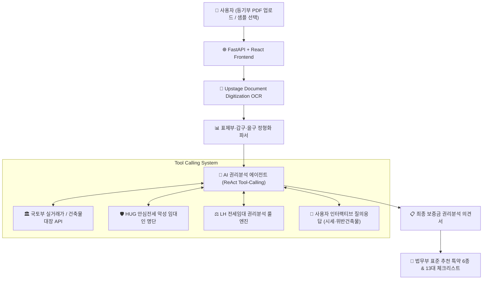

# 🛡️ 보증금지킴 (Deposit Guard)

> **"이 집, 계약해도 될까요?"**  
> 대법원 등기부등본 1장이면 1분 만에 **LH 권리분석 기준 깡통전세 위험도**, **11대 위험 신호**, **법무부 표준 맞춤 특약 6종**을 진단해 주는 AI 보증금 안전 진단 에이전트 서비스입니다.

---

## 📌 1. 해결하고자 하는 문제 (Problem & Solution)

### 🚨 문제 (Problem)
* **어려운 등기부등본**: 표제부·갑구·을구의 근저당권, 가압류, 신탁등기 등 복잡한 법률 용어로 인해 사회초년생 및 일반 임차인이 위험성을 직관적으로 파악하기 어렵습니다.
* **만연한 깡통전세 & 전세사기**: 선순위 채권과 보증금의 합이 매매 시세를 초과하여 경매 시 보증금을 떼이는 사고가 지속적으로 발생하고 있습니다.
* **계약서 특약 부재**: 위험 요소를 사전에 발견하더라도 임대차 계약서에 어떤 법적 안전 특약을 넣어야 하는지 알지 못해 피해 구제가 어렵습니다.

### 💡 해결책 (Solution)
1. **등기부 PDF 1초 파싱**: Upstage Document Digitization OCR로 표제부·갑구·을구 권리관계를 즉시 정형 데이터로 추출합니다.
2. **공공데이터 교차 검증**: 국토교통부 실거래가 공개시스템 API 및 HUG 상습 채무불이행 악성 임대인 명단을 실시간 대조합니다.
3. **LH 기준 안전 진단**: LH 전세임대 권리분석 지침(부채비율 70% 안전선, 90% 초과 위험선)을 기준으로 종합 안전도를 판정합니다.
4. **맞춤 특약 & 체크리스트**: 법무부·국토교통부 표준 주택임대차계약서 기반의 **6대 맞춤 안전 특약(원클릭 복사)**과 **13대 단계별 체크리스트**를 즉시 제공합니다.

---

## 🎯 2. 입력 데이터 및 분석 기준

### 📥 1) 입력 데이터 (Input)
* **등기부등본**: 대법원 인터넷등기소(`iros.go.kr`) 또는 부동산에서 발급받은 **등기사항전부증명서(말소사항 포함) PDF / JPG / PNG**
* **계약 정보**: 임차 보증금(만원), 계약 형태(전세/월세), 임대인 성명(선택)
* **체험용 샘플 3종**: 등기부 파일이 없어도 **아파트(정상 매물)**, **신축 빌라(시세 미등록·근저당 과다)**, **다가구(임차권등기·다중 임차인)** 실제 사례를 즉시 체험 가능

### ⚖️ 2) 심사 및 권리분석 기준 (Criteria)
* **LH 전세임대 권리분석 지침**:
  * **안전 (Safe)**: 선순위 채권 + 임차보증금 합계가 시세의 70% 이하
  * **주의 (Caution)**: 부채비율 70% 초과 90% 이하 또는 단기 권리 변동 발생
  * **위험 (Danger)**: 부채비율 90% 초과 (깡통전세 고위험)
* **11대 전세사기 의심 위험 신호**:
  * 최근 90일 이내 근저당권 설정
  * 신축 1년 내 보존등기 또는 2년 내 2회 이상 소유권 이전
  * 신탁등기(부동산담보신탁) 설정
  * 선순위 가압류 / 가등기 / 가처분 / 경매개시결정
  * 임차권등기명령 기재 (보증금 미반환 이력)
* **HUG 주택도시보증공사 안심전세 명단**:
  * 국토교통부 및 HUG 공개 상습 채무불이행 악성 임대인 명단 대조
* **주택임대차보호법**:
  * 지역별 소액임차인 최우선변제 보호한도 자동 계산

---

## 📊 3. 최종 제공 결과물 (Output)

1. **보증금 권리분석 의견서 (진단 리포트)**:
   * 종합 안전도 등급 (안전 / 주의 / 위험)
   * 깡통전세 지수 (선순위 근저당 + 내 보증금 vs 시세 부채비율 그래프)
   * 감지된 위험 신호 및 법적 근거 명시
2. **계약서 필수 추천 특약 6종 (원클릭 복사)**:
   * 담보권 설정 금지 특약
   * 위반 시 계약 해제 및 배액 배상 특약
   * 미고지 선순위·체납 확인 시 계약 해제 특약
   * 잔금일 선순위 근저당 전액 상환 및 말소 특약
   * 전세보증보험 가입 거절 시 계약 무효 및 반환 특약
   * 소유권 이전 및 담보신탁 시 즉시 통지 특약
3. **단계별 13가지 보증금 보호 체크리스트**:
   * 계약 전 (임대인 체납 조회, 중개사 공제증서 확인)
   * 계약 당일 (신분증 대조, 필수 특약 기재)
   * 잔금일 (등기부 재확인, 확정일자·전입신고 효력 발생 시점 점검)
   * 거주 중 (전세보증보험 가입, 주소 이전 주의사항)

---

## 🏗️ 4. 시스템 아키텍처 & 워크플로우



---

## 💻 5. 기술 스택 (Tech Stack)

* **Backend**: Python 3.12, FastAPI, SQLAlchemy 2.0 (Async), PostgreSQL, Pydantic v2
* **Frontend**: React 18, TypeScript, Tailwind CSS, Vite, Lucide Icons
* **AI & Document OCR**: Upstage Document Digitization API, OpenAI GPT-4o (Function Calling ReAct Agent)
* **Testing & Quality**: Pytest, Playwright MCP E2E Automation (98/98 Tests Passing)
* **DevOps**: Docker, Docker Compose, Cloudflare Tunnel

---

## 🚀 6. 로컬 실행 방법

### 1) 환경 변수 설정
`.env.example`을 복사하여 `.env`를 생성하고 API 키를 입력합니다:
```bash
cp .env.example .env
```

### 2) 백엔드 실행
```bash
cd backend
python -m venv .venv
source .venv/bin/activate
pip install -r requirements.txt
PYTHONPATH=. uvicorn app.main:app --host 0.0.0.0 --port 8080 --reload
```

### 3) 프론트엔드 실행
```bash
cd frontend
npm install
npm run dev
```

### 4) 전체 Docker 실행
```bash
docker compose up -d --build
```
접속 URL: `http://localhost:8080`
