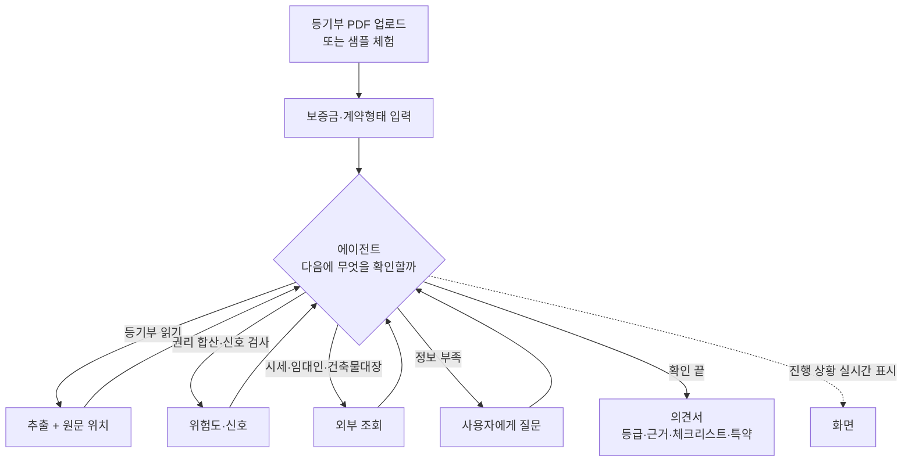

# RFQ — 요구·인터뷰

## 1. 배경과 동기

원티드 AI Championship 2026(자유 주제 AI 해커톤, 상금 대상 1,000만 원)에 1인으로 출품한다. 목표는 **대상 수상**이며 포트폴리오 목적은 배제한다.

**의뢰인의 경험.** 의뢰인은 2026년 6월에 전세 계약을 했다. "걱정도 되고 좀 무섭더라고. 실제로 그 집주인도 잘 못 믿겠고." LH(전세임대)를 통해 계약했는데, 계약 현장에 LH 쪽 담당자가 와서 권리관계를 검토해 줬다. 그 담당자가 해 준 일을, LH 없이 계약하는 세입자에게 해 주는 에이전트를 만든다.

**풀려는 문제.** 전세 계약 직전 세입자는 등기부등본을 받아도 "을구 근저당 채권최고액 1억 8천"이 내 보증금에 어떤 의미인지 해석하지 못한다. 정부 안심전세앱은 주소 기준 시세·보증사고 이력을 조회해 주지만, **세입자가 실제로 받은 등기부 그 자체와 세입자의 보증금 조건을 함께 놓고 판단해 주지 않는다.** 그 결과 근저당·신탁·가압류가 있는 집에 보증금을 넣고 계약 후에야 위험을 안다.

주제 선정 근거(2026-09-11~14 조사):
- 과거 수상작 공통점: 좁은 페르소나의 실제 고통, AI가 아니면 불가능한 비정형 입력 처리, 링크를 열어 3분 안에 체험, 돈 낼 사람이 분명함, 결론마다 근거 제시
- 레드오션(일기·면접·이력서·요약·동화책·데이팅)은 최근 대회에서 수상 0
- HUG 상습 채무불이행자 API가 2026-08-26 개방됐고 이를 활용한 서비스가 확인되지 않음

| 대회 일정 | 날짜 |
|---|---|
| 참가 접수 마감 | 2026-09-18 23:59:59 |
| 과제 제출 마감 | 2026-09-20 23:59:59 |
| 예선 심사·투표 | 2026-09-21 ~ 10-05 |
| TOP20 발표 | 2026-10-07 |
| Demo Day | 2026-10-17 |

## 2. 명세 체인

RFQ → PRD → SCN → UC → INFRA → DOM → UI → API → SEQ → MS → CODE. 6일 일정이므로 단계마다 1문서, 항목 수는 최소로 유지한다. 이 문서는 "무엇을"만 적는다. 판정 규칙의 확정값·에이전트 루프 구조·기술 스택은 PRD와 INFRA에서 정한다.

## 3. 요구 사항

### 3.1 대회·목표 요구

#### Q1 대상 수상이 목표다

의뢰인: "포폴은 생각하지 말고 우승을 노리자. 서비스적인 측면을 생각해야 돼."

#### Q2 개발자용 서비스는 만들지 않는다

의뢰인: "개발자 용도의 서비스를 받는 건 좀 아닌 것 같아." 사용자는 비개발자여야 한다.

#### Q3 특정 페르소나 하나의 실제 문제를 푼다

의뢰인이 확인한 방향: "고객 페르소나를 잘 잡아서 어떤 AI 서비스를 하나 만들어야 하는 거네." 대상은 "모든 사람"이 아니라 한 사람이다.

#### Q4 배포된 실제 제품이 나와야 한다

대회 요강: 배포된 서비스 링크 제출. 웹 권장. 링크는 2026-09-21~10-17 내내 접속 가능해야 하며 접속 불가 시 심사 제외.

#### Q5 수익 구조를 설명할 수 있어야 한다

의뢰인 질문 "수익성이 나야 해?"에 대한 합의: 실제 매출은 불필요하나 누가 왜 돈을 내는지는 답해야 한다. 심사 기준 '확장성'이 예선·본선 모두에 있다.

#### Q6 AI가 아니면 불가능한 기능이어야 한다

심사 기준 'AI 활용 적절성'. 의뢰인: "단순 개발 완성도를 보는 건지 AI 기술을 보는 건지도 중요하다." 합의: 최신 기술 과시가 아니라 비정형 입력 처리와 틀렸을 때의 통제.

#### Q7 제출 시 문제·AI 활용 방식·AI 도구를 기재한다

대회 요강 필수 항목: 해결하려는 문제, AI 활용 방식, 사용한 주요 AI 도구 이름과 활용 방식. 임시저장은 제출로 인정되지 않는다.

#### Q8 AI 협업 과정이 심사될 수 있다

대회 약관 제5조: 제출 자료(세션데이터 포함)는 과제의 일부. 제6조 3항: 제3자 평가 솔루션으로 검토·분석할 수 있다. 메인 파트너는 크래프톤 Cofa(AI 협업 과정 평가 솔루션).

#### Q9 주제는 전세 계약 검토 에이전트다

의뢰인 선택(2026-09-14): LH 계약 현장의 검토 담당자처럼, 세입자가 받은 서류를 읽고 무엇을 확인해야 할지 판단해 조회하고, 위험과 근거를 알려주는 에이전트. 정부 안심전세앱과의 차별점을 분명히 할 것.

#### Q10 명세는 싱크독으로 관리한다

의뢰인: "싱크독으로 새로운 프로젝트 만들어서 진행할 거야." 명세 체인을 따라 문서를 남긴다.

### 3.2 입력 요구

#### Q11 등기부등본 PDF를 그대로 받는다

사용자가 인터넷등기소나 중개사에게서 받은 등기사항전부증명서 PDF를 변환 없이 올린다. 표제부·갑구·을구가 모두 들어 있는 원본이다. 스캔본이나 사진(휴대폰 촬영)도 받을 수 있어야 한다.

#### Q12 계약 조건을 함께 받는다

등기부만으로는 위험을 판단할 수 없다. 사용자가 입력하는 것:

| 입력 | 필수 | 용도 |
|---|---|---|
| 내 보증금 | ○ | 깡통 위험도 계산 |
| 계약 형태 (전세 / 반전세·월세) | ○ | 판정 기준 분기 |
| 집주소 | △ (등기부에서 추출, 확인용) | 시세 조회, 임대인 조회 |
| 계약 상대방 이름 | △ | 등기부 소유자와 일치 확인, 채무불이행자 조회 |
| 계약서·건축물대장 (있으면) | △ | 위반건축물, 특약 확인 |

#### Q13 로그인 없이 샘플로 즉시 체험한다

심사위원과 투표자는 자기 등기부가 없다. 첫 화면에서 버튼 하나로 준비된 샘플(안전 1건, 위험 1건 이상)을 돌려 결과까지 본다. 회원가입·로그인은 두지 않는다.

### 3.3 판정 요구

#### Q14 등기부의 권리관계를 항목 단위로 읽어낸다

표제부·갑구·을구에서 최소 다음을 뽑아낸다. 각 항목은 원문의 어느 줄에서 나왔는지 위치를 함께 남긴다.

| 구분 | 읽어낼 것 |
|---|---|
| 표제부 | 소재지, 건물 종류(아파트·다세대·다가구·오피스텔), 전유부분 여부 |
| 갑구 | 현재 소유자, 소유권 이전 이력, 가압류·가처분·압류·경매개시결정, 신탁등기 |
| 을구 | 근저당권(채권최고액·채권자·설정일), 전세권, 임차권등기명령, 말소 여부 |

#### Q15 깡통전세 위험도를 숫자로 낸다

`(선순위 채권최고액 합계 + 내 보증금) ÷ 주택 시세`를 계산해 백분율로 보여준다. 시세는 실거래가 등 외부 데이터에서 가져오되, 못 가져오면 사용자가 직접 입력할 수 있어야 한다. 임계값(몇 % 이상이 위험인지)은 PRD에서 근거와 함께 정한다.

#### Q16 위험 신호를 개별로 짚는다

수치와 별개로, 있으면 그 자체로 경고해야 하는 것:

| 신호 | 왜 위험한가 |
|---|---|
| 신탁등기 | 수탁자 동의 없이 소유자와 계약하면 무효가 될 수 있음 |
| 가압류·가처분·압류·경매개시 | 소유자의 채무 문제. 보증금 회수 순위가 밀림 |
| 임차권등기명령 | 이전 세입자가 보증금을 못 받았다는 기록 |
| 근저당 설정일이 최근 | 계약 직전 대출 가능성 |
| 소유권 이전이 잦음 | 전세사기 패턴 중 하나 |
| 소유자와 계약 상대방 불일치 | 대리 계약·명의 문제 |
| 위반건축물 (건축물대장이 있을 때) | 전세보증보험 가입 불가 |

#### Q17 임대인의 보증사고 이력을 조회한다

HUG 상습 채무불이행자 정보공개 API(2026-08-26 개방)로 임대인이 명단에 있는지 확인해 결과에 넣는다. 조회 키(이름·생년월일 등)는 API 명세 확인 후 정한다. 조회 불가 시 "확인 못 함"으로 표시하고 결과를 숨기지 않는다.

#### Q18 세 단계 등급으로 요약한다

안전 / 주의 / 위험 세 단계. 등급 하나만 보여주는 게 아니라, 등급을 결정한 항목이 무엇인지 바로 아래에 보인다. 등급 판정 규칙은 코드로 고정하고, 규칙을 문서에 공개한다.

#### Q19 계산·조회는 도구가, 판단·설명은 에이전트가 한다

의뢰인 합의: 판단이 틀리면 보증금 전액을 잃는 영역이다. 금액 합산·비율·등급 판정·외부 조회는 결정적 도구로 만든다. 에이전트는 어떤 도구를 언제 부를지 판단하고, 도구가 돌려준 값만 근거로 설명한다. 에이전트가 도구 결과에 없는 사실을 지어내면 안 된다. 추출값은 사용자가 화면에서 고칠 수 있어야 하고, 고치면 에이전트가 다시 판단한다.

### 3.4 출력 요구

#### Q20 모든 결론에 원문 근거를 붙인다

위험 신호나 추출값마다 "근거 보기"를 누르면 등기부 원문의 해당 부분이 하이라이트된다. 근거 없는 결론은 내보내지 않는다.

#### Q21 쉬운 말로 설명한다

"근저당권 채권최고액"을 모르는 사람이 읽는다. 용어마다 한 줄 풀이를 붙이고, 결론은 "이 집은 보증금 2억을 넣기엔 위험합니다. 이유는 ~" 식의 문장으로 낸다.

#### Q22 계약 전 할 일 체크리스트를 준다

등기부로 확인할 수 없는 것을 사용자가 직접 확인하도록 안내한다: 전입세대 열람(다가구 선순위 보증금), 임대인 미납 국세·지방세 열람, 확정일자·전입신고, 전세보증보험 가입 가능 여부, 건축물대장 확인. 각 항목에 어디서 어떻게 하는지 한 줄을 붙인다.

#### Q23 특약 문구와 질문을 생성한다

진단 결과에 맞는 특약 문구(예: 근저당 말소 조건, 잔금일 기준 권리변동 없음 확약, 보증보험 가입 협조)와 집주인·중개사에게 물어볼 질문을 만들어 복사할 수 있게 한다.

#### Q24 결과를 저장·공유할 수 있다

결과를 PDF나 이미지로 내려받거나 링크로 공유해 가족·지인에게 보여줄 수 있다. 공유 링크에는 개인정보(이름·주민번호)가 들어가면 안 된다.

### 3.5 데이터·AI 요구

#### Q25 문서 파싱은 한국어 표 구조를 보존해야 한다

등기부는 표 구조이며 말소된 항목에 밑줄·취소선이 있다. 일반 OCR로는 깨진다. 표와 말소 표시를 구분해 읽어야 한다. 파싱 도구 선택은 INFRA에서 정한다.

#### Q26 외부 데이터는 공공 API를 쓴다

| 데이터 | 출처 | 상태 |
|---|---|---|
| 임대인 상습 채무불이행자 | HUG, 공공데이터포털 15161980 | 개발단계 자동승인 확인 |
| 주택 시세 | 국토부 아파트·연립다세대·오피스텔 실거래가 API | 신청 필요 |
| 건축물대장 (위반건축물) | 국토부 건축HUB API | 신청 필요, 선택 |

#### Q27 AI 도구는 대회 파트너사 것을 우선 검토한다

업스테이지(대회 파트너, TOP20 크레딧 제공)의 Document Parse와 Solar를 우선 검토한다. 다른 도구를 쓰면 이유를 남긴다. 사용한 도구와 방식은 제출 문구에 기재한다(Q7).

### 3.6 운영·법 요구

#### Q28 업로드한 문서를 저장하지 않는다

등기부에는 소유자 이름·주민번호 일부·주소가 있다. 처리 후 즉시 폐기하고 서버에 남기지 않는다. 결과 공유(Q24)는 개인정보를 뺀 요약만 담는다. 개정 개인정보보호법(2026-09-11 시행) 맥락에서 이 점을 화면에 명시한다.

#### Q29 비용과 남용을 제한한다

공개 기간 4주 동안 유료 API 비용은 의뢰인 부담이다. 파일 크기·페이지 수·IP당 일일 횟수를 제한하고, 같은 문서는 다시 처리하지 않는다. 샘플 체험은 미리 계산된 결과를 쓴다.

#### Q30 AI 생성 결과임을 고지하고 모바일에서 동작한다

AI 기본법에 따라 "AI가 읽고 정리한 결과이며 최종 판단은 전문가와 확인"을 화면에 표시한다. 투표자 대부분이 휴대폰이므로 모든 화면이 모바일에서 깨지지 않아야 한다.

### 3.7 에이전트 요구

#### Q31 에이전트는 계약 현장의 검토 담당자 역할을 한다

의뢰인이 본 LH 담당자처럼 행동한다. 서류를 받아 훑고, 이 집·이 계약에서 무엇을 확인해야 하는지 스스로 정하고, 확인하고, 결과를 세입자에게 설명한다. 사용자에게 "무엇을 조회할지" 고르게 하지 않는다. 단, 검토 항목의 전체 목록은 정해져 있고(Q14~Q17, Q22) 에이전트는 그중 이 건에 필요한 것을 고른다.

#### Q32 에이전트는 도구를 골라 호출하며 검토를 진행한다

의뢰인: "Agent면 이걸 tool로 만들어서 호출하면서 ReAct할 수 있잖아." 판단 → 도구 호출 → 결과 관찰 → 다음 판단을 반복한다. 검토에 필요한 도구는 최소 다음과 같다. 도구 인터페이스는 API 단계에서 정한다.

| 도구 | 하는 일 | 성격 |
|---|---|---|
| 등기부 읽기 | PDF·사진 → 표제부·갑구·을구 항목 + 원문 위치 | 추출 |
| 권리 합산 | 선순위 채권최고액 합계, 깡통 위험도 계산 | 결정적 계산 |
| 위험 신호 검사 | Q16의 신호를 규칙으로 판정 | 결정적 규칙 |
| 시세 조회 | 주소·건물 종류 → 실거래가 | 외부 조회 |
| 임대인 조회 | 이름 등 → HUG 채무불이행자 여부 | 외부 조회 |
| 건축물대장 조회 | 주소 → 위반건축물 여부 (선택) | 외부 조회 |
| 사용자에게 묻기 | 부족한 정보를 질문하고 답을 받음 | 대화 |
| 의견서 작성 | 등급·근거·체크리스트·특약·질문 생성 | 생성 |

#### Q33 검토 과정을 사용자에게 보여준다

LH 담당자가 "등기부 을구부터 볼게요, 근저당이 하나 있네요, 시세 대비 확인해 볼게요"라고 말하듯, 에이전트가 지금 무엇을 왜 확인하는지 진행 상황을 화면에 실시간으로 보여준다. 결과만 툭 나오면 안 된다. 심사위원이 이 과정을 보고 에이전트 구조를 이해할 수 있어야 한다.

#### Q34 정보가 부족하면 사용자에게 묻는다

계약 상대방 이름이 소유자와 다르면 "대리인인가요? 위임장을 받았나요?", 시세를 못 찾으면 "중개사가 말한 시세가 얼마인가요?", 다가구면 "다른 세입자가 몇 가구 있나요?"처럼 되묻고, 답을 받아 검토를 이어간다. 답을 안 하면 "확인 못 함"으로 두고 진행한다.

#### Q35 검토 결과를 의견서 한 장으로 낸다

LH 권리분석 결과처럼 종합 의견서를 낸다. 구성: 등급과 한 줄 결론, 확인한 항목과 결과(확인함·확인 못 함 구분), 위험 신호와 근거, 계약 전 할 일, 특약과 질문. 확인 못 한 항목을 숨기지 않는다.

#### Q36 에이전트는 도구 결과 밖의 사실을 말하지 않는다

의뢰인 우려: "집주인도 잘 못 믿겠고." 에이전트까지 못 믿으면 안 된다. 에이전트의 모든 주장은 도구가 돌려준 값이나 사용자가 답한 내용에 근거해야 하고, 그 근거를 Q20 방식으로 표시한다. 도구가 실패하면 실패했다고 말한다. 법률 해석은 일반적 설명에 그치고, 확정 판단은 전문가 확인을 권한다(Q30).

## 4. 사용자와 환경

| 항목 | 내용 |
|---|---|
| 최종 사용자 | 생애 첫 전세 계약을 앞둔 20~30대 세입자. 등기부를 받았지만 해석하지 못함. LH·보증기관 없이 개인끼리 계약하는 경우 |
| 2차 사용자 | 심사위원 5인(라이너·스파크랩·Firb AI·크래프톤·원티드), 원티드 회원 투표자(대부분 모바일) |
| 확장 고객 (수익) | 공인중개사무소(계약 전 설명 자료), 전세보증기관·청년주거지원 사업, 원룸 플랫폼 |
| 개발 인력 | 1인. AI 코딩 도구(Claude Code)와 싱크독 MCP 사용 |
| 가용 기간 | 2026-09-14 ~ 09-20 (6일, 거의 풀타임) |
| 심사 기준 | 예선: 기획력·실현 가능성·확장성·AI 활용 적절성 (내부 80% + 투표 20%). 본선: 기획력·확장성·기술력·발표 전달력 |
| 비용 | 유료 API 비용 참가자 부담. 공개 기간(약 4주) 동안 불특정 다수가 사용 |
| 법·규정 | AI 기본법(생성물 표시 의무), 개정 개인정보보호법(2026-09-11 시행). 업로드 문서에 개인정보 포함 |

## 5. 첫 프로젝트

서비스명 보증금지킴(가칭). 저장소 `HoyoungParkme/deposit-guard`.

핵심 흐름 하나를 끝까지 완성한다. 에이전트가 도구를 골라 부르며 검토하고, 과정이 화면에 보이고, 의견서로 끝난다:

이번 범위에 넣지 않는 것: 회원가입, 결제, 중개사용 관리 화면, 계약서 전체 검토, 다가구 선순위 보증금 자동 조회(전입세대 열람은 본인만 가능).

| 날짜 | 목표 |
|---|---|
| 09-14 | 접수, API 키 신청, 샘플 등기부 확보, 명세 RFQ·PRD |
| 09-15 | 등기부 읽기 도구 (샘플 3건 정확 추출) + 계산·규칙 도구 |
| 09-16 | 에이전트 루프 + 시세·HUG 조회 도구 + 사용자 질문 |
| 09-17 | 화면 3개, 진행 상황 표시, 근거 하이라이트, 샘플 체험 |
| 09-18 | 배포 안정화, 비용 제한, 실사용자 테스트 |
| 09-19 | 제출 문구, 데모 영상, 모바일 점검 |
| 09-20 | 최종 제출 |

## 6. 미정

- [ ] **LH 담당자가 계약 현장에서 실제로 확인한 항목** (의뢰인 기억으로 정리 → Q31 검토 항목 목록의 근거)
- [ ] 의뢰인이 그때 가장 불안했던 지점과, 담당자의 어떤 말에 안심했는지 (의견서 문장 톤의 근거)
- [ ] 정부 안심전세앱 최신 기능 확인 후 차별점 한 문장 확정 (의뢰인 직접 확인)
- [ ] 서비스명 확정 (보증금지킴 / 등기부읽어드림 / 전세안전등기)
- [ ] 데모용 등기부등본 샘플 2~3건 확보와 마스킹 방법 (의뢰인 6월 계약 등기부를 마스킹해 쓸 수 있는지)
- [ ] 공공데이터 API 키 발급 여부 (HUG 상습 채무불이행자, 국토부 실거래가, 건축HUB)
- [ ] HUG API 조회 키가 무엇인지 (이름? 생년월일? 사업자번호?) — 명세 확인 후 Q17 확정
- [ ] 깡통 위험도 임계값 (전세보증보험 가입 기준 90%와 시장 통용 70~80% 중 무엇을 쓸지)
- [ ] 시세 조회 실패 시 대체 소스 (KB시세는 API 미개방)
- [ ] 9/18 테스트에 참여할 실사용자 1명 섭외
- [ ] 배포처 (Vercel / Railway 등)와 도메인
- [ ] 참가 접수 완료 여부
