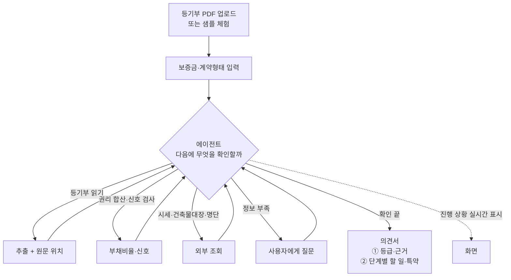

# RFQ — 요구·인터뷰

## 1. 배경과 동기

원티드 AI Championship 2026(자유 주제 AI 해커톤, 상금 대상 1,000만 원)에 1인으로 출품한다. 목표는 **대상 수상**이며 포트폴리오 목적은 배제한다.

**의뢰인의 경험.** 의뢰인은 2026년 6월에 전세 계약을 했다. "걱정도 되고 좀 무섭더라고. 실제로 그 집주인도 잘 못 믿겠고." LH(전세임대)를 통해 계약했는데, 계약 현장에 LH 쪽 담당자가 와서 권리관계를 검토해 줬다. 그 담당자가 해 준 일을, LH 없이 계약하는 세입자에게 해 주는 에이전트를 만든다.

**풀려는 문제.** 전세 계약 직전 세입자는 등기부등본을 받아도 "을구 근저당 채권최고액 1억 8천"이 내 보증금에 어떤 의미인지 해석하지 못한다. 정부 안심전세앱은 주소 기준 시세·보증사고 이력을 조회해 주지만, **세입자가 실제로 받은 등기부 그 자체와 세입자의 보증금 조건을 함께 놓고 판단해 주지 않고, 판단 뒤에 "당신 경우엔 이걸 준비하세요"까지 가지 않는다.** 그 결과 근저당·신탁·가압류가 있는 집에 보증금을 넣고 계약 후에야 위험을 안다.

**서비스의 두 축.** 의뢰인 정의(2026-09-14): "우리가 전세 사기를 당하는지 안 당하는지, 집 계약할 때 추가로 뭘 더 준비해야 하는지 고려하는데 그걸 안내해 주는 에이전트."

| 축 | 에이전트가 답하는 질문 | 근거 |
|---|---|---|
| ① 위험 판단 | 이 집·이 계약에 사기 위험이 있나 | 등기부·계약 조건·외부 조회 결과 |
| ② 준비 안내 | 그래서 계약 전·당일·잔금·입주 후에 무엇을 확인하고 준비해야 하나 | ①의 결과 + 제도 규칙(LH 권리분석 기준·HUG 보증 요건·정부 체크리스트) |

주제 선정 근거(2026-09-11~14 조사):
- 과거 수상작 공통점: 좁은 페르소나의 실제 고통, AI가 아니면 불가능한 비정형 입력 처리, 링크를 열어 3분 안에 체험, 돈 낼 사람이 분명함, 결론마다 근거 제시
- 레드오션(일기·면접·이력서·요약·동화책·데이팅)은 최근 대회에서 수상 0
- LH 전세임대 권리분석 기준과 HUG 보증 요건이 공식 문서로 공개돼 있어 판정 규칙의 근거로 쓸 수 있음. 이 기준을 개인 세입자에게 그대로 적용해 주는 서비스는 확인되지 않음

| 대회 일정 | 날짜 |
|---|---|
| 참가 접수 마감 | 2026-09-18 23:59:59 |
| 과제 제출 마감 | 2026-09-20 23:59:59 |
| 예선 심사·투표 | 2026-09-21 ~ 10-05 |
| TOP20 발표 | 2026-10-07 |
| Demo Day | 2026-10-17 |

## 2. 명세 체인

RFQ → PRD → SCN → UC → INFRA → DOM → UI → API → SEQ → MS → CODE. 6일 일정이므로 단계마다 1문서, 항목 수는 최소로 유지한다. 이 문서는 "무엇을"만 적는다. 판정 규칙의 확정값·에이전트 루프 구조·기술 스택은 PRD와 INFRA에서 정한다.

## 3. 요구 사항

### 3.1 대회·목표 요구

#### Q1 대상 수상이 목표다

의뢰인: "포폴은 생각하지 말고 우승을 노리자. 서비스적인 측면을 생각해야 돼."

#### Q2 개발자용 서비스는 만들지 않는다

의뢰인: "개발자 용도의 서비스를 받는 건 좀 아닌 것 같아." 사용자는 비개발자여야 한다.

#### Q3 특정 페르소나 하나의 실제 문제를 푼다

의뢰인이 확인한 방향: "고객 페르소나를 잘 잡아서 어떤 AI 서비스를 하나 만들어야 하는 거네." 대상은 "모든 사람"이 아니라 한 사람이다.

#### Q4 배포된 실제 제품이 나와야 한다

대회 요강: 배포된 서비스 링크 제출. 웹 권장. 링크는 2026-09-21~10-17 내내 접속 가능해야 하며 접속 불가 시 심사 제외.

#### Q5 수익 구조를 설명할 수 있어야 한다

의뢰인 질문 "수익성이 나야 해?"에 대한 합의: 실제 매출은 불필요하나 누가 왜 돈을 내는지는 답해야 한다. 심사 기준 '확장성'이 예선·본선 모두에 있다.

#### Q6 AI가 아니면 불가능한 기능이어야 한다

심사 기준 'AI 활용 적절성'. 의뢰인: "단순 개발 완성도를 보는 건지 AI 기술을 보는 건지도 중요하다." 합의: 최신 기술 과시가 아니라 비정형 입력 처리와 틀렸을 때의 통제.

#### Q7 제출 시 문제·AI 활용 방식·AI 도구를 기재한다

대회 요강 필수 항목: 해결하려는 문제, AI 활용 방식, 사용한 주요 AI 도구 이름과 활용 방식. 임시저장은 제출로 인정되지 않는다.

#### Q8 AI 협업 과정이 심사될 수 있다

대회 약관 제5조: 제출 자료(세션데이터 포함)는 과제의 일부. 제6조 3항: 제3자 평가 솔루션으로 검토·분석할 수 있다. 메인 파트너는 크래프톤 Cofa(AI 협업 과정 평가 솔루션).

#### Q9 주제는 전세 계약 검토 에이전트다

의뢰인 선택(2026-09-14): LH 계약 현장의 검토 담당자처럼, 세입자가 받은 서류를 읽고 무엇을 확인해야 할지 판단해 조회하고, **사기 위험이 있는지(축 ①)와 그래서 무엇을 더 준비해야 하는지(축 ②)**를 알려주는 에이전트. 정부 안심전세앱과의 차별점은 "조회 결과"가 아니라 "내 서류·내 조건에 맞춘 판단과 준비 안내"다.

#### Q10 명세는 싱크독으로 관리한다

의뢰인: "싱크독으로 새로운 프로젝트 만들어서 진행할 거야." 명세 체인을 따라 문서를 남긴다.

### 3.2 입력 요구

#### Q11 등기부등본 PDF를 그대로 받는다

사용자가 인터넷등기소나 중개사에게서 받은 등기사항전부증명서 PDF를 변환 없이 올린다. 표제부·갑구·을구가 모두 들어 있는 원본이다. 스캔본이나 사진(휴대폰 촬영)도 받을 수 있어야 한다. 단독·다가구 주택은 토지 등기부가 따로 있으므로 두 번째 PDF를 받을 수 있어야 한다.

#### Q12 계약 조건을 함께 받는다

등기부만으로는 위험을 판단할 수 없다. 사용자가 입력하는 것:

| 입력 | 필수 | 용도 |
|---|---|---|
| 내 보증금 | ○ | 부채비율 계산 |
| 계약 형태 (전세 / 반전세·월세) | ○ | 판정 기준 분기 |
| 집주소 | △ (등기부에서 추출, 확인용) | 시세 조회, 건축물대장 조회 |
| 계약 상대방 이름 | △ | 등기부 소유자와 일치 확인, 채무불이행자 명단 대조 |
| 계약서·건축물대장 (있으면) | △ | 위반건축물, 특약 확인 |

#### Q13 로그인 없이 샘플로 즉시 체험한다

심사위원과 투표자는 자기 등기부가 없다. 첫 화면에서 버튼 하나로 준비된 샘플(안전 1건, 위험 1건 이상)을 돌려 결과까지 본다. 회원가입·로그인은 두지 않는다.

### 3.3 판정 요구

#### Q14 등기부의 권리관계를 항목 단위로 읽어낸다

표제부·갑구·을구에서 최소 다음을 뽑아낸다. 각 항목은 원문의 어느 줄에서 나왔는지 위치를 함께 남긴다.

| 구분 | 읽어낼 것 |
|---|---|
| 표제부 | 소재지, 건물 종류(아파트·다세대·다가구·오피스텔), 전유부분 여부, "대지권 미등기"·"토지 별도등기" 표시 |
| 갑구 | 현재 소유자, 소유권 보존·이전 이력(등기원인·거래가액·날짜), 가압류·가처분·압류·가등기·경매개시결정·예고등기, 신탁 |
| 을구 | 근저당권(채권최고액·채권자·설정일), 전세권, 주택임차권(임차권등기명령), 말소 여부, 부기등기(변경·이전) |

#### Q15 부채비율을 숫자로 낸다

`(선순위 채권최고액 합계 + 내 보증금) ÷ 주택 가격`을 백분율로 보여준다. 참고할 공식 기준(조사 확인): LH 전세임대 권리분석은 **90% 이하**를 지원 가능으로 보고 채권최고액을 그대로 합산한다. HUG 반환보증은 (선순위+보증금) ≤ 주택가격×90%, 선순위 단독으로는 주택가격의 54% 이내, 다가구는 선순위 보증금까지 합쳐 80% 이내를 요구한다. 서울시는 전세가율 70% 이하를 권장한다. 어느 값을 등급 경계로 쓸지는 PRD에서 근거와 함께 정한다. 주택 가격은 외부 데이터에서 가져오되, 못 가져오면 사용자가 직접 입력할 수 있어야 한다.

#### Q16 위험 신호를 개별로 짚는다

수치와 별개로, 있으면 그 자체로 경고해야 하는 것. LH·HUG가 "불가"로 보는 항목은 그렇게 표시한다.

| 신호 | 왜 위험한가 | 공식 기준 |
|---|---|---|
| 신탁등기 (갑구) | 수탁자 동의 없이 소유자와 계약하면 무효가 될 수 있음 | LH 불가 |
| 가압류·가처분·압류·가등기·경매개시·예고등기 (갑구) | 소유자의 채무 문제. 보증금 회수 순위가 밀림 | LH·HUG 불가 (말소 후 가능) |
| 주택임차권 등기 (을구) | 이전 세입자가 보증금을 못 받았다는 기록 | LH 불가 |
| 근저당 설정일이 최근 | 계약 직전 대출 가능성 | — |
| 보존등기 직후·소유권 이전이 잦음 | 무자본 갭투자·동시진행 패턴 | — |
| 소유자와 계약 상대방 불일치 | 대리 계약·명의 문제 | — |
| 토지·건물 소유자 상이, 대지권 미등기 | 보증 가입 불가 | HUG 불가 |
| 위반건축물, 근린생활시설 이용 | 보증 가입 불가 | LH·HUG 불가 (아파트 제외) |
| 법인 임대인 | 2026년부터 LH 전세임대 배제 | LH 불가 |

#### Q17 임대인이 공개 명단에 있는지 대조한다

HUG가 주택도시기금법 34조의5에 따라 공개하는 상습 채무불이행자 명단(2025-01 기준 개인 1,128명·법인 49개사)과 계약 상대방을 대조한다. 조사 결과 공공데이터포털의 해당 API(15161980)는 **LINK형**이라 포털이 직접 서비스하지 않고 HUG 빅데이터 포털에서 별도 신청해야 하며 명세가 공개돼 있지 않다. 따라서 HUG 안심전세포털의 공개 명단 페이지를 읽어 대조하는 방식을 우선 검토하고, 그것도 안 되면 안심전세앱에서 임대인 조회를 하도록 안내한다. 대조 불가 시 "확인 못 함"으로 표시하고 숨기지 않는다.

#### Q18 세 단계 등급으로 요약한다

안전 / 주의 / 위험 세 단계. 등급 하나만 보여주는 게 아니라, 등급을 결정한 항목이 무엇인지 바로 아래에 보인다. 등급 판정 규칙은 코드로 고정하고, 규칙을 문서에 공개한다.

#### Q19 계산·조회는 도구가, 판단·설명은 에이전트가 한다

의뢰인 합의: 판단이 틀리면 보증금 전액을 잃는 영역이다. 금액 합산·비율·등급 판정·외부 조회는 결정적 도구로 만든다. 에이전트는 어떤 도구를 언제 부를지 판단하고, 도구가 돌려준 값만 근거로 설명한다. 에이전트가 도구 결과에 없는 사실을 지어내면 안 된다. 추출값은 사용자가 화면에서 고칠 수 있어야 하고, 고치면 에이전트가 다시 판단한다.

### 3.4 출력 요구

#### Q20 모든 결론에 원문 근거를 붙인다

위험 신호나 추출값마다 "근거 보기"를 누르면 등기부 원문의 해당 부분이 하이라이트된다. 근거 없는 결론은 내보내지 않는다.

#### Q21 쉬운 말로 설명한다

"근저당권 채권최고액"을 모르는 사람이 읽는다. 용어마다 한 줄 풀이를 붙이고, 결론은 "이 집은 보증금 2억을 넣기엔 위험합니다. 이유는 ~" 식의 문장으로 낸다.

#### Q22 단계별 할 일을 이 집에 맞춰 낸다

축 ②. 계약 전 / 계약 당일 / 잔금일 / 입주 후 네 단계로 나눠, 이 집의 판정 결과에 따라 필요한 것만 낸다. 각 항목에 어디서 어떻게 하는지와 비용을 한 줄 붙인다. 정부·서울시·HUG 체크리스트와 LH 절차를 근거로 하며, 전체 후보 목록은 Q37이다. 예: 다가구면 확정일자 부여현황 열람(임대인 동의 필요)과 전입세대확인서, 근저당이 있으면 잔금일 말소 확인, 보증금 1천만 원 초과면 계약 직후 동의 없는 미납세 열람, 잔금 당일 전입신고·확정일자(대항력은 다음 날 0시 발생), 계약기간 절반 전 보증보험 가입.

#### Q23 특약 문구와 질문을 생성한다

법무부·국토부 주택임대차표준계약서(2023-10-06)의 특약 1~3 원문(담보권 설정 금지, 위반 시 해제, 미고지 선순위·체납 확인 시 해제)을 기본으로 하고, 판정 결과에 따라 근저당 말소 조건, 보증보험 가입 불가 시 무효, 소유권 변경 통지, 체납 열람 동의 특약을 덧붙인다. 금액·날짜 같은 빈칸은 사용자 입력값으로 채운다. 집주인·중개사에게 물어볼 질문도 함께 만들어 복사할 수 있게 한다.

#### Q24 결과를 저장·공유할 수 있다

결과를 PDF나 이미지로 내려받거나 링크로 공유해 가족·지인에게 보여줄 수 있다. 공유 링크에는 개인정보(이름·주민번호)가 들어가면 안 된다.

### 3.5 데이터·AI 요구

#### Q25 문서 파싱은 한국어 표 구조를 보존해야 한다

등기부는 표 구조(갑구·을구: 순위번호/등기목적/접수/등기원인/권리자 및 기타사항)이며 말소된 항목에 취소선·밑줄이 있고, 부기등기는 "1-1" 같은 가지번호를 쓴다. 일반 OCR로는 깨진다. 표와 말소 표시를 구분해 읽어야 한다. 파싱 도구 선택은 INFRA에서 정한다.

#### Q26 외부 데이터는 공공 API를 쓴다

조사로 확인된 실태(2026-09-14):

| 데이터 | 출처 | 상태 |
|---|---|---|
| 주택 시세 | 국토부 실거래가 API (아파트 매매 15126468·전월세 15126474, 연립다세대 15126467·15126473, 오피스텔 15126464·15126475, 단독다가구 15126465·15126472). 법정동코드 5자리 + 계약년월로 조회 | 공공데이터포털 신청 |
| 건축물대장 | 국토부 건축HUB API (15134735). 주용도·가구수·세대수·대장 구분(일반/집합)은 제공. **위반건축물 여부 필드는 없음** → 사용자가 정부24에서 확인해 답함 | 신청 |
| 임대인 상습 채무불이행자 | HUG 공개 명단 페이지 (API는 LINK형, 명세 비공개) | Q17 참조 |
| 공시가격 | V-World 데이터 API (레이어 확인 필요) | 선택 |
| 등기부·미납국세·KB시세 | 공공 API 없음. 등기부는 사용자 업로드, 미납국세는 사용자 질문, KB시세는 사용자 입력 | — |

#### Q27 AI 도구는 대회 파트너사 것을 우선 검토한다

업스테이지(대회 파트너, TOP20 크레딧 제공)의 Document Parse와 Solar를 우선 검토한다. 다른 도구를 쓰면 이유를 남긴다. 사용한 도구와 방식은 제출 문구에 기재한다(Q7).

### 3.6 운영·법 요구

#### Q28 업로드한 문서를 저장하지 않는다

등기부에는 소유자 이름·주민번호 일부·주소가 있다. 처리 후 즉시 폐기하고 서버에 남기지 않는다. 결과 공유(Q24)는 개인정보를 뺀 요약만 담는다. 개정 개인정보보호법(2026-09-11 시행) 맥락에서 이 점을 화면에 명시한다.

#### Q29 비용과 남용을 제한한다

공개 기간 4주 동안 유료 API 비용은 의뢰인 부담이다. 파일 크기·페이지 수·IP당 일일 횟수를 제한하고, 같은 문서는 다시 처리하지 않는다. 샘플 체험은 미리 계산된 결과를 쓴다.

#### Q30 AI 생성 결과임을 고지하고 모바일에서 동작한다

AI 기본법에 따라 "AI가 읽고 정리한 결과이며 최종 판단은 전문가와 확인"을 화면에 표시한다. 투표자 대부분이 휴대폰이므로 모든 화면이 모바일에서 깨지지 않아야 한다.

### 3.7 에이전트 요구

#### Q31 에이전트는 계약 현장의 검토 담당자 역할을 한다

의뢰인이 본 LH 담당자처럼 행동한다. 서류를 받아 훑고, 이 집·이 계약에서 무엇을 확인해야 하는지 스스로 정하고, 확인하고, 결과를 세입자에게 설명한다. 사용자에게 "무엇을 조회할지" 고르게 하지 않는다. 단, 검토 항목의 전체 목록은 정해져 있고(Q37) 에이전트는 그중 이 건에 필요한 것을 고른다.

#### Q32 에이전트는 도구를 골라 호출하며 검토를 진행한다

의뢰인: "Agent면 이걸 tool로 만들어서 호출하면서 ReAct할 수 있잖아." 판단 → 도구 호출 → 결과 관찰 → 다음 판단을 반복한다. 검토에 필요한 도구는 최소 다음과 같다. 도구 인터페이스는 API 단계에서 정한다.

| 도구 | 하는 일 | 성격 |
|---|---|---|
| 등기부 읽기 | PDF·사진 → 표제부·갑구·을구 항목 + 원문 위치 | 추출 |
| 권리 합산 | 선순위 채권최고액 합계, 부채비율 계산 (말소 제외, 부기등기 감액 반영) | 결정적 계산 |
| 위험 신호 검사 | Q16의 신호를 규칙으로 판정 | 결정적 규칙 |
| 시세 조회 | 주소·건물 종류·면적 → 실거래가 | 외부 조회 |
| 건축물대장 조회 | 주소 → 주용도·가구수·대장 구분 | 외부 조회 |
| 임대인 명단 대조 | 이름 → HUG 공개 명단 일치 여부 | 외부 조회 |
| 사용자에게 묻기 | 부족한 정보를 질문하고 답을 받음 (위반건축물 여부, 시세, 가구 수, 대리인 여부 등) | 대화 |
| 의견서 작성 | 등급·근거·단계별 할 일·특약·질문 생성 | 생성 |

#### Q33 검토 과정을 사용자에게 보여준다

LH 담당자가 "등기부 을구부터 볼게요, 근저당이 하나 있네요, 시세 대비 확인해 볼게요"라고 말하듯, 에이전트가 지금 무엇을 왜 확인하는지 진행 상황을 화면에 실시간으로 보여준다. 결과만 툭 나오면 안 된다. 심사위원이 이 과정을 보고 에이전트 구조를 이해할 수 있어야 한다.

#### Q34 정보가 부족하면 사용자에게 묻는다

계약 상대방 이름이 소유자와 다르면 "대리인인가요? 위임장을 받았나요?", 시세를 못 찾으면 "중개사가 말한 시세가 얼마인가요?", 다가구면 "다른 세입자가 몇 가구 있나요?"처럼 되묻고, 답을 받아 검토를 이어간다. 답을 안 하면 "확인 못 함"으로 두고 진행한다.

#### Q35 검토 결과를 의견서 한 장으로 낸다

LH 권리분석 결과처럼 종합 의견서를 낸다. 구성: 등급과 한 줄 결론, 확인한 항목과 결과(확인함·확인 못 함 구분), 위험 신호와 근거, 단계별 할 일(Q22), 특약과 질문(Q23). 확인 못 한 항목을 숨기지 않는다.

#### Q36 에이전트는 도구 결과 밖의 사실을 말하지 않는다

의뢰인 우려: "집주인도 잘 못 믿겠고." 에이전트까지 못 믿으면 안 된다. 에이전트의 모든 주장은 도구가 돌려준 값이나 사용자가 답한 내용에 근거해야 하고, 그 근거를 Q20 방식으로 표시한다. 도구가 실패하면 실패했다고 말한다. 법률 해석은 일반적 설명에 그치고, 확정 판단은 전문가 확인을 권한다(Q30).

### 3.8 검토 항목 목록

#### Q37 에이전트가 고를 수 있는 검토 항목의 전체 목록

조사(LH 권리분석 위탁계약서·공고, HUG 반환보증 상품개요, 법무부·국토부 표준계약서 별지, 서울시·강서구·세종시 체크리스트)에서 확인된 항목. 판정 방식: **A** 등기부에서 자동 / **B** 외부 API / **C** 사용자에게 질문·서류 요청 / **D** 안내만. 에이전트는 이 목록 밖의 항목을 만들어내지 않는다.

| 단계 | 항목 | 판정 기준 | 방식 |
|---|---|---|---|
| 계약 전 | 갑구 소유자 = 계약 상대방 | 불일치 → 위험, 대리인이면 위임장·인감증명서(본인발급·3개월) 확인 안내 | A+C |
| 계약 전 | 갑구 권리침해 (압류·가압류·가처분·가등기·경매개시·예고등기) | 존재 → LH·HUG 불가 | A |
| 계약 전 | 갑구 신탁 | 존재 → LH 불가. 신탁원부·수탁자 동의 안내 | A→D |
| 계약 전 | 을구 근저당 채권최고액 합계 (말소 제외) | 부채비율 계산 (Q15) | A+B+C |
| 계약 전 | 을구 전세권·주택임차권 | 임차권등기 = 최상위 경고, 전세권은 선순위 합산 | A |
| 계약 전 | 표제부 토지 별도등기·대지권 미등기 | HUG 불가 | A |
| 계약 전 | 다가구: 토지 등기부 근저당 | 두 번째 PDF 요청 | A+C |
| 계약 전 | 주택 가격 | 실거래가(동일 단지·면적, 1년 내) → 갑구 1년 내 거래가액 → 공시가 140% → 사용자 입력 | B+A+C |
| 계약 전 | 부채비율·전세가율 | LH 90% / HUG 90%·54% / 서울시 권장 70% (경계는 PRD) | 계산 |
| 계약 전 | 건축물대장 주용도·가구수·위반건축물 | 근생 → 불가, 위반건축물 → HUG 불가(아파트 제외), 대장 가구수 vs 고지 가구수 | B+C |
| 계약 전 | 다가구 선순위 보증금 | 확정일자 부여현황(임대인 동의)·전입세대확인서. LH는 빈 방 × 최우선변제금 가산 | C |
| 계약 전 | 임대인 공개 명단·보증금지 | HUG 명단 대조, 안심전세앱 안내 | B/C |
| 계약 전 | 임대인 유형 (법인·다주택) | 법인 → LH 불가, 위험 가중 | C |
| 계약 전 | 미납 국세·지방세 | 갑구 압류(세무서·지자체) 자동 감지 + 계약 전 동의 열람 안내 | A+C+D |
| 계약 전 | 보존등기 직후·잦은 소유권 이전 | 동시진행 의심 | A |
| 계약 전 | 공인중개사 등록·공제증서 | 브이월드 조회 안내 | D |
| 계약 전 | 보증보험 가입 가능성 | HUG 요건 전체 통과 여부 | 계산 |
| 계약 당일 | 신분증·등기부 대조, 계좌 명의 = 소유자 | 체크리스트 | C/D |
| 계약 당일 | 임대인 정보제시 (확정일자 현황·납세증명서) | 주임법 3조의7 | D |
| 계약 당일 | 특약 삽입 | Q23 | D |
| 계약 당일 | 계약 직후 동의 없는 미납세 열람 | 보증금 1천만 초과 시 세무서·시군구 | D |
| 계약 당일 | 임대차 신고 (30일 내) | 6천만 초과 시. 확정일자 자동 부여 | D |
| 잔금일 | 등기부 재발급 후 계약 시점과 비교 | 신규 갑·을구 항목 → 특약 위반 | A(Q39) |
| 잔금일 | 등기신청사건 처리현황 | 진행 중 접수 → 잔금 보류 | D |
| 잔금일 | 근저당 말소 이행 | 을구 말소 행 또는 접수증 | A+C |
| 잔금일 | 당일 전입신고·확정일자 | 대항력 다음 날 0시 (2026-09 현재 즉시 발생 개정 미시행) | D |
| 입주 후 | 반환보증 가입 시한 | 계약기간 1/2 전 | D |
| 입주 후 | 등기 변동 감시 | 안심전세앱 알림 또는 재업로드 비교 | A+D |
| 입주 후 | 점유·주민등록 유지, 전출 요구 거절, 증액 시 재확정일자 | 표준계약서 별지 1 | D |

#### Q38 판정 기준은 공식 기준을 근거로 한다

에이전트의 판정 규칙과 의견서 문구는 LH 전세임대 권리분석 기준, HUG 전세보증금반환보증 가입 요건, 주택임대차표준계약서, 서울시·지자체 체크리스트를 근거로 하고, 의견서에서 "LH가 전세임대 계약 전에 보는 기준입니다"처럼 출처를 밝힌다. 전문가 개인 의견이나 블로그 기준은 쓰지 않는다.

#### Q39 잔금일 재확인은 선택 범위다

LH 절차에는 "잔금 지급일 직전 권리관계 변동사항 확인"이 있다. 계약 시점 등기부와 잔금 직전 등기부 두 장을 비교해 새로 생긴 항목을 짚는 기능은 6일 일정에서 여유가 있을 때만 넣는다. 못 넣으면 Q22의 잔금일 안내에 "등기부를 다시 발급해 다시 올려보세요"로 대신한다.

## 4. 사용자와 환경

| 항목 | 내용 |
|---|---|
| 최종 사용자 | 생애 첫 전세 계약을 앞둔 20~30대 세입자. 등기부를 받았지만 해석하지 못함. LH·보증기관 없이 개인끼리 계약하는 경우 |
| 2차 사용자 | 심사위원 5인(라이너·스파크랩·Firb AI·크래프톤·원티드), 원티드 회원 투표자(대부분 모바일) |
| 확장 고객 (수익) | 공인중개사무소(계약 전 설명 자료·확인설명 의무 보조), 전세보증기관·청년주거지원 사업, 원룸 플랫폼 |
| 개발 인력 | 1인. AI 코딩 도구(Claude Code)와 싱크독 MCP 사용 |
| 가용 기간 | 2026-09-14 ~ 09-20 (6일, 거의 풀타임) |
| 심사 기준 | 예선: 기획력·실현 가능성·확장성·AI 활용 적절성 (내부 80% + 투표 20%). 본선: 기획력·확장성·기술력·발표 전달력 |
| 비용 | 유료 API 비용 참가자 부담. 공개 기간(약 4주) 동안 불특정 다수가 사용 |
| 법·규정 | AI 기본법(생성물 표시 의무), 개정 개인정보보호법(2026-09-11 시행). 업로드 문서에 개인정보 포함 |

## 5. 첫 프로젝트

서비스명 보증금지킴(가칭). 저장소 `HoyoungParkme/deposit-guard`.

핵심 흐름 하나를 끝까지 완성한다. 에이전트가 도구를 골라 부르며 검토하고, 과정이 화면에 보이고, 위험 판단(축 ①)과 단계별 준비 안내(축 ②)를 담은 의견서로 끝난다:

이번 범위에 넣지 않는 것: 회원가입, 결제, 중개사용 관리 화면, 계약서 전체 검토, 입주 후 분쟁 대응, 보증보험 신청 대행, 다가구 선순위 보증금 자동 조회(전입세대 열람은 본인만 가능). 잔금일 등기부 비교(Q39)는 선택.

| 날짜 | 목표 |
|---|---|
| 09-14 | 접수, API 키 신청, 샘플 등기부 확보, 명세 RFQ·PRD |
| 09-15 | 등기부 읽기 도구 (샘플 3건 정확 추출) + 계산·규칙 도구 |
| 09-16 | 에이전트 루프 + 시세·건축물대장·명단 도구 + 사용자 질문 |
| 09-17 | 화면 3개, 진행 상황 표시, 근거 하이라이트, 샘플 체험 |
| 09-18 | 배포 안정화, 비용 제한, 실사용자 테스트 |
| 09-19 | 제출 문구, 데모 영상, 모바일 점검 |
| 09-20 | 최종 제출 |

## 6. 미정

- [ ] HUG 공개 명단 페이지를 자동으로 읽을 수 있는지 (막히면 사용자 안내로 대체)
- [ ] 정부 안심전세앱 최신 기능 확인 후 차별점 한 문장 확정 (의뢰인 직접 확인). 조사상 2026-09 개편으로 임대인·주택 위험도 3단계 표시가 추가됐음
- [ ] 서비스명 확정 (보증금지킴 / 등기부읽어드림 / 전세안전등기)
- [ ] 데모용 등기부등본 샘플 2~3건 확보와 마스킹 방법 (의뢰인 6월 계약 등기부를 마스킹해 쓸 수 있는지). 갑구·을구 본문 샘플 텍스트는 공개 자료에서 찾지 못함
- [ ] 공공데이터 API 키 발급 여부 (실거래가, 건축HUB, 법정동코드)
- [ ] 부채비율 등급 경계 (LH 90% / HUG 90%·54% / 서울시 70% 중 무엇을 어느 등급에 쓸지)
- [ ] 공시가격 조회 방법 (V-World 레이어 확인) — 실패 시 사용자 입력
- [ ] 9/18 테스트에 참여할 실사용자 1명 섭외
- [ ] 배포처 (Vercel / Railway 등)와 도메인
- [ ] 참가 접수 완료 여부
