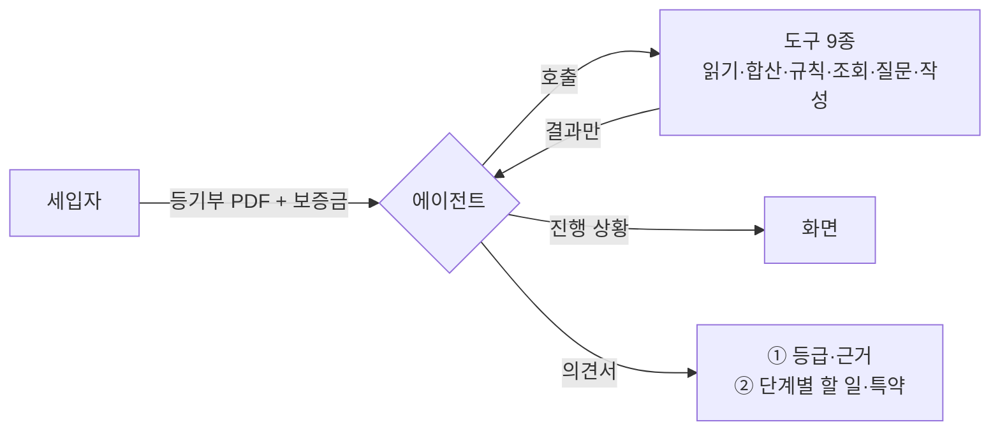

# PRD — 제품 요구

**3줄 요약.** 전세 계약 직전 세입자가 등기부 PDF와 보증금을 넣으면, 에이전트가 LH 권리분석 담당자처럼 무엇을 확인할지 정해 도구를 부르고, "위험한가"와 "그래서 뭘 준비해야 하나"를 의견서 한 장으로 낸다. 계산과 조회는 도구가, 판단과 설명은 에이전트가 한다. 모든 결론에 등기부 원문 근거가 붙는다.

## 1. 목표

#### G1 심사위원이 링크를 열어 3분 안에 의견서를 본다

근거: [[JSD-RFQ-001#Q4]] [[JSD-RFQ-001#Q13]]. 로그인 없이, 첫 화면의 예시 등기부 파일을 올리면 실제 검토 과정을 거쳐 의견서까지 도달한다. 미리 계산된 재생은 없다.

#### G2 세입자가 "이 계약 해도 되나"와 "그럼 뭘 해야 하나"에 답을 받는다

근거: [[JSD-RFQ-001#Q9]]. 축 ① 위험 등급과 근거, 축 ② 이 집에 맞는 단계별 할 일과 특약.

#### G3 에이전트의 모든 말에 근거가 있다

근거: [[JSD-RFQ-001#Q19]] [[JSD-RFQ-001#Q36]]. 도구 결과와 사용자 답변 밖의 사실을 말하지 않고, 판정 기준은 공식 출처를 밝힌다.

## 2. 비목표

| 비목표 | 이유 |
|---|---|
| 회원가입·로그인·결제 | 체험 진입 장벽. 심사·투표에 불리 ([[JSD-RFQ-001#Q13]]) |
| 미리 계산된 결과를 재생하는 샘플 | 의뢰인 결정. 예시 파일도 실제로 처리한다 ([[JSD-RFQ-001#Q13]]) |
| 계약서 전체 검토, 법률 자문 | 범위 폭발. 특약 생성과 일반 설명까지만 ([[JSD-RFQ-001#Q36]]) |
| 다가구 선순위 보증금 자동 조회 | 전입세대 열람은 본인·임대인만 가능. 사용자 질문으로 대체 |
| 등기부 자동 발급 | 공공 API 없음. 사용자 업로드 ([[JSD-RFQ-001#Q26]]) |
| 중개사용 관리 화면, 다국어 | 확장 단계 |
| 잔금일 등기부 비교 | 선택 범위. 일정 여유 시에만 ([[JSD-RFQ-001#Q39]]) |
| 입주 후 분쟁 대응, 보증보험 신청 대행 | 범위 밖 |

## 3. 요구사항

### 3.1 입력

#### R1 등기부 업로드와 계약 조건 입력

근거: [[JSD-RFQ-001#Q11]] [[JSD-RFQ-001#Q12]]

한 화면에서 등기부 PDF(또는 사진)를 올리고 보증금·계약 형태를 입력한다. 단독·다가구로 판정되면 토지 등기부를 추가로 요청한다. 계약 상대방 이름·주소는 선택이며, 주소는 등기부에서 추출한 값을 확인용으로 보여준다.

- [ ] PDF, JPG, PNG를 받고 10MB·20페이지를 넘으면 거절 메시지를 낸다
- [ ] 보증금은 만원 단위 숫자만 받는다. 계약 형태는 전세 / 반전세·월세 둘 중 하나
- [ ] 다가구 판정 시 "토지 등기부도 올려주세요" 요청이 검토 중에 나온다
- [ ] 필수 입력이 비면 검토를 시작하지 않는다

#### R2 예시 등기부 파일

근거: [[JSD-RFQ-001#Q13]] [[JSD-RFQ-001#Q29]]

첫 화면에 가상 등기부 PDF 3건(아파트·안전 / 다세대·주의 / 다가구·위험)을 둔다. 누르면 업로드 폼에 자동 첨부되고 보증금 기본값이 채워지며, 사용자가 "검토 시작"을 누르면 **실제 에이전트가 실제로 처리**한다. 미리 계산된 결과는 없다. 파일은 내려받을 수도 있다.

- [ ] 예시 3건 모두 첨부 → 의견서 90초 이내 (실처리)
- [ ] 예시 문서에는 실제 개인정보가 없다 (가명·가상 주소·가상 등기번호)
- [ ] 예시 3건이 R6 등급 안전·주의·위험을 각각 하나씩 낸다
- [ ] 두 번째 처리부터는 파일 해시 캐시로 등기부 파싱만 건너뛰고 에이전트는 매번 실제로 돈다 (N2)

### 3.2 도구

#### R3 등기부 읽기 도구

근거: [[JSD-RFQ-001#Q14]] [[JSD-RFQ-001#Q25]]

업로드 요청 안에서 PDF·이미지를 표 구조를 보존해 파싱하고, 표제부·갑구·을구를 항목 단위로 저장한다. 도구는 파일을 다시 읽지 않고 저장된 결과를 JSON으로 돌려준다. 각 항목에 원문 위치(페이지·블록 또는 좌표)를 붙인다. 말소된 항목은 `말소=true`로 남기고 버리지 않는다. 부기등기(1-1 등)는 주등기에 연결한다.

| 구분 | 필수 추출 필드 |
|---|---|
| 표제부 | 소재지, 건물 종류(아파트/다세대/다가구·단독/오피스텔/기타), 집합건물 여부, 전유부분 표시, 대지권 미등기·토지 별도등기 표시 |
| 갑구 | 순위번호, 등기목적, 접수일·접수번호, 등기원인(거래가액 포함), 권리자(소유자·채권자), 말소 여부 |
| 을구 | 순위번호, 등기목적, 접수일, 채권최고액·전세금, 채권자·전세권자, 말소 여부, 부기 감액 |

- [ ] 예시 등기부 3건에서 위 필수 필드 전부를 사람이 검수한 정답과 일치하게 뽑는다
- [ ] 말소 항목이 합산에서 빠진다
- [ ] 추출 실패 필드는 `null`로 남기고 도구가 실패 사유를 돌려준다

#### R4 권리 합산·부채비율 도구

근거: [[JSD-RFQ-001#Q15]]

말소되지 않은 을구 근저당 채권최고액과 전세권 전세금을 합산해 선순위 채권으로 잡는다. 다가구는 사용자가 답한 선순위 보증금과 빈 방 수 × 최우선변제금(서울 5,500만 / 과밀억제권역·세종·용인·화성·김포 4,800만 / 광역시·안산·광주·파주·이천·평택 2,800만 / 그 외 2,500만)을 더한다. `부채비율 = (선순위 + 내 보증금) ÷ 주택 가격`, `선순위비율 = 선순위 ÷ 주택 가격`.

- [ ] 근저당 부기등기 감액이 반영된다
- [ ] 주택 가격이 없으면 비율을 내지 않고 "가격 필요"를 돌려준다
- [ ] 순수 함수. 같은 입력이면 같은 출력. 단위 테스트 5건 이상

#### R5 위험 신호 검사 도구

근거: [[JSD-RFQ-001#Q16]]

등기부 JSON과 사용자 답변을 받아 신호 목록을 규칙으로 판정한다. 각 신호에 `등급 영향(즉시 위험 / 주의)`, `근거 항목 ID`, `공식 기준 출처`를 붙인다.

| 신호 | 규칙 | 등급 영향 |
|---|---|---|
| 권리침해 | 갑구에 말소되지 않은 압류·가압류·가처분·가등기·경매개시결정·예고등기 | 즉시 위험 |
| 신탁 | 갑구 등기목적 또는 등기원인에 "신탁" | 즉시 위험 |
| 임차권등기 | 을구에 말소되지 않은 주택임차권 | 즉시 위험 |
| 소유자 불일치 | 갑구 최종 소유자 ≠ 계약 상대방 이름 (사용자가 대리 확인 답하면 주의로 완화) | 즉시 위험 |
| 명단 일치 | HUG 공개 명단에 계약 상대방 이름 일치 | 즉시 위험 |
| 위반건축물·근생 | 사용자 답변 또는 건축물대장 주용도가 근린생활시설 (아파트 제외) | 즉시 위험 |
| 대지권 미등기·토지 별도등기 | 표제부 표시 | 주의 |
| 최근 근저당 | 설정일이 검토일 기준 90일 이내 | 주의 |
| 잦은 이전·신축 직후 | 보존등기 1년 이내이거나 최근 2년 소유권 이전 2회 이상 | 주의 |
| 법인 임대인 | 소유자가 법인 | 주의 |
| 선순위 과다 | 선순위비율 > 54% (HUG 기준) | 주의 |
| 다가구 미확인 | 다가구인데 선순위 보증금 답변 없음 | 주의 |

- [ ] 규칙 각각에 단위 테스트가 있다
- [ ] 신호마다 근거 항목 ID가 비어 있지 않다

#### R6 등급 판정 규칙

근거: [[JSD-RFQ-001#Q15]] [[JSD-RFQ-001#Q18]] [[JSD-RFQ-001#Q38]]

경계는 공식 기준만 쓴다. 90%는 LH 권리분석·HUG 보증의 불가 경계, 70%는 서울시 권장선이다.

| 등급 | 조건 (하나라도 해당하면 상위 등급) |
|---|---|
| **위험** | 즉시 위험 신호 1개 이상, 또는 부채비율 > 90% |
| **주의** | 주의 신호 1개 이상, 또는 부채비율 70% 초과 90% 이하, 또는 핵심 항목(주택 가격·소유자)이 "확인 못 함" |
| **안전** | 위 어느 것도 아니고 부채비율 ≤ 70% |

- [ ] 등급과 함께 "등급을 결정한 항목" 목록이 나온다
- [ ] 규칙표가 서비스 화면의 "판정 기준" 페이지에 그대로 공개된다
- [ ] 코드로 고정. 에이전트는 등급을 바꾸지 못하고 설명만 한다

#### R7 외부 조회 도구 3종

근거: [[JSD-RFQ-001#Q17]] [[JSD-RFQ-001#Q26]]

| 도구 | 입력 | 출력 | 실패 시 |
|---|---|---|---|
| 시세 조회 | 법정동코드, 건물 종류, 건물명·면적 | 최근 12개월 동일 단지·면적 실거래 평균, 건수, 조회 기간 | "시세 못 찾음" → 갑구 1년 내 거래가액 → 사용자 입력 요청 |
| 건축물대장 조회 | 시군구·법정동·번지 | 주용도, 대장 구분(일반/집합), 가구수·세대수, 사용승인일 | "조회 못 함" → 사용자 답변 |
| 임대인 명단 대조 | 이름 | 일치 여부, 일치 시 공개 항목 | "대조 못 함" → 안심전세앱 안내 |

- [ ] 각 도구는 5초 타임아웃, 실패 사유를 문자열로 돌려준다
- [ ] 같은 입력은 24시간 캐시된다
- [ ] 위반건축물 여부는 API에 없으므로 항상 사용자 질문으로 처리한다
- [ ] 예시 파일의 가상 주소는 실거래가 조회가 실패하므로, 예시 3건은 갑구 거래가액 또는 기본 입력값으로 가격이 채워지도록 설계한다

#### R8 사용자에게 묻기 도구

근거: [[JSD-RFQ-001#Q34]]

에이전트가 질문 1개를 내면 검토가 멈추고 화면에 질문과 선택지·입력칸이 뜬다. 답하면 재개, "모름·건너뛰기"면 해당 항목을 "확인 못 함"으로 두고 재개한다.

| 질문 유형 | 언제 | 형식 |
|---|---|---|
| 위반건축물 여부 | 아파트가 아닐 때 | 예 / 아니오 / 모름 (정부24 확인 방법 링크) |
| 시세 | 시세 조회 실패 | 만원 단위 숫자 / 모름 |
| 다가구 세입자 | 다가구·단독 | 가구 수, 알고 있는 보증금 합계 / 모름 |
| 대리인 | 소유자 ≠ 계약 상대방 | 본인 / 대리인(위임장 있음) / 대리인(위임장 없음) / 모름 |
| 임대인 유형 | 소유자가 법인이거나 다주택 의심 | 개인 / 법인 / 모름 |

- [ ] 한 검토에서 질문은 최대 5개
- [ ] 답하지 않아도 의견서가 나온다

#### R9 의견서 작성 도구

근거: [[JSD-RFQ-001#Q20]] [[JSD-RFQ-001#Q21]] [[JSD-RFQ-001#Q22]] [[JSD-RFQ-001#Q23]] [[JSD-RFQ-001#Q35]]

등급·신호·비율·질문 답변을 받아 의견서 JSON을 만든다. 구성은 고정이고, 문장만 생성한다.

| 절 | 내용 | 생성 방식 |
|---|---|---|
| 결론 | 등급 + 한 문장 ("보증금 2억을 넣기엔 위험합니다. 근저당 1억 8천에 시세 대비 92%입니다") | LLM, 등급·수치는 입력값 그대로 |
| 확인한 것 | 항목별 결과 (확인함 / 확인 못 함 / 해당 없음) | 템플릿 |
| 위험 신호 | 신호, 쉬운 설명, 근거 항목 ID, 공식 기준 출처 | 설명만 LLM |
| 단계별 할 일 | 계약 전 / 당일 / 잔금 / 입주 후. 이 집에 해당하는 항목만, 방법·비용 한 줄 | 규칙으로 선택, 문구는 템플릿 |
| 특약·질문 | 표준계약서 특약 1~3 + 결과별 추가 특약, 빈칸 채움. 집주인·중개사 질문 3~5개 | 템플릿 + LLM 보완 |
| 고지 | AI 생성 결과, 전문가 확인 권고, 판정 기준 출처 | 고정 |

- [ ] 의견서의 모든 수치가 도구 출력과 일치한다 (LLM이 숫자를 바꾸지 못하게 후검증)
- [ ] 위험 신호 각각에 근거 항목 ID가 있고 화면에서 하이라이트로 이어진다
- [ ] 특약 문구의 빈칸(금액·날짜·은행명)이 사용자 입력·추출값으로 채워진다

### 3.3 에이전트

#### R10 에이전트 루프

근거: [[JSD-RFQ-001#Q31]] [[JSD-RFQ-001#Q32]] [[JSD-RFQ-001#Q36]]

판단 → 도구 호출 → 관찰을 반복하는 단일 에이전트. 시스템 프롬프트에 역할(LH 권리분석 담당자), 도구 목록, 검토 항목 목록([[JSD-RFQ-001#Q37]]), 금지(도구 밖 사실, 등급 변경)를 넣는다.

- [ ] 도구 호출 최대 20회, 초과 시 그때까지의 결과로 의견서를 낸다
- [ ] 첫 호출은 항상 등기부 읽기, 마지막 호출은 항상 의견서 작성
- [ ] 에이전트가 낸 사실 문장은 도구 출력에서 유래해야 하며, 후검증에서 수치 불일치가 나오면 해당 문장을 버린다
- [ ] 한 검토의 LLM 비용이 건당 300원을 넘지 않는다

#### R11 건물 종류별 필수 검토 규칙

근거: [[JSD-RFQ-001#Q31]] [[JSD-RFQ-001#Q37]]

에이전트가 "무엇을 확인할지" 정하는 최소 규칙. 이 표의 항목은 반드시 시도하고, 나머지는 에이전트 판단.

| 건물 종류 | 반드시 확인 | 시세 순서 | 추가 질문 |
|---|---|---|---|
| 아파트 | 공통 + 실거래가 | 실거래가 → 갑구 거래가액 → 사용자 | 없음 (위반건축물 면제) |
| 다세대·연립 (집합) | 공통 + 대지권·토지 별도등기 + 건축물대장 주용도 | 실거래가(같은 건물) → 갑구 거래가액 → 사용자 | 위반건축물 |
| 다가구·단독 | 공통 + 토지 등기부 + 건축물대장 가구수 | 실거래가 → 갑구 거래가액 → 사용자 | 위반건축물, 세입자 수·보증금 |
| 오피스텔 | 공통 + 주거용 여부 | 실거래가(오피스텔) → 갑구 거래가액 → 사용자 | 위반건축물, 주거용 표기 |

공통 = 소유자 일치, 갑구 권리침해, 신탁, 을구 합산, 임차권·전세권, 부채비율, 임대인 명단, 보존·이전 이력.

- [ ] 예시 3건(아파트·다세대·다가구)에서 표의 필수 항목이 모두 시도된 기록이 남는다

#### R12 진행 상황 표시

근거: [[JSD-RFQ-001#Q33]]

에이전트의 각 단계(판단 문장, 도구 이름, 결과 요약)를 실시간으로 화면에 흘린다. 사람이 읽을 수 있는 문장이어야 한다. "을구를 봅니다 → 근저당 1건, 채권최고액 1억 8천 → 시세와 비교하겠습니다."

- [ ] 도구 호출마다 1줄 이상 표시된다
- [ ] 전체 과정이 대화로 남는다. 의견서에는 검토 기록 절을 따로 두지 않고 대화로 돌아가는 길과 도구 호출 수를 둔다([[JSD-UI-001#UI-3]] 규칙)
- [ ] 심사위원이 이 기록만 보고 어떤 도구가 왜 호출됐는지 알 수 있다

### 3.4 화면과 출력

#### R13 화면 5개

근거: [[JSD-RFQ-001#Q13]] [[JSD-RFQ-001#Q20]] [[JSD-RFQ-001#Q30]]

웹 서비스다(설치 파일 없음). 시작 화면에서 올리면 대화형 검토 화면으로 넘어가고, 에이전트가 문서를 인용하면 옆 패널에 원문이 열려 그 줄이 강조된다.

| 화면 | 내용 |
|---|---|
| 시작 | 한 줄 설명, 예시 등기부 3개 (누르면 폼에 자동 첨부), 업로드·입력 폼, 미저장 고지 |
| 검토 대화 | 에이전트 말풍선·도구 카드·질문 카드(R8)가 쌓이는 대화, 인용 칩 → 문서 패널의 원문 강조, 되묻기 입력창, 삭제 |
| 의견서 | 대화 옆 패널 탭과 단독 페이지. 등급 배지, 결론, 신호(근거 보기 → 원문 강조), 단계별 할 일(탭), 특약·질문(복사), 판정 기준 링크, 인쇄로 저장·링크 공유 |
| 판정 기준 | 등급 규칙·신호표·경계값·출처 공개 (R6) |
| 공유본 | 이름·원문·대화를 뺀 읽기 전용 의견서 (R14) |

- [ ] 폰(390px)에서 가로 스크롤 없이 동작
- [ ] 근거 보기를 누르면 3초 안에 원문 해당 부분이 강조된다

#### R14 저장·공유

근거: [[JSD-RFQ-001#Q24]] [[JSD-RFQ-001#Q28]]

의견서를 PDF로 내려받고, 공유 링크를 만든다. 공유 본에는 이름·주민번호·상세 주소가 없다(동까지만).

- [ ] 공유 링크 열람 시 원본 문서에 접근할 수 없다
- [ ] 공유 본은 7일 후 만료

### 3.5 비기능

#### N1 개인정보

근거: [[JSD-RFQ-001#Q28]]

- [ ] 업로드 파일은 처리 후 즉시 삭제, 디스크에 쓰지 않거나 임시 파일을 요청 종료 시 지운다
- [ ] 로그에 이름·주민번호·상세 주소를 남기지 않는다
- [ ] 시작 화면과 의견서에 미저장 고지가 있다

#### N2 비용·남용 제한

근거: [[JSD-RFQ-001#Q29]]

- [ ] IP당 하루 5건, 파일 10MB·20페이지. 예시 파일은 IP 한도에서 제외
- [ ] 같은 파일 해시는 다시 파싱하지 않고 파싱 결과 캐시를 쓴다. 검토 기록·의견서는 캐시하지 않고 에이전트는 매번 돈다. 예시 3건은 배포 직후 한 번 파싱해 캐시를 채워 둔다
- [ ] 외부 API·LLM 호출 실패 시 재시도 1회
- [ ] 월 예상 비용을 계산해 INFRA에 기록한다

#### N3 가용성

근거: [[JSD-RFQ-001#Q4]]

- [ ] 2026-09-21 ~ 10-17 링크 가동. 무료 티어 슬립이 없는 배포처를 쓴다
- [ ] 외부 API가 죽어도 의견서는 나온다 ("확인 못 함" 처리)

#### N4 AI 고지·접근성

근거: [[JSD-RFQ-001#Q30]]

- [ ] "AI가 읽고 정리한 결과" 고지가 의견서 상단에 있다
- [ ] 용어마다 한 줄 풀이 (툴팁 또는 괄호)

#### N5 AI 협업 과정 기록

근거: [[JSD-RFQ-001#Q8]]

- [ ] 저장소에 CLAUDE.md(의도·규칙), 명세 체인, 결정 기록이 남는다
- [ ] 판정 규칙·추출 도구에 테스트가 있고 실패→수정→재통과 이력이 커밋에 남는다

## 4. 성공지표

| 지표 | 목표 | 측정 |
|---|---|---|
| 예시 파일 도달 시간 | 첨부 → 의견서 90초 이내 (실처리, 캐시 없이) | 예시 3건 실측 |
| 추출 정확도 | 예시 3건 필수 필드 100% | 정답표 대조 |
| 실사용자 테스트 | 실제 등기부 1건 이상, 의견서 받고 "도움 됐다" 한 줄 확보 | 9/18 |
| 근거 연결률 | 위험 신호 100%에 근거 하이라이트 | 자동 검사 |
| 수치 일치율 | 의견서 수치와 도구 출력 100% 일치 | 후검증 로그 |
| 건당 비용 | LLM+API 300원 이하 | 로그 집계 |
| 가동률 | 심사 기간 99% 이상 | 외부 모니터 |
| 모바일 | 390px에서 3화면 모두 정상 | 수동 점검 |

## 5. ID 체계

`G` 목표, `R` 기능 요구, `N` 비기능 요구. 하위 문서는 `[[JSD-PRD-001#R6]]`처럼 참조한다. 판정 규칙(R5·R6)과 검토 규칙(R11)은 코드와 화면의 "판정 기준" 페이지가 이 문서를 그대로 따른다.

## 6. 미결사항

- [ ] 부채비율 경계 70%·90% 확정 여부 (RFQ 미정 항목. 이 문서는 LH·HUG 90%, 서울시 70%를 채택했다)
- [ ] HUG 공개 명단 자동 읽기 가능 여부 → 불가 시 R7 명단 대조는 안내로 격하
- [ ] 예시 등기부 3건 제작 방법 (실제 문서 마스킹 vs 가상 제작). 가상 주소면 실거래가 조회가 안 되므로 가격 채움 방식을 함께 정한다
- [ ] 반전세·월세일 때 보증금이 소액임차인 기준 이하면 등급을 완화할지
- [ ] 진행 상황 스트리밍 방식 (SSE vs 폴링) → INFRA
- [ ] 서비스명 확정
