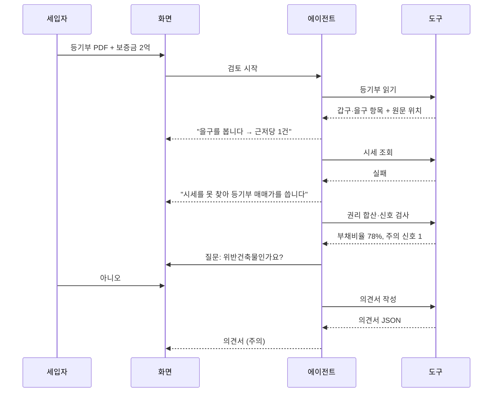

# 사용자 시나리오

## 0. 범위와 전제

- 시나리오 S1~S3은 [[JSD-PRD-001#R2]]의 예시 등기부 3건과 1:1로 대응한다. 예시 파일은 이 시나리오가 그대로 재현되도록 만든다.
- 등급 경계와 신호 규칙은 [[JSD-PRD-001#R5]] [[JSD-PRD-001#R6]]을 따른다.
- 외부 조회는 실패할 수 있고, 실패해도 의견서는 나온다 ([[JSD-PRD-001#N3]]).
- 모든 시나리오는 로그인 없이 시작한다.

## 1. 페르소나

#### P1 첫 전세 세입자 민서

**역할**: 29세 직장인. 서울에서 첫 전세 계약을 앞둠. 보증금 2억, 부모님 도움 + 전세대출.
**겪는 문제**: 중개사가 준 등기부 PDF를 열어 봤지만 "을구 근저당권설정 채권최고액 금 216,000,000원"이 위험한 건지 모른다. 집주인은 한 번 봤는데 믿어도 되는지 모르겠고, 계약일이 사흘 뒤라 물어볼 사람이 없다. 인터넷엔 "전세사기 조심"만 넘친다.
**원하는 것**: "이 집 괜찮아요?"에 대한 답과, 계약 당일 뭘 챙겨야 하는지 목록. 잘못되면 2억을 잃는다는 걸 안다.

#### P2 심사위원·투표자

**역할**: 원티드 AI Championship 심사위원 또는 투표하러 들어온 원티드 회원. 대부분 휴대폰으로 링크를 연다.
**겪는 문제**: 자기 등기부가 없다. 3분 안에 이 서비스가 뭘 하는지, AI가 어디에 쓰였는지, 결과를 믿을 수 있는지 판단해야 한다.
**원하는 것**: 클릭 몇 번으로 실제 동작을 보고, 에이전트가 무엇을 왜 확인했는지 읽고, 결론의 근거를 확인하는 것.

## 2. 시나리오

#### S1 아파트, 안전 — 근저당 하나 있는 보통의 집

**주체**: P1
**상황**: 서울 노원구 아파트 84㎡. 등기부 을구에 근저당 1건(채권최고액 1억 2천, 2021년 설정). 갑구는 2019년 매매로 소유권 이전 후 변동 없음. 보증금 2억, 전세. 같은 단지 최근 실거래 5억 5천.

1. 시작 화면에서 등기부 PDF를 올리고 보증금 2억, 전세를 입력한 뒤 검토 시작
2. 진행 화면: "등기부를 읽습니다" → 표제부에서 아파트 판정 → "갑구를 봅니다: 소유자 1명, 권리침해 없음" → "을구를 봅니다: 근저당 1건 1억 2천"
3. "같은 단지 실거래가를 찾습니다" → 최근 12개월 평균 5억 5천 (건수 4)
4. "권리를 합산합니다" → 부채비율 (1.2억 + 2억) ÷ 5.5억 = 58%, 선순위비율 22%
5. 신호 검사: 해당 없음. 질문 없음
6. 의견서: **안전**. 결론 "보증금 2억을 넣어도 시세 대비 58%로 LH·HUG 기준(90%) 안에 있습니다. 근저당 1억 2천은 2021년 설정이며 최근 변동은 없습니다."
7. 단계별 할 일: 계약 당일 신분증·등기부 대조, 소유자 계좌 입금, 표준계약서 특약 1·2 삽입 / 잔금일 등기부 재발급·전입신고·확정일자 / 입주 후 보증보험 가입(계약기간 절반 전), 임대차 신고 30일
8. 특약: 표준 특약 1·2 채움. 질문: "근저당 1억 2천은 어느 은행이고 상환 계획이 있나요?"
9. PDF 저장

**변형 — 실거래가 조회 실패**: 3에서 실패하면 "등기부 갑구의 최근 매매가(2019년 4억 8천)를 대신 씁니다"라고 알리고, 부채비율 67%로 계산. 의견서에 "시세는 2019년 매매가 기준이며 현재 시세를 직접 확인하세요"가 붙는다. 등급은 안전 유지 (≤70%).
**변형 — 계약 상대방 이름 입력**: 갑구 소유자와 같으면 "소유자 본인과 계약합니다"가 확인 항목에 표시된다.

**성공 조건**: 첨부 → 의견서 90초 이내. 질문 0개. 의견서 수치가 도구 출력과 일치. 근거 보기 3곳(소유자·근저당·매매가)이 원문을 하이라이트.
**연관 요구사항**: [[JSD-PRD-001#R1]] [[JSD-PRD-001#R3]] [[JSD-PRD-001#R4]] [[JSD-PRD-001#R6]] [[JSD-PRD-001#R7]] [[JSD-PRD-001#R9]] [[JSD-PRD-001#R12]] [[JSD-PRD-001#R14]]

#### S2 다세대, 주의 — 시세가 없고 근저당이 큰 신축 빌라

**주체**: P1
**상황**: 서울 강서구 다세대(집합건물) 3층 301호, 2025년 보존등기. 을구 근저당 1건 채권최고액 2억 1천(2025년 설정, 검토일 기준 60일 전). 갑구에 2025년 매매 거래가액 5억. 보증금 1억 8천, 전세. 신축이라 같은 건물 실거래 없음.

1. 업로드, 보증금 1억 8천, 전세
2. 진행: 표제부에서 집합건물·다세대 판정, 대지권 등기 정상 → "갑구: 2025년 보존등기, 같은 해 매매 1건" → "을구: 근저당 2억 1천, 60일 전 설정"
3. "실거래가를 찾습니다" → 없음 → "등기부의 올해 매매가 5억을 씁니다"
4. "건축물대장을 조회합니다" → 주용도 다세대주택, 세대수 12
5. 질문 카드: "정부24 건축물대장에 '위반건축물' 표시가 있나요?" (확인 방법 링크) → 사용자 "아니오"
6. 합산: (2.1억 + 1.8억) ÷ 5억 = 78%, 선순위비율 42%
7. 신호: 최근 근저당(60일) 주의, 신축 직후(보존등기 1년 이내) 주의
8. 의견서: **주의**. 결론 "시세 대비 78%로 기준 안이지만, 근저당이 두 달 전에 설정됐고 신축 첫 세입자입니다. 시세 근거가 등기부 매매가 하나뿐이라 실제 시세를 꼭 따로 확인하세요."
9. 단계별 할 일에 추가: 계약 전 안심전세앱 시세·보증보험 가입 가능 사전 확인, 임대인 미납세 열람 동의 요청 / 계약 당일 특약 3(체납·선순위 미고지 시 해제) 금액 채움 / 잔금일 등기부 재발급해 근저당 증액 여부 확인
10. 특약: 표준 1·2·3 + "보증보험 가입 거절 시 계약 무효" 조건부 특약. 질문: "근저당 2억 1천은 분양 잔금 대출인가요? 잔금 전 감액 계획이 있나요?"

**변형 — 위반건축물 "예"**: 5에서 "예"면 즉시 위험 신호 → 등급 **위험**, 결론에 "위반건축물은 전세보증보험 가입이 안 됩니다"가 먼저 온다.
**변형 — 질문 건너뛰기**: "모름"이면 위반건축물 항목이 "확인 못 함"으로 남고, 단계별 할 일 맨 위에 정부24 확인이 올라온다. 등급은 주의 유지.

**성공 조건**: 질문 1개가 정확한 시점(건축물대장 조회 뒤)에 뜬다. 시세 실패→대체 경로가 진행 화면에 문장으로 보인다. 의견서 수치 일치.
**연관 요구사항**: [[JSD-PRD-001#R5]] [[JSD-PRD-001#R7]] [[JSD-PRD-001#R8]] [[JSD-PRD-001#R9]] [[JSD-PRD-001#R11]] [[JSD-PRD-001#R12]]

#### S3 다가구, 위험 — 세입자가 여럿이고 임차권등기가 있는 집

**주체**: P1
**상황**: 경기 부천 다가구주택(일반건물) 2층 중 한 호. 건물 등기부 을구에 근저당 2건 합계 채권최고액 3억, **주택임차권 1건**(2025년, 보증금 8천, 이전 세입자). 토지 등기부에 근저당 1억. 갑구 소유자는 법인. 보증금 9천, 전세. 건축물대장 가구수 6.

1. 업로드(건물 등기부), 보증금 9천, 전세, 계약 상대방 "○○주식회사"
2. 진행: 표제부에서 일반건물·다가구 판정 → "다가구는 토지 등기부도 봐야 합니다" → 질문 카드: 토지 등기부 업로드 요청 → 사용자 업로드
3. "갑구: 소유자 법인, 권리침해 없음" → "을구: 근저당 2건 3억, **주택임차권 1건** — 이전 세입자가 보증금을 못 받은 기록입니다"
4. "토지 등기부 을구: 근저당 1억"
5. "건축물대장: 다가구주택, 6가구" → 질문: "이 건물에 다른 세입자가 몇 가구 있고, 아는 보증금 합계가 있나요?" → "4가구, 빈 방 2개, 보증금은 모름"
6. 실거래가 없음 → 갑구 매매가 없음 → 질문: "중개사가 말한 이 건물 시세는?" → 7억
7. 합산: 선순위 = 근저당 4억 + 다른 세입자 보증금(모름 → 빈 방 2 × 과밀억제권역 4,800만 = 9,600만, 아는 4가구는 미확인) → 다가구 미확인 주의 + 임차권등기 **즉시 위험** + 법인 임대인 주의
8. 의견서: **위험**. 결론 "이 집은 이전 세입자가 보증금을 돌려받지 못해 임차권등기를 한 기록이 있습니다. LH 기준으로는 지원 불가 주택입니다. 계약을 보류하고 아래를 확인하세요."
9. 단계별 할 일: 계약 전 임차권등기 경위를 임대인에게 서면으로 확인, 확정일자 부여현황(임대인 동의)으로 선순위 보증금 전액 확인, 법인 임대인 보증사고 이력 조회 / 그래도 진행한다면 특약에 선순위 총액 명시·상이 시 해제
10. 특약: 표준 3(선순위·체납) + 근저당 말소 조건부. 질문: "임차권등기가 된 이전 세입자 보증금은 반환됐나요? 말소 예정일은?"

**변형 — 토지 등기부 안 올림**: 2에서 건너뛰면 "토지 근저당 확인 못 함"으로 남고 주의 신호가 추가된다. 등급은 임차권등기 때문에 어차피 위험.
**변형 — 계약 상대방이 개인 이름**: 소유자(법인)와 불일치 → 즉시 위험 신호 하나 더. 질문 "대리인인가요?"가 뜬다.

**성공 조건**: 질문 3개(토지 등기부·세입자·시세)가 순서대로 뜨고 답 없이도 의견서가 나온다. 임차권등기 근거 보기가 을구 해당 행을 하이라이트. 결론 첫 문장이 임차권등기다.
**연관 요구사항**: [[JSD-PRD-001#R1]] [[JSD-PRD-001#R4]] [[JSD-PRD-001#R5]] [[JSD-PRD-001#R6]] [[JSD-PRD-001#R8]] [[JSD-PRD-001#R11]]

#### S4 심사위원의 3분 체험

**주체**: P2
**상황**: 대회 사이트에서 링크를 열었다. 휴대폰. 등기부 없음.

1. 시작 화면: 한 줄 설명 "등기부 올리면 LH 권리분석 기준으로 검토해 드립니다", 예시 등기부 3개 카드(아파트·다세대·다가구), 업로드 폼, "문서는 저장하지 않습니다"
2. "다세대·신축 빌라" 카드 탭 → 폼에 파일 첨부됨, 보증금 1억 8천 채워짐 → 검토 시작
3. 진행 화면에서 에이전트가 무엇을 왜 하는지 문장으로 흘러감. 시세 실패→대체를 봄. 질문 카드가 뜨면 답함
4. 의견서 도착 (S2와 동일). 등급 배지, 결론, 신호 카드
5. 신호 카드의 "근거 보기" 탭 → 원문 패널에서 을구 근저당 행이 강조됨
6. "판정 기준" 링크 → R5·R6 규칙표와 LH·HUG 출처
7. 하단 "검토 기록"에서 도구 호출 순서 확인
8. 뒤로 가서 "다가구·위험" 카드로 한 번 더

**변형 — 두 번째 사람이 같은 예시를 돌림**: 파일 해시 캐시로 등기부 파싱만 건너뛰고 에이전트는 처음부터 실제로 돈다. 앞사람의 대화·의견서를 재생하지 않는다.
**변형 — 외부 API 장애**: 시세·건축물대장이 모두 실패해도 질문으로 대체돼 의견서가 나온다.

**성공 조건**: 링크 → 의견서 3분 이내. 폰에서 가로 스크롤 없음. 검토 기록만 읽고 도구 호출 이유를 알 수 있음.
**연관 요구사항**: [[JSD-PRD-001#G1]] [[JSD-PRD-001#R2]] [[JSD-PRD-001#R12]] [[JSD-PRD-001#R13]] [[JSD-PRD-001#N2]] [[JSD-PRD-001#N3]] [[JSD-PRD-001#N4]]

## 3. 대응표

| 시나리오 | 등급 | 질문 수 | 외부 조회 | 다루는 요구 |
|---|---|---|---|---|
| S1 아파트 | 안전 | 0 | 실거래가 성공 | R1 R3 R4 R6 R7 R9 R12 R14 |
| S2 다세대 | 주의 | 1 (위반건축물) | 실거래가 실패 → 갑구 매매가, 건축물대장 성공 | R5 R7 R8 R9 R11 R12 |
| S3 다가구 | 위험 | 3 (토지 등기부·세입자·시세) | 실거래가 없음, 건축물대장 성공 | R1 R4 R5 R6 R8 R11 |
| S4 심사위원 | (S2·S3 재사용) | — | S2·S3와 같음 | G1 R2 R12 R13 N2 N3 N4 |

| PRD 요구 | 다루는 시나리오 |
|---|---|
| R1 업로드·입력 | S1 S3 |
| R2 예시 파일 | S4 |
| R3 등기부 읽기 | S1 (S2·S3 암묵) |
| R4 권리 합산 | S1 S3 |
| R5 위험 신호 | S2 S3 |
| R6 등급 판정 | S1 S3 |
| R7 외부 조회 | S1 S2 |
| R8 사용자에게 묻기 | S2 S3 |
| R9 의견서 | S1 S2 |
| R10 에이전트 루프 | 전체 (도구 순서·실패 대체) |
| R11 건물 종류별 검토 | S2 S3 |
| R12 진행 상황 | S1 S2 S4 |
| R13 화면 3개 | S4 |
| R14 저장·공유 | S1 |
| N1 개인정보 | S4 (미저장 고지) |
| N2 비용·남용 | S4 변형 |
| N3 가용성 | S4 변형 |
| N4 AI 고지 | S4 |
| N5 협업 과정 기록 | 시나리오 밖 (개발 과정) |
