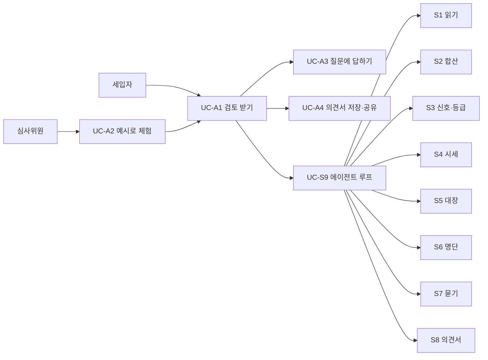

# USECASE (Cockburn)

## 0. 이 문서의 형식

- 사용자 목표 수준(`UC-A`)은 세입자가 한 번 앉아서 끝내는 일. 하위기능 수준(`UC-S`)은 에이전트가 부르는 도구 하나 또는 시스템 내부 절차 하나.
- 도구 유스케이스의 주 액터는 **에이전트**다. 에이전트는 시스템 안에 있지만 도구를 "호출하는 쪽"이므로 액터로 둔다.
- 확장은 `3a.` 형식. 실패 시 "확인 못 함"으로 진행하는 것이 이 서비스의 기본 태도다 ([[JSD-PRD-001#N3]]).

## 1. 액터

| 액터 | 종류 | 설명 |
|---|---|---|
| 세입자 | 주 액터 (사람) | 등기부를 올리고 질문에 답하고 의견서를 받는다. [[JSD-SCN-001#P1]] |
| 심사위원·투표자 | 주 액터 (사람) | 예시 파일로 세입자 역할을 대신 수행한다. [[JSD-SCN-001#P2]] |
| 에이전트 | 주 액터 (시스템 내부) | 도구를 골라 호출하고 결과를 설명한다. [[JSD-PRD-001#R10]] |
| 문서 파싱 서비스 | 보조 (외부) | PDF·이미지 → 표 구조 보존 텍스트. 업스테이지 Document Parse 우선 검토 |
| LLM | 보조 (외부) | 에이전트 판단, 의견서 문장 생성 |
| 실거래가 API | 보조 (외부) | 국토부 공공데이터 |
| 건축물대장 API | 보조 (외부) | 국토부 건축HUB |
| HUG 명단 | 보조 (외부) | 상습 채무불이행자 공개 명단 페이지 |

## 2. 사용자 목표 수준 유스케이스

#### UC-A1 등기부 검토 받기

| 항목 | 내용 |
|---|---|
| 범위 | 보증금지킴 서비스 |
| 수준 | 사용자 목표 |
| 주 액터 | 세입자 |
| 이해관계자와 관심사 | 세입자: 계약 전 위험을 알고 준비 목록을 받는다 / 운영자: 비용 한도 안에서 처리된다 / 임대인: 개인정보는 검토를 만든 뒤 24시간 안에 지워진다 |
| 사전조건 | 등기부 PDF 또는 사진을 가지고 있다. 로그인 없음 |
| 최소 보장 | 업로드 파일은 요청 종료 시 삭제된다. 실패해도 어디까지 확인됐는지 화면에 남는다 |
| 성공 보장 | 등급·근거·단계별 할 일·특약이 담긴 의견서가 화면에 있다. 검토 기록이 남아 있다 |
| 트리거 | 세입자가 파일과 보증금·계약 형태를 넣고 "검토 시작"을 누른다 |
| 패키지 | 검토 |
| 포함(include) | [[#UC-S1]] [[#UC-S9]] [[#UC-S10]] |
| 확장점(extension point) | 질문 발생 → [[#UC-A3]] / 의견서 도착 → [[#UC-A4]] |
| 일반화 | — |

**기본 흐름**
1. 세입자가 등기부 파일을 올리고 보증금(만원), 계약 형태(전세/반전세·월세)를 입력한다. 계약 상대방 이름은 선택
2. 시스템이 파일 형식·크기·페이지 수와 요청 한도를 검사한다 ([[#UC-S10]])
3. 시스템이 같은 요청 안에서 등기부를 파싱하고([[#UC-S1]] 1~6) 검토 세션과 함께 저장한 뒤 검토 중 화면으로 전환한다
4. 에이전트 루프가 시작된다 ([[#UC-S9]]). 도구 호출마다 진행 문장이 화면에 흐른다
5. 에이전트가 질문을 내면 [[#UC-A3]]으로 분기했다가 돌아온다
6. 에이전트가 의견서 작성 도구를 마지막으로 호출한다
7. 시스템이 의견서 수치를 도구 출력과 대조한다 (후검증)
8. 의견서 화면이 뜬다. 등급 배지, 결론, 신호 카드(근거 보기), 단계별 할 일, 특약·질문, 검토 기록, AI 고지
9. 시스템이 만든 지 24시간이 지난 검토의 기록(대화·질문·등기부·인용·의견서)을 삭제한다. 업로드 파일은 3의 요청이 끝날 때 이미 버려졌다

**확장**
- **2a. 파일이 PDF·JPG·PNG가 아니거나 10MB·20페이지 초과**
  - 2a1. 거절 메시지와 함께 1로 돌아간다
- **2b. IP 일일 한도 초과**
  - 2b1. "오늘은 5건까지 검토할 수 있습니다" 안내. 예시 파일은 한도에서 제외
- **2c. 같은 파일 해시가 캐시에 있음**
  - 2c1. 3에서 문서 파싱 서비스를 부르지 않고 캐시된 파싱 결과를 쓴다. 검토 기록·의견서는 캐시하지 않으므로 에이전트는 4부터 그대로 돈다
- **3a. 등기부 읽기 실패 (파싱 불가·등기부가 아님)**
  - 3a1. 업로드 요청이 거절로 답한다([[#UC-S1]] 1a·2a). "등기부로 읽히지 않습니다. 인터넷등기소 PDF 원본을 올려주세요" 안내. 검토는 만들어지지 않는다. 1로
- **4b. 도구 호출이 20회에 달함**
  - 4b1. 에이전트가 그때까지의 결과로 6을 수행한다
- **7a. 의견서 수치가 도구 출력과 다름**
  - 7a1. 해당 문장을 버리고 도구 값으로 채운 템플릿 문장을 넣는다. 검토 기록에 "후검증 교정 N건" 표시
- **8a. 세입자가 추출값을 고침 (예: 채권최고액 오인식)**
  - 8a1. 고친 값으로 합산·신호·등급 도구만 다시 돌리고 의견서를 갱신한다. 등기부 읽기는 다시 하지 않는다

**연관**: [[JSD-PRD-001#R1]] [[JSD-PRD-001#R9]] [[JSD-PRD-001#R10]] [[JSD-PRD-001#R12]] [[JSD-PRD-001#R13]] [[JSD-PRD-001#N1]] · [[JSD-SCN-001#S1]] [[JSD-SCN-001#S2]] [[JSD-SCN-001#S3]]

#### UC-A2 예시 파일로 체험하기

| 항목 | 내용 |
|---|---|
| 범위 | 보증금지킴 서비스 |
| 수준 | 사용자 목표 |
| 주 액터 | 심사위원·투표자 (세입자도 가능) |
| 이해관계자와 관심사 | 심사위원: 3분 안에 실제 동작과 근거를 본다 / 운영자: 예시는 파싱 비용이 들지 않는다. 에이전트 비용은 매번 든다 |
| 사전조건 | 없음 |
| 최소 보장 | 예시 파일을 내려받을 수 있다 |
| 성공 보장 | [[#UC-A1]]과 같은 의견서에 도달한다 |
| 트리거 | 시작 화면에서 예시 카드(아파트·다세대·다가구)를 누른다 |
| 패키지 | 검토 |
| 포함(include) | [[#UC-A1]] |
| 확장점(extension point) | — |
| 일반화 | [[#UC-A1]]의 특수화 |

**기본 흐름**
1. 시작 화면에 예시 카드 3개가 각각 한 줄 설명(집 종류, 어떤 상황인지)과 함께 보인다
2. 카드를 누르면 업로드 폼에 해당 PDF가 첨부되고, 보증금·계약 형태가 시나리오 값으로 채워진다
3. 사용자가 "검토 시작"을 누른다 → [[#UC-A1]] 1부터 진행. 예시 파일은 IP 한도에서 제외
4. 매번 실제로 도구가 돈다. 이미 파싱된 파일이면 [[#UC-A1]] 2c로 파싱 결과만 캐시에서 가져온다

**확장**
- **2a. 사용자가 보증금을 바꿈**
  - 2a1. 캐시 키는 파일 해시뿐이고 에이전트는 매번 돌므로 바뀐 보증금으로 그대로 처리된다
- **4a. 배포 직후 캐시가 비어 있음**
  - 4a1. 운영자가 배포 후 예시 3건을 한 번씩 파싱해 파싱 캐시를 채운다. 검토는 만들지 않는다 (운영 절차, INFRA)

**연관**: [[JSD-PRD-001#G1]] [[JSD-PRD-001#R2]] [[JSD-PRD-001#N2]] · [[JSD-SCN-001#S4]]

#### UC-A3 에이전트의 질문에 답하기

| 항목 | 내용 |
|---|---|
| 범위 | 보증금지킴 서비스 |
| 수준 | 사용자 목표 |
| 주 액터 | 세입자 |
| 이해관계자와 관심사 | 세입자: 무엇을 왜 묻는지 알고 답하거나 건너뛴다 / 에이전트: 답을 받아 검토를 잇는다 |
| 사전조건 | [[#UC-A1]] 진행 중, 에이전트가 [[#UC-S7]]을 호출함 |
| 최소 보장 | 답하지 않아도 검토가 계속된다. 해당 항목은 "확인 못 함" |
| 성공 보장 | 답이 도구 입력으로 들어가 후속 판단에 반영된다 |
| 트리거 | 검토 중 화면에 질문 카드가 뜬다 |
| 패키지 | 검토 |
| 포함(include) | — |
| 확장점(extension point) | — |
| 일반화 | — |

**기본 흐름**
1. 질문 카드에 질문 문장, 왜 묻는지 한 줄, 선택지 또는 입력칸, "모름·건너뛰기", 확인 방법 링크(있으면)가 보인다
2. 세입자가 선택하거나 입력하고 "답변"을 누른다
3. 시스템이 답을 검토 세션에 저장하고 에이전트를 재개한다
4. 진행 화면에 "답변 반영: …"이 흐른다

**확장**
- **2a. "모름·건너뛰기"**
  - 2a1. 답을 `unknown`으로 저장. 에이전트는 해당 항목을 "확인 못 함"으로 두고 진행. 단계별 할 일에 그 항목이 올라간다
- **2b. 토지 등기부 업로드 요청인 경우**
  - 2b1. 카드에 파일 입력이 있고, 올리면 답변 요청 안에서 두 번째 문서로 파싱·저장한다([[#UC-S1]] 1~6). 에이전트는 저장된 결과를 읽는다
  - 2b2. 등기부가 아니거나 파싱이 실패하면 답변 요청이 거절로 답하고([[#UC-S1]] 1a·2a) 질문 카드는 그대로 남는다
- **2c. 5분 동안 답이 없음**
  - 2c1. 2a와 같이 처리하고 진행 화면에 "답변 없이 진행합니다"
- **3a. 한 검토에서 질문이 이미 5개**
  - 3a1. 에이전트는 더 묻지 못한다. [[#UC-S7]]이 거절을 돌려주고 에이전트는 "확인 못 함"으로 진행

**연관**: [[JSD-PRD-001#R8]] · [[JSD-SCN-001#S2]] [[JSD-SCN-001#S3]]

#### UC-A4 의견서 저장·공유하기

| 항목 | 내용 |
|---|---|
| 범위 | 보증금지킴 서비스 |
| 수준 | 사용자 목표 |
| 주 액터 | 세입자 |
| 이해관계자와 관심사 | 세입자: 가족·지인에게 보여준다 / 임대인: 공유본에 이름·주민번호가 없다 |
| 사전조건 | 의견서가 화면에 있다 |
| 최소 보장 | 공유본은 7일 뒤 사라진다. 원본 등기부는 어디에도 없다 |
| 성공 보장 | PDF 파일이 내려받아지거나, 공유 링크가 복사된다 |
| 트리거 | 의견서 화면에서 "PDF 저장" 또는 "링크 공유" |
| 패키지 | 출력 |
| 포함(include) | — |
| 확장점(extension point) | — |
| 일반화 | — |

**기본 흐름**
1. 세입자가 "PDF 저장"을 누른다
2. 브라우저 인쇄로 의견서 본문을 A4 PDF로 저장한다. 서버를 부르지 않는다. 목차·근거 패널·대화는 인쇄에서 빠지고 근거 문장만 남는다
3. 세입자가 "링크 공유"를 누른다
4. 시스템이 의견서에서 이름·주민번호·상세 주소(동 이하)를 지운 공유본을 만들고 7일 만료 링크를 발급한다
5. 링크가 클립보드에 복사된다

**확장**
- **4a. 공유본 생성 시 마스킹 대상 필드가 비어 있음**
  - 4a1. 그대로 진행. 마스킹은 존재하는 필드에만 적용
- **5a. 공유 링크 열람자가 원본 등기부를 요청**
  - 5a1. 불가. 공유본에는 원문 패널이 없다

**연관**: [[JSD-PRD-001#R14]] [[JSD-PRD-001#N1]] · [[JSD-SCN-001#S1]]

## 3. 하위기능 수준 유스케이스

#### UC-S1 등기부 읽기

| 항목 | 내용 |
|---|---|
| 범위 | 도구 |
| 수준 | 하위기능 |
| 주 액터 | 에이전트 |
| 이해관계자와 관심사 | 세입자: 추출값이 정확하고 원문 위치가 맞다 |
| 사전조건 | 파일이 검사를 통과했다 |
| 최소 보장 | 파싱 실패·등기부 아님이면 업로드 요청이 거절로 답하고 문서를 저장하지 않는다. 부분 추출이면 `null` 필드와 함께 저장한다 |
| 성공 보장 | 표제부·갑구·을구 항목 JSON + 각 항목의 원문 위치 + 문서 종류(건물/토지/집합) |
| 트리거 | 1~6은 검토 시작·서류 추가 업로드 요청 안에서 돌고 결과를 저장한다. 에이전트 첫 호출 또는 토지 등기부 추가 시에는 저장된 결과를 돌려준다 |
| 패키지 | 도구 |
| 포함(include) | — |
| 확장점(extension point) | — |
| 일반화 | — |

**기본 흐름**
1. 문서 파싱 서비스에 파일을 보내 표 구조가 보존된 HTML(표는 `<table>`, 요소마다 id)을 받는다
2. 표제부·갑구·을구 구간을 헤더로 나눈다
3. 구간별 표를 행 단위로 규칙에 따라 읽는다. 모델은 쓰지 않는다. 출력 스키마: 순위번호, 등기목적, 접수일·번호, 등기원인·거래가액, 권리자, 금액(채권최고액·전세금), 말소 여부, 부기 대상 순위, 원문 블록 ID
4. 등기목적이 "N번…말소"인 행으로 N번 항목을 `말소=true`로 두고(취소선은 파싱 결과에 남지 않는다), 부기등기(1-1)를 주등기에 연결한다
5. 표제부에서 건물 종류·집합건물 여부·대지권 미등기·토지 별도등기 표시를 뽑는다
6. 필수 필드 누락을 세어 `warnings`에 넣고 결과를 저장한다. 에이전트가 부르면 저장된 결과를 돌려준다

**확장**
- **1a. 파싱 서비스 실패·타임아웃(30초)**
  - 1a1. 1회 재시도. 다시 실패하면 업로드 요청이 parse_failed(502)로 답한다 → [[#UC-A1]] 3a · [[#UC-A3]] 2b
- **2a. 갑구·을구 헤더가 없음 (등기부가 아님)**
  - 2a1. 업로드 요청이 not_registry(400)로 답하고 문서를 저장하지 않는다 → [[#UC-A1]] 3a · [[#UC-A3]] 2b
- **3a. 행의 필드를 읽지 못함**
  - 3a1. 그 필드는 `null` + warning
- **5a. 건물 종류를 판정하지 못함**
  - 5a1. `기타`로 두고 에이전트가 [[#UC-S7]]로 묻게 한다

**연관**: [[JSD-PRD-001#R3]] · [[JSD-SCN-001#S1]]

#### UC-S2 권리 합산·부채비율

| 항목 | 내용 |
|---|---|
| 범위 | 도구 |
| 수준 | 하위기능 |
| 주 액터 | 에이전트 |
| 이해관계자와 관심사 | 세입자: 숫자가 틀리지 않는다 |
| 사전조건 | 등기부 JSON(건물, 있으면 토지), 보증금, 주택 가격(있으면), 다가구 답변(있으면) |
| 최소 보장 | 주택 가격이 없으면 비율 대신 "가격 필요"를 돌려준다. 선순위 합계는 항상 돌려준다 |
| 성공 보장 | 선순위 합계, 부채비율, 선순위비율, 계산에 쓴 항목 ID 목록 |
| 트리거 | 에이전트 호출 |
| 패키지 | 도구 |
| 포함(include) | — |
| 확장점(extension point) | — |
| 일반화 | — |

**기본 흐름**
1. 을구에서 말소되지 않은 근저당 채권최고액과 전세권 전세금을 모은다 (건물 + 토지)
2. 부기등기로 감액된 근저당은 감액 후 금액을 쓴다
3. 다가구면 사용자가 답한 선순위 보증금과 빈 방 수 × 지역 최우선변제금을 더한다
4. `부채비율 = (선순위 + 보증금) ÷ 가격`, `선순위비율 = 선순위 ÷ 가격` 계산
5. 사용한 항목 ID와 함께 돌려준다

**확장**
- **3a. 다가구인데 답변이 없음**
  - 3a1. 세입자 보증금은 0으로 두고 `다가구_미확인=true`를 돌려준다
- **4a. 가격이 없음**
  - 4a1. 비율은 `null`, `가격_필요=true`

**연관**: [[JSD-PRD-001#R4]] · [[JSD-SCN-001#S1]] [[JSD-SCN-001#S3]]

#### UC-S3 위험 신호 검사·등급 판정

| 항목 | 내용 |
|---|---|
| 범위 | 도구 |
| 수준 | 하위기능 |
| 주 액터 | 에이전트 |
| 이해관계자와 관심사 | 세입자: 규칙이 공개돼 있고 같은 입력이면 같은 등급 |
| 사전조건 | 등기부 JSON, 합산 결과, 사용자 답변, 명단·대장 조회 결과(있으면) |
| 최소 보장 | 입력이 부족해도 판정 가능한 신호만으로 등급을 낸다. 부족한 항목은 "확인 못 함" 목록에 |
| 성공 보장 | 신호 목록(각각 등급 영향·근거 항목 ID·출처), 등급, 등급 결정 항목, 확인 못 함 목록 |
| 트리거 | 에이전트 호출 |
| 패키지 | 도구 |
| 포함(include) | — |
| 확장점(extension point) | — |
| 일반화 | — |

**기본 흐름**
1. [[JSD-PRD-001#R5]] 규칙표를 위에서 아래로 적용해 신호를 모은다
2. [[JSD-PRD-001#R6]] 규칙으로 등급을 정한다: 즉시 위험 신호 또는 부채비율 > 90% → 위험 / 주의 신호 또는 70~90% 또는 핵심 항목 확인 못 함 → 주의 / 그 외 → 안전
3. 등급을 결정한 항목만 골라 `결정_항목`에 넣는다
4. 결과를 돌려준다

**확장**
- **1a. 소유자 불일치인데 사용자가 "대리인(위임장 있음)"이라 답함**
  - 1a1. 즉시 위험 → 주의로 완화하고 단계별 할 일에 위임장·인감증명서 확인을 넣는다
- **2a. 부채비율이 `null`**
  - 2a1. 핵심 항목 확인 못 함 → 최소 주의

**연관**: [[JSD-PRD-001#R5]] [[JSD-PRD-001#R6]] · [[JSD-SCN-001#S2]] [[JSD-SCN-001#S3]]

#### UC-S4 시세 조회

| 항목 | 내용 |
|---|---|
| 범위 | 도구 |
| 수준 | 하위기능 |
| 주 액터 | 에이전트 |
| 이해관계자와 관심사 | 세입자: 시세 근거와 조회 기간을 안다 |
| 사전조건 | 주소(시군구·법정동), 건물 종류, 건물명·전용면적(있으면) |
| 최소 보장 | 실패 사유("동일 단지 거래 없음", "API 오류" 등)를 돌려준다 |
| 성공 보장 | 최근 12개월 동일 단지·유사 면적(±3%) 매매 평균, 건수, 기간, 출처 |
| 트리거 | 에이전트 호출 |
| 패키지 | 도구 |
| 포함(include) | — |
| 확장점(extension point) | — |
| 일반화 | — |

**기본 흐름**
1. 주소에서 법정동코드 5자리를 찾는다 (코드표 캐시)
2. 건물 종류에 맞는 실거래가 API(아파트·연립다세대·오피스텔·단독다가구 매매)를 최근 12개월 월별로 호출한다
3. 건물명·면적으로 거른다
4. 평균·건수·기간을 돌려준다. 같은 입력은 24시간 캐시

**확장**
- **1a. 법정동코드를 못 찾음**
  - 1a1. 실패 사유 반환
- **2a. API 타임아웃(5초) 또는 오류**
  - 2a1. 1회 재시도 후 실패 사유 반환
- **3a. 거른 결과가 0건**
  - 3a1. "동일 단지 거래 없음" 반환. 에이전트는 갑구 거래가액 → [[#UC-S7]] 순으로 대체

**연관**: [[JSD-PRD-001#R7]] · [[JSD-SCN-001#S1]] [[JSD-SCN-001#S2]]

#### UC-S5 건축물대장 조회

| 항목 | 내용 |
|---|---|
| 범위 | 도구 |
| 수준 | 하위기능 |
| 주 액터 | 에이전트 |
| 이해관계자와 관심사 | 세입자: 주용도·가구수를 안다 |
| 사전조건 | 시군구·법정동 코드, 번지 |
| 최소 보장 | 실패 사유 반환 |
| 성공 보장 | 주용도, 대장 구분(일반/집합), 가구수·세대수·호수, 사용승인일 |
| 트리거 | 에이전트 호출 (아파트가 아닐 때) |
| 패키지 | 도구 |
| 포함(include) | — |
| 확장점(extension point) | — |
| 일반화 | — |

**기본 흐름**
1. 건축HUB 표제부 조회를 호출한다
2. 주용도·대장 구분·가구수·세대수·사용승인일을 뽑는다
3. 돌려준다. 24시간 캐시

**확장**
- **1a. 타임아웃·오류**
  - 1a1. 1회 재시도 후 실패 사유 반환
- **2a. 결과 여러 건 (같은 번지에 건물 여러 동)**
  - 2a1. 등기부 건물명과 가장 비슷한 것을 고르고 `후보_여러개=true` 표시

**연관**: [[JSD-PRD-001#R7]] [[JSD-PRD-001#R11]] · [[JSD-SCN-001#S2]] [[JSD-SCN-001#S3]]

#### UC-S6 임대인 명단 대조

| 항목 | 내용 |
|---|---|
| 범위 | 도구 |
| 수준 | 하위기능 |
| 주 액터 | 에이전트 |
| 이해관계자와 관심사 | 세입자: 명단 일치 여부를 안다 / 임대인: 동명이인이 오인되지 않는다 |
| 사전조건 | 계약 상대방 이름 또는 갑구 소유자 이름. 명단 스냅샷이 있음 |
| 최소 보장 | 스냅샷이 없으면 "대조 못 함"과 안심전세앱 안내를 돌려준다 |
| 성공 보장 | 일치 여부, 일치 시 명단의 공개 항목, 스냅샷 날짜 |
| 트리거 | 에이전트 호출 |
| 패키지 | 도구 |
| 포함(include) | — |
| 확장점(extension point) | — |
| 일반화 | — |

**기본 흐름**
1. 하루 1회 HUG 공개 명단 페이지를 읽어 스냅샷(이름·법인명·공개 항목)을 갱신한다 (운영 작업)
2. 입력 이름을 스냅샷과 완전 일치로 대조한다
3. 일치하면 공개 항목과 함께, 아니면 불일치로 돌려준다. 동명이인 가능성 문구를 항상 붙인다

**확장**
- **1a. 명단 페이지 구조가 바뀌어 읽기 실패**
  - 1a1. 마지막 스냅샷을 쓰고 날짜를 표시. 스냅샷이 없으면 "대조 못 함"
- **2a. 이름이 없음**
  - 2a1. 갑구 소유자 이름으로 대조

**연관**: [[JSD-PRD-001#R7]] · [[JSD-SCN-001#S3]]

#### UC-S7 사용자에게 묻기

| 항목 | 내용 |
|---|---|
| 범위 | 도구 |
| 수준 | 하위기능 |
| 주 액터 | 에이전트 |
| 이해관계자와 관심사 | 세입자: 질문이 이해되고 건너뛸 수 있다 |
| 사전조건 | 검토 세션 진행 중, 질문 수 < 5 |
| 최소 보장 | 5분 무응답이면 `unknown` |
| 성공 보장 | 사용자 답이 구조화된 값으로 돌아온다 |
| 트리거 | 에이전트 호출 |
| 패키지 | 도구 |
| 포함(include) | — |
| 확장점(extension point) | — |
| 일반화 | — |

**기본 흐름**
1. 에이전트가 질문 유형(위반건축물·시세·다가구 세입자·대리인·임대인 유형·토지 등기부·기타)과 문장, 이유를 넘긴다
2. 시스템이 유형에 맞는 카드(선택지·입력·파일)를 화면에 띄우고 에이전트를 멈춘다 → [[#UC-A3]]
3. 답이 오면 구조화된 값으로 에이전트에 돌려준다

**확장**
- **1a. 질문 수가 이미 5개**
  - 1a1. 거절 반환. 에이전트는 "확인 못 함"으로 진행
- **2a. 5분 무응답**
  - 2a1. `unknown` 반환

**연관**: [[JSD-PRD-001#R8]] · [[JSD-SCN-001#S2]] [[JSD-SCN-001#S3]]

#### UC-S8 의견서 작성

| 항목 | 내용 |
|---|---|
| 범위 | 도구 |
| 수준 | 하위기능 |
| 주 액터 | 에이전트 |
| 이해관계자와 관심사 | 세입자: 쉬운 말, 근거, 할 일, 특약 / 심사위원: 수치가 도구 값과 같다 |
| 사전조건 | 등급·신호·합산·답변·조회 결과·검토 기록 |
| 최소 보장 | LLM 실패 시 템플릿 문장만으로 의견서를 낸다 |
| 성공 보장 | 의견서 JSON: 결론, 확인한 것, 신호(근거 ID·출처), 단계별 할 일, 특약·질문, 고지 |
| 트리거 | 에이전트 마지막 호출 |
| 패키지 | 도구 |
| 포함(include) | — |
| 확장점(extension point) | — |
| 일반화 | — |

**기본 흐름**
1. 단계별 할 일을 규칙으로 고른다: [[JSD-RFQ-001#Q37]] 목록에서 이 건의 건물 종류·신호·확인 못 함 항목에 해당하는 것만
2. 특약을 고른다: 표준계약서 특약 1·2는 항상, 특약 3은 다가구 또는 체납 미확인 시, 근저당 말소·보증보험 조건부·소유권 변경 통지는 해당 신호가 있을 때. 빈칸을 입력·추출값으로 채운다
3. LLM에 결론 문장, 신호별 쉬운 설명, 집주인·중개사 질문 3~5개를 생성시킨다. 입력으로 등급·수치·신호만 주고 "숫자와 등급을 바꾸지 말 것"을 지시한다
4. 후검증: 생성 문장 속 금액·비율·등급이 입력값과 다르면 그 문장을 템플릿 문장으로 교체하고 교정 수를 기록한다
5. 고정 고지(AI 생성, 전문가 확인, 판정 기준 출처)를 붙여 돌려준다

**확장**
- **3a. LLM 실패·타임아웃**
  - 3a1. 1회 재시도 후 템플릿 문장으로 대체. `LLM_대체=true`

**연관**: [[JSD-PRD-001#R9]] · [[JSD-SCN-001#S1]] [[JSD-SCN-001#S2]] [[JSD-SCN-001#S3]]

#### UC-S9 에이전트 루프

| 항목 | 내용 |
|---|---|
| 범위 | 시스템 |
| 수준 | 하위기능 |
| 주 액터 | 에이전트 |
| 이해관계자와 관심사 | 세입자: 무엇을 왜 하는지 보인다 / 운영자: 호출 수·비용이 한도 안 / 심사위원: 검토 기록만으로 구조가 읽힌다 |
| 사전조건 | 검토 세션 생성, 등기부 추출 저장, 입력 확보 |
| 최소 보장 | 어떤 경우에도 의견서 작성 도구가 마지막에 호출된다 |
| 성공 보장 | 검토 기록(판단 문장·도구·결과 요약·시각)이 순서대로 남고 의견서가 나온다 |
| 트리거 | [[#UC-A1]] 4 |
| 패키지 | 검토 |
| 포함(include) | [[#UC-S1]] ~ [[#UC-S8]] |
| 확장점(extension point) | — |
| 일반화 | — |

**기본 흐름**
1. 시스템 프롬프트: 역할(LH 권리분석 담당자), 도구 9종 설명, 검토 항목 목록, 건물 종류별 필수 검토([[JSD-PRD-001#R11]]), 금지 사항(도구 밖 사실, 등급 변경), 진행 문장 형식
2. 첫 호출은 반드시 [[#UC-S1]]
3. 반복: 에이전트가 다음 도구와 인자를 정하고 한 줄 판단 문장을 낸다 → 시스템이 진행 이벤트를 화면에 보내고 도구를 실행한다 → 결과를 에이전트에 돌려준다
4. 필수 검토 항목이 모두 시도되면 에이전트가 [[#UC-S8]]을 호출한다
5. 시스템이 검토 기록을 확정하고 [[#UC-A1]] 7로 넘긴다

**확장**
- **3a. 에이전트가 목록에 없는 도구나 인자를 냄**
  - 3a1. 거절하고 "사용 가능한 도구" 목록을 다시 준다. 3회 반복 시 4로 강제
- **3b. 호출 20회 도달**
  - 3b1. 4로 강제
- **3c. 누적 LLM 비용이 건당 한도(300원) 도달**
  - 3c1. 4로 강제. 검토 기록에 "비용 한도" 표시
- **4a. 필수 항목을 시도하지 않고 의견서를 호출하려 함**
  - 4a1. 시스템이 미시도 항목을 알려주고 한 번 더 기회. 그래도 안 하면 의견서에 "확인 못 함"으로 기록하고 진행

**연관**: [[JSD-PRD-001#R10]] [[JSD-PRD-001#R11]] [[JSD-PRD-001#R12]] · [[JSD-SCN-001#S1]] [[JSD-SCN-001#S2]] [[JSD-SCN-001#S3]]

#### UC-S10 요청 제한·캐시

| 항목 | 내용 |
|---|---|
| 범위 | 시스템 |
| 수준 | 하위기능 |
| 주 액터 | 시스템 |
| 이해관계자와 관심사 | 운영자: 4주 공개 기간 비용이 예측 범위 안 |
| 사전조건 | 요청 도착 |
| 최소 보장 | 한도 초과 시 이유를 알려준다 |
| 성공 보장 | 통과한 요청만 검토 세션이 되고, 캐시 적중이면 등기부를 다시 파싱하지 않는다 |
| 트리거 | [[#UC-A1]] 2 |
| 패키지 | 운영 |
| 포함(include) | — |
| 확장점(extension point) | — |
| 일반화 | — |

**기본 흐름**
1. 파일 형식·크기·페이지 수 검사
2. 파일 해시로 파싱 캐시 키를 만든다
3. 캐시 적중이면 [[#UC-A1]] 3은 문서 파싱 서비스를 부르지 않고 저장된 파싱 결과를 쓴다. 검토 기록과 의견서는 캐시하지 않는다
4. IP별 일일 카운트를 확인한다 (예시 파일 해시는 제외)
5. 통과하면 세션 생성

**확장**
- **1a. 검사 실패** → [[#UC-A1]] 2a
- **4a. 한도 초과** → [[#UC-A1]] 2b
- **3a. 파싱 캐시가 24시간 지났거나 그 파일의 검토가 삭제됨**
  - 3a1. 캐시가 없으므로 문서 파싱 서비스로 다시 파싱한다. 예시 파일 캐시는 만료가 없다

**연관**: [[JSD-PRD-001#N2]] [[JSD-PRD-001#N3]] · [[JSD-SCN-001#S4]]

## 4. 대응표

| 유스케이스 | PRD 요구 | SCN 시나리오 |
|---|---|---|
| UC-A1 검토 받기 | R1 R9 R10 R12 R13 N1 | S1 S2 S3 |
| UC-A2 예시 체험 | G1 R2 N2 | S4 |
| UC-A3 질문에 답하기 | R8 | S2 S3 |
| UC-A4 저장·공유 | R14 N1 | S1 |
| UC-S1 등기부 읽기 | R3 | S1 |
| UC-S2 권리 합산 | R4 | S1 S3 |
| UC-S3 신호·등급 | R5 R6 | S2 S3 |
| UC-S4 시세 조회 | R7 | S1 S2 |
| UC-S5 건축물대장 | R7 R11 | S2 S3 |
| UC-S6 명단 대조 | R7 | S3 |
| UC-S7 묻기 | R8 | S2 S3 |
| UC-S8 의견서 | R9 | S1 S2 S3 |
| UC-S9 에이전트 루프 | R10 R11 R12 | S1 S2 S3 |
| UC-S10 제한·캐시 | N2 N3 | S4 |

PRD 요구 중 UC가 없는 것: N4(AI 고지, 화면 문구 → UI), N5(협업 과정 기록, 개발 절차 → INFRA).
