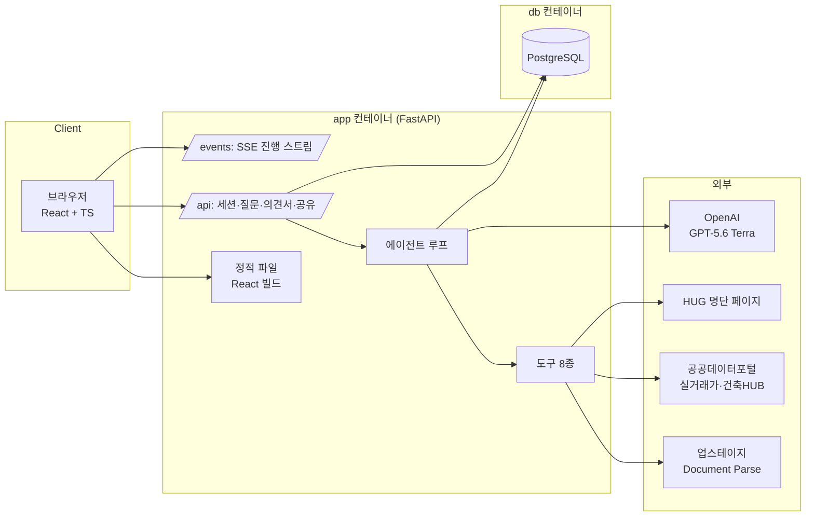

# 인프라 아키텍처

## 0. 이 문서가 다루는 것

기술 스택, 배포 단위, 데이터가 어디에 얼마나 머무는지, 외부 의존과 그 실패 대응, 운영 절차. 도메인 내부 구조는 DOM, 도구 인터페이스는 API에서 정한다.

**3줄 요약.** Docker 이미지 하나(FastAPI + React 정적 빌드)와 Postgres 컨테이너 하나를 compose로 띄운다. LLM은 OpenAI GPT-5.6 Terra 단일, 문서 파싱은 업스테이지 Document Parse, 외부 데이터는 공공 API 2종과 HUG 명단 스냅샷. Azure에 올리되 컴퓨트 종류는 미결이라 이미지 하나로 어디든 옮길 수 있게 만든다.

## 1. 제약

#### C1 심사 기간 4주 무중단

출처: [[JSD-PRD-001#N3]]. 2026-09-21~10-17 링크가 죽으면 심사 제외. 슬립 없는 컴퓨트, 헬스체크, 외부 모니터.

#### C2 업로드 문서 미저장

출처: [[JSD-PRD-001#N1]]. 원본 파일은 디스크에 남기지 않는다. 파싱 텍스트는 근거 하이라이트에 필요하므로 세션 만료까지만 DB에 두고 지운다.

#### C3 건당 비용 300원 이하

출처: [[JSD-PRD-001#R10]] [[JSD-PRD-001#N2]]. LLM + 파싱 + API 합산. 캐시와 호출 한도로 지킨다.

#### C4 진행 상황 실시간 전달

출처: [[JSD-PRD-001#R12]]. 도구 호출마다 이벤트. SSE로 충분하며 WebSocket은 쓰지 않는다.

#### C5 외부 실패에도 의견서

출처: [[JSD-PRD-001#N3]] [[JSD-UC-001#UC-S9]]. 모든 외부 호출은 타임아웃·재시도 1회·실패 사유 반환. 에이전트는 "확인 못 함"으로 진행.

#### C6 1인 5일 개발

출처: [[JSD-RFQ-001#Q4]]. 배포 단위 1개, 서비스 1개, 프레임워크 최소. 에이전트 프레임워크(LangChain 등)는 쓰지 않고 도구 루프를 직접 구현한다.

#### C7 LLM은 OpenAI GPT-5.6 Terra 단일

출처: 의뢰인 결정 2026-09-15. OpenAI API 직접 호출. 에이전트 판단·추출 구조화·의견서 문장 모두 같은 모델. 모델 ID는 환경변수로 두어 교체 가능하게 한다.

#### C8 문서 파싱은 업스테이지 Document Parse

출처: [[JSD-RFQ-001#Q27]] [[JSD-PRD-001#R3]]. 대회 파트너사. 표 구조·블록 위치 보존. 페이지당 $0.01.

#### C9 DB는 같은 환경의 Postgres 컨테이너

출처: 의뢰인 결정 2026-09-15. 관리형 DB 대신 compose의 컨테이너. 볼륨과 백업은 운영 절차로 챙긴다.

#### C10 Azure 배포, 컴퓨트 종류 미정

출처: 의뢰인 결정 2026-09-15 ("나중에 고려"). 컨테이너 이미지 하나 + compose 파일이면 Container Apps·App Service·VM 어디든 올릴 수 있으므로 그 형태로 고정한다.

#### C11 AI 협업 과정 기록

출처: [[JSD-PRD-001#N5]]. 저장소에 CLAUDE.md, 명세 체인, 테스트, 결정 기록이 커밋으로 남는다.

## 2. 구성도

요청 흐름: 업로드 → 세션 생성(DB) → 백그라운드 태스크로 에이전트 루프 → 이벤트를 DB에 적재하며 SSE로 밀어냄 → 질문이 나오면 세션 상태 `waiting_user`로 멈춤 → 답변 API가 오면 재개 → 의견서 저장 → 파일·임시 데이터 삭제.

## 3. 기술 스택

| 구분 | 선택 | 이유 | 대안 | 대안을 택하지 않은 이유 |
|---|---|---|---|---|
| 백엔드 언어·프레임워크 | Python 3.12, FastAPI | 의뢰인 보유 도메인 아키텍처 규칙, 비동기 SSE·백그라운드 태스크 | Node | 규칙·경험이 Python에 있음 |
| 패키지 관리 | uv | 빠르고 lock 재현 | pip+venv | 컨테이너 빌드 속도 |
| DB 접근 | SQLAlchemy 2 (async) + asyncpg, Alembic | 스키마 이력 관리 | raw SQL | 마이그레이션 필요 |
| 프론트 | React 18 + TypeScript + Vite | 근거 하이라이트·질문 카드 같은 상호작용 UI. 빌드 산출물을 FastAPI가 정적 서빙 | Next.js | 서버 하나로 끝내기 위해 |
| 스타일 | Tailwind CSS | 모바일 우선 빠른 작업 | CSS Modules | 속도 |
| 원문 하이라이트 | Document Parse가 돌려준 HTML을 그대로 렌더링하고 블록 ID로 강조 | PDF 뷰어 없이 좌표 없이 동작 | pdf.js + 좌표 | 5일 안에 좌표 매핑 위험 |
| 실시간 | SSE (sse-starlette). 이벤트는 DB에도 저장해 재접속·캐시 재생에 사용 | 단방향으로 충분 | WebSocket | 불필요 |
| LLM | OpenAI GPT-5.6 Terra, 공식 Python SDK, 도구 호출 + JSON 스키마 구조화 출력 | 의뢰인 결정 | Luna 혼합 | 모델 하나로 단순화 (의뢰인) |
| 에이전트 루프 | 직접 구현 (판단 → 도구 → 관찰) | 도구 8개, 규칙 명확, 프레임워크 불필요 | LangChain/LangGraph | 과설계, 디버깅 비용 |
| 문서 파싱 | 업스테이지 Document Parse (HTML 출력, 페이지·블록 좌표) | C8 | 자체 OCR | 표·말소 표기 처리 불가 |
| 외부 데이터 | 공공데이터포털 실거래가 8종, 건축HUB, 행안부 법정동코드, HUG 명단 스냅샷 | [[JSD-RFQ-001#Q26]] | — | — |
| 캐시 | Postgres 테이블 (파일 해시+입력 키, 외부 조회 키) | 컨테이너 추가 없이 | Redis | 단일 서비스에 과함 |
| 컨테이너 | Docker, docker compose (app, db) | C9·C10 | — | — |
| 배포 | Azure (컴퓨트 미정, C10) | 의뢰인 결정 | Railway | 의뢰인 결정 |
| 테스트 | pytest (규칙·합산·파서 단위 테스트), vitest 최소 | [[JSD-PRD-001#N5]] | — | — |
| 로그·비용 | 구조화 로그(JSON), 세션별 토큰·API 호출 비용 집계 테이블 | C3 측정 | — | — |
| 예시 파일 | 가상 등기부 PDF 3건을 저장소 `assets/samples/`에 커밋 | [[JSD-PRD-001#R2]] | — | — |

## 4. 내부 구조

도메인 단위 패키지. 상세는 DOM 단계.

| 도메인 | 책임 | 관련 UC |
|---|---|---|
| `review` | 검토 세션 생명주기, 에이전트 루프, 이벤트 스트림, 질문 대기·재개 | [[JSD-UC-001#UC-A1]] [[JSD-UC-001#UC-A3]] [[JSD-UC-001#UC-S9]] |
| `registry` | 등기부 파싱·구조화 (Document Parse + LLM 구조화) | [[JSD-UC-001#UC-S1]] |
| `rules` | 권리 합산, 위험 신호, 등급 판정 — 순수 함수, 외부 의존 없음 | [[JSD-UC-001#UC-S2]] [[JSD-UC-001#UC-S3]] |
| `lookup` | 시세·건축물대장·명단 조회, 캐시, 스냅샷 | [[JSD-UC-001#UC-S4]] [[JSD-UC-001#UC-S5]] [[JSD-UC-001#UC-S6]] |
| `report` | 의견서 조립, 단계별 할 일·특약 선택, LLM 문장 생성, 후검증, PDF | [[JSD-UC-001#UC-S8]] [[JSD-UC-001#UC-A4]] |
| `gate` | 파일 검사, 해시 캐시, IP 한도 | [[JSD-UC-001#UC-S10]] |

`rules`는 LLM·네트워크를 절대 부르지 않는다. 테스트가 가장 많이 붙는 곳이다.

## 5. 인증과 접근

| 항목 | 방식 |
|---|---|
| 사용자 인증 | 없음 ([[JSD-PRD-001]] 비목표). 세션 ID는 추측 불가능한 랜덤 토큰, 브라우저에만 보관 |
| 요청 제한 | IP당 일 5건 (예시 파일 해시는 제외), 파일 10MB·20페이지 |
| 공유 링크 | 랜덤 토큰, 7일 만료, 마스킹된 의견서만 노출 |
| 외부 API 키 | 환경변수(.env는 커밋 금지). OpenAI, 업스테이지, 공공데이터포털 |
| CORS | 불필요 (같은 오리진) |
| 관리 작업 | 별도 관리 화면 없음. 명단 스냅샷·캐시 정리는 컨테이너 안 스크립트 |
| 개인정보 | 로그에 이름·주민번호·상세주소 금지 (로그 필터), 파싱 텍스트는 세션 만료 시 삭제 |

## 6. 데이터가 사는 곳

| 데이터 | 저장 위치 | 보관 기간 | 개인정보 |
|---|---|---|---|
| 업로드 원본 (PDF·이미지) | 메모리 → 파싱 API 전송 → 즉시 폐기. 디스크에 쓰지 않음 | 요청 처리 중만 | 있음 |
| 파싱 결과 (HTML·블록·구조화 JSON) | Postgres `review_documents` | 세션 만료(마지막 접근 후 24시간)까지, 이후 삭제 | 있음 (소유자 이름 등) |
| 검토 세션·이벤트(진행 기록) | Postgres `review_sessions`, `review_events` | 30일 | 이벤트 문장에 이름 없음 |
| 의견서 JSON | Postgres `reports` | 30일 | 이름·상세주소 포함 (본인 열람용) |
| 공유본 | Postgres `shares` (마스킹된 사본) | 7일 | 없음 |
| 파일 해시 캐시 | Postgres `file_cache` (해시+입력 → 세션 ID) | 30일. 예시 파일 3건은 만료 없음 | — |
| 외부 조회 캐시 | Postgres `lookup_cache` | 24시간 | 없음 |
| HUG 명단 스냅샷 | Postgres `hug_defaulters` | 일 1회 갱신, 최신본만 | 공개 정보 |
| 비용 집계 | Postgres `usage_log` (세션별 토큰·호출·원화 환산) | 무기한 | 없음 |
| 예시 등기부 PDF | 저장소 `assets/samples/` | 영구 | 없음 (가상) |
| 환경변수·키 | Azure 컨테이너 설정 | — | — |

DB 볼륨은 compose named volume. 백업은 하루 1회 `pg_dump`를 Azure Blob에 올리는 스크립트 (운영 절차, 미결 9 참고).

## 7. 외부 변경 감지

| 의존 | 바뀌면 | 감지 | 대응 |
|---|---|---|---|
| OpenAI 모델 은퇴·가격 변경 | 호출 실패 또는 비용 초과 | 헬스체크에 모델 호출 1회, 비용 집계 알림 | 모델 ID 환경변수 교체 |
| 업스테이지 응답 형식 | 블록 ID·좌표 파싱 실패 | 예시 3건 회귀 테스트 | 파서 어댑터 수정 |
| 공공 API 스키마·엔드포인트 | 시세·대장 실패 급증 | 실패율 로그 | 어댑터 수정, 그동안 "확인 못 함"으로 서비스 유지 |
| HUG 명단 페이지 구조 | 스냅샷 갱신 실패 | 갱신 잡 실패 알림 | 마지막 스냅샷 유지 + 날짜 표시 |
| 법정동코드·최우선변제금 표 | 계산 오차 | 상수 파일에 출처·기준일 명시 | 수동 갱신 |

## 8. 배치와 운영

| 작업 | 주기 | 내용 |
|---|---|---|
| 헬스체크 | 1분 | `/health`: DB 연결, 최근 에이전트 실패율. 외부 uptime 모니터가 호출 |
| HUG 명단 스냅샷 | 일 1회 | 페이지 읽기 → 테이블 갱신 |
| 만료 정리 | 시간 1회 | 파싱 결과 24h, 공유본 7d, 캐시 30d, 조회 캐시 24h 삭제 |
| 예시 파일 워밍 | 배포 직후 1회 | 예시 3건 실제 처리해 캐시 채움 |
| 백업 | 일 1회 | `pg_dump` → Azure Blob |
| 비용 점검 | 일 1회 | `usage_log` 합계, 건당 평균이 300원 넘으면 알림 |

**월 비용 추정** (심사 기간, 검토 1,000건 가정, 환율 1,350원)

| 항목 | 단가 | 추정 |
|---|---|---|
| OpenAI Terra | 건당 ~3만 입력·5천 출력 토큰 ≈ $0.12 | ~160,000원 |
| 업스테이지 파싱 | 건당 5쪽 × $0.01 | ~68,000원 |
| 공공 API | 무료 | 0 |
| Azure 컴퓨트 + 스토리지 | 소형 인스턴스 | 30,000~80,000원 (컴퓨트 확정 후) |
| 합계 | | **약 26~31만 원** (캐시 적중과 예시 파일 비중이 높으면 크게 줄어듦) |

## 9. 미결사항

- [ ] **Azure 컴퓨트 종류** (Container Apps / App Service / VM) — 의뢰인 보류. 이미지+compose로 준비해 두고 9/18 배포 전 결정
- [ ] 도메인과 HTTPS (Azure 기본 도메인으로 갈지, 별도 도메인 붙일지)
- [ ] OpenAI API 호출 방식 (Responses API vs Chat Completions) — SDK 문서 확인 후 첫 구현 때 확정
- [ ] Terra의 도구 호출 안정성 — 9/16 첫 루프 구현에서 검증. 불안정하면 Sol로 상향
- [ ] Document Parse 응답의 블록 ID·좌표 형식 — 9/15 첫 호출로 확인, 하이라이트 방식 확정
- [ ] 파싱 결과 보관 기간 24시간이 적절한지 (의견서 재열람 시 근거 하이라이트가 사라지는 시점)
- [ ] 백업 대상 저장소 (Azure Blob) 접근 방식
- [ ] 외부 uptime 모니터 서비스 선택
- [ ] 가상 등기부 PDF 3건 제작 도구 (HTML → PDF 변환으로 실제 등기부 레이아웃 재현)
