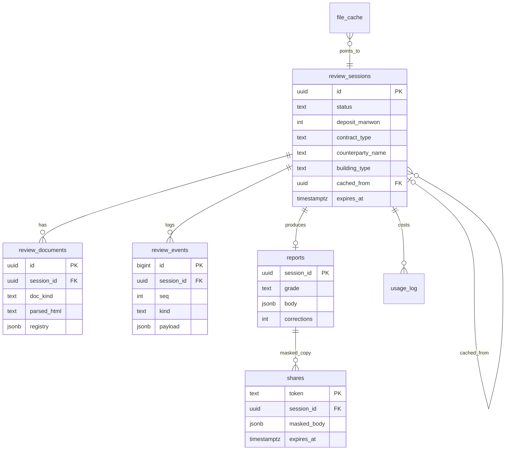
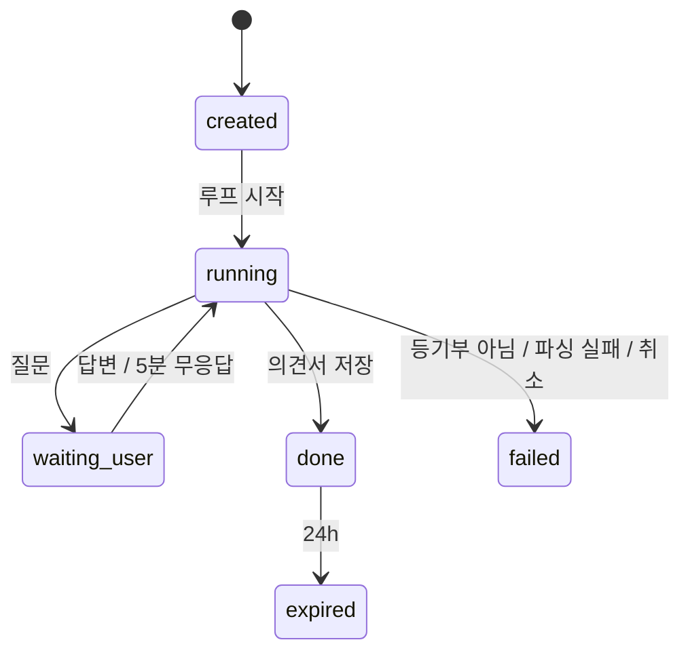

# ERD·DD

## 0. 이 문서가 다루는 것

Postgres 테이블 9개의 ERD, 데이터 사전(DD), 인덱스. 도구 사이를 오가는 DTO는 [[JSD-DOM-002]], 함수는 MS.

**3줄 요약.** 검토 세션 하나가 문서·이벤트·의견서를 가진다. 원본 파일은 어디에도 없고, 파싱 결과는 세션 만료까지만 산다. 캐시·스냅샷·비용 집계는 세션과 느슨하게 연결된 보조 테이블이다.

## 1. 개념 식별

| 개념 | 테이블 | 어디서 왔나 |
|---|---|---|
| 검토 세션 | review_sessions | [[JSD-UC-001#UC-A1]] |
| 등기부 문서(파싱 결과) | review_documents | [[JSD-UC-001#UC-S1]] |
| 검토 이벤트(진행 기록·질문·답변) | review_events | [[JSD-PRD-001#R12]] [[JSD-UC-001#UC-S7]] |
| 의견서 | reports | [[JSD-UC-001#UC-S8]] |
| 공유본 | shares | [[JSD-UC-001#UC-A4]] |
| 파일 캐시 | file_cache | [[JSD-UC-001#UC-S10]] |
| 외부 조회 캐시 | lookup_cache | [[JSD-PRD-001#R7]] |
| HUG 명단 스냅샷 | hug_defaulters | [[JSD-UC-001#UC-S6]] |
| 비용 집계 | usage_log | [[JSD-INFRA-001#C3]] |

## 2. ERD

`lookup_cache`, `hug_defaulters`, `usage_log`, `file_cache`는 세션과 느슨하게 연결되므로 그림에서 뺐다.

## 3. DD

#### review_sessions 검토 세션

| 컬럼 | 타입 | 필수 | 설명 |
|---|---|---|---|
| id | uuid | ○ | 세션 ID. 추측 불가 랜덤 |
| status | text | ○ | `created` / `running` / `waiting_user` / `done` / `failed` / `expired` |
| deposit_manwon | int | ○ | 보증금 (만원) |
| contract_type | text | ○ | `jeonse` / `monthly` |
| counterparty_name | text | | 계약 상대방 이름 (입력 시) |
| building_type | text | | 표제부에서 판정: `apartment` / `multi_family_unit`(다세대·연립) / `multi_household`(다가구·단독) / `officetel` / `other` |
| is_sample | bool | ○ | 예시 파일 여부 (IP 한도 제외) |
| file_hash | text | ○ | 업로드 파일 SHA-256 |
| client_ip_hash | text | ○ | IP 해시 (한도 계산용, 원본 IP 저장 안 함) |
| cached_from | uuid FK | | 캐시 적중으로 만들어진 세션이면 원 세션 ID. 문서·이벤트·의견서는 원 세션 것을 읽는다 ([[JSD-UC-001#UC-A2]] 4) |
| tool_calls | int | ○ | 도구 호출 수 (한도 20) |
| questions_asked | int | ○ | 질문 수 (한도 5) |
| cost_krw | numeric | ○ | 누적 비용 |
| created_at / updated_at | timestamptz | ○ | |
| expires_at | timestamptz | ○ | 마지막 접근 + 24h. 지나면 문서 삭제. 예시 원 세션은 null(만료 없음) |

판정 근거: 상태 전이는 [[JSD-UC-001#UC-S9]]. 한도는 [[JSD-PRD-001#R10]].

#### review_documents 등기부 문서

| 컬럼 | 타입 | 필수 | 설명 |
|---|---|---|---|
| id | uuid | ○ | |
| session_id | uuid FK | ○ | |
| doc_kind | text | ○ | `building` / `land` / `collective`(집합건물) |
| parsed_html | text | ○ | Document Parse가 돌려준 HTML (블록 ID 포함). 하이라이트 원문 |
| registry | jsonb | ○ | `Registry` DTO 직렬화 ([[JSD-DOM-002#Registry]]) |
| page_count | int | ○ | 비용 집계용 |
| created_at | timestamptz | ○ | |

원본 파일 바이트는 어디에도 저장하지 않는다 ([[JSD-PRD-001#N1]]). 세션 만료 시 행 삭제.

#### review_events 검토 이벤트

| 컬럼 | 타입 | 필수 | 설명 |
|---|---|---|---|
| id | bigint PK | ○ | |
| session_id | uuid FK | ○ | |
| seq | int | ○ | 세션 내 순번. SSE 재접속 시 `Last-Event-ID` |
| kind | text | ○ | `thought` / `tool_call` / `tool_result` / `question` / `answer` / `report` / `error` |
| payload | jsonb | ○ | `ReviewEvent` DTO ([[JSD-DOM-002#ReviewEvent]]). 질문이면 `Question` 포함 |
| created_at | timestamptz | ○ | |

캐시 재생([[JSD-UC-001#UC-A2]] 4)은 이 테이블을 순서대로 읽는다. payload에 이름·주민번호 금지.

#### reports 의견서

| 컬럼 | 타입 | 필수 | 설명 |
|---|---|---|---|
| session_id | uuid PK FK | ○ | 세션당 1개 |
| grade | text | ○ | `safe` / `caution` / `danger` |
| body | jsonb | ○ | `Report` DTO ([[JSD-DOM-002#Report]]) |
| corrections | int | ○ | 후검증 교정 문장 수 |
| llm_fallback | bool | ○ | LLM 실패로 템플릿 대체 여부 |
| created_at | timestamptz | ○ | |

30일 보관.

#### shares 공유본

| 컬럼 | 타입 | 필수 | 설명 |
|---|---|---|---|
| token | text PK | ○ | 랜덤 22자 |
| session_id | uuid FK | ○ | |
| masked_body | jsonb | ○ | 이름·주민번호·동 이하 주소 제거한 `Report` |
| expires_at | timestamptz | ○ | 생성 + 7일 |

#### file_cache 파일 캐시

| 컬럼 | 타입 | 필수 | 설명 |
|---|---|---|---|
| cache_key | text PK | ○ | sha256(file_hash + deposit + contract_type + counterparty) |
| session_id | uuid FK | ○ | 재생할 세션 |
| is_sample | bool | ○ | 예시면 만료 없음 |
| expires_at | timestamptz | | 30일 |

#### lookup_cache 외부 조회 캐시

| 컬럼 | 타입 | 필수 | 설명 |
|---|---|---|---|
| cache_key | text PK | ○ | `{tool}:{sha256(args)}` |
| result | jsonb | ○ | 도구 출력 그대로 |
| expires_at | timestamptz | ○ | 24시간 |

#### hug_defaulters HUG 명단 스냅샷

| 컬럼 | 타입 | 필수 | 설명 |
|---|---|---|---|
| id | bigint PK | ○ | |
| name | text | ○ | 성명 또는 법인명 |
| is_corporation | bool | ○ | |
| public_fields | jsonb | ○ | 명단에 공개된 항목 그대로 |
| snapshot_date | date | ○ | 갱신일 |

일 1회 전체 교체. 완전 일치 대조만 ([[JSD-UC-001#UC-S6]]).

#### usage_log 비용 집계

| 컬럼 | 타입 | 필수 | 설명 |
|---|---|---|---|
| id | bigint PK | ○ | |
| session_id | uuid FK | | |
| kind | text | ○ | `llm` / `parse` / `api` |
| units | numeric | ○ | 토큰 수 또는 페이지 수 또는 호출 수 |
| cost_krw | numeric | ○ | 환산 비용 |
| created_at | timestamptz | ○ | |

## 4. 인덱스

| 테이블 | 인덱스 | 이유 |
|---|---|---|
| review_events | (session_id, seq) UNIQUE | SSE 재개·재생 순서 |
| review_sessions | (client_ip_hash, created_at) | IP 일일 한도 집계 |
| review_sessions | (expires_at) | 만료 정리 배치 |
| review_sessions | (cached_from) | 원 세션 삭제 전 참조 확인 |
| review_documents | (session_id) | 세션 삭제 시 함께 |
| file_cache | (expires_at) | 만료 정리 |
| lookup_cache | (expires_at) | 만료 정리 |
| shares | (expires_at) | 만료 정리 |
| hug_defaulters | (name) | 완전 일치 대조 |
| usage_log | (session_id), (created_at) | 건당 비용·일별 합계 |

## 5. 경계

| 도메인 | 소유 테이블 |
|---|---|
| `review` | review_sessions, review_events |
| `registry` | review_documents |
| `rules` | — (테이블 없음, 순수) |
| `lookup` | lookup_cache, hug_defaulters |
| `report` | reports, shares |
| `gate` | file_cache, usage_log |

한 테이블은 한 도메인만 쓴다. 다른 도메인이 필요하면 소유 도메인의 서비스를 통해서만.

## 6. 미결사항

- [ ] `block_id`가 Document Parse 출력에서 어떤 형태인지 (element id vs 좌표) — INFRA 미결과 동일
- [ ] `usage_log` 환율 상수 관리 방식
- [ ] 세션 삭제를 하드 삭제로 할지, 문서만 지우고 세션 행은 남길지 (비용 집계 유지 위해 후자 예정)
