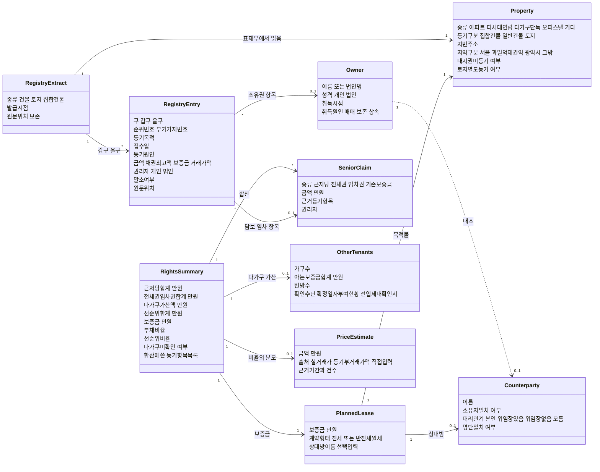
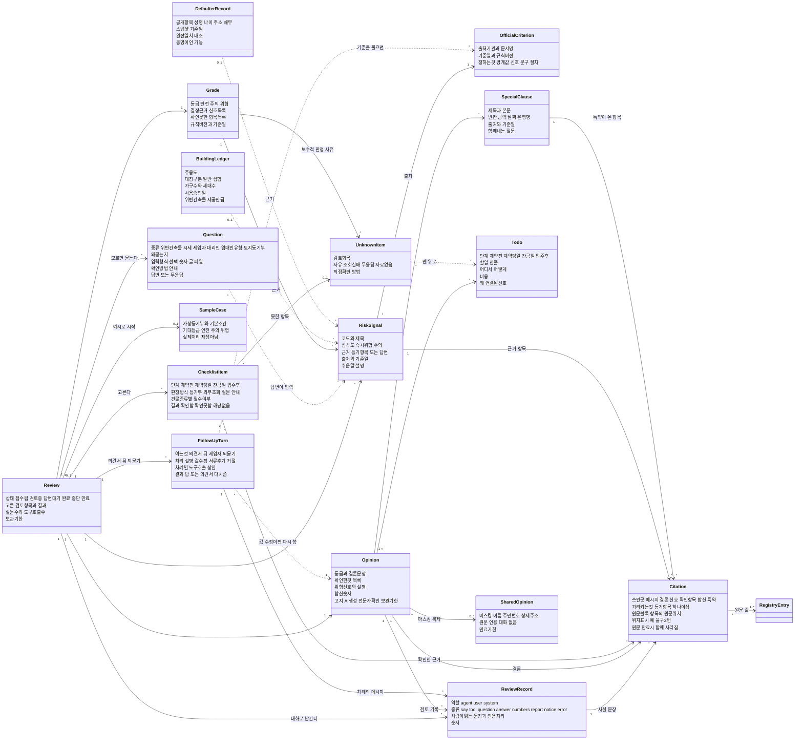
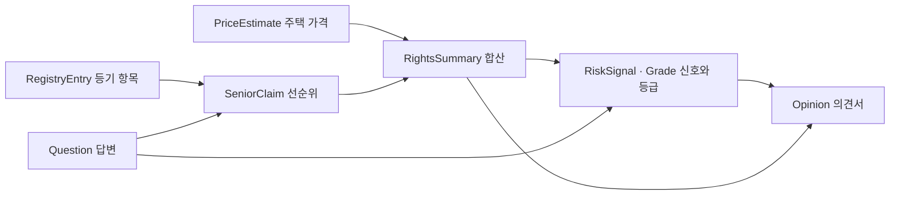
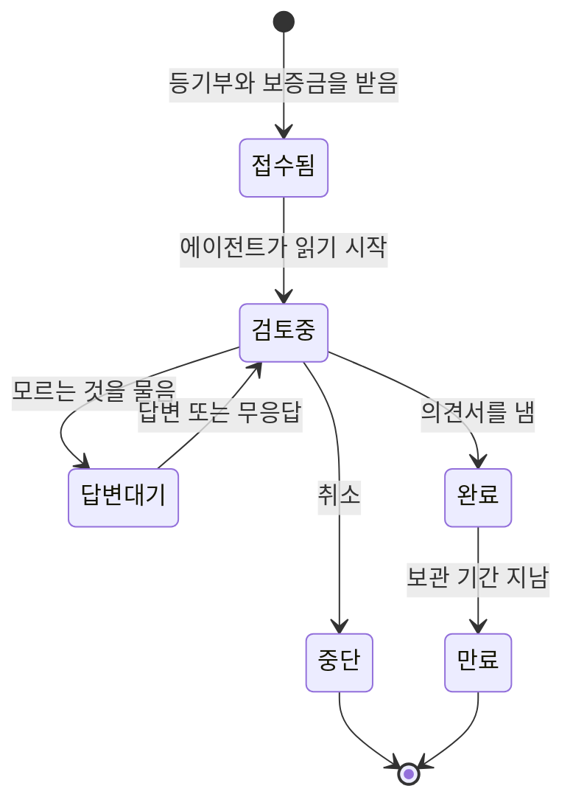

# 도메인 모델

## 0. 이 문서가 다루는 것

전세 계약 직전 권리분석이라는 문제 영역의 개념과 개념 사이 관계. 이름·속성·관계·불변 규칙까지만 정한다.

**3줄 요약.** 세입자가 맺으려는 계약 하나(PlannedLease)를 놓고, 등기부에서 읽은 권리들(RegistryEntry)을 선순위로 합산해(RightsSummary) 위험 신호(RiskSignal)와 등급(Grade)을 정한다. 모르는 것은 확인 못 함(UnknownItem)으로 남기고 숨기지 않는다. 결과는 근거·할 일·특약이 붙은 의견서(Opinion) 한 장이다.

**이 문서에 없는 것.** 저장 구조(테이블·컬럼·인덱스)는 ERD·DD, 클래스와 DTO 타입은 클래스 명세, 도구 호출 스키마는 API, 화면 배치는 UI에서 정한다. 싱크독 순서상 클래스 명세는 API 문서가, ERD·DD는 클래스 명세가 있어야 쓸 수 있으므로 이 문서는 그보다 앞선 개념만 다룬다.

**용어는 등기부의 말을 그대로 쓴다.** 표제부·갑구·을구·채권최고액·말소·부기등기처럼 세입자가 서류에서 보게 되는 단어를 개념 이름의 한국어 표기로 삼는다 ([[JSD-RFQ-001#Q25]]).

## 1. 개념 식별

| 묶음 | 개념 | 한국어 | 어디서 왔나 |
|---|---|---|---|
| 물건·서류 | [[#Property]] | 주택 | [[JSD-PRD-001#R11]] |
| 물건·서류 | [[#RegistryExtract]] | 등기부 (등기사항전부증명서) | [[JSD-UC-001#UC-S1]] |
| 물건·서류 | [[#RegistryEntry]] | 등기 항목 (갑구·을구 한 줄) | [[JSD-RFQ-001#Q25]] |
| 물건·서류 | [[#Owner]] | 소유자 | [[JSD-PRD-001#R5]] |
| 물건·서류 | [[#Counterparty]] | 계약 상대방 | [[JSD-PRD-001#R5]] |
| 계약·금액 | [[#PlannedLease]] | 체결 예정 계약 | [[JSD-UC-001#UC-A1]] |
| 계약·금액 | [[#SeniorClaim]] | 선순위 권리 | [[JSD-PRD-001#R4]] |
| 계약·금액 | [[#OtherTenants]] | 다가구 기존 세입자 | [[JSD-SCN-001#S3]] |
| 계약·금액 | [[#PriceEstimate]] | 주택 가격 | [[JSD-RFQ-001#Q37]] |
| 계약·금액 | [[#RightsSummary]] | 권리 합산 | [[JSD-PRD-001#R4]] |
| 판정 | [[#ChecklistItem]] | 검토 항목 | [[JSD-RFQ-001#Q37]] |
| 판정 | [[#RiskSignal]] | 위험 신호 | [[JSD-PRD-001#R5]] |
| 판정 | [[#Grade]] | 등급 | [[JSD-PRD-001#R6]] |
| 판정 | [[#UnknownItem]] | 확인 못 함 | [[JSD-PRD-001#N3]] |
| 판정 | [[#OfficialCriterion]] | 공식 기준 | [[JSD-RFQ-001#Q38]] |
| 진행 | [[#Review]] | 검토 | [[JSD-UC-001#UC-A1]] |
| 진행 | [[#ReviewRecord]] | 대화 메시지 (검토 기록) | [[JSD-PRD-001#R12]] |
| 진행 | [[#Question]] | 질문과 답변 | [[JSD-PRD-001#R8]] |
| 진행 | [[#FollowUpTurn]] | 되묻기 차례 | [[JSD-RFQ-001#Q19]] |
| 근거 | [[#Citation]] | 인용 | [[JSD-RFQ-001#Q20]] |
| 산출 | [[#Opinion]] | 의견서 | [[JSD-PRD-001#R9]] |
| 산출 | [[#Todo]] | 단계별 할 일 | [[JSD-RFQ-001#Q22]] |
| 산출 | [[#SpecialClause]] | 특약 | [[JSD-RFQ-001#Q23]] |
| 산출 | [[#SharedOpinion]] | 공유본 | [[JSD-PRD-001#R14]] |
| 체험 | [[#SampleCase]] | 예시 사례 | [[JSD-SCN-001#P2]] |
| 외부 확인 | [[#BuildingLedger]] | 건축물대장 | [[JSD-RFQ-001#Q26]] |
| 외부 확인 | [[#DefaulterRecord]] | 공개 명단 기록 | [[JSD-PRD-001#R7]] |

개념 이름은 영문 파스칼 표기로 두고, 화면과 의견서에는 한국어 표기를 쓴다.

## 2. 개념 모델

개념이 스물일곱이라 관계도를 두 장으로 나눈다. 앞장은 서류에서 금액까지, 뒷장은 판정·대화·산출이다. 두 장을 잇는 것은 [[#Review]]와 [[#Citation]]이다. 검토 하나가 앞장의 [[#PlannedLease]]·[[#RegistryExtract]]·[[#RightsSummary]]를 입력으로 받아 뒷장의 [[#Grade]]와 [[#Opinion]]을 낸다. 인용은 뒷장의 문장을 앞장의 [[#RegistryEntry]]에 잇는다. 그래서 뒷장에는 RegistryEntry를 속성 없이 이름만 한 번 더 그린다.

### 2.1 관계도 — 서류와 금액

### 2.2 관계도 — 판정·대화·산출

### 2.3 판정 흐름

판정은 한 방향으로만 흐른다. 등기부에서 항목을 읽고, 항목을 합산하고, 합산과 답변으로 신호를 정하고, 신호로 등급을 정하고, 등급으로 안내를 고른다.

### 2.4 검토의 생애

사람이 답을 주지 않아도 끝까지 간다 ([[JSD-PRD-001#R8]]). 등기부가 아닌 파일은 올리는 요청에서 바로 거절된다. 그래서 검토가 생기지 않고, 검토 중에 올린 서류라면 상태가 그대로다.

## 3. 개념별 정리

카드는 1장 표의 순서(물건·서류 → 계약·금액 → 판정 → 진행 → 근거 → 산출 → 체험과 외부 확인)로 놓는다. 개념이 어느 코드 도메인에 사는지는 5장 경계에 있다.

#### Property 주택

검토 대상 물건. 등기부 표제부와 건축물대장에서 읽는다.

- 종류: 아파트 · 다세대·연립 · 다가구·단독 · 오피스텔 · 기타. 종류가 필수 검토 항목을 정한다
- 등기 구분: 집합건물 · 일반건물 · 토지
- 소재: 지번 주소. 최우선변제금 지역 구분(서울 · 과밀억제권역 · 광역시 · 그 밖)이 여기서 나온다
- 대지권 미등기 여부, 토지 별도등기 여부
- 다가구·단독이면 토지 등기부가 한 장 더 있어야 완전하다

**관계** [[#RegistryExtract]]의 표제부에서 읽고, [[#PlannedLease]]의 목적물이다. [[#BuildingLedger]]로 주용도·가구수를 보강한다.

**판정 근거** 종류별 필수 검토는 [[JSD-PRD-001#R11]], 종류 구분은 [[JSD-SCN-001#S1]] [[JSD-SCN-001#S2]] [[JSD-SCN-001#S3]].

#### RegistryExtract 등기부

등기사항전부증명서 한 장. 표제부(물건)·갑구(소유권)·을구(소유권 외 권리) 세 부분이다.

- 종류: 건물 · 토지 · 집합건물. 한 검토에 두 장까지(건물과 토지)
- 발급 시점이 곧 정보의 시점이다. 잔금일에 다시 발급해 비교해야 한다
- 원문 위치를 잃지 않는다. 모든 [[#RegistryEntry]]는 원문의 어느 줄에서 나왔는지 가리킨다
- 세입자가 올린 파일 자체는 보관하지 않는다. 읽어낸 결과와 원문 표시용 텍스트만 남는다

**관계** [[#RegistryEntry]]를 여럿 가진다. [[#Review]]가 한두 장을 참조한다.

**판정 근거** [[JSD-UC-001#UC-S1]] · 파싱 요구는 [[JSD-RFQ-001#Q25]] · 보관 금지는 [[JSD-PRD-001#N1]].

#### RegistryEntry 등기 항목

갑구나 을구의 한 줄. 이 줄들이 판정의 1차 사실이다.

- 구: 갑구 · 을구
- 순위번호. 부기등기는 가지번호(1-1)를 쓰고 원 항목을 가리킨다
- 등기목적: 소유권보존 · 소유권이전 · 근저당권설정 · 근저당권변경 · 전세권설정 · 주택임차권 · 압류 · 가압류 · 가처분 · 가등기 · 경매개시결정 · 신탁 · 예고등기 · 말소
- 접수일과 등기원인. 접수일이 "최근 설정" 판단의 기준이다
- 금액: 근저당은 채권최고액, 전세권·임차권은 보증금, 소유권이전은 거래가액
- 권리자와 그 성격(개인 · 법인)
- 말소 여부. 말소된 항목은 합산에서 빠지지만 이력으로는 읽는다
- 원문 위치

**관계** [[#RegistryExtract]]에 속한다. 담보·임차 항목은 [[#SeniorClaim]]이 되고, 소유권 항목은 [[#Owner]]를 정한다. [[#RiskSignal]]의 근거가 된다. [[#Citation]]이 이 항목을 가리키므로, 항목 쪽에서 자기가 합산·신호·특약·메시지 어디에 쓰였는지 거꾸로 찾을 수 있다.

**판정 근거** 표 구조와 말소·부기 표기는 [[JSD-RFQ-001#Q25]] · 합산 규칙은 [[JSD-PRD-001#R4]].

#### Owner 소유자

갑구의 마지막 유효한 소유권 항목이 가리키는 사람 또는 법인.

- 이름 또는 법인명
- 성격: 개인 · 법인. 법인이면 위험이 가중된다
- 취득 시점과 취득 원인(매매·보존·상속). 보존등기 직후이거나 짧은 기간에 여러 번 넘어갔으면 신호가 된다
- 소유자가 여럿이면(공유) 전원이 계약 당사자여야 한다

**관계** [[#RegistryEntry]]에서 정해지고, [[#Counterparty]]와 대조된다.

**판정 근거** [[JSD-PRD-001#R5]] · [[JSD-RFQ-001#Q37]].

#### Counterparty 계약 상대방

세입자가 계약서에 이름을 적게 되는 쪽. 소유자와 같아야 정상이다.

- 이름 (세입자가 입력. 선택 항목)
- 소유자와의 일치 여부
- 대리 관계: 본인 · 위임장 있는 대리인 · 위임장 없는 대리인 · 모름
- 공개 명단 일치 여부 ([[#DefaulterRecord]])

**관계** [[#PlannedLease]]의 상대방이고 [[#Owner]]와 대조된다. 이름을 입력하지 않으면 일치 여부가 [[#UnknownItem]]이 된다.

**판정 근거** 불일치와 대리 완화는 [[JSD-PRD-001#R5]] · 질문 형식은 [[JSD-PRD-001#R8]].

#### PlannedLease 체결 예정 계약

아직 맺지 않은 계약. 검토의 단위이며 금액의 기준이다.

- 보증금 (만원 단위 정수)
- 형태: 전세 · 반전세·월세
- 목적물 [[#Property]], 상대방 [[#Counterparty]]
- 아직 존재하지 않는 계약이므로 확정일자·전입신고 같은 보호 수단은 "앞으로 할 일"이다

**관계** [[#Review]] 하나가 [[#PlannedLease]] 하나를 검토한다. 보증금은 [[#RightsSummary]]의 분자에 들어간다.

**판정 근거** [[JSD-UC-001#UC-A1]] · 금액 단위는 [[#RightsSummary]].

#### SeniorClaim 선순위 권리

내 보증금보다 먼저 배당받는 권리. 합산의 대상이다.

- 종류: 근저당 · 전세권 · 기존 주택임차권 · 다가구 기존 세입자 보증금
- 금액. 근저당은 실제 대출 잔액이 아니라 채권최고액을 쓴다. 잔액은 임대인 말일 뿐 등기부에 없다
- 근거 등기 항목. 말소된 항목은 제외하고, 부기등기로 감액된 근저당은 감액 후 금액을 쓴다
- 건물 등기부와 토지 등기부의 권리를 모두 더한다
- 권리자

**관계** [[#RegistryEntry]]에서 나오고 [[#RightsSummary]]에 합산된다. 다가구는 [[#OtherTenants]]가 더해진다.

**판정 근거** 채권최고액 합산은 [[JSD-PRD-001#R4]] · LH 방식 근거는 [[JSD-RFQ-001#Q37]].

#### OtherTenants 다가구 기존 세입자

다가구·단독주택에서 같은 건물의 다른 세입자들. 등기부에 안 나오는 선순위다.

- 가구 수 (건축물대장 가구수와 임대인 고지가 다를 수 있다)
- 아는 보증금 합계. 세입자가 전부 알기 어렵다
- 빈 방 수. 모르는 방은 최우선변제금으로 가산해 보수적으로 잡는다
- 전액 확인 수단: 확정일자 부여현황 열람(임대인 동의 필요), 전입세대확인서

**관계** [[#RightsSummary]]에 가산된다. 모르면 [[#UnknownItem]]이 되고 주의 신호가 붙는다.

**판정 근거** [[JSD-SCN-001#S3]] · 가산 방식과 지역별 금액은 [[JSD-PRD-001#R4]].

#### PriceEstimate 주택 가격

부채비율의 분모. 하나의 값이 아니라 출처가 있는 추정치다.

- 금액 (만원)
- 출처: 실거래가 · 등기부 거래가액 · 사용자 직접 입력. 이 순서로 찾는다
- 근거 기간과 건수 (실거래가일 때)
- 출처가 실거래가가 아니면 의견서에 그 사실을 적고 직접 확인을 권한다
- 신축이나 다가구는 실거래가가 없는 일이 흔하다. 없는 것이 정상 경로다

**관계** [[#RightsSummary]]가 참조한다. 없으면 부채비율을 내지 못하고 등급이 보수적으로 간다.

**판정 근거** 산정 순서는 [[JSD-RFQ-001#Q37]] · 가격 미확인 시 처리는 [[JSD-PRD-001#R6]].

#### RightsSummary 권리 합산

금액을 한 줄로 모은 것. 사람이 아니라 코드가 계산한다.

- 근저당 합계, 전세권·임차권 합계, 다가구 가산액, 선순위 합계
- 내 보증금
- 부채비율 = (선순위 합계 + 내 보증금) ÷ 주택 가격
- 선순위비율 = 선순위 합계 ÷ 주택 가격
- 다가구 미확인 여부
- 합산에 쓴 등기 항목 목록. 의견서의 모든 숫자가 이 목록으로 되짚어진다

**관계** [[#SeniorClaim]] · [[#OtherTenants]] · [[#PriceEstimate]] · [[#PlannedLease]]에서 만들어지고 [[#Grade]]의 입력이 된다.

**판정 근거** [[JSD-PRD-001#R4]] · 경계값 90%·70%·54%는 [[JSD-PRD-001#R6]]에 있고 이 문서는 개념만 정한다.

#### ChecklistItem 검토 항목

에이전트가 고를 수 있는 확인 거리의 단위. 목록은 닫혀 있고, 이 목록 밖의 항목을 만들어내지 않는다.

- 단계: 계약 전 · 계약 당일 · 잔금일 · 입주 후
- 판정 방식: 등기부에서 자동 · 외부 조회 · 사용자에게 질문 · 안내만
- 건물 종류별 필수 여부
- 결과: 확인함 · 확인 못 함 · 해당 없음

**관계** [[#Review]]가 이 중 필요한 것을 고른다. 결과가 [[#Opinion]]의 확인한 것 절이 되고, 못 한 것은 [[#UnknownItem]]이 된다. 확인한 결과의 근거는 [[#Citation]]으로 원문 줄에 이어진다.

**판정 근거** 전체 목록은 [[JSD-RFQ-001#Q37]] · 종류별 필수는 [[JSD-PRD-001#R11]].

#### RiskSignal 위험 신호

규칙표로 판정한 사실 하나. 의견만 붙이고 판정 자체는 바꾸지 않는다.

- 코드와 사람이 읽는 제목
- 심각도: 즉시 위험 · 주의
- 근거: 등기 항목 또는 답변. 근거 없는 신호는 만들 수 없다
- 공식 출처와 기준일 ([[#OfficialCriterion]])
- 쉬운 말 설명 한두 문장. 이것만 문장 생성이고 나머지는 규칙의 결과다

**관계** [[#RegistryEntry]]·[[#Question]]의 답변을 근거로 삼고 [[#Grade]]를 결정한다. 근거 등기 항목은 [[#Citation]]으로 원문 줄에 이어진다.

**판정 근거** 신호 목록과 심각도는 [[JSD-PRD-001#R5]] · 근거 표시 의무는 [[JSD-PRD-001#R9]].

#### Grade 등급

검토 하나의 결론. 안전 · 주의 · 위험 셋이다.

- 등급값
- 결정 근거가 된 신호 목록
- 확인 못 한 항목 목록
- 규칙 버전과 기준일. 같은 등기부라도 규칙이 바뀌면 결과가 달라질 수 있으므로 버전을 남긴다
- 색만으로 전달하지 않는다. 색·기호·글자 셋 다로 표시한다

**관계** [[#RiskSignal]]과 [[#RightsSummary]]에서 정해지고 [[#Opinion]]의 머리에 온다.

**판정 근거** [[JSD-PRD-001#R6]] · 공개 의무는 [[JSD-RFQ-001#Q38]].

#### UnknownItem 확인 못 함

판정하지 못한 항목. 숨기지 않는 것이 이 서비스의 약속이다.

- 어떤 검토 항목인지
- 사유: 외부 조회 실패 · 질문 무응답 · 자료 없음
- 세입자가 직접 확인하는 방법 한 줄

**관계** [[#ChecklistItem]]의 결과이고 [[#Grade]]를 보수적으로 만들며 [[#Todo]] 맨 위로 올라간다.

**판정 근거** 실패해도 의견서는 나온다 [[JSD-PRD-001#N3]] · 표시 의무는 [[JSD-PRD-001#R9]].

#### OfficialCriterion 공식 기준

판정의 출처. 전문가 개인 의견이나 블로그 기준은 쓰지 않는다.

- 출처 기관과 문서명: LH 전세임대 권리분석, HUG 전세보증금반환보증 가입 요건, 주택임대차표준계약서, 서울시·지자체 체크리스트
- 기준일과 규칙 버전
- 무엇을 정하는지: 경계값 · 신호 · 특약 문구 · 절차

**관계** [[#RiskSignal]]·[[#Grade]]·[[#SpecialClause]]·[[#Todo]]가 각각 출처를 가리킨다.

**판정 근거** [[JSD-RFQ-001#Q38]].

#### Review 검토

한 번의 검토. 등기부와 보증금을 받아 의견서를 내는 일의 단위다.

- 상태: 접수됨 · 검토중 · 답변대기 · 완료 · 중단 · 만료
- 대상 [[#PlannedLease]], 읽은 [[#RegistryExtract]] 한두 장
- 고른 [[#ChecklistItem]]들과 그 결과
- 대화 [[#ReviewRecord]] 목록. 검토 과정이 곧 대화다
- 의견서가 나온 뒤의 되묻기 차례 [[#FollowUpTurn]] 목록
- 산출 [[#Opinion]] 하나
- 로그인이 없다. 검토는 링크로만 식별되고 보관 기간이 지나면 사라진다
- 무엇을 확인할지는 사람이 고르지 않는다. 에이전트가 정한다

**관계** 위 모든 개념을 묶는 뿌리다.

**판정 근거** [[JSD-UC-001#UC-A1]] · 에이전트가 정한다는 원칙은 [[JSD-RFQ-001#Q31]] [[JSD-RFQ-001#Q32]].

#### ReviewRecord 대화 메시지

검토 대화의 한 칸. 에이전트의 말, 도구 카드, 질문과 답, 숫자, 의견서 카드, 안내, 오류가 모두 이것이다. 이 목록만 읽어도 에이전트가 무엇을 왜 했는지 알 수 있어야 한다.

- 역할: agent(에이전트) · user(세입자) · system(서비스)
- 종류: say(말) · tool(도구 호출과 결과 요약) · question(질문) · answer(답변) · numbers(합산 숫자) · report(의견서 카드) · notice(답변 없이 진행·한도 도달 같은 안내) · error(오류)
- 역할과 종류는 따로 간다. 세입자의 말은 질문에 대한 답변(answer)과 질문 밖의 되묻기 두 가지다
- 사람이 읽는 문장. "을구를 봅니다: 근저당 1건 1억 2천"처럼 무엇을 왜 보는지가 들어간다. 사실 문장에는 [[#Citation]]이 붙고, 문장 안에 인용이 놓이는 자리가 있다
- 종류별 내용: question은 [[#Question]], numbers는 [[#RightsSummary]], report는 [[#Opinion]]의 등급 요약을 싣는다. 수치와 등급은 도구가 낸 값을 옮길 뿐 문장이 만들지 않는다
- 순서. 끊긴 뒤 이어 볼 수 있어야 한다
- 이름·주민번호·상세 주소를 담지 않는다. 세입자가 입력한 문장에서도 가린다

**관계** [[#Review]]에 순서대로 쌓이고, 대화 전체가 [[#Opinion]]의 검토 기록이 된다. 의견서가 나온 뒤의 메시지는 [[#FollowUpTurn]] 하나에 속한다. 질문 카드와 답변은 [[#Question]] 하나를 가리킨다.

**판정 근거** [[JSD-PRD-001#R12]] · 기록만 읽고 이유를 알 수 있어야 한다 [[JSD-RFQ-001#Q33]] · 사실 문장의 근거는 [[JSD-RFQ-001#Q36]].

#### Question 질문과 답변

에이전트가 모르는 것을 세입자에게 묻는 일. 질문 하나는 물음 한 번과 답 한 번이다.

- 종류: 위반건축물 여부 · 시세 · 다른 세입자 · 대리인 · 임대인 유형 · 토지 등기부
- 왜 묻는지 한 줄. 이유 없는 질문은 하지 않는다
- 입력 형식: 선택 · 숫자 · 글 · 파일
- 확인 방법 안내 (정부24 등)
- 답변 또는 무응답. 모름과 건너뛰기를 허용한다
- 한 검토에서 질문 수에 상한이 있고, 답이 없어도 검토는 끝난다
- 세입자는 질문 밖에서도 말할 수 있다(되묻기). 되묻기는 질문이 아니다. 의견서가 나온 뒤의 되묻기는 [[#FollowUpTurn]]을 연다

**관계** [[#Review]]가 내고, 답변이 [[#RiskSignal]]·[[#RightsSummary]]의 입력이 된다. 답이 없으면 [[#UnknownItem]]이 된다. 질문과 답은 [[#ReviewRecord]]의 question·answer 메시지로 대화에 남는다.

**판정 근거** [[JSD-PRD-001#R8]] · [[JSD-UC-001#UC-A3]] · 질문 도구는 [[JSD-RFQ-001#Q34]].

#### FollowUpTurn 되묻기 차례

의견서가 나온 뒤 세입자가 입력할 때마다 열리는 한 차례. 검토를 처음부터 다시 하지 않는다. 이미 나온 판정 안에서 답하거나, 받은 값만큼 규칙을 다시 돌린다.

- 여는 것: 세입자의 되묻기 한 번. 에이전트의 질문에 대한 답은 차례를 열지 않는다
- 차례마다 도구 호출 상한이 따로 있다. 검토 단계의 상한과 별개다
- 처리 네 가지
  - 설명: 신호나 기준의 이유를 묻는다 → 이미 나온 결과와 [[#OfficialCriterion]]으로만 답한다. 규칙을 지어내지 않는다
  - 값 수정: 시세·다른 세입자 보증금처럼 세입자가 아는 값을 준다 → 합산·신호·등급 규칙을 다시 돌리고 의견서를 다시 쓴다. 왜 다시 썼는지가 남는다
  - 서류 추가: 토지 등기부 같은 서류를 올린다 → 등기부 읽기부터 다시 돈다
  - 거절: 등급이나 수치를 바꿔 달라는 요청 → 도구를 부르지 않고 이유를 말한다
- 값을 알려 주는 것과 결과를 바꿔 달라는 것은 다르다. 앞의 것은 규칙의 입력이고, 뒤의 것은 받지 않는다
- 차례의 말과 카드는 모두 [[#ReviewRecord]]로 남고, 답의 사실 문장에도 [[#Citation]]이 붙는다

**관계** [[#Review]]에 순서대로 쌓이고 [[#Opinion]]이 있어야 열린다. 값 수정이면 [[#RightsSummary]]·[[#RiskSignal]]·[[#Grade]]를 다시 내고 [[#Opinion]]을 다시 쓴다.

**판정 근거** 고친 값으로 다시 판단은 [[JSD-RFQ-001#Q19]] · 에이전트는 등급을 바꾸지 못함은 [[JSD-PRD-001#R6]] · 도구 결과 밖의 사실 금지는 [[JSD-RFQ-001#Q36]] · 호출 상한은 [[JSD-PRD-001#R10]].

#### Citation 인용

사실 문장이 등기부의 어느 줄에 기대는지 잇는 것. 문장에서 원문 줄로 가고, 원문 줄에서 그 줄이 쓰인 곳으로 거꾸로 간다.

- 쓰인 곳: 에이전트 메시지 · 의견서 결론 · 위험 신호 · 확인한 항목 · 합산 · 특약. 쓰인 곳마다 사람이 읽는 한 줄이 붙는다 (예: "선순위 합산 2.1억")
- 가리키는 것: 이 검토의 [[#RegistryEntry]] 하나 이상. 원문 블록은 그 항목의 원문 위치에서 정해진다
- 위치 표시: "을구 2번"처럼 세입자가 등기부에서 찾는 말
- 한 문장에 인용이 여럿일 수 있다
- 양방향이다. 문장에서 항목을 찾고, 등기 항목에서 그 항목이 쓰인 합산·신호·특약·메시지를 모두 찾는다
- 지어낼 수 없다. 에이전트는 도구가 돌려준 항목으로만 인용을 달고, 이 검토의 등기부에 실제로 있는 항목인지 대조를 통과해야 인용이 된다. 없는 항목을 가리키면 버린다
- 원문과 함께 사라진다. 읽어낸 등기부가 보관 기간을 넘겨 지워질 때 인용과 대화·의견서도 함께 지워진다. 원문 없이 문장만 남는 일은 없다

**관계** [[#ReviewRecord]]·[[#Opinion]]의 결론·[[#RiskSignal]]·[[#ChecklistItem]]·[[#SpecialClause]]가 인용을 가진다. [[#RightsSummary]]의 합산에 쓴 등기 항목 목록도 쓰인 곳으로 되짚어진다. 모든 인용은 [[#RegistryEntry]]를 가리킨다. [[#SharedOpinion]]에는 실리지 않는다.

**판정 근거** 원문 근거 표시는 [[JSD-RFQ-001#Q20]] [[JSD-PRD-001#R9]] · 도구 결과 밖의 사실 금지는 [[JSD-RFQ-001#Q36]] · 항목마다 원문 위치는 [[JSD-PRD-001#R3]] · 원문을 두는 기간은 [[JSD-INFRA-001#C2]].

#### Opinion 의견서

검토의 결과물 한 장. 구성은 고정이고 문장만 생성한다.

- 등급과 결론 한 문장
- 확인한 것: 항목별 확인함 · 확인 못 함 · 해당 없음
- 위험 신호와 쉬운 설명, 각각의 근거와 출처
- 합산 숫자
- 단계별 할 일 [[#Todo]]
- 특약과 물어볼 것 [[#SpecialClause]]
- 검토 기록
- 고지: AI 생성물이며 법률 자문이 아니라는 것, 전문가 확인 권고, 보관 기간

**불변** 의견서의 모든 수치와 등급은 도구가 낸 값과 같아야 한다. 생성된 문장이 값을 바꾸면 그 문장을 버린다. 의견서에는 개인 이름을 담지 않는다. 개인 권리자는 개인 A처럼 가린 이름으로, 법인은 법인명으로 쓴다. 다시 쓰면 몇 번째 판인지와 왜 다시 썼는지가 남는다.

**관계** [[#Review]] 하나에 하나. [[#SharedOpinion]]으로 복제된다. 결론·위험 신호·확인한 것은 [[#Citation]]으로 원문에 이어진다. [[#FollowUpTurn]]에서 값이 바뀌면 다시 쓰인다.

**판정 근거** 절 구성은 [[JSD-PRD-001#R9]] · 수치 일치 의무는 [[JSD-PRD-001#R10]].

#### Todo 단계별 할 일

이 집에서 실제로 해야 하는 준비. 일반론 목록이 아니라 판정 결과로 고른 것만 낸다.

- 단계: 계약 전 · 계약 당일 · 잔금일 · 입주 후
- 할 일 한 줄, 어디서 어떻게, 비용
- 왜 이 항목이 나왔는지 (연결된 신호 또는 확인 못 함)
- 확인 못 함에서 나온 항목이 그 단계의 맨 위에 온다

**관계** [[#Grade]]·[[#RiskSignal]]·[[#UnknownItem]]·[[#Property]] 종류로 고르고 [[#Opinion]]에 실린다.

**판정 근거** 후보 목록은 [[JSD-RFQ-001#Q22]] [[JSD-RFQ-001#Q37]].

#### SpecialClause 특약

계약서에 넣을 문구. 표준계약서 특약을 기본으로 하고 판정 결과에 따라 덧붙인다.

- 제목과 본문. 금액·날짜·은행명 같은 빈칸은 이 검토의 값으로 채운다
- 출처와 기준일
- 왜 필요한지
- 함께 내는 것: 집주인·중개사에게 물어볼 질문 몇 개

**관계** [[#Grade]]·[[#RiskSignal]]·[[#SeniorClaim]]으로 고르고 [[#Opinion]]에 실린다. 빈칸을 채운 금액·권리자가 온 등기 항목은 [[#Citation]]으로 원문 줄에 이어진다.

**판정 근거** [[JSD-RFQ-001#Q23]].

#### SharedOpinion 공유본

가족·지인에게 보여주기 위한 읽기 전용 복제. 세입자 혼자 판단하지 않게 하는 장치다.

- 마스킹: 소유자·권리자 이름, 주민번호 패턴, 주소는 동까지
- 원문·인용·대화를 담지 않는다. [[#Citation]]도 [[#ReviewRecord]]도 따라오지 않는다
- 만료 기간이 있다
- 링크를 받은 사람은 원본 문서에 접근할 수 없다

**관계** [[#Opinion]]에서 만들어진다.

**판정 근거** [[JSD-PRD-001#R14]] · 개인정보 금지는 [[JSD-PRD-001#N1]] · [[JSD-RFQ-001#Q24]].

#### SampleCase 예시 사례

등기부가 없는 사람이 서비스를 끝까지 볼 수 있게 두는 가상 사례.

- 가상 등기부 파일과 기본 조건(보증금·계약 형태)
- 기대 등급. 안전 · 주의 · 위험 세 갈래를 덮는다
- 실제 등기부가 아니므로 가상 주소는 외부 조회가 안 될 수 있다. 그 경로도 보여주는 것이 목적이다
- 미리 계산해 둔 결과를 재생하지 않는다. 같은 파일을 실제로 읽어서 처리한다

**관계** [[#Review]]의 입력이 된다. 결과는 보통의 검토와 같다.

**판정 근거** [[JSD-SCN-001#P2]] [[JSD-SCN-001#S4]] · [[JSD-UC-001#UC-A2]].

#### BuildingLedger 건축물대장

주택의 공적 장부. 등기부가 말하지 않는 것을 말해 준다.

- 주용도. 근린생활시설이면 주거용이 아니다
- 대장 구분(일반 · 집합), 가구수 · 세대수, 사용승인일
- 위반건축물 여부는 이 경로로 얻지 못한다. 세입자가 직접 확인해 답해야 한다
- 주소 하나에 여러 동이 걸리면 후보가 여럿이라는 사실을 함께 남긴다

**관계** [[#Property]]를 보강하고 [[#RiskSignal]]의 근거가 된다.

**판정 근거** [[JSD-RFQ-001#Q26]] · 질문으로 메우는 항목은 [[JSD-PRD-001#R8]].

#### DefaulterRecord 공개 명단 기록

보증금을 상습적으로 돌려주지 않아 공개된 임대인 기록.

- 공개된 항목: 성명 또는 법인 대표자명, 나이, 주소, 채무 금액, 채무불이행 기간
- 스냅샷 기준일. 명단은 갱신된다
- 이름 완전 일치로만 대조한다. 동명이인일 수 있으므로 일치는 확인의 출발점이고 결론이 아니다

**관계** [[#Counterparty]]·[[#Owner]]와 대조되어 [[#RiskSignal]]을 만든다.

**판정 근거** [[JSD-PRD-001#R7]] · 명단 확보 경로는 [[JSD-RFQ-001#Q26]].

## 4. 불변 규칙

개념 사이에 항상 참이어야 하는 것. 어느 단계에서도 깨지면 안 된다.

| 규칙 | 내용 | 근거 |
|---|---|---|
| 계산은 규칙, 설명은 생성 | 합산·신호·등급은 정해진 규칙이 정한다. 문장 생성은 결론을 바꾸지 못한다 | [[JSD-PRD-001#R6]] [[JSD-PRD-001#R10]] |
| 에이전트는 판정 입력을 정하지 못한다 | 대리 관계·위반건축물 여부·임대인 유형은 [[#Question]]의 답에서만 오고, 답이 없으면 모름이다. 에이전트가 합산에 넘기는 시세·다른 세입자 보증금·빈 방 수는 이 검토에서 세입자가 말하거나 답한 값에 있을 때만 쓰고, 없으면 버린다 | [[JSD-PRD-001#R6]] [[JSD-PRD-001#R8]] [[JSD-RFQ-001#Q36]] |
| 근거 없는 사실 없음 | 모든 [[#RiskSignal]]과 의견서의 모든 수치는 등기 항목이나 답변으로 되짚어진다. 대화의 사실 문장도 [[#Citation]]이나 도구 결과로 되짚어진다 | [[JSD-PRD-001#R9]] [[JSD-PRD-001#G3]] |
| 인용은 지어내지 못한다 | [[#Citation]]은 이 검토의 등기부에 실제로 있는 항목만 가리킨다. 대조를 통과하지 못한 인용은 버린다 | [[JSD-RFQ-001#Q20]] [[JSD-RFQ-001#Q36]] |
| 되묻기는 판정을 바꾸지 못한다 | [[#FollowUpTurn]]은 설명하거나, 받은 값으로 규칙을 다시 돌릴 뿐이다. 등급·수치를 바꿔 달라는 요청은 거절한다 | [[JSD-PRD-001#R6]] [[JSD-RFQ-001#Q19]] |
| 모르는 것은 남긴다 | 확인하지 못한 항목은 조용히 넘기지 않고 [[#UnknownItem]]으로 드러낸다 | [[JSD-PRD-001#N3]] |
| 보수적으로 판정 | 확인 못 한 것이 있으면 등급을 낮추지 않는다 (안전으로 올리지 않는다) | [[JSD-PRD-001#R6]] |
| 채권최고액을 쓴다 | 근저당은 실제 잔액이 아니라 등기부의 채권최고액으로 합산한다 | [[JSD-PRD-001#R4]] |
| 말소는 빼고 이력은 읽는다 | 말소된 항목은 합산에서 제외하되 이력으로는 판단에 쓴다 | [[JSD-PRD-001#R4]] |
| 금액 단위는 만원 | 모든 금액은 만원 단위 정수. 화면 표기만 억·만원으로 바꾼다 | [[#RightsSummary]] |
| 원본은 남기지 않는다 | 올린 파일은 보관하지 않고, 읽어낸 결과와 그것을 가리키는 인용도 보관 기간이 지나면 사라진다 | [[JSD-PRD-001#N1]] [[JSD-INFRA-001#C2]] |
| 개인정보는 기록에 없다 | 대화 메시지와 공유본에 이름·주민번호·상세 주소를 담지 않는다. 세입자가 입력한 문장에서도 가린다 | [[JSD-PRD-001#N1]] |
| 출처를 밝힌다 | 판정과 안내는 공식 기준을 가리킨다 | [[JSD-RFQ-001#Q38]] |
| 실패해도 결과는 나온다 | 외부 조회가 실패하거나 답이 없어도 의견서는 나온다 | [[JSD-PRD-001#N3]] |

## 5. 경계

이 문서의 개념이 어디까지이고 무엇이 다음 단계 것인지.

| 이 문서 | 다음 단계 |
|---|---|
| 개념 이름·속성·관계 | 클래스와 DTO의 타입·필드 (클래스 명세) |
| 개념이 사는 코드 도메인 | 도메인 안의 파일·서비스·메서드 (클래스 명세) |
| 개념 사이 불변 규칙 | 테이블·컬럼·인덱스·보관 기간 값 (ERD·DD) |
| 검토의 상태와 생애 | 상태 전이를 누가 어떻게 바꾸는지 (시퀀스·미니스펙) |
| 에이전트가 무엇을 고르는지 | 도구 이름·인자·응답 스키마 (API) |
| 세입자가 보는 정보의 묶음 | 화면 배치와 조작 (UI) |

### 5.1 코드 도메인

클래스 명세는 이 표의 도메인을 그대로 코드 폴더로 삼는다. **개념 하나는 도메인 하나에만 산다.** 1장의 묶음은 읽는 순서이고, 코드의 경계는 이 표다. 세 가지를 물어 나눴다.

1. **같이 바뀌고 같이 사라지나** — 검토·대화·질문은 함께 생기고 함께 지워진다. 공유본은 자기 만료 기간으로, 예시 사례는 기간 없이 검토와 따로 산다
2. **바깥 시스템을 부르나** — 부르는 도메인만 바깥과 닿는다. 판정은 아무것도 부르지 않는다
3. **두 도메인에 걸치나** — 걸치면 떼어 따로 둔다. 인용은 등기부와 대화·의견서를 잇기 때문에 어느 한쪽에 넣을 수 없다

| 도메인 | 개념 | 책임 | 바깥 시스템 |
|---|---|---|---|
| `registry` | [[#RegistryExtract]] [[#RegistryEntry]] [[#Property]] [[#Owner]] | 원문에서 사실을 뽑는다. 판단하지 않는다. 항목마다 원문 위치를 지킨다 | 문서 파싱 [[JSD-INFRA-001#C8]] |
| `rules` | [[#SeniorClaim]] [[#OtherTenants]] [[#PriceEstimate]] [[#RightsSummary]] [[#ChecklistItem]] [[#RiskSignal]] [[#Grade]] [[#UnknownItem]] [[#OfficialCriterion]] | 정해진 식과 규칙표만 적용한다. 저장소·네트워크·모델을 부르지 않고 문장을 만들지 않는다. 같은 입력이면 같은 출력이다 | 없음 |
| `lookup` | [[#BuildingLedger]] [[#DefaulterRecord]] | 밖에서 사실을 가져오고 실패를 사유로 돌려준다. 명단은 받아 둔 스냅샷으로 대조한다. 실거래가는 [[#PriceEstimate]]의 후보로만 넘긴다 | 공공 API와 HUG 명단 [[JSD-RFQ-001#Q26]] |
| `review` | [[#PlannedLease]] [[#Counterparty]] [[#Review]] [[#ReviewRecord]] [[#Question]] [[#FollowUpTurn]] | 검토 하나의 순서와 한도를 지키고 대화를 남긴다. 에이전트 루프(검토 단계와 되묻기 차례)가 여기 산다 | 모델 [[JSD-INFRA-001#C7]] |
| `citation` | [[#Citation]] | 문장과 등기 항목을 양방향으로 잇는다. 이 검토의 등기부에 없는 항목을 가리키는 인용을 만들지 않는다 | 없음 |
| `report` | [[#Opinion]] [[#Todo]] [[#SpecialClause]] | 판정 결과로 의견서를 조립하고 할 일·특약을 고른다. 문장만 생성하고 수치·등급은 옮겨 적는다 | 모델 [[JSD-INFRA-001#C7]] |
| `share` | [[#SharedOpinion]] | 가린 사본을 만들고 자기 만료 기간이 지나면 사라진다([[JSD-PRD-001#R14]]). 원본 검토·원문·인용·대화에 닿지 않는다 | 없음 |
| `sample` | [[#SampleCase]] | 예시 사례 목록과 가상 등기부를 내준다. 보관 기간이 없고 개인정보가 없다([[JSD-PRD-001#R2]]) | 없음 |
| `gate` | 없음 | 검토가 생기기 전에 막는다. 파일 형식·크기·쪽수, IP 하루 한도, 같은 파일 파싱 캐시. 캐시는 파싱 결과만 담고 대화·의견서를 재생하지 않는다. 검토를 지우면 그 파일의 캐시도 지운다(예시 파일은 남긴다) | 없음 |

**`gate`에는 개념이 없다.** IP 한도와 파일 캐시는 소프트웨어라서 생긴 것이라 개념으로 세우지 않았다. 그래도 검토가 만들어지기 전에 요청을 거르는 일이라 [[#Review]]의 규칙과 섞지 않으려고 도메인 이름을 둔다 ([[JSD-UC-001#UC-S10]] · [[JSD-PRD-001#N2]]).

### 5.2 도메인 사이

- **도메인끼리는 ID와 값으로만 주고받는다.** 다른 도메인의 저장 객체를 들고 다니지 않는다
- **에이전트 루프는 `review`에 산다.** 도구 순서·도구와 질문의 상한·질문 대기·되묻기 차례가 [[#Review]]·[[#Question]]·[[#FollowUpTurn]]의 규칙이기 때문이다. 루프가 부르는 도구의 일은 각 도메인이 한다
- **`rules`는 아무 도메인도 부르지 않고 저장하지 않는다.** 판정 개념은 값이다. 그 값을 남기는 것은 부른 쪽이다 (대화의 numbers 메시지, 의견서)
- **인용을 만드는 쪽은 `citation`을 거친다.** `citation`은 `registry`의 등기 항목으로 대조한 뒤에만 인용을 만든다
- **`share`는 `report`의 의견서만 받는다.** 대화·원문·인용이 있는 `review`·`registry`·`citation`을 보지 않는다
- **거꾸로 부르는 길은 없다.** `registry`·`rules`·`lookup`은 `review`를 부르지 않는다

## 6. 미결사항

- [ ] 공개 명단 이름 완전 일치를 즉시 위험으로 볼지, 동명이인 가능성 때문에 "확인 필요"로 낮출지 — [[JSD-PRD-001#R5]]와 함께 정한다
- [ ] 반전세·월세에서 보증금이 소액임차인 기준 이하일 때 등급을 완화할지
- [ ] 소유자가 여럿(공유)일 때 계약 상대방 대조를 어떻게 볼지
- [ ] 잔금일 재발급 등기부와 계약 시점 등기부를 비교하는 개념([[JSD-RFQ-001#Q39]])을 이 모델에 넣을지, 안내로만 둘지
- [ ] [[#SampleCase]]의 가상 주소로 외부 조회가 실패하는 경로를 예시에서 어떻게 보여줄지
- [ ] 세입자의 되묻기가 [[#ReviewRecord]]의 어느 종류로 남는지 — 여덟 종류 가운데 answer는 질문의 답이라 맞지 않는다. 역할 user인 say로 둘지 종류를 하나 더 둘지
- [ ] 의견서가 나오기 전에 온 되묻기를 받을지, 그리고 [[#FollowUpTurn]]이 열린 동안 검토 상태(2.4)를 어떻게 보일지
- [ ] 의견서 화면에서 값을 직접 고치는 것도 [[#FollowUpTurn]] 하나로 볼지 (차례의 도구 상한을 세는지)
