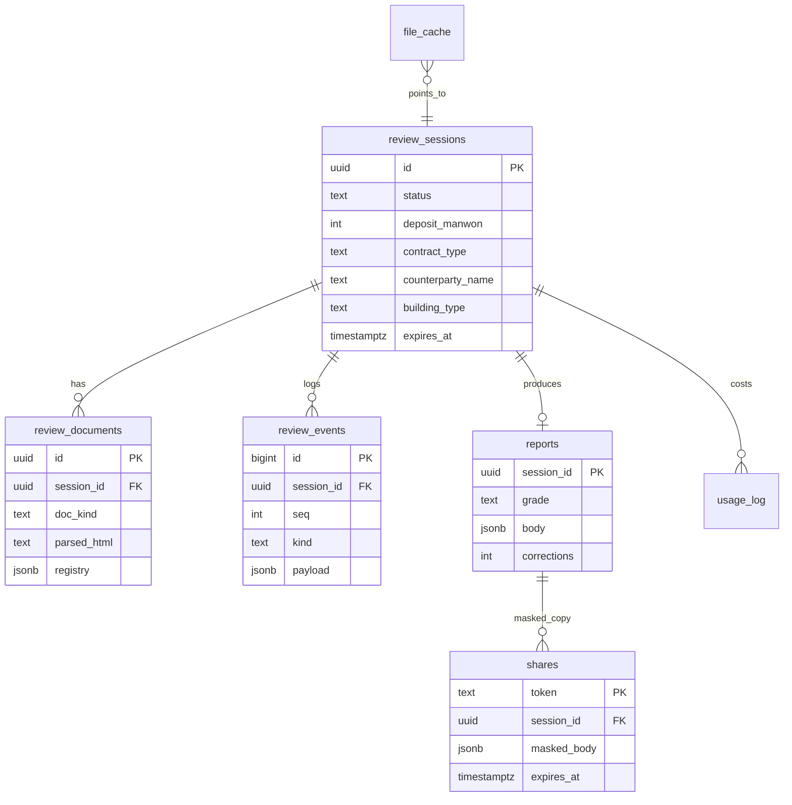
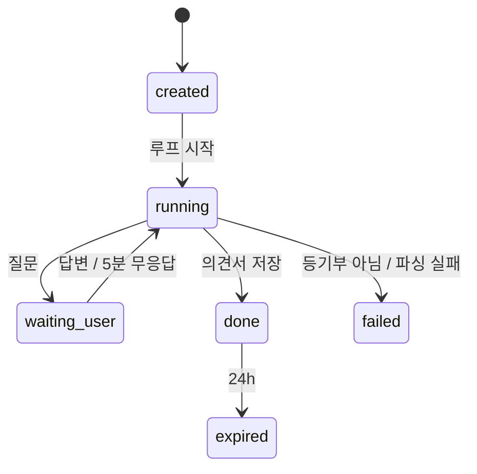
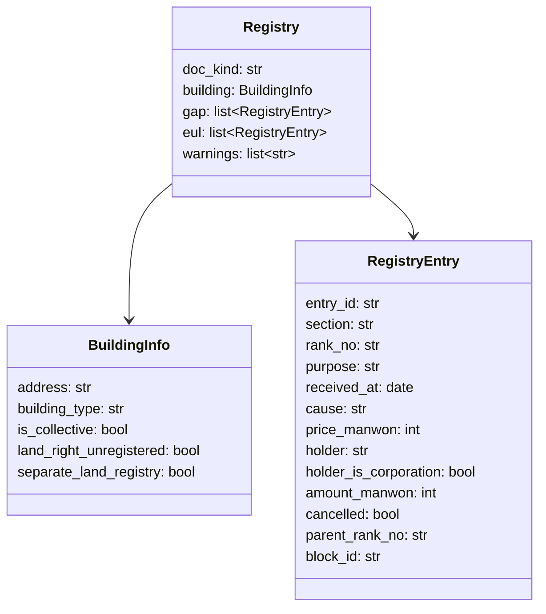

# 도메인 모델 / ERD·DD

## 0. 이 문서가 다루는 것

Postgres 테이블 9개(소문자 ID)와 도구 사이를 오가는 DTO 7개(대문자 ID). 도메인 6개의 경계. 함수 시그니처는 MS, 도구 스키마는 API.

**3줄 요약.** 검토 세션 하나가 문서·이벤트·의견서를 가진다. 등기부는 `Registry` DTO로 구조화돼 규칙 도구를 통과하며 `RightsSummary`·`Signal`·`Grade`가 된다. 규칙 도메인은 DB와 LLM을 모른다.

## 1. 개념 식별

| 개념 | 종류 | 어디서 왔나 |
|---|---|---|
| 검토 세션 | 테이블 | [[JSD-UC-001#UC-A1]] |
| 등기부 문서(파싱 결과) | 테이블 + DTO `Registry` | [[JSD-UC-001#UC-S1]] |
| 검토 이벤트(진행 기록) | 테이블 + DTO `ReviewEvent` | [[JSD-PRD-001#R12]] |
| 질문·답변 | 테이블(이벤트의 한 종류) + DTO `Question` | [[JSD-UC-001#UC-S7]] |
| 권리 합산 | DTO `RightsSummary` | [[JSD-UC-001#UC-S2]] |
| 위험 신호·등급 | DTO `Signal`, `Grade` | [[JSD-UC-001#UC-S3]] |
| 의견서 | 테이블 + DTO `Report` | [[JSD-UC-001#UC-S8]] |
| 공유본 | 테이블 | [[JSD-UC-001#UC-A4]] |
| 파일 캐시·조회 캐시·명단 스냅샷·비용 집계 | 테이블 | [[JSD-INFRA-001#C3]] [[JSD-UC-001#UC-S10]] |

## 2. 개념 모델

`lookup_cache`, `hug_defaulters`, `usage_log`, `file_cache`는 세션과 느슨하게 연결되므로 그림에서 뺐다.

## 3. 개념별 정리

### 3.1 테이블

#### review_sessions 검토 세션

| 컬럼 | 타입 | 필수 | 설명 |
|---|---|---|---|
| id | uuid | ○ | 세션 ID. 추측 불가 랜덤 |
| status | text | ○ | `created` / `running` / `waiting_user` / `done` / `failed` / `expired` |
| deposit_manwon | int | ○ | 보증금 (만원) |
| contract_type | text | ○ | `jeonse` / `monthly` |
| counterparty_name | text | | 계약 상대방 이름 (입력 시) |
| building_type | text | | 표제부에서 판정: `apartment` / `multi_family_unit`(다세대·연립) / `multi_household`(다가구·단독) / `officetel` / `other` |
| is_sample | bool | ○ | 예시 파일 여부 (IP 한도 제외) |
| file_hash | text | ○ | 업로드 파일 SHA-256 |
| client_ip_hash | text | ○ | IP 해시 (한도 계산용, 원본 IP 저장 안 함) |
| tool_calls | int | ○ | 도구 호출 수 (한도 20) |
| questions_asked | int | ○ | 질문 수 (한도 5) |
| cost_krw | numeric | ○ | 누적 비용 |
| created_at / updated_at | timestamptz | ○ | |
| expires_at | timestamptz | ○ | 마지막 접근 + 24h. 지나면 문서 삭제 |

판정 근거: 상태 전이는 [[JSD-UC-001#UC-S9]]. 한도는 [[JSD-PRD-001#R10]].

#### review_documents 등기부 문서

| 컬럼 | 타입 | 필수 | 설명 |
|---|---|---|---|
| id | uuid | ○ | |
| session_id | uuid FK | ○ | |
| doc_kind | text | ○ | `building` / `land` / `collective`(집합건물) |
| parsed_html | text | ○ | Document Parse가 돌려준 HTML (블록 ID 포함). 하이라이트 원문 |
| registry | jsonb | ○ | `Registry` DTO 직렬화 |
| page_count | int | ○ | 비용 집계용 |
| created_at | timestamptz | ○ | |

원본 파일 바이트는 어디에도 저장하지 않는다 ([[JSD-PRD-001#N1]]). 세션 만료 시 행 삭제.

#### review_events 검토 이벤트

| 컬럼 | 타입 | 필수 | 설명 |
|---|---|---|---|
| id | bigint PK | ○ | |
| session_id | uuid FK | ○ | |
| seq | int | ○ | 세션 내 순번. SSE 재접속 시 `Last-Event-ID` |
| kind | text | ○ | `thought` / `tool_call` / `tool_result` / `question` / `answer` / `report` / `error` |
| payload | jsonb | ○ | `ReviewEvent` DTO |
| created_at | timestamptz | ○ | |

캐시 재생([[JSD-UC-001#UC-A2]] 4)은 이 테이블을 순서대로 읽는다. payload에 이름·주민번호 금지.

#### reports 의견서

| 컬럼 | 타입 | 필수 | 설명 |
|---|---|---|---|
| session_id | uuid PK FK | ○ | 세션당 1개 |
| grade | text | ○ | `safe` / `caution` / `danger` |
| body | jsonb | ○ | `Report` DTO |
| corrections | int | ○ | 후검증 교정 문장 수 |
| llm_fallback | bool | ○ | LLM 실패로 템플릿 대체 여부 |
| created_at | timestamptz | ○ | |

30일 보관.

#### shares 공유본

| 컬럼 | 타입 | 필수 | 설명 |
|---|---|---|---|
| token | text PK | ○ | 랜덤 22자 |
| session_id | uuid FK | ○ | |
| masked_body | jsonb | ○ | 이름·주민번호·동 이하 주소 제거한 `Report` |
| expires_at | timestamptz | ○ | 생성 + 7일 |

#### file_cache 파일 캐시

| 컬럼 | 타입 | 필수 | 설명 |
|---|---|---|---|
| cache_key | text PK | ○ | sha256(file_hash + deposit + contract_type + counterparty) |
| session_id | uuid FK | ○ | 재생할 세션 |
| is_sample | bool | ○ | 예시면 만료 없음 |
| expires_at | timestamptz | | 30일 |

#### lookup_cache 외부 조회 캐시

| 컬럼 | 타입 | 필수 | 설명 |
|---|---|---|---|
| cache_key | text PK | ○ | `{tool}:{sha256(args)}` |
| result | jsonb | ○ | 도구 출력 그대로 |
| expires_at | timestamptz | ○ | 24시간 |

#### hug_defaulters HUG 명단 스냅샷

| 컬럼 | 타입 | 필수 | 설명 |
|---|---|---|---|
| id | bigint PK | ○ | |
| name | text | ○ | 성명 또는 법인명 |
| is_corporation | bool | ○ | |
| public_fields | jsonb | ○ | 명단에 공개된 항목 그대로 |
| snapshot_date | date | ○ | 갱신일 |

일 1회 전체 교체. 완전 일치 대조만 ([[JSD-UC-001#UC-S6]]).

#### usage_log 비용 집계

| 컬럼 | 타입 | 필수 | 설명 |
|---|---|---|---|
| id | bigint PK | ○ | |
| session_id | uuid FK | | |
| kind | text | ○ | `llm` / `parse` / `api` |
| units | numeric | ○ | 토큰 수 또는 페이지 수 또는 호출 수 |
| cost_krw | numeric | ○ | 환산 비용 |
| created_at | timestamptz | ○ | |

### 3.2 DTO (도구 사이를 오가는 값)

DTO는 `rules` 도메인이 DB·LLM 없이 동작하게 하는 계약이다. Pydantic 모델로 한 곳(`domain/dto.py`)에만 정의한다.

#### Registry 등기부 구조

- `section`: `gap` / `eul`. `purpose`: 등기목적 원문 + 정규화 토큰(`ownership_transfer`, `mortgage`, `lease_right`, `seizure`, `trust`, `cancellation` …)
- `amount_manwon`: 채권최고액·전세금·임차보증금. `price_manwon`: 갑구 거래가액
- `parent_rank_no`: 부기등기(1-1)의 주등기. `cancelled`: 말소 여부
- `block_id`: `parsed_html`의 블록 ID → 근거 하이라이트

판정 근거: [[JSD-PRD-001#R3]].

#### RightsSummary 권리 합산

| 필드 | 타입 | 설명 |
|---|---|---|
| senior_mortgage_manwon | int | 말소 제외 근저당 채권최고액 합 (건물+토지) |
| senior_lease_manwon | int | 전세권 전세금 합 |
| other_tenants_manwon | int | 다가구 기존 세입자 보증금 (답변) + 빈 방 × 최우선변제금 |
| senior_total_manwon | int | 위 셋의 합 |
| deposit_manwon | int | 내 보증금 |
| price_manwon | int or null | 주택 가격 |
| price_source | str or null | `trade_api` / `registry_sale` / `user_input` |
| debt_ratio | float or null | (senior_total + deposit) ÷ price |
| senior_ratio | float or null | senior_total ÷ price |
| multi_household_unknown | bool | 다가구인데 세입자 답변 없음 |
| based_on | list[str] | 계산에 쓴 entry_id |

판정 근거: [[JSD-PRD-001#R4]].

#### Signal 위험 신호

| 필드 | 타입 | 설명 |
|---|---|---|
| code | str | `encumbrance` / `trust` / `lease_registration` / `owner_mismatch` / `defaulter_match` / `illegal_building` / `land_right_issue` / `recent_mortgage` / `frequent_transfer` / `corporate_owner` / `senior_excess` / `multi_household_unknown` |
| severity | str | `danger`(즉시 위험) / `caution`(주의) |
| evidence_ids | list[str] | 근거 entry_id 또는 답변 ID. 비어 있으면 안 됨 |
| source | str | 공식 기준 출처 (LH 공고, HUG 상품개요 등) |
| summary | str | 규칙이 만든 한 줄 (LLM 아님) |

판정 근거: [[JSD-PRD-001#R5]].

#### Grade 등급

| 필드 | 타입 | 설명 |
|---|---|---|
| level | str | `safe` / `caution` / `danger` |
| deciders | list[str] | 등급을 결정한 신호 code 또는 `debt_ratio` |
| unknowns | list[str] | 확인 못 한 항목 code |
| rule_version | str | 규칙표 버전 (문서 R6 기준일) |

판정 근거: [[JSD-PRD-001#R6]].

#### Question 질문

| 필드 | 타입 | 설명 |
|---|---|---|
| question_id | str | |
| kind | str | `illegal_building` / `price` / `tenants` / `proxy` / `owner_type` / `land_registry` / `other` |
| text | str | 질문 문장 |
| why | str | 왜 묻는지 한 줄 |
| options | list[str] or null | 선택지 (없으면 입력형) |
| help_url | str or null | 확인 방법 링크 |
| answer | Any or null | 답. `unknown`이면 건너뜀 |

판정 근거: [[JSD-PRD-001#R8]].

#### Report 의견서

| 필드 | 타입 | 설명 |
|---|---|---|
| grade | Grade | |
| conclusion | str | 한 문장 (LLM, 후검증) |
| checked | list[CheckedItem] | 항목·결과(`ok`/`unknown`/`n_a`)·근거 |
| signals | list[SignalView] | Signal + 쉬운 설명(LLM) |
| rights | RightsSummary | |
| todos | list[Todo] | 단계(`before`/`signing`/`balance`/`after`)·항목·방법·비용·이유 |
| clauses | list[Clause] | 특약 제목·본문(빈칸 채움)·출처 |
| questions_to_ask | list[str] | 집주인·중개사 질문 |
| notices | list[str] | AI 고지·전문가 확인·기준 출처 |
| review_log | list[ReviewEvent] | 검토 기록 |

판정 근거: [[JSD-PRD-001#R9]].

#### ReviewEvent 검토 이벤트

| 필드 | 타입 | 설명 |
|---|---|---|
| seq | int | |
| kind | str | `thought` / `tool_call` / `tool_result` / `question` / `answer` / `report` / `error` |
| text | str | 사람이 읽는 한 줄 ("을구를 봅니다: 근저당 1건 1억 2천") |
| tool | str or null | 도구 이름 |
| data | dict or null | 도구 입출력 요약 (개인정보 제외) |
| at | datetime | |

판정 근거: [[JSD-PRD-001#R12]].

## 4. 경계

| 도메인 | 소유 테이블 | 소유 DTO | 의존 |
|---|---|---|---|
| `review` | review_sessions, review_events | ReviewEvent, Question(대기·재개) | registry·rules·lookup·report 호출, OpenAI |
| `registry` | review_documents | Registry | 업스테이지, OpenAI(구조화) |
| `rules` | — | RightsSummary, Signal, Grade | **없음** (순수) |
| `lookup` | lookup_cache, hug_defaulters | — | 공공 API, HUG 페이지 |
| `report` | reports, shares | Report | OpenAI(문장), rules(후검증에 Grade·RightsSummary 재사용) |
| `gate` | file_cache, usage_log | — | — |

규칙: `rules`는 어떤 도메인도 import하지 않는다. `review`만 여러 도메인을 조립한다.

## 5. 미결사항

- [ ] `purpose` 정규화 토큰 목록의 완전성 — 실제 등기부 샘플로 검증 후 확정
- [ ] `block_id`가 Document Parse 출력에서 어떤 형태인지 (element id vs 좌표) — INFRA 미결과 동일
- [ ] 최우선변제금 지역 판정에 필요한 주소 → 지역 구분 매핑 (과밀억제권역 목록)
- [ ] `usage_log` 환율 상수 관리 방식
