# 클래스 명세: 보증금지킴 (deposit-guard)

---

## 0. 이 문서가 다루는 것

도메인 모델의 개념을 **코드 구조**로 옮긴다. 폴더 배치, 엔티티 클래스, 서비스의 책임과 메서드 이름까지. 테이블·컬럼·인덱스 정의는 ERD·DD(ERD·DD 문서)가 맡는다.

**3줄 요약.** 도메인 모델의 코드 도메인 아홉 개가 `app/domains/` 아래 폴더 아홉 개가 된다. 검토 하나의 흐름은 `review`가 쥐고, 에이전트 루프(`review/service_agent.py`)가 도구 9종을 각 도메인 서비스로 나눠 보낸다. 등급과 수치는 `rules`의 순수 함수가 내고, 모델로 가는 값은 루프와 의견서 작성 두 곳만 지나며 그 전에 이름이 가려진다.

**클래스 세 종류와 이 문서의 범위**

| 종류 | 역할 | 우리 구조 | 정의하는 곳 |
|---|---|---|---|
| Entity | 데이터를 갖는 것 | `domains/*/models.py` | 이 문서 2장 + ERD·DD |
| Control | 유스케이스 흐름을 조율하는 것 | `domains/*/service*.py`, `core/health.py` | 이 문서 3장(의존)·4장(시그니처·다이어그램) |
| Boundary | 바깥과 만나는 것 | `domains/*/router.py`, `jobs.py`, 에이전트 도구 인자 모델(`review/schemas.py`) | API 명세·화면 명세. 3.1에서 Control과의 연결만 |

**전제 (앞 단계에서 결정)**
- 도메인 경계는 [[JSD-DOM-001]] 5.1 표 그대로다. 개념 하나는 도메인 하나에만 산다
- 도메인끼리는 ID와 값으로만 주고받는다. 다른 도메인의 ORM 객체를 들고 다니지 않는다 ([[JSD-DOM-001]] 5.2)
- ORM 모델은 저장 형태다. 규칙은 서비스에 둔다. `rules`는 저장소·네트워크·모델을 부르지 않는다
- 등급과 수치는 코드가 정한다. 생성 문장은 옮겨 적을 뿐이다 ([[JSD-PRD-001#R6]] [[JSD-PRD-001#R10]])
- 올린 파일은 디스크에 쓰지 않는다. 이름·주민번호·상세 주소는 로그·모델·공유본에 닿지 않는다 ([[JSD-INFRA-001#C2]] [[JSD-PRD-001#N1]])
- 로그인이 없다. 검토는 추측할 수 없는 `review_id`로만 찾는다. 바깥에 보이는 ID(`review_id`·`document_id`·`message_id`)는 UUID 문자열이고 그 행의 기본키다. 바깥에 안 보이는 행은 정수 기본키다
- 한도: 도구 20회, 질문 5회, 되묻기 차례마다 도구 5회, 파일 10MB·20쪽, IP 하루 5건(예시 제외), 보관 24시간, 공유 링크 7일 ([[JSD-PRD-001#R10]] [[JSD-PRD-001#N2]] [[JSD-API-002]] 4장)

**본문은 언어 중립으로 쓴다.** FastAPI·SQLAlchemy로 어떻게 옮기는지는 6장 부록에 둔다. 다만 폴더와 파일 이름은 파이썬 기준이다.

---

## 1. 폴더 구조

저장소 `deposit-guard` 하나에 **백엔드와 프런트엔드를 나눠 둔다.** 명세와 예시 등기부는 둘 다 쓰므로 루트에 둔다.

**기본형과 다른 점, 그리고 왜.** 싱크독 작성 규약(SYNC-STD-001) 1.9의 기본형을 따른다. 입구가 브라우저 REST 하나이고 배포 단위가 하나라([[JSD-INFRA-001#C6]]) 라우터는 도메인 폴더 안에 둔다. 다른 점은 다섯이다.
- **빠진 파일.** `rules`에는 `crud`·`models`가 없다 — 판정 개념은 값이고 남기는 것은 부른 쪽이다([[JSD-DOM-001]] 5.2). `sample`에도 없다 — 예시 3건은 저장소에 커밋한 파일이다([[JSD-INFRA-001]] 3장 예시 파일). `lookup`·`gate`에는 `router`가 없다 — [[JSD-API-001]]의 16개 경로 중 이 둘이 받는 것이 없다. `gate`는 `schemas`도 없다 — 주고받는 타입이 `shared/types.py`의 것뿐이다
- **더한 파일.** `review/service_agent.py`·`registry/service_parse.py`는 서비스가 길어 기능 단위로 나눈 것이고 계층 이름을 유지한다. `rules/criteria.py`·`report/catalog.py`·`review/prompts.py`는 로직 없는 상수다 — 판정 기준 페이지는 코드 상수를 그대로 내려보내야 하고([[JSD-UI-001#UI-4]] 규칙) 할 일·특약 문구는 출처와 함께 한곳에 있어야 고치고, 프롬프트는 루프 코드와 따로 읽고 고친다
- **`app/jobs.py`.** 배치 명령의 입구다([[JSD-INFRA-001]] 8장). 두 번째 입구지만 서비스 메서드를 부르기만 하고 REST와 따로 쓰는 절차가 없으므로 라우터를 도메인 밖으로 내지 않는다
- **`core/health.py`.** `HealthService`는 도메인 모델의 코드 도메인 표에 없고 앱 자신의 DB 연결만 본다. 도메인 폴더를 새로 만들지 않고 `core`에 둔다
- **`shared/types.py`.** 두 도메인 이상이 쓰는 열거형과, 개념이 아니면서 여러 도메인을 오가는 타입(`Upload` `Error` `Limits` `FileCheck` `ParsedDocument`)만 둔다. 개념의 DTO는 그 개념이 사는 도메인의 `schemas.py`에 있다 — 개념 하나는 도메인 하나에만 산다([[JSD-DOM-001]] 5.1). 파일 자리는 2.8 표의 `자리` 열이다

```
deposit-guard/                  저장소 = 프로젝트
├── backend/                    파이썬 3.12. FastAPI 앱 하나 (INFRA 3장)
│   ├── app/                    임포트 패키지 — from app.domains.review …
│   ├── tests/                  app/ 구조를 그대로 따른다
│   ├── alembic/ · alembic.ini  마이그레이션
│   └── pyproject.toml · uv.lock
│
├── frontend/                   React 18 + TypeScript + Vite + Tailwind. 빌드 → backend/app/static
│
├── assets/samples/             가상 등기부 PDF 3건 + samples.json(목록·기본 조건·기대 등급). 이미지에 함께 담는다
├── docs/specs/                 명세 원본. 백엔드·프런트엔드가 같이 본다
├── Dockerfile · docker-compose.yml   배치 (INFRA 2장). 프런트를 빌드해 백엔드 이미지에 담는 2단계. compose는 app·db
├── .env.example               필요한 환경 변수의 이름만. 값은 비운다. .env는 커밋하지 않는다
├── .gitignore · .dockerignore
└── CLAUDE.md · README.md       에이전트용 · 사람용 (INFRA C11)
```

**backend/app/ 안**

```
app/
├── main.py                 앱 조립. 도메인 라우터 등록 · 검토 경로 공통 의존성 · 업로드 스풀 크기 · 정적 파일과 SPA 폴백 · /health
├── jobs.py                 배치 명령 입구. python -m app.jobs <명령> (4.15)
│
├── core/                   도메인에 속하지 않는 것. 도메인을 import하지 않는다
│   ├── config.py           환경 변수(API 키·모델 ID·DB URL·앱 비밀키), 한도 상수 LIMITS, 단가 상수 PRICES(파싱 쪽당 원 · 입출력 토큰당 원)
│   ├── db.py               비동기 엔진·세션. 예외 문자열에 바인드 값을 싣지 않는다(4.14)
│   ├── errors.py           AppError(code) 하나, 코드 → HTTP 상태 표, 에러 봉투 핸들러 (API-001 2장)
│   ├── logging.py          JSON 로그. 주민번호 형태 숫자를 지우는 필터 · httpx·httpcore 로거는 WARNING(4.14)
│   └── health.py           HealthService — DB 연결 확인
│
├── domains/                코드 도메인 아홉 개 (DOM-001 5.1). 서로 ID와 값으로만
│   ├── review/             검토·대화·질문·되묻기 차례·사용량. 에이전트 루프
│   ├── registry/           등기부 파싱과 등기 항목
│   ├── rules/              합산·신호·등급·판정 기준. 순수
│   ├── lookup/             실거래가·건축물대장·HUG 명단·법정동코드
│   ├── citation/           인용과 역방향 조회
│   ├── report/             의견서 조립·문장 생성·후검증
│   ├── share/              가린 공유본
│   ├── sample/             예시 사례 목록과 파일
│   └── gate/               파일 검사·IP 한도·파싱 캐시
│
├── infra/
│   └── openai.py           OpenAI 클라이언트 하나. review·report 어댑터가 같이 쓴다
│
├── shared/                 두 도메인 이상이 쓰는 순수 코드. DB·네트워크 없음. 아무것도 import하지 않는다
│   ├── types.py            2.9 열거형 중 두 도메인 이상이 쓰는 것 · 2.8 표에서 자리가 shared인 타입
│   ├── privacy.py          개인 이름 라벨(개인 A) · 문장 가리기 · 주소를 시군구·동으로
│   ├── factcheck.py        문장 속 금액·비율·등급어가 허용 값과 다른지
│   └── money.py            만원 정수 → 2.1억 · 8,000만원
│
└── static/                 프런트엔드 빌드 결과 (gitignore)
```

**이 문서에서 파일 경로를 적을 때**는 패키지 안 상대 경로로 쓴다 — `core/errors.py`는 `backend/app/core/errors.py`를 가리킨다. 도메인 폴더는 `domains/`를 줄여 `review/service.py`처럼 쓴다.

**domains/ 안** (파일마다 한 줄)

```
domains/
├── review/
│   ├── router.py            HTTP 입출력만. 응답 뒤 루프를 BackgroundTasks로 띄우며 모델 포트를 넘긴다. 업로드 크기를 폼 읽기 전에 막는다
│   ├── schemas.py           요청·응답 모델과 에이전트 도구 9종의 인자 모델 (API-002 3장)
│   ├── service.py           ReviewService. 검토의 상태·한도·대화 기록·세션 정보 채우기. 트랜잭션 경계
│   ├── service_agent.py     에이전트 루프. 도구 호출을 각 도메인 서비스로 나눠 보내고 모델에 가는 값을 가린다
│   ├── prompts.py           시스템 프롬프트 두 벌(검토 · 되묻기)과 첫 차례 문장 틀. 로직 없는 상수
│   ├── crud.py              DB 접근만
│   ├── models.py            Review · ReviewRecord · Question · FollowUpTurn · UsageLog
│   ├── ports.py             AgentModel — 모델 한 차례
│   └── adapters/
│       └── openai_agent.py  AgentModel 구현. 도구 스키마를 넘기고 토큰을 센다
├── registry/
│   ├── router.py            문서 목록·원문 HTML
│   ├── schemas.py           응답 모델
│   ├── service.py           RegistryService. 등기부 저장·읽기·항목 조회
│   ├── service_parse.py     업스테이지 HTML에서 표제부·갑구·을구 항목을 읽는 순수 함수
│   ├── crud.py              DB 접근만
│   ├── models.py            RegistryExtract · RegistryEntry
│   ├── ports.py             DocumentParser — 파일 바이트 → HTML
│   └── adapters/
│       └── upstage.py       DocumentParser 구현. Document Parse 호출
├── rules/
│   ├── router.py            판정 기준. core의 LIMITS를 criteria에 넘긴다
│   ├── schemas.py           판정 DTO와 입력 모양(EntryFact · PropertyFact)
│   ├── service.py           RulesService. 합산·신호·등급. 순수
│   └── criteria.py          규칙 상수 — 경계값·신호표·필수 검토·최우선변제금·검토 항목·출처·규칙 버전
├── lookup/
│   ├── schemas.py           조회 결과 모델
│   ├── service.py           LookupService. 법정동코드 찾기·캐시·실패를 코드로
│   ├── crud.py              DB 접근만
│   ├── models.py            DefaulterRecord · RegionCode · LookupCache
│   ├── ports.py             TradeSource · LedgerSource · DefaulterSource
│   └── adapters/
│       ├── data_go_kr.py    TradeSource · LedgerSource 구현. 국토부 실거래가 4종·건축HUB
│       └── hug.py           DefaulterSource 구현. HUG 명단 페이지를 끝까지 넘기며 cp949로 읽는다
├── citation/
│   ├── router.py            이 줄이 쓰인 곳
│   ├── schemas.py           응답 모델
│   ├── service.py           CitationService. 표식 대조·인용 생성·역방향 조회
│   ├── crud.py              DB 접근만
│   └── models.py            Citation
├── report/
│   ├── router.py            의견서
│   ├── schemas.py           응답 모델
│   ├── service.py           ReportService. 조립·문장 생성 요청·후검증
│   ├── catalog.py           할 일·특약 문구와 출처·기준일 상수
│   ├── crud.py              DB 접근만
│   ├── models.py            Opinion
│   ├── ports.py             SentenceWriter — 결론·설명·물어볼 것 문장
│   └── adapters/
│       └── openai_writer.py SentenceWriter 구현. JSON 스키마 구조화 출력
├── share/
│   ├── router.py            공유 링크 만들기(검토 경로)·보기(토큰 경로). 라우터 둘(5장 결정 7)
│   ├── schemas.py           응답 모델
│   ├── service.py           ShareService. 가린 사본·만료
│   ├── crud.py              DB 접근만
│   └── models.py            SharedOpinion
├── sample/
│   ├── router.py            예시 목록
│   ├── schemas.py           응답 모델
│   └── service.py           SampleService. assets/samples 읽기
└── gate/
    ├── service.py           요청 관문 함수 — 파일 검사·IP 한도·파싱 캐시 (4.11)
    ├── crud.py              DB 접근만
    └── models.py            IpQuota · FileCache
```

**tests/ 안**

```
tests/
├── conftest.py              테스트 DB 세션 · 포트 가짜(모델·업스테이지·공공 API·HUG) 주입
├── core/                    test_errors.py · test_logging.py
├── domains/
│   ├── review/              test_service.py · test_service_agent.py(가짜 모델로 순서·한도·표식·가리기) · test_router.py
│   ├── registry/            test_service_parse.py(예시 3건 HTML 정답표) · test_service.py · fixtures/
│   ├── rules/               test_service.py — 신호 규칙마다 · 합산 5건 이상 · 등급 경계
│   ├── lookup/              test_service.py · adapters/test_hug.py(cp949 페이지 고정본)
│   ├── citation/            test_service.py
│   ├── report/              test_service.py — 후검증 교정 · 모델 실패 시 템플릿
│   ├── share/               test_service.py — 가림
│   ├── sample/              test_service.py
│   └── gate/                test_service.py
└── shared/                  test_privacy.py · test_factcheck.py · test_money.py
```

**규칙**
- 호출은 `router → service → crud` 한 방향이다. 라우터는 `crud`를 부르지 않는다
- 다른 도메인은 그 도메인의 `service`만 부르고 ID와 값(DTO)만 받는다. 어느 도메인이 어느 도메인을 부를 수 있는지는 3.2가 전부다
- `ports.py`·`adapters/`는 바깥 시스템을 실제로 부르는 네 도메인(review·registry·lookup·report)에만 있다. 서비스는 생성자로 포트를 받고 기본값이 어댑터다. 두 번째 구현은 테스트 가짜다
- 다른 도메인의 값 타입은 그 도메인의 `schemas.py`에서 import한다. `service`·`crud`·`models`는 import하지 않는다
- `rules`의 `service.py`·`criteria.py`·`schemas.py`는 `shared` 말고 아무것도 import하지 않는다 — 입력 모양을 스스로 정하고 `review`가 옮겨 담는다. `rules/router.py`는 다른 라우터처럼 `core`를 쓴다. `shared`는 아무것도 import하지 않는다. `core`는 `shared`만 쓴다
- 모델을 부르는 곳은 `review/service_agent.py`와 `report/service.py` 두 곳뿐이다. 둘 다 가린 값만 넘긴다
- 테스트는 바깥을 부르지 않는다. 판정 규칙·합산·파서 테스트가 가장 많다([[JSD-PRD-001#R4]] [[JSD-PRD-001#R5]] [[JSD-PRD-001#N5]])

**frontend/ 안**

```
frontend/
├── index.html
├── vite.config.ts · tsconfig.json · package.json · tailwind.config.ts   화면만 설정하므로 여기
├── public/                  그대로 서빙 — favicon
└── src/
    ├── main.tsx             진입
    ├── App.tsx              라우팅 — / · /review/:id · /review/:id/report · /criteria · /s/:token
    ├── pages/               화면 하나 = 파일 하나. 와이어프레임 항목과 1:1
    │   ├── StartPage.tsx        UI-1 시작
    │   ├── ReviewPage.tsx       UI-2 검토 대화
    │   ├── ReportPage.tsx       UI-3 의견서 단독 페이지
    │   ├── CriteriaPage.tsx     UI-4 판정 기준
    │   └── SharePage.tsx        UI-5 공유본
    ├── components/          두 화면 이상이 쓰는 조각만
    │   ├── Composer.tsx         입력 상자 — UI-1과 UI-2가 같은 부품
    │   ├── ReportView.tsx       의견서 본문 — UI-2 패널 탭 · UI-3 · UI-5(가린 모드)
    │   ├── DocumentPanel.tsx    원문 HTML · 강조 · 인용 n/N · 이 줄이 쓰인 곳 — UI-2 · UI-3
    │   ├── CitationChip.tsx     본문의 {{c1}}을 칩으로 — UI-2 · UI-3
    │   ├── GradeBadge.tsx       색·기호·글자 셋 다 — UI-2 · UI-3 · UI-5
    │   └── TopBar.tsx           상단 바 — 모든 화면
    ├── api/
    │   └── client.ts        서버 호출 한곳. SSE와 짧은 주기 조회 폴백도 여기
    ├── assets/              번들에 들어가는 이미지
    └── styles.css           UI-001 4.1 토큰의 전사 + Tailwind 진입
```

**기본형과 다른 점, 그리고 왜.** 기본형 그대로다. 스타일이 Tailwind라([[JSD-INFRA-001]] 3장) 설정 파일이 하나 더 있을 뿐이다.

**빌드 결과는 백엔드 이미지로 간다** — `frontend` 빌드 산출물이 `backend/app/static`에 들어가고 `main.py`가 정적 파일과 SPA 폴백으로 서빙한다. 그래서 컨테이너가 app·db 둘이다([[JSD-INFRA-001#C10]]).

---

## 2. 엔티티

묶음별로 나눈다. **클래스마다 항목 헤딩 + 그 클래스의 다이어그램.** 관계는 각 클래스 아래 목록으로 적는다. 묶음 전체 그림은 뷰가 조각을 합쳐 만든다. 각 클래스의 테이블 정의는 ERD·DD의 해당 항목을 참조한다. 묶음 하나가 코드 도메인 하나이고, 도메인을 넘는 관계는 선으로 긋지 않고 ID 열로만 잇는다. 예외 하나 — 검토에 딸린 행(`RegistryExtract`·`Citation`·`Opinion` 포함)의 `review_id`는 DB에서 `reviews`에 on delete cascade 외래키를 건다(5장 결정 11). 다이어그램에는 선을 긋지 않는다.

**개념이 코드 어디에 사는지.** 도메인 모델의 개념 27개 중 저장되는 것은 엔티티(2.1~2.7), 값으로만 오가는 것은 DTO(2.8)다. 개념이 없는 엔티티 다섯(`UsageLog` `RegionCode` `LookupCache` `IpQuota` `FileCache`)은 소프트웨어라서 생긴 것이라 도메인 링크가 없다.

| 개념 | 도메인 | 코드에서 |
|---|---|---|
| [[JSD-DOM-001#Property]] | registry | 엔티티 `RegistryExtract`의 표제부 열 · DTO `Property` |
| [[JSD-DOM-001#RegistryExtract]] | registry | 엔티티 `RegistryExtract` |
| [[JSD-DOM-001#RegistryEntry]] | registry | 엔티티 `RegistryEntry` · DTO `RegistryEntry` |
| [[JSD-DOM-001#Owner]] | registry | DTO `Owner`. 갑구 항목에서 계산하고 저장하지 않는다 |
| [[JSD-DOM-001#Counterparty]] | review | `Review.counterparty_name` · 소유자 일치는 `ReviewService.owner_matches`가 계산 |
| [[JSD-DOM-001#PlannedLease]] | review | `Review.deposit_manwon` · `Review.contract_type` |
| [[JSD-DOM-001#SeniorClaim]] | rules | DTO `SeniorClaim` (합산 안에서만) |
| [[JSD-DOM-001#OtherTenants]] | rules | DTO `OtherTenants` (합산 안에서만) |
| [[JSD-DOM-001#PriceEstimate]] | rules | DTO `PriceEstimate` → `RightsSummary.price_manwon` · `price_source` |
| [[JSD-DOM-001#RightsSummary]] | rules | DTO `RightsSummary` |
| [[JSD-DOM-001#ChecklistItem]] | rules | `criteria.py` 목록 · DTO `ChecklistItem` |
| [[JSD-DOM-001#RiskSignal]] | rules | DTO `RiskSignal` |
| [[JSD-DOM-001#Grade]] | rules | DTO `Grade` |
| [[JSD-DOM-001#UnknownItem]] | rules | DTO `UnknownItem` |
| [[JSD-DOM-001#OfficialCriterion]] | rules | `criteria.py` 출처 · DTO `OfficialCriterion` |
| [[JSD-DOM-001#Review]] | review | 엔티티 `Review` |
| [[JSD-DOM-001#ReviewRecord]] | review | 엔티티 `ReviewRecord` · DTO `Message` |
| [[JSD-DOM-001#Question]] | review | 엔티티 `Question` · DTO `Question` |
| [[JSD-DOM-001#FollowUpTurn]] | review | 엔티티 `FollowUpTurn` |
| [[JSD-DOM-001#Citation]] | citation | 엔티티 `Citation` · DTO `Citation` |
| [[JSD-DOM-001#Opinion]] | report | 엔티티 `Opinion` · DTO `Report` |
| [[JSD-DOM-001#Todo]] | report | DTO `Todo` (`Opinion.body` 안) · `catalog.py` |
| [[JSD-DOM-001#SpecialClause]] | report | DTO `SpecialClause` (`Opinion.body` 안) · `catalog.py` |
| [[JSD-DOM-001#SharedOpinion]] | share | 엔티티 `SharedOpinion` |
| [[JSD-DOM-001#SampleCase]] | sample | DTO `SampleCase` · `assets/samples/` |
| [[JSD-DOM-001#BuildingLedger]] | lookup | DTO `BuildingLedger` (응답은 `LookupCache`에 24시간) |
| [[JSD-DOM-001#DefaulterRecord]] | lookup | 엔티티 `DefaulterRecord` |

### 2.1 검토

#### Review 검토

테이블: [[JSD-DOM-003#reviews]] · 도메인: [[JSD-DOM-001#Review]]

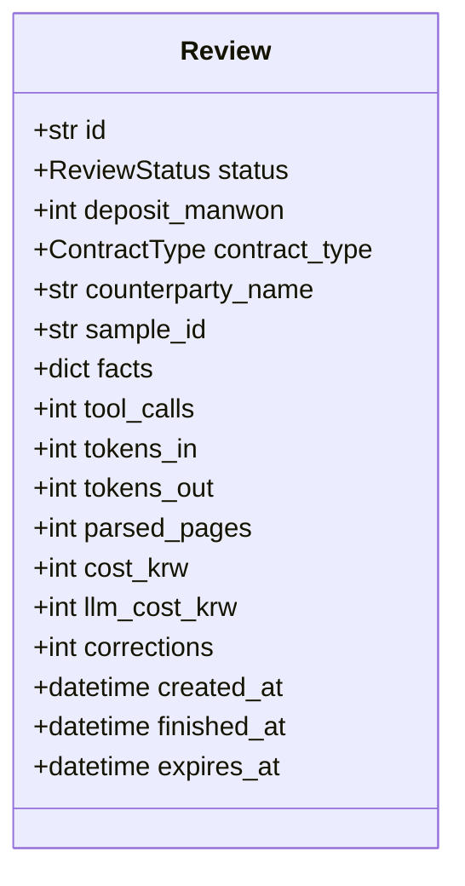

관계
- `Review` 1 — * `ReviewRecord`
- `Review` 1 — * `Question`
- `Review` 1 — * `FollowUpTurn`

**체결 예정 계약과 계약 상대방은 이 행의 열이다.** 둘 다 검토 하나에 하나씩 생기고 검토와 함께 사라지므로 행을 따로 두지 않는다. `counterparty_name`은 서버 안에서만 쓴다 — 명단 대조와 소유자 일치 계산. 모델·로그·공유본·응답으로 나가지 않는다(`ReviewView`에서 뺐다, 7장). `facts`는 루프가 모은 도구 결과·답변·직접 입력 값(2.8 `ReviewFacts`)이고, 서버가 도구 인자로 받지 않는 세션 정보를 채울 때 여기서 읽는다([[JSD-API-002]] 1.2). `tool_calls`는 검토 단계만 센다. 질문 수·되묻기 수는 행 수로 센다. `cost_krw`는 파싱과 LLM을 합친 건당 비용이고 `llm_cost_krw`는 그중 LLM만이다 — 루프·되묻기·값 수정의 한도는 LLM만 보고([[JSD-UC-001#UC-S9]] 3c · [[JSD-PRD-001#R10]]), 합계는 `UsageLog`와 일일 점검이 본다([[JSD-INFRA-001#C3]]). `corrections`는 대화 문장과 의견서에서 교정한 수의 합이다. `sample_id`가 있으면 예시 검토다.

#### ReviewRecord 대화 메시지

테이블: [[JSD-DOM-003#review_records]] · 도메인: [[JSD-DOM-001#ReviewRecord]]

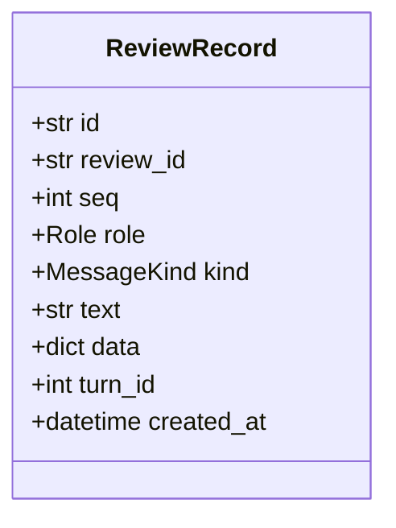

관계
- 역방향: `ReviewRecord` * — 1 `Review`
- 역방향: `ReviewRecord` * — 0..1 `FollowUpTurn` (차례의 메시지)

**API 이름은 `Message`다.** 인용은 이 행에 싣지 않는다 — `Citation` 행이 진실이고 응답을 만들 때 붙인다(5장 결정 5). `text`는 저장 전에 가린다. `seq`는 검토 안에서 1부터이고 스트림의 이벤트 ID다.

#### Question 질문과 답변

테이블: [[JSD-DOM-003#questions]] · 도메인: [[JSD-DOM-001#Question]]

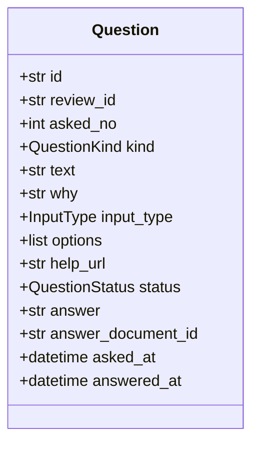

관계
- 역방향: `Question` * — 1 `Review`

질문 카드 메시지의 `data`는 물을 때의 사본이고, 답과 상태는 이 행이 진실이다. 모름·건너뛰기와 5분 무응답은 `answer`가 `unknown`이고, 무응답이면 `status`가 timeout이다([[JSD-UC-001#UC-A3]] 2a·2c). 파일로 답하면 붙은 등기부의 ID가 `answer_document_id`에 들어간다.

#### FollowUpTurn 되묻기 차례

테이블: [[JSD-DOM-003#follow_up_turns]] · 도메인: [[JSD-DOM-001#FollowUpTurn]]

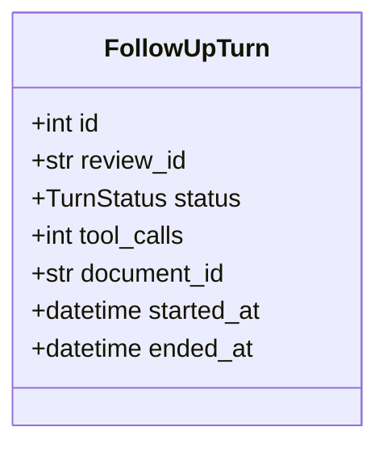

관계
- 역방향: `FollowUpTurn` * — 1 `Review`
- `FollowUpTurn` 0..1 — * `ReviewRecord` (차례의 메시지)

차례가 열려 있는 동안(`status` running) 다음 되묻기와 값 수정은 wrong_state다. `document_id`가 있으면 서류를 올려 연 차례라 `read_registry`를 허용한다. `tool_calls`는 이 차례의 도구 수이고 상한 5다.

#### UsageLog 사용량 기록

테이블: [[JSD-DOM-003#usage_logs]]

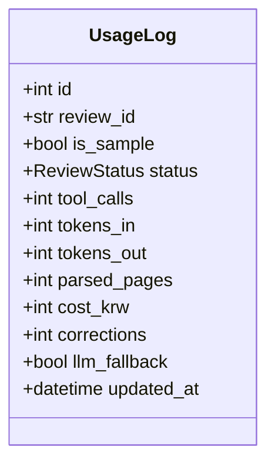

**`review_id`는 외래키가 아니다.** 검토가 지워져도(보관 기간·삭제) 남아 건당 비용·후검증 교정 수를 센다([[JSD-INFRA-001#C3]] · [[JSD-PRD-001]] 4장 성공지표). 개인정보가 없어 기한이 없다. 검토가 끝날 때와 되묻기 차례가 끝날 때 같은 행을 갱신한다.

### 2.2 등기부

#### RegistryExtract 등기부

테이블: [[JSD-DOM-003#registry_extracts]] · 도메인: [[JSD-DOM-001#RegistryExtract]]

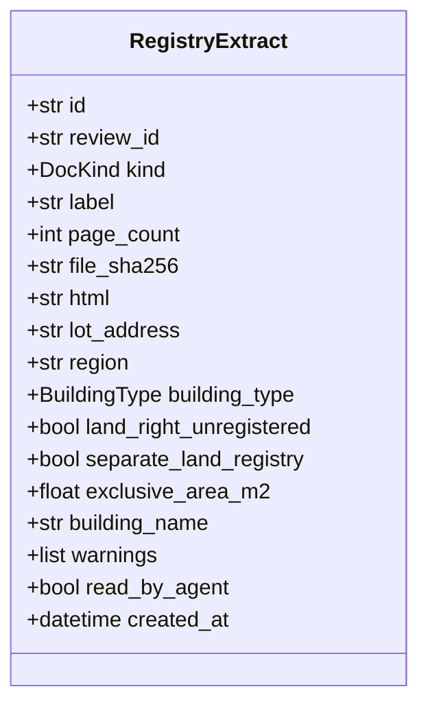

관계
- `RegistryExtract` 1 — * `RegistryEntry`

**API 이름은 document다**(`document_id`). 표제부에서 읽은 주택(`lot_address`부터 `building_name`까지)은 건물 등기부에만 채우고 토지 등기부는 비운다. 소유자는 저장하지 않고 갑구 항목에서 계산한다. `lot_address`는 지번까지이고 동·호수는 읽지 않는다 — 외부 조회에만 쓰고 모델·공유본으로 나가지 않는다. `html`은 문서 패널에 내려가는 원문이다. 블록마다 `data-block-id`가 붙어 있다. `file_sha256`은 파싱 캐시(`FileCache`)를 찾는 열이다 — 검토를 지울 때 그 캐시도 지운다(4.1 `cancel`). `warnings`는 표 읽기에서 못 읽은 필드를 적은 문장 목록이다 — read_registry 응답에 그대로 싣는다. 이름을 넣지 않고 `entry_id`와 필드 이름만 쓴다.

#### RegistryEntry 등기 항목

테이블: [[JSD-DOM-003#registry_entries]] · 도메인: [[JSD-DOM-001#RegistryEntry]]

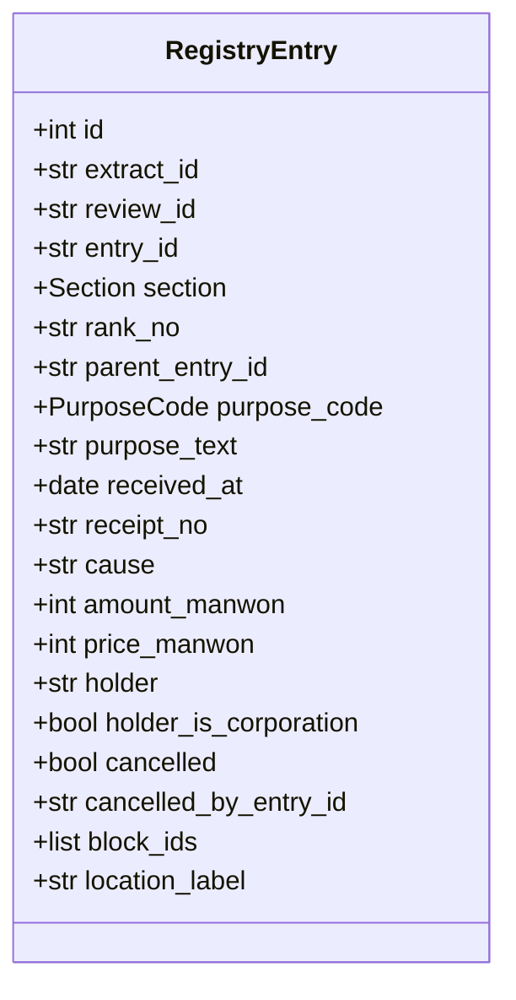

관계
- 역방향: `RegistryEntry` * — 1 `RegistryExtract`
- `RegistryEntry` 0..1 — * `RegistryEntry` (부기)

`entry_id`는 검토 안에서 유일하다. 첫 등기부는 `gap-1`·`eul-2`, 뒤에 붙은 등기부는 `land-gap-1`처럼 접두어를 붙인다. `holder`는 등기부의 이름 그대로이고 모델로는 `개인 A`로 바뀌어 간다. 말소는 "N번…말소" 행을 읽어 `cancelled`·`cancelled_by_entry_id`로 남긴다 — 취소선은 파싱 결과에 남지 않는다. `location_label`은 "을구 2번"처럼 세입자가 등기부에서 찾는 말이다.

### 2.3 인용

#### Citation 인용

테이블: [[JSD-DOM-003#citations]] · 도메인: [[JSD-DOM-001#Citation]]

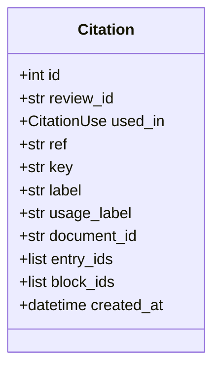

`entry_ids`·`block_ids`·`document_id`는 다른 도메인의 값이라 외래키가 아니다. 만들 때 `RegistryService.entries`로 이 검토에 있는 항목인지 대조한다. 쓰인 곳은 `used_in`과 `ref`다 — message면 `message_id`, signal이면 신호 코드, checked면 검토 항목 코드, clause면 특약 순번, conclusion·rights면 빈 문자열. `key`는 그 자리 안에서 c1·c2… 순서다. `usage_label`은 역방향 조회에 보일 한 줄("선순위 합산 2.1억")이다.

### 2.4 의견서

#### Opinion 의견서

테이블: [[JSD-DOM-003#opinions]] · 도메인: [[JSD-DOM-001#Opinion]]

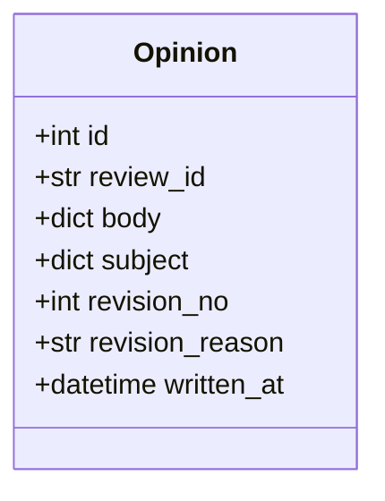

**API 이름은 `Report`다.** `body`는 인용을 뺀 `Report` 전체다 — 등급·합산·신호·확인한 것·할 일·특약·물어볼 것·고지·교정 수. 할 일과 특약은 행이 아니라 `body` 안 목록이다. 되묻기나 값 수정으로 다시 쓰면 같은 행을 덮고 `revision_no`를 올린다. `body`에는 개인 이름이 없다([[JSD-INFRA-001]] 6장). `revision_reason`은 모델이 쓴 한 줄이라 `review`가 `privacy.mask_text`로 가린 뒤 넘긴다. `subject`는 공유본이 원본 검토를 보지 않고 쓸 요약이다(지역은 시군구·동까지).

### 2.5 공유

#### SharedOpinion 공유본

테이블: [[JSD-DOM-003#shared_opinions]] · 도메인: [[JSD-DOM-001#SharedOpinion]]

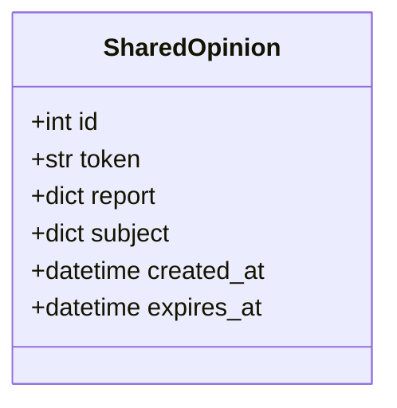

**원본 검토를 가리키는 열이 없다.** 원본이 24시간 뒤 사라져도 공유본은 7일 동안 따로 산다. `report`에는 인용·특약·물어볼 것이 없다([[JSD-UI-001#UI-5]] 가림 표). 만료 뒤에는 `report`·`subject`를 비우고 행만 남겨 410을 답한다.

### 2.6 외부 확인

#### DefaulterRecord 공개 명단 기록

테이블: [[JSD-DOM-003#defaulter_records]] · 도메인: [[JSD-DOM-001#DefaulterRecord]]

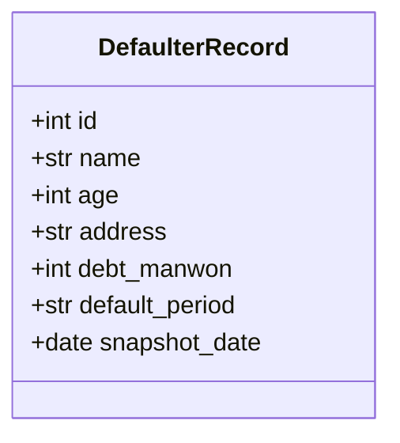

HUG 공개 명단 전체의 최신 스냅샷이다. 갱신은 행 전체 교체이고 모든 행의 `snapshot_date`가 같다. 속성은 도메인 모델의 공개 항목 기준이고 실제 페이지 열은 크롤러를 만들 때 확인한다(7장).

#### RegionCode 법정동코드

테이블: [[JSD-DOM-003#region_codes]]

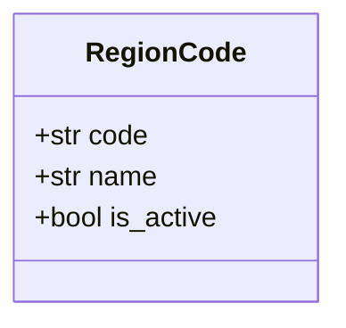

행안부 법정동코드를 한 번 적재한다. 지번 주소의 앞부분을 `name`과 맞춰 10자리 `code`를 얻는다. 앞 5자리가 실거래가 API의 지역 코드, 뒤 5자리가 건축HUB의 법정동 코드다.

#### LookupCache 조회 캐시

테이블: [[JSD-DOM-003#lookup_caches]]

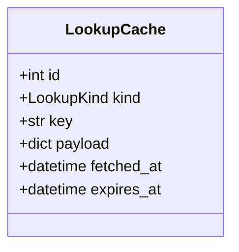

공공 API 응답을 24시간 둔다([[JSD-PRD-001#R7]]). `key`는 종류·법정동코드·조회 인자를 이은 문자열을 앱 비밀키로 HMAC한 16진수다 — 건축물대장 인자인 번·지가 원문으로 남지 않게. `payload`는 판정에 쓰는 필드만 두고 대지위치·도로명주소는 뺀다. 그래서 개인정보가 없고 검토를 지울 때 함께 지우지 않는다(5장 결정 12).

### 2.7 요청 관문

#### IpQuota 요청 한도

테이블: [[JSD-DOM-003#ip_quotas]]

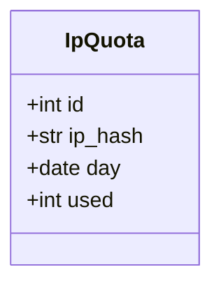

IP 원문은 저장하지 않고 앱 비밀키로 HMAC한 값만 둔다. 예시 검토와 예시 파일 해시는 세지 않는다([[JSD-PRD-001#N2]] · [[JSD-INFRA-001]] 5장). `used`는 한 문장으로 원자적으로 올린다(4.11).

#### FileCache 파싱 캐시

테이블: [[JSD-DOM-003#file_caches]]

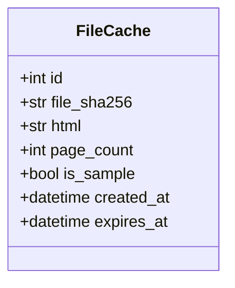

**검토 결과가 아니라 업스테이지 HTML만 둔다.** 같은 파일이면 파싱 비용만 아끼고 에이전트는 다시 돈다(5장 결정 3). 실제 등기부는 보관 기간(24시간)이 지나거나 그 전에 검토가 삭제되면 지우고(`gate.forget`), 예시 사례는 만료가 없다.

### 2.8 응답·내부 타입 (DTO)

서비스·루프·라우터가 주고받는 타입. API 스키마와 같은 이름은 필드를 그대로 쓴다 — [[JSD-API-001]] 4장 `Message` `Citation` `Question` `Report` `RightsSummary`, 3장의 응답, [[JSD-API-002]] 1.1 봉투와 도구 응답. 필드 뒤 `?`는 null일 수 있다는 뜻이다. `+ 내부`로 붙인 필드는 API·모델로 나가지 않는다.

**`자리`는 코드 파일이다.** 도메인 이름이면 그 도메인의 `schemas.py`, shared면 `shared/types.py`, core면 `core/health.py`. 개념의 DTO는 그 개념이 사는 도메인에 둔다(2장 머리 표 · [[JSD-DOM-001]] 5.1). 개념이 아니면서 여러 도메인을 오가는 타입만 shared다. `rules`는 다른 도메인의 타입을 import하지 않으므로 입력을 자기 모양(`EntryFact` `PropertyFact`)으로 받고 `review`가 옮겨 담는다.

| 타입 | 필드 | 쓰는 곳 | 자리 |
|---|---|---|---|
| `Message` | `message_id: str` · `seq: int` · `role: Role` · `kind: MessageKind` · `text: str` · `citations: list[Citation]` · `data: dict?` · `created_at: datetime` | list_messages · stream. `ReviewRecord` 행 + `CitationService.for_messages` | review |
| `ToolCard` | `tool: ToolName` · `status: ToolStatus` · `error_code: str?` · `elapsed_ms: int` · `summary: str` · `detail: dict?` | `Message.data` (kind tool). `detail`은 가린 도구 응답이고 되묻기 history에도 들어간다(4.2) | review |
| `AnswerData` | `question_id: str?` · `choice: str?` · `text: str?` · `document_id: str?` | `Message.data` (kind answer) | review |
| `ReportCard` | `grade: GradeLevel` · `signal_count: int` · `unknown_count: int` · `rule_version: str` · `revision_no: int` · `revision_reason: str?` | `Message.data` (kind report) | review |
| `NoticeData` | `code: str` | `Message.data` (kind notice). 코드 answer_timeout · tool_limit · cost_limit · text_only · out_of_scope | review |
| `Error` | `code: str` · `detail: str` · `field: str?` | 에러 봉투 · `Message.data` (kind error) · 스트림 error. `detail`은 코드별 문구이고 예외 문자열을 싣지 않는다(4.14) | shared |
| `Citation` (DTO) | `key: str` · `label: str` · `document_id: str` · `block_ids: list[str]` · `entry_ids: list[str]` | Message · Report. ORM은 `CitationRow` | citation |
| `Question` (DTO) | `question_id: str` · `kind: QuestionKind` · `text: str` · `why: str` · `input_type: InputType` · `options: list[str]?` · `help_url: str?` · `asked_no: int` | `Message.data` (kind question) · ReviewView. ORM은 `QuestionRow` | review |
| `Report` | `grade: Grade` · `conclusion: {text, citations}` · `rights: RightsSummary` · `signals: list[{code, severity, label, explanation, source, source_date, citations}]` · `checked: list[{code, label, result: CheckResult, citations}]` · `todos: list[Todo]` · `clauses: list[SpecialClause]` · `questions_to_ask: list[str]` · `notices: list[str]` · `corrections: int` · `llm_fallback: bool` · `revision_no: int` · `revision_reason: str?` | ReportService.get · override_values · SharedView | report |
| `Grade` | `level: GradeLevel` · `deciders: list[str]` · `unknowns: list[str]` · `rule_version: str` | Report · SignalCheck | rules |
| `Todo` | `stage: TodoStage` · `title: str` · `how: str` · `cost: str` · `because: list[str]` | Report | report |
| `SpecialClause` | `title: str` · `body: str` · `source: str` · `filled: dict` | Report | report |
| `RightsSummary` | `senior_mortgage_manwon: int` · `senior_lease_manwon: int` · `other_tenants_manwon: int` · `senior_total_manwon: int` · `deposit_manwon: int` · `price_manwon: int?` · `price_source: PriceSource?` · `debt_ratio: float?` · `senior_ratio: float?` · `multi_household_unknown: bool` · `based_on: list[str]` | RulesService.summarize → numbers 메시지 · Report · ReviewFacts | rules |
| `ReviewCreated` | `review_id: str` · `status: ReviewStatus` · `is_sample: bool` · `expires_at: datetime` | ReviewService.create | review |
| `ReviewView` | `review_id: str` · `status: ReviewStatus` · `subject: {building_type, deposit_manwon, contract_type, region}` · `counters: {tool_calls, questions_asked, asks_used, elapsed_sec, cost_krw}` · `pending_question: Question?` · `documents: list[{document_id, kind, label}]` · `has_report: bool` · `expires_at: datetime` | ReviewService.get. [[JSD-API-001#GET/api/reviews/{id}]]의 `subject.counterparty_name`은 싣지 않는다(7장) | review |
| `DocumentBrief` | `document_id: str` · `kind: DocKind` · `label: str` · `page_count: int` | RegistryService.list · create_extract. ReviewView에서는 `page_count`를 뺀다 | registry |
| `MessagesPage` | `messages: list[Message]` · `next_seq: int` · `status: ReviewStatus` | ReviewService.list_messages | review |
| `StreamEvent` | `event: str`(message · delta · state · done · error) · `id: int?` · `data: dict` | ReviewService.stream. state의 data는 `{status, counters, pending_question}` | review |
| `UserInput` | `kind: InputKind` · `question_id: str?` · `text: str?` · `choice: str?` · `file: Upload?` | ReviewService.receive | review |
| `Accepted` | `message_id: str` · `seq: int` + 내부 `turn_id: int?` | ReviewService.receive. `turn_id`가 있으면 라우터가 `run_follow_up`을 띄운다 | review |
| `ValueOverrides` | `price_manwon: int?` · `entries: list[{entry_id, amount_manwon}]` | ReviewService.override_values · ReviewFacts | review |
| `BlockUsages` | `block_id: str` · `excerpt: str` · `used_in: list[{kind: CitationUse, label, signal_code?, message_id?}]` | CitationService.usages | citation |
| `ShareLink` | `token: str` · `url: str` · `expires_at: datetime` | ShareService.create | share |
| `SharedView` | `report: Report`(인용·특약·물어볼 것 없음) · `subject: {region_short, building_type, deposit_manwon, contract_type, reviewed_at}` · `expires_at: datetime` | ShareService.get | share |
| `Criteria` | `rule_version: str` · `grades: list[{level, condition}]` · `signals: list[{code, severity, label, source, source_date}]` · `debt_ratio: {formula, danger, caution, senior}` · `required_checks: dict[BuildingType, list[str]]` · `price_order: list[PriceSource]` · `priority_repayment: list[{region, amount_manwon, effective_date}]` · `checklist: list[{no, label, source_kind}]` · `limits: Limits` · `sources: list[OfficialCriterion]` | RulesService.criteria → 판정 기준 · get_criteria | rules |
| `Limits` | `tool_calls: int` · `questions: int` · `asks: int?` · `answer_timeout_sec: int` · `file_mb: int` · `pages: int` · `retention_hours: int` + 내부 `follow_up_tools: int` · `ip_daily: int` · `cost_krw: int` · `text_only_strikes: int` · `share_days: int` | `core/config.py`의 `LIMITS` → criteria · 루프 · gate · share | shared |
| `OfficialCriterion` | `name: str` · `what_it_defines: str` · `as_of: date` | Criteria.sources | rules |
| `SampleCase` | `sample_id: str` · `title: str` · `summary: str` · `region: str` · `deposit_manwon: int` · `contract_type: ContractType` + 내부 `file_name: str` · `land_file_name: str?` · `expected_grade: GradeLevel` | SampleService.list · file | sample |
| `Health` | `status: str` · `db: str` · `version: str?` | HealthService.check | core |
| `ToolResult` | `ok: bool` · `data: dict?` · `error: str?` · `summary: str` | 루프 dispatch → 모델 · tool 메시지 | review |
| `LoopState` | `review_id: str` · `phase: Phase` · `turn_id: int?` · `model: AgentModel` · `history: list[dict]` · `strikes: int` · `required_returned: bool` · `read_ok: bool` · `forced: bool` | 루프 메모리. 저장하지 않는다 | review |
| `Registry` | `document_id: str` · `doc_kind: DocKind` · `building: Property?` · `gap: list[RegistryEntry]` · `eul: list[RegistryEntry]` · `warnings: list[str]` | RegistryService.read → 루프가 `owner_matches_counterparty`를 더하고 가린 뒤 모델 | registry |
| `Property` | `region: str` · `building_type: BuildingType` · `is_collective: bool` · `land_right_unregistered: bool` · `separate_land_registry: bool` + 내부 `lot_address: str?` · `exclusive_area_m2: float?` · `building_name: str?` | Registry.building · LookupService 인자 · SignalInput · ReportInput | registry |
| `RegistryEntry` (DTO) | `entry_id: str` · `rank_no: str` · `purpose_code: PurposeCode` · `received_at: date?` · `amount_manwon: int?` · `price_manwon: int?` · `holder: str?` · `holder_is_corporation: bool?` · `cancelled: bool` + 내부 `document_id: str` · `block_ids: list[str]` · `location_label: str` · `section: Section` · `parent_entry_id: str?` · `cause: str?` · `cancelled_by_entry_id: str?` | Registry · ReportInput. `rules`에는 `EntryFact`로 옮긴다. ORM은 `RegistryEntryRow` | registry |
| `PriceLookup` | `price_manwon: int` · `count: int` · `period: str` · `source: PriceSource` · `samples: list[{date, amount_manwon, area_m2}]` | LookupService.price · ReviewFacts | lookup |
| `BuildingLedger` | `main_use: str` · `ledger_kind: LedgerKind` · `households: int?` · `families: int?` · `approved_at: date?` · `multiple_candidates: bool` | LookupService.building · ReviewFacts. `rules`에는 `ledger_main_use`로 옮긴다 | lookup |
| `DefaulterMatch` | `matched: bool` · `match_count: int` · `snapshot_date: date` · `note: str` | LookupService.defaulter · ReviewFacts. `rules`에는 `defaulter_matched`로 옮긴다 | lookup |
| `SignalCheck` | `grade: Grade` · `signals: list[RiskSignal]` + 내부 `checked: list[ChecklistItem]` · `unknowns: list[UnknownItem]` | RulesService.check. 모델에는 `grade`·`signals`만 · ReportInput | rules |
| `RiskSignal` | `code: str` · `severity: Severity` · `label: str` · `source: str` · `entry_ids: list[str]` + 내부 `source_date: date` | SignalCheck | rules |
| `AskArgs` | `kind: QuestionKind` · `text: str` · `why: str` · `input_type: InputType` · `options: list[str]?` · `help_url: str?` | ask_user 인자 → ReviewService.ask | review |
| `AskAnswer` | `question_id: str` · `answer: str` · `document_id: str?` | ReviewService.ask → ask_user 응답 | review |
| `ReportResult` | `grade: GradeLevel` · `signal_count: int` · `unknown_count: int` · `corrections: int` · `rule_version: str` · `revision_no: int` · `revision_reason: str?` + 내부 `llm_fallback: bool` · `tokens_in: int` · `tokens_out: int` | ReportService.write → ReviewService.write_report → write_report 응답 · report 메시지 | report |
| `ReviewFacts` | `stated: {price_manwon?, other_tenants_manwon?, vacant_rooms?}` · `answers: dict[QuestionKind, str]` · `price: PriceLookup?` · `building: BuildingLedger?` · `defaulter: DefaulterMatch?` · `failures: dict[ToolName, str]` · `overrides: ValueOverrides?` · `rights: RightsSummary?` · `check: SignalCheck?` · `tried: list[str]` · `untried: list[str]` | `Review.facts`. 루프와 `ReviewService`가 쓰고 `ReviewService`의 입력 채우기가 읽는다. `stated`는 사용자 말과 대조를 통과한 값만(4.2). `tried`는 결과와 상관없이 부른 도구, `untried`는 끝내 시도하지 않은 필수 항목 코드 | review |
| `RightsInput` | `entries: list[EntryFact]` · `deposit_manwon: int` · `building_type: BuildingType` · `region: str` · `override_price_manwon: int?` · `trade_price_manwon: int?` · `user_price_manwon: int?` · `other_tenants_manwon: int?` · `vacant_rooms: int?` · `amount_overrides: dict[str, int]` · `today: date` | ReviewService.rights_input → RulesService.summarize | rules |
| `SignalInput` | `entries: list[EntryFact]` · `property: PropertyFact` · `rights: RightsSummary` · `owner_matches_counterparty: bool?` · `proxy_status: ProxyStatus` · `illegal_building: IllegalBuilding` · `owner_type: OwnerType` · `ledger_main_use: str?` · `defaulter_matched: bool?` · `tenants_answered: bool` · `failures: list[str]` · `untried: list[str]` · `today: date` | ReviewService.signal_input → RulesService.check | rules |
| `EntryFact` | `entry_id: str` · `section: Section` · `rank_no: str` · `parent_entry_id: str?` · `purpose_code: PurposeCode` · `cause: str?` · `received_at: date?` · `amount_manwon: int?` · `price_manwon: int?` · `holder: str?` · `holder_is_corporation: bool?` · `cancelled: bool` | RightsInput · SignalInput. `review`가 `RegistryEntry`에서 옮긴다. `holder`는 가린 값(개인 A · 법인명) | rules |
| `PropertyFact` | `region: str` · `building_type: BuildingType` · `is_collective: bool` · `land_right_unregistered: bool` · `separate_land_registry: bool` | SignalInput. `review`가 `Property`의 공개 필드를 옮긴다 | rules |
| `SeniorClaim` | `kind: SeniorKind` · `amount_manwon: int` · `entry_id: str` · `holder: str?` | RulesService.summarize 안 | rules |
| `OtherTenants` | `households: int?` · `known_deposit_manwon: int?` · `vacant_rooms: int?` · `added_manwon: int` | RulesService.summarize 안 | rules |
| `PriceEstimate` | `amount_manwon: int` · `source: PriceSource` · `period: str?` · `count: int?` | RulesService.summarize 안 → RightsSummary | rules |
| `ChecklistItem` | `code: str` · `label: str` · `result: CheckResult` · `entry_ids: list[str]` | SignalCheck → Report.checked | rules |
| `UnknownItem` | `code: str` · `reason: UnknownReason` · `how_to_check: str` | SignalCheck → Grade.unknowns · 할 일 맨 위 | rules |
| `ReportInput` | `rights: RightsSummary` · `check: SignalCheck` · `property: Property`(내부 필드 뺌) · `deposit_manwon: int` · `contract_type: ContractType` · `answers: dict[QuestionKind, str]` · `entries: list[RegistryEntry]`(이름 가림) + 내부 `use_model: bool` | ReviewService.report_input → ReportService.write. `use_model`은 LLM 비용이 한도 아래일 때만 true | report |
| `Shareable` | `report: Report` · `subject: {region_short, building_type, deposit_manwon, contract_type, reviewed_at}` | ReportService.shareable → ShareService.create | report |
| `CitedText` | `text: str` · `citations: list[Citation]` · `dropped: int` | CitationService.resolve_markers | citation |
| `CitationRef` | `used_in: CitationUse` · `ref: str` · `citation: Citation` | CitationService.for_report → ReportService.get | citation |
| `BlockExcerpt` | `entry_id: str` · `document_id: str` · `excerpt: str` | RegistryService.block_excerpt → CitationService.usages | registry |
| `Owner` | `name: str` · `is_corporation: bool` · `acquired_at: date?` · `cause: PurposeCode` · `entry_id: str` | RegistryService.owner → 명단 대조 이름 · `ReviewService.owner_matches` | registry |
| `Upload` | `data: bytes` · `media_type: str` · `filename: str` | 라우터 → ReviewService.create · receive · gate · SampleService.file | shared |
| `FileCheck` | `file_sha256: str` · `media_type: str` · `page_count: int` | gate.check_file → ReviewService | shared |
| `ParsedDocument` | `html: str` · `page_count: int` · `billed_pages: int` | registry 포트 → RegistryService.parse · gate.cached_html(적중이면 `billed_pages` 0). `billed_pages`가 `parsed_pages`에 더해진다 | shared |
| `ParsedRegistry` | `kind: DocKind` · `property: Property?` · `entries: list[ParsedEntry]` · `panel_html: str` · `warnings: list[str]` | service_parse.read_extract → RegistryService.create_extract | registry |
| `ParsedEntry` | `RegistryEntry` 필드 전부 + `receipt_no: str?` · `purpose_text: str` · `block_ids: list[str]` · `location_label: str` | ParsedRegistry → RegistryEntry 행 | registry |
| `Block` | `tag: str` · `block_id: str` · `text: str` + 표면 `header: list[str]` · `rows: list[list[str]]` | service_parse 안에서만. 업스테이지 요소 하나 | registry |
| `ToolCall` | `id: str` · `name: str` · `arguments: dict` | 모델 포트 → 루프 dispatch | review |
| `ModelTurn` | `text: str?` · `tool_calls: list[ToolCall]` · `refused: bool` · `tokens_in: int` · `tokens_out: int` | AgentModel.complete → 루프 | review |
| `SentenceRequest` | `grade: Grade` · `rights: RightsSummary` · `signals: list[RiskSignal]` · `agent_notes: str?` · `revision_reason: str?` | ReportService → SentenceWriter | report |
| `Sentences` | `conclusion: str` · `explanations: dict[str, str]` · `questions: list[str]` · `tokens_in: int` · `tokens_out: int` | SentenceWriter → ReportService | report |
| `Trade` | `date: date` · `amount_manwon: int` · `area_m2: float` · `building_name: str` | TradeSource → LookupService.price | lookup |
| `LedgerRow` | `main_use: str` · `ledger_kind: LedgerKind` · `households: int?` · `families: int?` · `approved_at: date?` · `dong_name: str?` | LedgerSource → LookupService.building | lookup |
| `DefaulterRow` | `name: str` · `age: int?` · `address: str` · `debt_manwon: int?` · `default_period: str?` | DefaulterSource → LookupService.refresh_defaulters | lookup |
| `RegionCodeRow` | `code: str` · `name: str` · `is_active: bool` | jobs.py → LookupService.load_region_codes | lookup |
| `UsageSummary` | `day: date` · `reviews: int` · `failed: int` · `avg_cost_krw: int` | ReviewService.usage_report → jobs.py | review |

타입은 여기 한 곳에만 정의한다.

### 2.9 열거형

쓰는 도메인이 둘 이상이면 코드는 `shared/types.py`, 하나면 그 도메인의 `schemas.py`에 둔다.

| 이름 | 값 | 쓰는 곳 |
|---|---|---|
| ReviewStatus | created, running, waiting_user, done, failed, expired | Review, UsageLog. [[JSD-API-001#GET/api/reviews/{id}]]의 값 그대로 |
| ContractType | jeonse, monthly | Review |
| Role | agent, user, system | ReviewRecord |
| MessageKind | say, tool, question, answer, numbers, report, notice, error | ReviewRecord |
| QuestionKind | illegal_building, price, tenants, proxy, owner_type, land_registry, other | Question |
| InputType | choice, number, text, file | Question |
| QuestionStatus | pending, answered, timeout | Question |
| TurnStatus | running, done, failed | FollowUpTurn |
| DocKind | building, land, collective | RegistryExtract |
| BuildingType | apartment, multi_family_unit, multi_household, officetel, other | RegistryExtract, Property, 필수 검토 |
| Section | gap, eul | RegistryEntry. 표제부는 항목이 아니다 |
| PurposeCode | ownership_preserve, ownership_transfer, mortgage, mortgage_change, jeonse_right, lease_right, seizure, provisional_seizure, injunction, provisional_registration, auction, trust, notice_registration, cancellation, other | RegistryEntry. 앞 셋은 [[JSD-API-002#read_registry]] 예시의 이름 |
| CitationUse | message, conclusion, rights, signal, checked, clause | Citation |
| LookupKind | trade, building | LookupCache |
| GradeLevel | safe, caution, danger | Grade |
| Severity | danger, caution | RiskSignal. danger가 즉시 위험 |
| CheckResult | ok, unknown, n_a | ChecklistItem |
| UnknownReason | lookup_failed, no_answer, no_data | UnknownItem. 끝내 시도하지 않은 필수 항목은 no_data |
| TodoStage | before, signing, balance, after | Todo |
| PriceSource | trade_api, registry_sale, user_input | RightsSummary, PriceEstimate |
| SeniorKind | mortgage, jeonse_right, lease_right, tenant_deposit | SeniorClaim |
| LedgerKind | general, collective | BuildingLedger |
| ProxyStatus | self, proxy_with_poa, proxy_without_poa, unknown | SignalInput · proxy 질문의 답. check_signals 인자로는 받지 않는다(4.2) |
| IllegalBuilding | yes, no, unknown | SignalInput · illegal_building 질문의 답. check_signals 인자로는 받지 않는다(4.2) |
| OwnerType | individual, corporation, unknown | SignalInput · owner_type 질문의 답. check_signals 인자로는 받지 않는다(4.2) |
| CriteriaTopic | grade, signals, debt_ratio, required_checks, price_order, priority_repayment, limits, sources | get_criteria 인자 |
| ToolName | read_registry, summarize_rights, check_signals, lookup_price, lookup_building, match_defaulter, ask_user, get_criteria, write_report | ToolCard, 루프 |
| ToolStatus | running, ok, failed | ToolCard. 도구 메시지는 끝난 뒤 한 번 쌓으므로 running은 쓰지 않는다 |
| InputKind | answer, ask | UserInput |
| Phase | review, follow_up | 루프 |

엔티티는 2.1~2.7, DTO는 2.8, 열거형은 2.9.

---

## 3. 의존 관계

누가 누굴 부르는지. 클래스 다이어그램이 아니라 지도다. 3.1은 입구(Boundary)에서 서비스(Control)로, 3.2는 서비스끼리. 여기 없는 방향은 부르면 안 된다.

### 3.1 Boundary → Control 의존 관계

클래스 다이어그램이 아니라 **의존 그림**이다. 라우터는 클래스가 아니라 함수가 든 파일이므로 박스만 그린다.

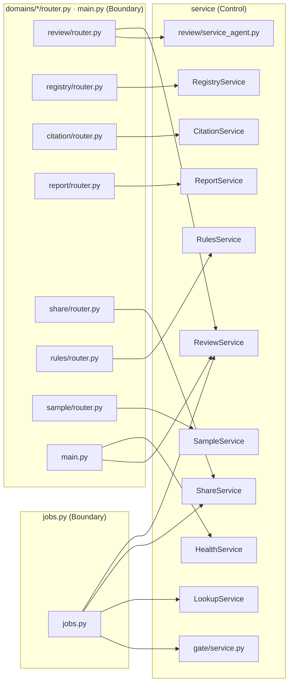

라우터 하나가 도메인 하나를 본다. **예외 둘.** `review/router.py`는 검토를 만들거나 되묻기를 받은 뒤 `service_agent`의 루프를 BackgroundTasks로 띄우고 모델 포트를 넘긴다(5장 결정 6). `main.py`는 `/api/reviews/{id}/…` 경로를 가진 라우터 — registry·citation·report의 라우터와 share의 검토 경로 라우터 — 를 등록할 때 `ReviewService.require_live`를 공통 의존성으로 건다. 404·410 판정이 한 곳에 있고 그 도메인들이 `review`를 import하지 않는다. `share/router.py`는 라우터를 둘 둔다 — `POST /api/reviews/{id}/shares`용과 `GET /api/shares/{token}`용. 토큰 경로에는 이 의존성이 없다(5장 결정 7). `lookup`·`gate`에는 라우터가 없다. `jobs.py`는 서비스 메서드 하나씩만 부른다.

### 3.2 Control 사이의 의존 관계

이것도 의존 그림이다. 화살표 위 글자는 부르는 메서드. 어느 서비스가 어느 서비스를 **부를 수 있는지**를 정한 것이며, 여기 없는 방향은 부르면 안 된다.

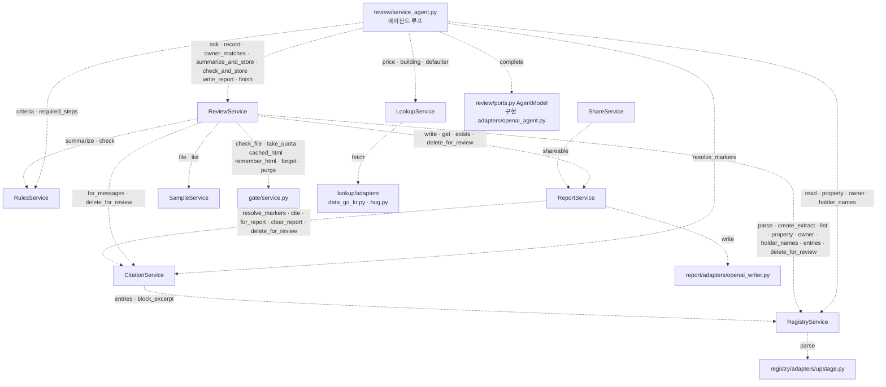

**규칙** — 서비스끼리 직접 부르는 것은 이 그림이 전부다. `RulesService`·`LookupService`·`SampleService`·`gate`는 아무 서비스도 부르지 않는다. `RegistryService`는 자기 어댑터만 부른다. registry·rules·lookup에서 review로, share에서 review·registry·citation으로 가는 선은 없다([[JSD-DOM-001]] 5.2). 인용은 `CitationService`만 만들고, 만들기 전에 반드시 `RegistryService.entries`로 대조한다. `service_agent.py`는 같은 도메인이라 `review/crud.py`도 직접 쓴다(도구 수·토큰·`facts` 갱신). 합산·신호·의견서는 루프도 `ReviewService`를 거친다 — 다시 돌리는 순서가 `write_report` 한 곳에 있어야 값 수정과 어긋나지 않는다. 4장에서 각 노드를 확대한다.

## 4. 설계 클래스 다이어그램

3장이 지도라면 여기는 각 노드를 확대한 것이다. 도메인마다 `«service»` 컨트롤의 **메서드 시그니처**와, 그 서비스가 만지는 엔티티를 한 그림에 둔다. 이게 코딩할 때 보는 그림이다.

**읽는 법** — 시그니처는 API 명세([[JSD-API-001]], [[JSD-API-002]])에서 확정한 것. `-`로 시작하는 메서드는 서비스 안에서만 쓰는 것. `T?`는 null일 수 있는 값, `list~T~`는 목록. 각 그림 아래 표에 메서드마다 어디서 부르는지·유스케이스·던지는 에러를 붙였다. 에러는 `core/errors.py`의 `AppError` 코드이고 HTTP 상태는 [[JSD-API-001]] 2장 표를 따른다. 그림 안 엔티티는 2장의 속성을 그대로 다시 그린다. **원본에 속성이 두 번 적히는 것이므로 어긋나면 2장이 진실이다.** 클래스가 아닌 함수 열(루프·파서·관문·어댑터·유틸·배치)은 항목 없이 코드블록으로 쓴다.

### 4.1 review

#### ReviewService

다루는 개념 — [[JSD-DOM-001#Review]] · [[JSD-DOM-001#ReviewRecord]] · [[JSD-DOM-001#Question]] · [[JSD-DOM-001#FollowUpTurn]] · [[JSD-DOM-001#PlannedLease]] · [[JSD-DOM-001#Counterparty]]

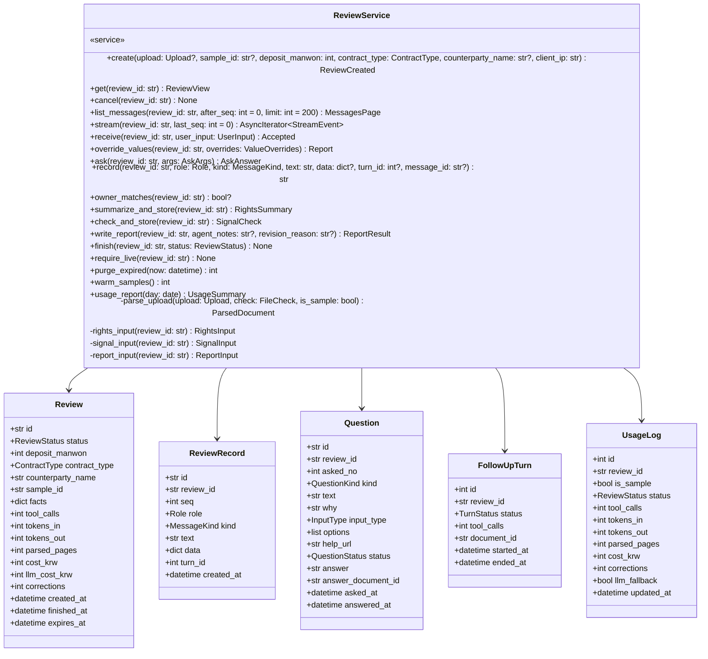

| 메서드 | 부르는 곳 | 유스케이스 | 던지는 에러 |
|---|---|---|---|
| `create` | [[JSD-API-001#POST/api/reviews]] | [[JSD-UC-001#UC-A1]] · [[JSD-UC-001#UC-A2]] · [[JSD-UC-001#UC-S10]] | missing_input, invalid_file, not_registry, parse_failed, rate_limited |
| `get` | [[JSD-API-001#GET/api/reviews/{id}]] | [[JSD-UC-001#UC-A1]] | not_found, gone |
| `cancel` | [[JSD-API-001#DELETE/api/reviews/{id}]] | [[JSD-UC-001#UC-A1]] | not_found, gone |
| `list_messages` | [[JSD-API-001#GET/api/reviews/{id}/messages]] | [[JSD-UC-001#UC-S9]] | not_found, gone |
| `stream` | [[JSD-API-001#GET/api/reviews/{id}/stream]] | [[JSD-UC-001#UC-S9]] | not_found, gone |
| `receive` | [[JSD-API-001#POST/api/reviews/{id}/messages]] | [[JSD-UC-001#UC-A3]] | missing_input, invalid_file, not_registry, parse_failed, wrong_state, ask_limit |
| `override_values` | [[JSD-API-001#PATCH/api/reviews/{id}/values]] | [[JSD-UC-001#UC-A1]] 8a | not_found, missing_input, wrong_state |
| `ask` | service_agent · [[JSD-API-002#ask_user]] | [[JSD-UC-001#UC-S7]] · [[JSD-UC-001#UC-A3]] | question_limit |
| `record` · `owner_matches` · `summarize_and_store` · `check_and_store` · `write_report` · `finish` | service_agent · `override_values` | [[JSD-UC-001#UC-S9]] · [[JSD-UC-001#UC-S8]] | |
| `require_live` | `main.py`가 검토 경로 라우터에 거는 공통 의존성 (3.1) | — | not_found, gone |
| `purge_expired` · `warm_samples` · `usage_report` | jobs.py | [[JSD-UC-001#UC-S10]] | |

**규칙이 사는 곳**
- `create`: 순서가 규칙이다. `upload`와 `sample_id` 중 하나(없거나 둘 다면 missing_input. `sample_id`면 `SampleService.file`) → `gate.check_file` → `gate.take_quota(client_ip, file_sha256, is_sample)` — 예시로 왔거나 예시 파일 해시면 세지 않는다 → `parse_upload`. **여기까지 트랜잭션을 열지 않는다** — 업스테이지 호출(30초·재시도 1회) 동안 DB 연결과 한도 행을 붙들지 않는다 → 짧은 트랜잭션 하나에 `Review` 행과 `RegistryService.create_extract`, 파싱이 캐시에서 온 것이 아니면 같은 트랜잭션에서 `gate.remember_html`. 등기부가 아니면(not_registry) 그 트랜잭션을 되돌려 검토도 캐시도 생기지 않는다. 이미 센 한도는 돌려주지 않는다 — 파싱 비용이 이미 났다(7장). 업스테이지가 재시도 뒤에도 실패하면 parse_failed(502) — 트랜잭션을 열기 전이라 검토·문서가 생기지 않는다. 파일 바이트는 이 메서드가 끝나면 버려진다. 루프는 응답 뒤 라우터가 띄운다
- `parse_upload`: `gate.cached_html(file_sha256)` → 없으면 `RegistryService.parse`. 캐시에 넣지는 않는다 — 부른 쪽이 `create_extract`가 성공한 트랜잭션에서 `gate.remember_html`을 부른다. 등기부가 아닌 파일의 원문이 어느 검토에도 매이지 않은 채 캐시에 남지 않게 하기 위해서다. 트랜잭션 밖에서만 부른다. 돌려준 `billed_pages`(캐시 적중이면 0)를 `parsed_pages`·`cost_krw`에 더한다
- `get`: 지역·건물 종류는 `RegistryService.property`, 문서 목록은 `RegistryService.list`, `has_report`는 `ReportService.exists`. `questions_asked`·`asks_used`는 `Question`·`FollowUpTurn` 행 수, `elapsed_sec`는 `finished_at`(없으면 지금) − `created_at`
- `cancel`: 상태가 expired면 지우지 않고 gone이다 — 남긴 행이 410의 근거다. 아니면 한 트랜잭션에 `RegistryService.delete_for_review` → 돌려받은 `file_sha256`마다 `gate.forget`(예시 캐시는 남는다) → `CitationService`·`ReportService`의 `delete_for_review` → 자기 행. 원문이 든 파싱 캐시까지 지워야 "즉시 지운다"가 지켜진다([[JSD-API-001#DELETE/api/reviews/{id}]]). `UsageLog`는 남긴다. 도는 루프는 다음 단계 전에 행이 없는 것을 보고 멈춘다
- `list_messages`·`stream`: 메시지 행 + `CitationService.for_messages`로 `Message`를 만든다. `stream`은 DB를 짧은 주기로 읽어 `seq`가 커진 메시지를 `message`로, 상태·수치가 바뀌면 `state`로 보낸다. 상태가 done·failed·expired이고 열린 차례가 없고 다 보냈으면 `done`. `delta`는 보내지 않는다(7장)
- `receive`: kind answer면 `question_id`가 이 검토의 pending 질문이어야 한다(아니면 wrong_state). kind ask면 `ReportService.exists`이고 열린 차례가 없어야 한다(아니면 wrong_state). `LIMITS.asks`가 정해졌고 차례 수가 그 값이거나 `llm_cost_krw ≥ LIMITS.cost_krw`면 ask_limit([[JSD-PRD-001#R10]]). 파일이 있으면 `gate.check_file` → `parse_upload`(트랜잭션 밖) → 짧은 트랜잭션에서 `RegistryService.create_extract`와 캐시 넣기(`create`와 같다). 업스테이지가 재시도 뒤에도 실패하면 parse_failed(502) — 트랜잭션을 열기 전이라 답·차례·문서가 남지 않는다. 붙은 문서 ID는 answer면 `answer_document_id`, ask면 `FollowUpTurn.document_id`에 적는다. ask면 `FollowUpTurn`을 열고 사용자 말을 role user · kind say로 남긴다(5장 결정 10). 모든 사용자 문장은 `privacy.mask_text`를 거쳐 저장한다
- `override_values`: 상태 done이고 열린 차례가 없어야 한다. `entries`의 `entry_id`는 `RegistryService.entries`로 대조하고 이 검토에 없는 ID가 하나라도 있으면 missing_input(field entries)이다. 등기부 읽기·외부 조회 없이 `facts.overrides`를 저장하고 `write_report(revision_reason="직접 입력")` → `ReportService.get`으로 갱신된 의견서를 돌려준다. 합산·신호를 다시 내는 순서는 `write_report` 안에만 있다. 대화에 사용자 말 "직접 입력: …"을 남기고, 새 의견서 카드는 `write_report`가 남긴다. 되묻기 차례로 세지 않는다. LLM 비용이 한도에 닿았으면 문장은 템플릿이다(`report_input`의 `use_model`)
- `ask`: 질문이 `LIMITS.questions`(5)면 question_limit. `Question` 행 + question 메시지 + 상태 waiting_user. 1초마다 행을 다시 읽어 답이 오면 running으로 돌리고 `AskAnswer`를 돌려준다. 다시 읽을 때 질문 행이 없으면(검토 삭제) 기다리지 않고 not_found를 던진다 — 루프가 조용히 멈춘다(4.2). `LIMITS.answer_timeout_sec`(300)이 지나면 status timeout · answer unknown · notice(answer_timeout). kind가 illegal_building · proxy · owner_type이면 선택지를 [[JSD-PRD-001#R8]] 표의 고정 선택지로 바꿔 내고 답을 열거형 값(`IllegalBuilding` · `ProxyStatus` · `OwnerType`, 모름은 unknown)으로 저장한다 — 등급을 움직이는 이 사실들은 사용자가 고른 답에서만 온다(4.2)
- `record`: `seq`를 하나 올려 쌓는다. `text`는 가린 뒤 저장한다. `message_id`를 받으면 그 ID로 쌓는다 — 인용이 메시지보다 먼저 만들어지기 때문이다
- `owner_matches`: `RegistryService.owner`의 이름과 `counterparty_name`의 완전 일치(공백 제거). 어느 쪽이든 없으면 null. read_registry 응답과 `signal_input`이 같이 쓰고, 이름은 `review` 밖으로 나가지 않는다
- `summarize_and_store` · `check_and_store` · `write_report`: 합산·신호·의견서를 다시 내는 순서는 여기 한 곳이다. `summarize_and_store`는 `rights_input` → `RulesService.summarize` → `facts.rights`, `check_and_store`는 `summarize_and_store`를 먼저 부른 뒤 `signal_input` → `RulesService.check` → `facts.check` — 합산 전이거나 합산 뒤 시세·조회 결과가 바뀌었어도 신호가 옛 합산에 기대지 않는다. `write_report`는 `check_and_store`(합산 포함) → `ReportService.write(report_input)` → 교정 수를 `corrections`에, `ReportResult`의 문장 생성 토큰을 `infra.openai.usage_krw`로 바꿔 `cost_krw`·`llm_cost_krw`에 더한다 → report 메시지(data: grade · signal_count · unknown_count · rule_version · revision_no · revision_reason)를 남긴다. 카드를 여기서 남겨야 루프를 지나지 않는 `override_values`에도 새 카드가 뜬다. 의견서는 늘 마지막 `facts`로 다시 계산한 값을 싣는다. 루프의 summarize_rights · check_signals · write_report와 `override_values`가 이것만 부른다([[JSD-API-002]] 4.2 값 제공)
- `rights_input`·`signal_input`·`report_input`: 도구 인자로 받지 않는 세션 정보를 채우는 곳이 여기 하나다([[JSD-API-002]] 1.2). 등기 항목은 `RegistryService.entries`, 주택은 `RegistryService.property`, 조회 결과·답변·대조를 통과한 말한 값·직접 입력은 `facts`. `rules`에는 `EntryFact`·`PropertyFact`로 옮겨 넘기고 권리자는 `privacy`로 가린 값이다. 가격 후보는 셋을 따로 넘긴다 — `override_price_manwon`(직접 입력) · `trade_price_manwon` · `user_price_manwon`(대화에서 말한 값). 고르는 순서는 `rules`가 정한다. 대리·위반건축물·임대인 유형은 그 종류 질문의 답만 쓰고 없으면 unknown이다. `report_input`의 항목은 이름을 가린 사본이고, `use_model`은 `llm_cost_krw < LIMITS.cost_krw`일 때만 true다([[JSD-PRD-001#R10]])
- `finish`: 상태와 `finished_at`을 쓰고 `UsageLog`를 갱신한다(`corrections` 포함). 되묻기 차례가 끝날 때도 부른다(상태는 done 그대로)
- `require_live`: 행이 없으면 not_found, 상태 expired면 gone. `/api/reviews/{id}/…` 경로에만 걸린다 — 공유본 보기는 검토를 보지 않는다(5장 결정 7)
- `purge_expired`: `expires_at`이 지난 검토의 다른 도메인 행을 `cancel`처럼 지우고, 자기 대화·질문·차례를 지우고, `Review` 행은 `counterparty_name`·`facts`를 비워 상태 expired로 남긴다 — 그래야 410을 답한다
- `warm_samples`: 예시 3건의 파일을 파싱해 `gate`에 만료 없는 캐시로 넣는다. 검토는 만들지 않는다([[JSD-INFRA-001]] 8장)

### 4.2 review.service_agent — 에이전트 루프

`review` 안이지만 클래스가 아니라 함수 열이다. 루프가 여기 사는 이유는 [[JSD-DOM-001]] 5.2, 시간축은 [[JSD-UC-001#UC-S9]], 순서 규칙은 [[JSD-API-002]] 4장. 루프 상태(`LoopState`, 2.8)는 메모리에만 있다. 모델은 인자로 받는다 — 라우터가 루프를 띄울 때 `OpenAIAgentModel`을 넘기고 테스트는 가짜를 넘긴다.

```
run_review(review_id: str, model: AgentModel) -> None
    UC-S9. 상태 created → running. write_report가 ok를 돌려줄 때까지 돈다
    history = 시스템 프롬프트(API-002 4.3) + 첫 차례
    반복
      review 행이 없으면 멈춘다 (cancel)
      tool_calls ≥ LIMITS.tool_calls   → force_report(tool_limit)
      llm_cost_krw ≥ LIMITS.cost_krw  → force_report(cost_limit)
      turn = model.complete(history, 도구 9종)    토큰과 원화를 Review의 cost_krw · llm_cost_krw에 더한다
      turn.text가 있으면 say(turn.text)
      turn.tool_calls가 비었으면 strikes += 1 → 3이면 force_report(text_only), 아니면 "도구를 고르세요"를 history에
      있으면 run_tools(state, turn.tool_calls) — 남은 도구 수(LIMITS.tool_calls − tool_calls)만큼 앞에서부터
        남은 수를 넘는 call은 부르지 않고 force_report(tool_limit). 한 차례에 여럿이 와도 20회를 넘지 않는다
      write_report가 ok면 끝
    ReviewService.finish(done). 예상 밖 예외는 error 메시지 + finish(failed)
    예외가 나면 먼저 review 행을 다시 읽는다. 없으면(삭제) 아무것도 쓰지 않고 멈춘다 — 외래키 위반·not_found가 여기로 온다

run_follow_up(review_id: str, turn_id: int, model: AgentModel) -> None
    API-002 4.2. 허용 도구 get_criteria · summarize_rights · check_signals · write_report · lookup_price
                 차례가 서류로 열렸으면(FollowUpTurn.document_id) read_registry도
    history = 시스템 프롬프트 + 저장된 대화에서 다시 만든 요약
              say 문장 · tool 메시지의 summary와 detail(가린 도구 응답. entry_id가 있어 답에 인용 표식을 달 수 있다) · report 카드. 이미 가린 값뿐이다
    반복
      llm_cost_krw ≥ LIMITS.cost_krw → notice(cost_limit) → 끝
      남은 = LIMITS.follow_up_tools(5) − FollowUpTurn.tool_calls
      turn = model.complete(history, 남은 > 0이면 허용 도구 · 0이면 도구 없이 "도구 없이 답하세요"를 한 번 붙여)
      turn.tool_calls가 비었으면 turn.text가 답이다 → say(text). turn.refused면 notice(out_of_scope)도. 끝
      남은 = 0이면 부르지 않는다 → turn.text가 있으면 say → notice(tool_limit) → 끝
      run_tools(state, turn.tool_calls) — 앞에서부터 남은 수만큼. 넘는 call은 부르지 않고 봉투(ok false · error tool_limit)만 history에
    FollowUpTurn.status done → ReviewService.finish(done)
    예외 처리는 run_review와 같다. review 행이 없으면 아무것도 쓰지 않고 멈춘다

run_tools(state: LoopState, calls: list[ToolCall]) -> bool
    한 차례의 호출을 남은 수만큼 돈다. 조회 도구는 fetch_lookup을 먼저 동시에 돌리고, 나머지와 적용은 call 순서대로 dispatch
    call마다 tool 메시지(ToolCard)와 봉투를 history에. write_report가 ok면 true

fetch_lookup(state: LoopState, call: ToolCall) -> PriceLookup | BuildingLedger | DefaulterMatch | AppError
    lookup_price · lookup_building · match_defaulter의 LookupService 호출만. 자기 세션을 열고 facts를 쓰지 않는다

dispatch(state: LoopState, call: ToolCall, fetched: object | None = None) -> ToolResult
    조회 도구는 fetch_lookup이 미리 받은 fetched를 적용만 한다
    목록 밖 이름 · 이 단계에서 허용 안 된 이름 → unknown_tool, strikes += 1
    read_registry가 한 번도 ok가 아닌데 다른 도구 → read_registry_first
    인자를 review/schemas.py 인자 모델로 검증. 어긋나면 unknown_tool
    사실 인자를 대조한다(아래). 통과한 값만 facts.stated에
    read_registry     RegistryService.read(review_id, document_id) + owner_matches_counterparty = ReviewService.owner_matches → mask_for_model
    summarize_rights  ReviewService.summarize_and_store → numbers 메시지
    check_signals     ReviewService.check_and_store. 모델에는 grade · signals만
    lookup_price      LookupService.price(property, area_m2) → facts.price
    lookup_building   LookupService.building(property) → facts.building
    match_defaulter   이름은 target 생략이면 counterparty_name, 비었으면 RegistryService.owner의 이름. target이 있으면 그쪽 이름만
                      → LookupService.defaulter(name) → facts.defaulter. 이름이 끝내 없으면 no_name
    ask_user          ReviewService.ask → facts.answers[kind]
    get_criteria      RulesService.criteria(LIMITS, topic, signal_code)
    write_report      검토 단계의 첫 호출이면 RulesService.required_steps(building_type)의 항목 중 STEP_TOOLS로 보아 facts.tried에 시도가 없는 것이 있는지
                        있으면 required_unchecked를 한 번 돌려준다. 두 번째 호출이면 남은 항목을 facts.untried에 두고 넘어간다 — 확인 못 함이 된다(UC-S9 4a1)
                      ReviewService.write_report(review_id, agent_notes, revision_reason). report 메시지는 write_report가 남긴다
    AppError(code) → ok false · error code. 조회 실패 코드는 facts.failures에. 그 밖의 예외 → tool_failed. 어느 쪽이든 루프는 계속
    부른 도구는 결과와 상관없이 facts.tried에 — ask_user는 kind까지(ask_user:tenants), read_registry는 문서 종류까지(read_registry:land)
      required_unchecked는 "시도하지 않음"이다(API-002 2장). 실패한 조회를 다시 부르게 하지 않는다
    summary는 tool_summary(call, result)가 결과로 만든다 — money.format_manwon. 이름을 싣지 않는다
    tool 메시지 data = ToolCard. detail은 가린 data

  check_stated(review_id: str, args: dict) -> dict — 사실 인자 대조. 인자는 "사용자가 대화에서 말했을 때만"이다(API-002 3.1). 모델의 말이 등급·수치를 움직이지 못하게 서버가 확인한다(PRD R6)
    price_manwon · other_tenants_manwon            이 검토의 사용자 메시지·답변 text에서 factcheck.amounts로 뽑은 값에 있을 때만
    vacant_rooms                                   사용자 메시지·답변 text에 그 정수가 있을 때만
    proxy_status · illegal_building · owner_type   받지 않는다. 값은 그 종류 질문의 답에서만 온다(ReviewService.ask)
    통과하지 못한 인자는 버리고 Review.corrections를 올린다. 도구는 버린 인자 없이 돈다

  STEP_TOOLS — 필수 항목(criteria.py 코드) → 시도로 보는 호출. 이 파일의 상수. 나열한 호출이 모두 tried에 있어야 시도다("또는"은 하나)
    소유자 일치 · 갑구 권리침해 · 신탁 · 보존·이전 이력   read_registry · check_signals
    을구 합산 · 임차권·전세권                             summarize_rights
    부채비율                                              summarize_rights · lookup_price
    임대인 명단                                           match_defaulter
    실거래가                                              lookup_price
    대지권 미등기 · 토지 별도등기                          read_registry
    건축물대장 주용도 · 가구수 · 주거용 여부                lookup_building
    토지 등기부                                           ask_user:land_registry 또는 read_registry:land
    위반건축물                                            ask_user:illegal_building
    다가구 세입자 수·보증금                                ask_user:tenants

  동시 호출 — 한 차례의 lookup_price · lookup_building · match_defaulter는 LookupService 호출만 동시에 돌린다(호출마다 자기 세션)
    facts · tool_calls · 교정 수 · tool 메시지는 모두 끝난 뒤 call 순서대로 루프 하나가 쓴다. facts를 쓰는 곳은 한 번에 하나다

say(state: LoopState, text: str) -> None
    API-002 1.4. 인용 행이 남는 문장에만 생기도록 후검증을 먼저 한다. 나오는 문장은 1.4 순서와 같다
    문장마다 factcheck.contradicts(문장, 도구가 낸 금액 · 비율 · 등급어) → 다르면 도구 출력으로 만든 문장으로 바꾼다(표식 없음)
    message_id를 만든다
    CitationService.resolve_markers(review_id, text, message, message_id) → 표식을 c1로, 없는 항목은 지우고 dropped
    바꾼 문장 수 + dropped를 Review.corrections에 더한다(API-002 1.4의 교정 수)
    ReviewService.record(agent, say, text, message_id)

force_report(state: LoopState, notice_code: str) -> None
    notice 메시지 → dispatch(write_report) 한 번. required_unchecked 되돌림은 건너뛰고 시도 없는 필수 항목은 facts.untried로
    이 호출은 도구 20회에 세지 않는다 — 한도에 닿은 뒤 그때까지의 결과로 의견서를 내는 호출이다(PRD R10). 실패하면 finish(failed)

mask_for_model(review_id: str, data: dict) -> dict
    API-002 1.3. privacy.person_labels(RegistryService.holder_names) — 법인이 아닌 이름을 첫 등장 순서로 개인 A · 개인 B
    region은 시군구·동까지. lot_address · exclusive_area_m2 · building_name은 뺀다. 주민번호 형태 숫자는 지운다
```

**규칙** — 모델로 가는 값은 `mask_for_model`을 지난 도구 응답과 이미 가려 저장한 대화뿐이다. 인용 표식 대조와 수치 후검증을 거치지 않은 에이전트 문장은 대화에 쌓이지 않는다. 등급·수치를 움직이는 인자는 사용자의 말이나 답과 대조한 뒤에만 쓴다. 다시 볼 필요가 있는 값은 `Review.facts`와 대화에 있으므로 루프 상태를 저장하지 않는다. 프로세스가 죽으면 도는 루프는 사라진다(7장).

### 4.3 registry

#### RegistryService

다루는 개념 — [[JSD-DOM-001#RegistryExtract]] · [[JSD-DOM-001#RegistryEntry]] · [[JSD-DOM-001#Property]] · [[JSD-DOM-001#Owner]]

```mermaid
classDiagram
    class RegistryService {
        «service»
        +read(review_id: str, document_id: str?) Registry
        +list(review_id: str) list~DocumentBrief~
        +get_html(review_id: str, document_id: str) str
        +parse(data: bytes, media_type: str) ParsedDocument
        +create_extract(review_id: str, html: str, page_count: int, file_sha256: str) DocumentBrief
        +property(review_id: str) Property?
        +owner(review_id: str) Owner?
        +holder_names(review_id: str) list~str~
        +entries(review_id: str, entry_ids: list~str~?) list~RegistryEntry~
        +block_excerpt(review_id: str, block_id: str) BlockExcerpt?
        +delete_for_review(review_id: str) list~str~
    }
    class RegistryExtract {
        +str id
        +str review_id
        +DocKind kind
        +str label
        +int page_count
        +str file_sha256
        +str html
        +str lot_address
        +str region
        +BuildingType building_type
        +bool land_right_unregistered
        +bool separate_land_registry
        +float exclusive_area_m2
        +str building_name
        +list warnings
        +bool read_by_agent
        +datetime created_at
    }
    class RegistryEntry {
        +int id
        +str extract_id
        +str review_id
        +str entry_id
        +Section section
        +str rank_no
        +str parent_entry_id
        +PurposeCode purpose_code
        +str purpose_text
        +date received_at
        +str receipt_no
        +str cause
        +int amount_manwon
        +int price_manwon
        +str holder
        +bool holder_is_corporation
        +bool cancelled
        +str cancelled_by_entry_id
        +list block_ids
        +str location_label
    }
    RegistryService --> RegistryExtract
    RegistryService --> RegistryEntry
```

| 메서드 | 부르는 곳 | 유스케이스 | 던지는 에러 |
|---|---|---|---|
| `read` | service_agent · [[JSD-API-002#read_registry]] | [[JSD-UC-001#UC-S1]] | not_found |
| `list` | [[JSD-API-001#GET/api/reviews/{id}/documents]] · ReviewService.get | [[JSD-UC-001#UC-A1]] | |
| `get_html` | [[JSD-API-001#GET/api/reviews/{id}/documents/{documentId}]] | [[JSD-UC-001#UC-A1]] | not_found |
| `parse` | ReviewService (캐시에 없을 때) | [[JSD-UC-001#UC-S1]] 1 | parse_failed |
| `create_extract` | ReviewService.create · receive | [[JSD-UC-001#UC-S1]] 2~6 | not_registry, wrong_state |
| `property` · `owner` · `holder_names` · `entries` | ReviewService · service_agent | [[JSD-UC-001#UC-S2]] · [[JSD-UC-001#UC-S6]] | |
| `entries` · `block_excerpt` | CitationService | [[JSD-UC-001#UC-A1]] | |
| `delete_for_review` | ReviewService.cancel · purge_expired | [[JSD-UC-001#UC-A1]] | |

**규칙이 사는 곳**
- `read`: `document_id`가 없으면 `read_by_agent`가 false인 첫 문서를 읽고 true로 바꾼다. 가리지 않은 값을 돌려준다 — 소유자 일치 계산과 가리기는 `review`의 몫이다. 계약 상대방 이름은 이 도메인에 들어오지 않는다
- `parse`: 포트를 한 번 부른다. 업스테이지 타임아웃 30초·재시도 1회는 어댑터 안이다([[JSD-UC-001#UC-S1]] 1a). 바이트는 메모리에서만 오간다
- `create_extract`: `service_parse.read_extract(html)` → 갑구·을구가 없으면 not_registry. 이 검토에 이미 등기부가 있으면 두 번째는 토지 등기부여야 하고(아니면 wrong_state) `entry_id`에 `land-` 접두어를 붙인다. 한 검토에 두 장까지이고 세 번째는 wrong_state다([[JSD-DOM-001#RegistryExtract]]). `file_sha256`은 행에 남겨 검토를 지울 때 파싱 캐시를 찾는다
- `owner`: 건물 등기부(토지가 아닌 첫 문서) 갑구에서 말소되지 않은 마지막 소유권 항목의 권리자. 토지 등기부의 소유자는 보지 않는다. 공유(여럿)면 첫 이름만 쓰고 경고를 남긴다(도메인 모델 미결사항)
- `holder_names`: 이 검토 항목의 권리자 중 법인이 아닌 이름(`holder_is_corporation`이 true가 아닌 것)을 등기부 순서·갑구 → 을구 순서로. 같은 이름도 나온 대로 둔다. 라벨 순서가 여기서 정해진다. 법인명은 가리지 않으므로 싣지 않는다
- `entries`: 이 검토의 항목만 돌려준다. `entry_ids`가 None이면 전부. 없는 ID는 조용히 빠지고, 대조는 부르는 쪽이 한다
- `block_excerpt`: 블록이 속한 항목과 원문 한 줄. 어느 항목에도 없는 블록이면 None
- `delete_for_review`: 이 검토의 문서·항목을 지우고 지운 문서의 `file_sha256` 목록을 돌려준다 — `cancel`이 그 해시로 파싱 캐시를 지운다

### 4.4 registry.service_parse — 등기부 표 읽기

`registry` 안 함수 열. DB·네트워크·모델을 부르지 않는 순수 함수라 예시 3건의 업스테이지 HTML 고정본으로 정답표를 대조한다([[JSD-PRD-001#R3]]). 2026-09-16에 확인한 업스테이지 출력에 기댄다 — 등기부 표가 `<table>`로 남고 요소마다 id가 있다, 취소선은 남지 않는다.

```
read_extract(html: str) -> ParsedRegistry
    표를 순서대로 훑어 머리글로 구간을 나눈다 — 표제부 · 갑구 · 을구. 갑구와 을구가 둘 다 없으면 not_registry
    표제부 → Property: 소재지번(동·호수 버림) · 건물 종류 · 집합건물 여부 · 대지권 미등기 · 토지 별도등기 · 전용면적 · 건물명
      건물 종류를 못 정하면 other (UC-S1 5a)
    갑구·을구의 행 → ParsedEntry: 순위번호 · 등기목적 · 접수 일자와 번호 · 등기원인과 거래가액 · 권리자 · 채권최고액 또는 전세금 · 그 행의 블록 ID
    블록 ID: 업스테이지 요소 id는 표 하나에 하나다. 행마다 `표id-행번호`(tbody 안 1부터)를 만든다 — 인용이 표 전체가 아니라 한 줄을 강조한다
    쪽을 넘겨 제목 없이 이어진 표는 바로 앞 구간(갑구·을구)의 표다
    말소: 등기목적이 "N번…말소"인 행 → N번 항목 cancelled = true, cancelled_by_entry_id = 그 행
    부기: 순위번호 N-M → parent_entry_id = N번. 근저당권변경 금액은 부기 항목에 두고 감액 합산은 rules가 한다
    금액 문자열 → 만원 정수. 못 읽은 필드는 null + warnings
    권리자 성격: 이름 뒤 등록번호가 `NNNNNN-N****`(법인등록번호 가림)이면 법인, `NNNNNN-*******`(주민번호 가림)이면 개인. 번호가 없으면 법인 표지(주식회사 · 은행 · 금고 · 공사 · 조합 …)로 본다
    panel_html: 허용 태그만 남기고 요소 id를 data-block-id로 옮긴다. 표의 행에는 `표id-행번호`를 붙인다
    셀 글자는 비교 전에 공백을 모두 뺀다 — OCR이 "근저당권설 정"처럼 끊는다

purpose_code(text: str) -> PurposeCode
    등기목적 문구 → 코드. 대응표는 이 파일의 상수

won_to_manwon(text: str) -> int?
    금 210,000,000원 → 21000. 만원 미만은 버린다

split_blocks(html: str) -> list[Block]
    업스테이지 HTML → 요소 목록. 표는 머리글과 행 목록을 갖는다. 표준 라이브러리 html.parser

read_property(blocks: list[Block], kind: DocKind) -> Property?
    표제부 블록과 첫머리 주소 줄에서 주택 정보. 토지면 None

read_rows(table: Block, section: Section, warnings: list[str]) -> list[ParsedEntry]
    머리글 이름으로 열을 찾고 행마다 항목 하나

read_holder(section: Section, purpose: PurposeCode, text: str) -> tuple[str?, bool?]
    권리자 칸에서 역할 낱말(소유자 · 근저당권자 · 전세권자 · 임차권자 · 채권자 · 수탁자 · 가등기권자) 뒤 이름과 법인 여부

apply_cancellations(entries: list[ParsedEntry]) -> None
    말소 행으로 같은 구의 N번 항목에 cancelled · cancelled_by_entry_id

clean_html(blocks: list[Block]) -> str
    panel_html 만들기
```

**규칙** — 등기부 구조화에 모델을 쓰지 않는다(5장 결정 2). 파일에서 읽은 것만 내고 판단하지 않는다 — 합산·신호는 `rules`의 일이다.

### 4.5 rules

#### RulesService

다루는 개념 — [[JSD-DOM-001#SeniorClaim]] · [[JSD-DOM-001#OtherTenants]] · [[JSD-DOM-001#PriceEstimate]] · [[JSD-DOM-001#RightsSummary]] · [[JSD-DOM-001#ChecklistItem]] · [[JSD-DOM-001#RiskSignal]] · [[JSD-DOM-001#Grade]] · [[JSD-DOM-001#UnknownItem]] · [[JSD-DOM-001#OfficialCriterion]]

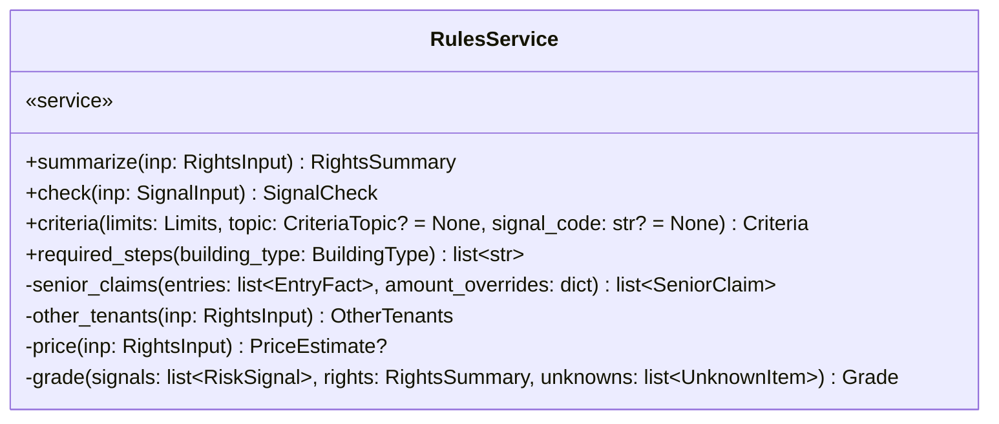

| 메서드 | 부르는 곳 | 유스케이스 |
|---|---|---|
| `summarize` | ReviewService.summarize_and_store (루프 [[JSD-API-002#summarize_rights]] · write_report · override_values) | [[JSD-UC-001#UC-S2]] |
| `check` | ReviewService.check_and_store (루프 [[JSD-API-002#check_signals]] · write_report · override_values) | [[JSD-UC-001#UC-S3]] |
| `criteria` | [[JSD-API-001#GET/api/criteria]] · [[JSD-API-002#get_criteria]] | [[JSD-UC-001#UC-S3]] · [[JSD-UC-001#UC-A3]] |
| `required_steps` | service_agent (write_report 앞) | [[JSD-UC-001#UC-S9]] 4a |

**규칙이 사는 곳**
- 모든 메서드가 같은 입력이면 같은 출력이다. 오늘 날짜도 인자(`today`)로 받는다. 예외를 던지지 않는다 — 모르는 것은 `UnknownItem`으로 남긴다([[JSD-PRD-001#R4]] [[JSD-PRD-001#N3]]). `service.py`·`criteria.py`·`schemas.py`는 `shared` 말고 import하지 않는다
- `summarize`: 말소 항목 제외. 근저당은 채권최고액, 부기 감액이 있으면 감액 후 금액. 전세권·주택임차권은 보증금. 건물·토지 등기부를 모두 더한다. 다가구면 알려 준 보증금 합 + 빈 방 수 × 최우선변제금(`region`의 지역 구분). 가격은 `override_price_manwon`(직접 입력)이 있으면 그것, 없으면 실거래가 → 갑구 1년 안 거래가액 → `user_price_manwon`(대화에서 말한 값) 순이다([[JSD-API-001#GET/api/criteria]] price_order · [[JSD-DOM-001#PriceEstimate]]). 직접 입력과 말한 값의 `price_source`는 user_input이다. 가격이 없으면 비율은 null. `based_on`에 합산에 쓴 `entry_id` 전부. `amount_overrides`가 항목 금액을 덮는다
- `check`: [[JSD-PRD-001#R5]] 신호표 12개를 `criteria.py`의 표대로 적용한다. 신호마다 `entry_ids`가 비지 않는다 — 답변·조회에서 나온 신호는 소유권 항목을 근거로 단다. 조회 실패·무응답·자료 없음은 `UnknownItem`으로 모은다. `untried`의 항목은 reason no_data인 `UnknownItem`이 된다 — 시도하지 않은 필수 항목도 확인 못 함으로 드러낸다([[JSD-UC-001#UC-S9]] 4a1)
- `grade`: 즉시 위험 1개 이상이거나 부채비율 > 0.90이면 danger. 주의 1개 이상이거나 0.70 < 부채비율 ≤ 0.90이거나 주택 가격·소유자가 확인 못 함이면 caution. 나머지는 safe. 확인 못 한 것이 있으면 safe로 올리지 않는다([[JSD-PRD-001#R6]])
- `criteria`: `criteria.py` 상수를 [[JSD-API-001#GET/api/criteria]] 모양으로. `topic`이 있으면 그 부분과 `rule_version`만. 한도는 인자로 받는다 — `rules`가 `core`를 import하지 않기 위해서다
- `required_steps`: [[JSD-PRD-001#R11]] 표의 필수 항목을 `criteria.py`의 검토 항목 코드로 돌려준다 — 공통 항목과 건물 종류별 추가 항목·추가 질문. 도구 이름을 모른다. 어느 호출이 그 항목의 시도인지는 루프의 `STEP_TOOLS`가 정한다(4.2). 오피스텔의 주거용 여부는 건축물대장 주용도로 보고, "주거용 표기" 질문은 `QuestionKind`에 없어 넣지 않았다(7장)

### 4.6 lookup

#### LookupService

다루는 개념 — [[JSD-DOM-001#BuildingLedger]] · [[JSD-DOM-001#DefaulterRecord]] · [[JSD-DOM-001#PriceEstimate]]의 실거래가 후보

```mermaid
classDiagram
    class LookupService {
        «service»
        +price(target: Property, area_m2: float?) PriceLookup
        +building(target: Property) BuildingLedger
        +defaulter(name: str?) DefaulterMatch
        +refresh_defaulters() int
        +load_region_codes(rows: list~RegionCodeRow~) int
        +purge_cache(now: datetime) int
        -region_code(lot_address: str) str
    }
    class DefaulterRecord {
        +int id
        +str name
        +int age
        +str address
        +int debt_manwon
        +str default_period
        +date snapshot_date
    }
    class RegionCode {
        +str code
        +str name
        +bool is_active
    }
    class LookupCache {
        +int id
        +LookupKind kind
        +str key
        +dict payload
        +datetime fetched_at
        +datetime expires_at
    }
    LookupService --> DefaulterRecord
    LookupService --> RegionCode
    LookupService --> LookupCache
```

| 메서드 | 부르는 곳 | 유스케이스 | 던지는 에러 |
|---|---|---|---|
| `price` | service_agent · [[JSD-API-002#lookup_price]] | [[JSD-UC-001#UC-S4]] | no_region_code, no_trades, api_failed |
| `building` | service_agent · [[JSD-API-002#lookup_building]] | [[JSD-UC-001#UC-S5]] | no_region_code, not_found, api_failed |
| `defaulter` | service_agent · [[JSD-API-002#match_defaulter]] | [[JSD-UC-001#UC-S6]] | no_snapshot, no_name |
| `refresh_defaulters` | jobs.py (일 1회) | [[JSD-UC-001#UC-S6]] | |
| `load_region_codes` | jobs.py (배포 때) | [[JSD-UC-001#UC-S4]] | |
| `purge_cache` | jobs.py (시간 1회) | [[JSD-UC-001#UC-S10]] | |

**규칙이 사는 곳**
- `price`: 건물 종류로 국토부 실거래가 API를 고른다 — 아파트 · 연립다세대 · 오피스텔 · 단독다가구. 최근 12개월을 달마다 조회하고 캐시 키는 HMAC(trade, 실거래가 API 종류, 지역 코드, 연월)이다 — 종류가 빠지면 아파트와 연립다세대가 같은 키를 쓴다. 같은 단지(건물명)·유사 면적 매매의 평균과 건수·기간을 낸다. 없으면 no_trades. `source`는 trade_api 하나뿐이고 다음 순서는 `rules`가 정한다
- `building`: 건축HUB 표제부를 법정동코드·번·지로 조회한다. 캐시 키는 HMAC(building, 법정동코드, 번, 지)이고 캐시에는 대지위치·도로명주소를 뺀 응답을 둔다. 동이 여럿이면 `multiple_candidates`. 위반건축물 여부는 돌려주지 않는다(API에 없음)
- `defaulter`: 스냅샷이 비었으면 no_snapshot, 이름이 없으면 no_name. 공백을 뺀 완전 일치. 결과에 이름·공개 항목을 싣지 않는다
- `refresh_defaulters`: 포트로 명단을 끝까지 다 읽은 뒤에만 한 트랜잭션으로 교체한다. 중간에 실패하거나 0건이면 마지막 스냅샷을 그대로 두고 실패로 남긴다 — 페이지 구조가 바뀌면 예외 없이 0건이 오기 쉽다([[JSD-INFRA-001]] 7장)
- `region_code`: `RegionCode.name`과 지번 주소 앞부분의 가장 긴 일치. 없으면 no_region_code
- 바깥 호출은 어댑터 안에서 5초 타임아웃·재시도 1회다([[JSD-PRD-001#R7]] · [[JSD-INFRA-001#C5]]). 실패는 `AppError(api_failed)`로 올라온다

### 4.7 citation

#### CitationService

다루는 개념 — [[JSD-DOM-001#Citation]]

```mermaid
classDiagram
    class CitationService {
        «service»
        +usages(review_id: str, block_id: str) BlockUsages
        +resolve_markers(review_id: str, text: str, used_in: CitationUse, ref: str) CitedText
        +cite(review_id: str, used_in: CitationUse, ref: str, usage_label: str, entry_ids: list~str~) list~Citation~
        +for_messages(review_id: str, message_ids: list~str~) dict
        +for_report(review_id: str) list~CitationRef~
        +clear_report(review_id: str) None
        +delete_for_review(review_id: str) None
    }
    class Citation {
        +int id
        +str review_id
        +CitationUse used_in
        +str ref
        +str key
        +str label
        +str usage_label
        +str document_id
        +list entry_ids
        +list block_ids
        +datetime created_at
    }
    CitationService --> Citation
```

| 메서드 | 부르는 곳 | 유스케이스 | 던지는 에러 |
|---|---|---|---|
| `usages` | [[JSD-API-001#GET/api/reviews/{id}/blocks/{blockId}]] | [[JSD-UC-001#UC-A1]] | not_found |
| `resolve_markers` | service_agent.say · ReportService.write (결론) | [[JSD-UC-001#UC-S9]] · [[JSD-UC-001#UC-S8]] | |
| `cite` | ReportService.write (합산·신호·확인한 것·특약) | [[JSD-UC-001#UC-S8]] | |
| `for_messages` | ReviewService.list_messages · stream | [[JSD-UC-001#UC-A1]] | |
| `for_report` · `clear_report` | ReportService.get · write | [[JSD-UC-001#UC-S8]] | |
| `delete_for_review` | ReviewService.cancel · purge_expired | [[JSD-UC-001#UC-A1]] | |

**규칙이 사는 곳**
- `resolve_markers`: [[JSD-API-002]] 1.4. 표식마다 `RegistryService.entries`로 대조한다. 있는 항목만 남기고, 가리키는 문서가 다르면 문서마다 인용 하나. 키는 문장 안 순서대로 c1 · c2. 남는 항목이 없으면 표식을 지우고 `dropped`를 올린다. 라벨은 첫 항목의 `location_label`
- `cite`: 대조를 통과한 항목이 없으면 빈 목록이다 — 근거 없는 인용을 만들지 않는다
- `clear_report`: `used_in`이 message가 아닌 행(conclusion · rights · signal · checked · clause)을 전부 지운다. `ReportService.write`가 새 인용을 만들기 전에 맨 먼저 부른다 — 이전 의견서의 인용이 남지 않고 새 결론 인용이 지워지지 않는다
- `usages`: `block_ids`에 그 블록이 든 행 전부를 `used_in`·`usage_label`로. signal이면 `signal_code`, message면 `message_id`를 싣는다. 발췌는 `RegistryService.block_excerpt`. 블록이 이 검토 원문에 없으면 not_found
- 인용 행이 진실이다. `Message.citations`와 `Report`의 인용은 응답 때 이 행에서 붙인다(5장 결정 5)

### 4.8 report

#### ReportService

다루는 개념 — [[JSD-DOM-001#Opinion]] · [[JSD-DOM-001#Todo]] · [[JSD-DOM-001#SpecialClause]]

```mermaid
classDiagram
    class ReportService {
        «service»
        +get(review_id: str) Report
        +write(review_id: str, inp: ReportInput, agent_notes: str?, revision_reason: str?) ReportResult
        +exists(review_id: str) bool
        +shareable(review_id: str) Shareable
        +delete_for_review(review_id: str) None
        -pick_todos(inp: ReportInput) list~Todo~
        -pick_clauses(inp: ReportInput) list~SpecialClause~
        -template_sentences(inp: ReportInput) Sentences
    }
    class Opinion {
        +int id
        +str review_id
        +dict body
        +dict subject
        +int revision_no
        +str revision_reason
        +datetime written_at
    }
    ReportService --> Opinion
```

| 메서드 | 부르는 곳 | 유스케이스 | 던지는 에러 |
|---|---|---|---|
| `get` | [[JSD-API-001#GET/api/reviews/{id}/report]] | [[JSD-UC-001#UC-S8]] | not_found |
| `write` | ReviewService.write_report (루프 [[JSD-API-002#write_report]] · override_values) | [[JSD-UC-001#UC-S8]] · [[JSD-UC-001#UC-A1]] 7 | |
| `exists` | ReviewService.get · receive | [[JSD-UC-001#UC-A3]] | |
| `shareable` | ShareService.create | [[JSD-UC-001#UC-A4]] | not_found |
| `delete_for_review` | ReviewService.cancel · purge_expired | [[JSD-UC-001#UC-A1]] | |

**규칙이 사는 곳**
- `write`: 순서가 규칙이다. 등급·신호·합산·확인한 것은 `inp`에서 옮기고 여기서 계산하지 않는다 → 할 일을 `catalog.py`에서 건물 종류·신호·확인 못 함으로 고른다(확인 못 함에서 온 것이 단계 맨 위) → 특약은 표준계약서 1·2 항상, 3은 다가구 또는 체납 미확인, 나머지는 신호별이고 빈칸은 금액·날짜·법인 권리자명으로 채운다([[JSD-UC-001#UC-S8]] 2) → 포트로 결론 한 문장·신호별 설명·물어볼 것 3~5개를 받는다(`inp.use_model`이 false면 부르지 않고, 실패하면 재시도 1회 뒤 `template_sentences`. 어느 쪽이든 `llm_fallback` true) → 문장마다 `factcheck.contradicts`, 다르면 템플릿 문장으로 바꾸고 `corrections`를 올린다 → `CitationService.clear_report`로 이전 의견서의 인용을 지운다 → 결론의 표식은 `resolve_markers`, 합산·신호·확인한 것·특약은 `cite`로 새로 만든다 → `Opinion`을 덮고 `revision_no`를 올린다. 고지 문구는 고정이다. 문장 생성·후검증까지는 트랜잭션 밖이고, `clear_report`부터 `Opinion` 덮기까지는 한 트랜잭션이다 — 중간에 실패해도 이전 판이 인용을 잃지 않는다. `ReportResult`에 새 `revision_no`·`revision_reason`을 싣는다
- `write`가 모델에 주는 것은 `SentenceRequest`뿐이고 돌려주는 것은 `ReportResult`뿐이다. 의견서 전문은 모델에 가지 않는다([[JSD-API-002#write_report]])
- `get`: `body` + `CitationService.for_report`. 없으면 not_found(아직 나오지 않음)
- `shareable`: `body`에서 인용·특약·물어볼 것을 뺀 `Report`와 `subject`. `body`에는 처음부터 개인 이름이 없다 — `ReportInput`의 항목이 가려져 들어오고 문장 생성은 가린 값만 받는다. 이 도메인은 이름 목록을 모르므로 문장은 `privacy.mask_text(text, names=[])`로 주민번호 형태 숫자와 번지·동호수만 한 번 더 지운다

### 4.9 share

#### ShareService

다루는 개념 — [[JSD-DOM-001#SharedOpinion]]

```mermaid
classDiagram
    class ShareService {
        «service»
        +create(review_id: str) ShareLink
        +get(token: str) SharedView
        +purge_expired(now: datetime) int
    }
    class SharedOpinion {
        +int id
        +str token
        +dict report
        +dict subject
        +datetime created_at
        +datetime expires_at
    }
    ShareService --> SharedOpinion
```

| 메서드 | 부르는 곳 | 유스케이스 | 던지는 에러 |
|---|---|---|---|
| `create` | [[JSD-API-001#POST/api/reviews/{id}/shares]] | [[JSD-UC-001#UC-A4]] | not_found |
| `get` | [[JSD-API-001#GET/api/shares/{token}]] | [[JSD-UC-001#UC-A4]] | not_found, gone |
| `purge_expired` | jobs.py (시간 1회) | [[JSD-UC-001#UC-A4]] | |

**규칙이 사는 곳**
- `create`: `ReportService.shareable`만 받는다. 토큰은 추측할 수 없는 랜덤 문자열, 만료는 `LIMITS.share_days`(7일)([[JSD-PRD-001#R14]]). 부를 때마다 새 링크다
- `get`: 만료가 지났거나 내용이 비었으면 gone
- `purge_expired`: 만료 지난 행의 `report`·`subject`를 비운다. 행은 남겨 410을 답한다
- 원본 검토·대화·원문·인용에 닿지 않는다 — 3.2에 그 선이 없다. 공유본 보기 라우트에는 `require_live`가 없다 — 원본 검토가 사라져도 이 행의 `expires_at`까지 산다(5장 결정 7)

### 4.10 sample

#### SampleService

다루는 개념 — [[JSD-DOM-001#SampleCase]]

```mermaid
classDiagram
    class SampleService {
        «service»
        +list() list~SampleCase~
        +file(sample_id: str) Upload
    }
```

| 메서드 | 부르는 곳 | 유스케이스 | 던지는 에러 |
|---|---|---|---|
| `list` | [[JSD-API-001#GET/api/samples]] | [[JSD-UC-001#UC-A2]] | |
| `file` | ReviewService.create · warm_samples | [[JSD-UC-001#UC-A2]] | missing_input |

**규칙이 사는 곳**
- 목록과 기본 조건은 `assets/samples/samples.json`, 파일은 같은 폴더의 PDF다. 읽기만 한다
- 결과를 미리 계산해 두지 않는다. `expected_grade`는 테스트가 쓰는 정답이고 응답에 싣지 않는다([[JSD-DOM-001#SampleCase]] · [[JSD-PRD-001#R2]])

### 4.11 gate — 요청 관문

`gate` 안 함수 열. API가 부르는 서비스가 아니라 `ReviewService`가 검토를 만들기 전·서류를 붙이기 전·검토를 지울 때 부르므로 서비스 클래스를 두지 않는다. 시간축은 [[JSD-UC-001#UC-S10]], 도메인 이름을 둔 이유는 [[JSD-DOM-001]] 5.1.

```
check_file(upload: Upload) -> FileCheck
    형식은 바이트 머리로 판정 — PDF · JPEG · PNG. 10MB 이하
    PDF는 메모리에서 쪽수를 세어 20쪽 이하, 암호가 걸렸으면 거절. 이미지는 1쪽
    어긋나면 AppError invalid_file, field file

take_quota(client_ip: str, file_sha256: str, is_sample: bool, today: date) -> None
    is_sample이거나 file_sha256이 예시 캐시(FileCache.is_sample)면 세지 않는다 (INFRA 5장 · 예시 파일 해시는 제외)
    ip_hash = HMAC(앱 비밀키, ip). 한 문장으로 원자적으로 센다 — 그날 행이 없으면 만들고, used < LIMITS.ip_daily(5)일 때만 1 올린다
    올린 행이 없으면 rate_limited. 동시에 온 두 요청이 같은 마지막 자리를 함께 받지 못한다 (SQL은 6장)

cached_html(file_sha256: str) -> ParsedDocument?
    만료 전 FileCache. billed_pages는 0

remember_html(file_sha256: str, html: str, page_count: int, is_sample: bool) -> None
    예시면 expires_at 없음, 아니면 LIMITS.retention_hours 뒤

forget(file_sha256: str) -> None
    예시가 아닌 FileCache 행을 지운다. 검토 삭제(ReviewService.cancel)가 부른다

purge(now: datetime) -> int
    만료된 FileCache와 어제 이전 IpQuota를 지운다
```

**규칙** — `gate`는 아무 도메인도 부르지 않는다. 검토가 생기기 전에 막을 것은 여기서 막고, 검토가 생긴 뒤의 한도(도구·질문·되묻기)는 `review`가 센다.

### 4.12 core.health

#### HealthService

```mermaid
classDiagram
    class HealthService {
        «service»
        +check() Health
    }
```

| 메서드 | 부르는 곳 | 근거 |
|---|---|---|
| `check` | [[JSD-API-001#GET/health]] (`main.py`) | [[JSD-INFRA-001#C1]] |

**규칙이 사는 곳**
- `check`: DB에 가벼운 질의 한 번. 실패면 status degraded · db fail이고 라우트가 503을 낸다. 모델 호출과 실패율은 보지 않는다(7장)

### 4.13 ports · adapters — 바깥 연동

클래스 명세의 항목이 아니다. 포트 하나에 실제 구현 하나와 테스트 가짜 하나다.

```
review/ports.py
    AgentModel.complete(history: list[dict], tools: list[dict]) -> ModelTurn
review/adapters/openai_agent.py
    OpenAIAgentModel — infra.openai로 함수 호출. 되묻기 단계는 refused 표시를 구조화 출력으로 받는다

registry/ports.py
    DocumentParser.parse(data: bytes, media_type: str) -> ParsedDocument
registry/adapters/upstage.py
    UpstageParser — Document Parse, HTML 출력. 30초 · 재시도 1회. 실패는 parse_failed

lookup/ports.py
    TradeSource.fetch(kind: BuildingType, region_code: str, year_month: str) -> list[Trade]
    LedgerSource.fetch(region_code: str, bun: str, ji: str) -> list[LedgerRow]
    DefaulterSource.fetch_all() -> list[DefaulterRow]
lookup/adapters/data_go_kr.py
    DataGoKrTradeSource · DataGoKrLedgerSource — TradeSource · LedgerSource 구현. 서비스 키 하나 · 5초 · 재시도 1회. 실패는 api_failed
lookup/adapters/hug.py
    HugDefaulterSource — DefaulterSource 구현. 목록 페이지를 끝까지 넘기며 cp949로 읽는다

report/ports.py
    SentenceWriter.write(req: SentenceRequest) -> Sentences
report/adapters/openai_writer.py
    OpenAISentenceWriter — JSON 스키마 구조화 출력. 재시도 1회

infra/openai.py
    client() -> AsyncOpenAI           키 · 모델 ID는 환경 변수 (INFRA C7)
    usage_krw(tokens_in: int, tokens_out: int) -> int   PRICES의 토큰 단가로 원화 환산. 파싱 비용은 parsed_pages × PRICES.parse_page_krw
```

**규칙** — 어댑터는 바깥 형식을 DTO로 바꾸는 데서 끝나고 판단하지 않는다. 로그에는 요청 URL의 키·이름을 남기지 않는다. httpx는 요청마다 전체 URL(서비스 키·번·지 포함)을 INFO로 남기므로 `core/logging.py`가 httpx·httpcore 로거를 WARNING으로 둔다.

### 4.14 shared — 순수 유틸

```
privacy.person_labels(names: list[str]) -> dict[str, str]
    받은 이름(법인이 아닌 것만 온다)을 첫 등장 순서로 개인 A · 개인 B. 같은 이름은 같은 라벨

privacy.mask_text(text: str, names: list[str]) -> str
    아는 이름 → 라벨 또는 ○○ · 주민번호 형태 숫자 삭제 · 번지와 동·호수 삭제. names가 비면 뒤의 둘만 한다(공유본)

privacy.short_region(address: str) -> str
    시군구·동까지

factcheck.amounts(text: str) -> set[int]
    문장 속 금액(억 · 만원)을 만원 정수로 뽑는다. contradicts와 루프의 사실 인자 대조가 같이 쓴다

factcheck.contradicts(text: str, allowed_manwon: set[int], allowed_ratios: set[float], grade: GradeLevel?) -> bool
    문장 속 금액(억 · 만원) · 비율(%) · 등급어를 뽑아 허용 값에 없는 것이 있으면 true

money.format_manwon(amount: int) -> str
    1억 이상 2.1억, 미만 8,000만원 (UI-001 4.1)

types.py
    2.9 열거형 중 두 도메인 이상이 쓰는 것 · 2.8 표에서 자리가 shared인 타입
```

**규칙** — `shared`는 아무것도 import하지 않는다. 로그 필터(`core/logging.py`)는 이름을 모르므로 주민번호 형태만 지운다 — 이름은 처음부터 로그에 넘기지 않는다(ID와 코드만 남긴다). 라이브러리가 남기는 것도 막는다 — httpx·httpcore 로거는 WARNING, DB 엔진은 `hide_parameters`(SQLAlchemy 예외 문자열에는 바인드 값인 권리자·상대방 이름이 실린다). 예외는 `str(exc)`를 로그나 `Error.detail`에 쓰지 않고 예외 종류·`review_id`·에러 코드만 남긴다([[JSD-PRD-001#N1]]).

### 4.15 jobs — 배치 명령

```
python -m app.jobs purge                   시간 1회   ReviewService.purge_expired · ShareService.purge_expired · LookupService.purge_cache · gate.purge
python -m app.jobs refresh_defaulters      일 1회     LookupService.refresh_defaulters
python -m app.jobs load_region_codes FILE  배포 때    법정동코드 CSV를 읽어 LookupService.load_region_codes
python -m app.jobs warm_samples            배포 직후  ReviewService.warm_samples
python -m app.jobs usage_report            일 1회     ReviewService.usage_report → 건당 평균이 LIMITS.cost_krw를 넘으면 경고 로그
```

**규칙** — 명령 하나가 서비스를 부르고 끝난다. 무엇이 주기를 돌릴지는 컴퓨트가 정해진 뒤 인프라 문서가 정한다([[JSD-INFRA-001#C10]]).

## 5. 판단이 필요한 지점

**1. 등기부 파싱을 어디서 하나 — 결정: 업로드 요청 안에서.** `ReviewService.create`·`receive`가 트랜잭션 밖에서 업스테이지를 부르고 결과를 `RegistryExtract`에 저장한다. `read_registry`는 저장된 결과를 읽는다. 파일 바이트가 요청 밖으로 나가지 않으므로 백그라운드 루프의 메모리에도 남지 않고 재시작에도 필요 없다([[JSD-INFRA-001#C2]]). [[JSD-API-001#POST/api/reviews]]의 400 not_registry도 요청 안에서만 답할 수 있다. 대가로 [[JSD-API-002#read_registry]]의 not_registry·parse_failed는 루프에서 나지 않는다 — 업로드 요청이 답한다(4.1 `create`·`receive`).

**2. 등기부 구조화에 모델을 쓰나 — 결정: 쓰지 않는다.** 2026-09-16에 업스테이지 출력을 확인했다. 등기부 표가 요소 id가 붙은 `<table>`로 남아 표에서 결정적으로 읽힌다. 취소선은 남지 않지만 "N번…말소" 행으로 말소를 안다. [[JSD-UC-001#UC-S1]] 3과 [[JSD-INFRA-001]] 4장의 "LLM 구조화"보다 정답표 대조가 쉽고 비용이 없다.

**3. 같은 파일 캐시가 무엇을 캐시하나 — 결정: 업스테이지 HTML까지만.** [[JSD-UC-001#UC-S10]]·[[JSD-UC-001#UC-A1]] 2c와 INFRA 6장 `file_cache`는 검토 기록과 의견서를 재생한다고 적었다. [[JSD-DOM-001#SampleCase]]·[[JSD-UI-001#UI-1]] 규칙·[[JSD-PRD-001#R2]]는 미리 계산한 결과를 재생하지 않는다고 한다. 재생 캐시는 대화·의견서를 보관 기간보다 오래 붙들어야 하기도 하다. 파싱 캐시는 둘을 다 지킨다 — 비용이 큰 파싱은 아끼고 에이전트는 매번 돈다. 캐시 HTML에도 소유자 이름이 있으므로 검토를 지우면 그 파일의 캐시도 함께 지운다(`gate.forget`).

**4. 보관 기간 — 결정: 검토에 딸린 것은 모두 24시간, 공유본은 7일.** 대화·질문·차례·등기부·항목·인용·의견서가 한 번에 사라지고 `Review` 행만 내용을 비운 채 expired로 남아 410을 답한다. INFRA 6장의 세션·이벤트·의견서 30일은 따르지 않는다 — 인용은 원문과 함께 사라져야 하고([[JSD-DOM-001#Citation]]) 원문 없이 남은 대화는 죽은 인용 칩만 남긴다. `UsageLog`만 기한이 없다(개인정보 없음).

**5. 인용을 어디에 두나 — 결정: `Citation` 행 하나가 진실.** `ReviewRecord`·`Opinion`에는 인용을 싣지 않고 응답 때 붙인다. 역방향 조회([[JSD-API-001#GET/api/reviews/{id}/blocks/{blockId}]])가 같은 행을 읽으므로 두 방향이 어긋날 수 없다.

**6. 루프를 누가 띄우나 — 결정: 라우터가 BackgroundTasks로.** 루프는 `ReviewService.ask`·`record`를 부른다. `ReviewService`가 루프를 띄우면 `service.py`와 `service_agent.py`가 서로 import한다. 라우터가 응답 뒤에 띄우면 import가 한 방향이다. 모델 포트도 라우터가 넘긴다(`run_review(review_id, model)`) — 루프가 어댑터를 import하지 않고 테스트가 가짜 모델을 넣는 자리다.

**7. 다른 도메인 라우터의 404·410 — 결정: `main.py`가 검토 경로 라우터에만 공통 의존성으로 건다.** registry·citation·report의 라우터와 share의 검토 경로 라우터(`POST /api/reviews/{id}/shares`)는 `ReviewService.require_live`를 의존성으로 달고 등록된다. 그 도메인들은 `review`를 import하지 않고 판정은 한 곳에 있다. 공유본 보기(`GET /api/shares/{token}`)는 share의 다른 라우터라 이 의존성이 없고 `SharedOpinion` 행의 만료만 본다 — 원본이 24시간 뒤 사라져도 공유본은 7일 산다([[JSD-UI-001#UI-5]] · [[JSD-PRD-001#R14]]). 검토가 지워진 뒤 남은 `Review` 행이 검토 경로 판정의 근거다(결정 4).

**8. 업로드가 디스크에 닿는 길 — 결정: 스풀 크기를 올리고 폼을 읽기 전에 막는다.** 설치된 Starlette 1.6.0의 multipart 파서는 파일 부분을 `SpooledTemporaryFile(max_size=spool_max_size)`에 받고 기본값이 1MB다(`starlette/formparsers.py` 147행·230행). 1MB를 넘는 PDF는 임시 파일로 디스크에 쓰이고, 명세 검증기는 이것을 알 수 없다. `main.py`가 `MultiPartParser.spool_max_size`를 파일 한도보다 크게 두고, 업로드 라우트는 `Content-Length`가 없거나 한도를 넘으면 폼을 읽기 전에 invalid_file로 끊는다([[JSD-PRD-001#N1]]).

**9. 같은 이름의 DTO와 ORM — 결정: DTO가 API 이름을 갖고 ORM은 코드에서 `…Row`.** `Citation`·`Question`·`RegistryEntry`가 겹친다. 이 문서의 엔티티 헤딩과 테이블 이름은 도메인 개념 이름을 따르고, 코드의 ORM 클래스만 `CitationRow`·`QuestionRow`·`RegistryEntryRow`로 쓴다.

**10. 되묻기에서 사용자 말의 종류 — 지금 설계: role user · kind say.** [[JSD-API-001]] 4.1의 `kind`에는 ask가 없고 answer는 질문의 답이다. 도메인 모델 미결사항이 열려 있어 7장에도 남긴다.

**11. 검토에 딸린 행의 `review_id`를 외래키로 거나 — 결정: 건다, on delete cascade (2026-09-17).** 2장 머리의 "도메인을 넘으면 ID 열로만"은 코드 import와 다이어그램의 규칙이고, DB에서는 `RegistryExtract`·`Citation`·`Opinion`도 `reviews`에 외래키를 건다. 이 셋은 검토보다 오래 살 이유가 없고, 서비스가 지우는 길(`cancel`·`purge_expired`) 밖에서 행이 지워져도 개인정보가 고아로 남지 않는다. 등기부를 가리키는 `document_id`·`entry_ids`·`block_ids`와 기한이 없는 `UsageLog.review_id`는 여전히 외래키가 아니다([[JSD-DOM-003]] 4장 1).

**12. 조회 캐시 키 — 결정: HMAC (2026-09-17).** 건축물대장 조회 인자(번·지)는 `lot_address`와 같은 정보다. 원문 키로 두면 검토를 지워도 24시간 남아 [[JSD-API-001]] 삭제의 "즉시 지운다"에 들지 않는다. 검토 삭제 때 캐시를 함께 지우는 안은 여러 검토가 같은 키를 써 삭제 흐름이 늘어난다. 키를 앱 비밀키로 HMAC하고 응답에서 주소 필드를 빼면 개인정보가 남지 않고 삭제 흐름은 그대로다. `IpQuota.ip_hash`와 같은 비밀키를 쓴다.

---

## 6. 부록: FastAPI·SQLAlchemy 구현 형태

본문은 언어 중립이다. 이 절만 스택에 묶인다.

**모델**: SQLAlchemy 2 declarative + asyncpg. 열거형은 `str` 컬럼과 파이썬 `StrEnum`. `dict`는 JSONB, `list`는 JSONB 배열. 바깥에 보이는 ID는 `str` UUID 기본키. ORM 클래스 이름은 5장 결정 9의 셋 말고는 2장 헤딩 그대로다.

**세션**: 요청마다 하나. 루프는 단계마다 짧은 세션을 열고 닫는다 — 질문을 기다리는 5분 동안 세션을 붙들지 않는다. 업로드의 업스테이지 호출은 세션 밖이다(4.1 `create`).

**루프**: `BackgroundTasks`로 띄운 코루틴. 조회 도구의 병렬 호출은 `asyncio.gather`로 `LookupService` 호출만 모으고 호출마다 세션을 따로 연다(`AsyncSession`은 동시에 쓸 수 없다). `facts` 저장은 gather가 끝난 뒤 순서대로. 프로세스 하나 전제.

**스트림**: `sse-starlette`의 `EventSourceResponse`. 이벤트 `id`는 메시지 `seq`.

**포트**: `typing.Protocol`. 서비스 생성자 인자의 기본값이 어댑터다.

```python
class DocumentParser(Protocol):
    async def parse(self, data: bytes, media_type: str) -> ParsedDocument: ...
```

**업로드**: `UploadFile.read()`로 메모리에 올린 바이트만 쓴다. 스풀 크기는 5장 결정 8.

**엔진과 로그**: `create_async_engine(url, hide_parameters=True)`. `logging.getLogger("httpx")`·`logging.getLogger("httpcore")`는 `WARNING`.

**IP 한도**: `INSERT INTO ip_quotas (ip_hash, day, used) VALUES (:h, :d, 1) ON CONFLICT (ip_hash, day) DO UPDATE SET used = ip_quotas.used + 1 WHERE ip_quotas.used < :limit RETURNING used` — 행이 돌아오지 않으면 rate_limited.

**마이그레이션**: Alembic. 법정동코드 적재는 마이그레이션이 아니라 `jobs.py load_region_codes`.

---

## 7. 미결사항

- [ ] [[JSD-DOM-001]] 개정 선행 — 이 문서는 `FollowUpTurn`·`Citation` 카드와 5.1 코드 도메인·5.2 도메인 사이 절이 들어간 개정판에 기댄다. 지금 저장된 도메인 모델(개념 25개)에는 없어 `#FollowUpTurn`·`#Citation` 링크 7곳이 없는 참조로 보이고 승인이 막힌다. 도메인 모델 개정을 먼저 저장한다
- [ ] ERD·DD — 테이블 이름은 글자로만 적었다. 참조는 아래에서 위로만 적으므로 ERD·DD 문서가 이 문서의 엔티티를 가리킨다
- [ ] API-001 되먹임 — [[JSD-API-001#GET/api/reviews/{id}]]의 `subject.counterparty_name`은 1장 "개인정보는 응답에 넣지 않는다"와 어긋나고 [[JSD-UI-001#UI-2]] 상단 바도 쓰지 않는다. `ReviewView`에서 뺐다
- [ ] INFRA-001 되먹임 — INFRA 6장의 테이블 이름(`review_sessions` 등)은 ERD·DD에서 개념 이름으로 바뀐다
- [ ] 만료된(expired) `Review` 행과 비운 공유본 행을 언제 지울지
- [ ] 되묻기 횟수 한도 `LIMITS.asks`의 값 — [[JSD-API-001]]·[[JSD-API-002]] 미결과 같다. 정하기 전까지 되묻기와 값 수정은 LLM 비용 한도(`llm_cost_krw`)로만 막힌다
- [ ] 등기부가 아닌 파일도 IP 한도 한 건으로 센다 — 한도를 파싱 전에 세야 한도를 넘은 요청이 업스테이지 비용을 내지 않는다(4.1 `create`). 맞는지
- [ ] 오피스텔 "주거용 표기" 추가 질문([[JSD-PRD-001#R11]]) — `QuestionKind`에 없어 필수 항목에 넣지 않았고 주거용 여부는 건축물대장 주용도로만 본다
- [ ] 되묻기에서 사용자 말의 메시지 종류(5장 결정 10)와 의견서 전 되묻기(지금은 wrong_state) — 도메인 모델 미결사항과 함께
- [ ] 되묻기 거절을 서버가 아는 방법 — 모델 차례의 `refused` 표시(구조화 출력)로 받는다고 적었다. Terra가 도구 호출과 함께 이 표시를 지키는지 확인한다
- [ ] `delta` 스트림 이벤트 — 지금 `stream`은 DB에 쌓인 것만 보낸다. 넣으려면 루프와 스트림 사이에 프로세스 안 전달 통로가 하나 더 필요하다([[JSD-API-001]] 미결)
- [ ] 루프가 도는 중 프로세스가 재시작되면 running·waiting_user 검토가 멈춘 채 남는다 — 기동 때 failed로 닫을지
- [ ] [[JSD-API-001#POST/api/reviews/{id}/messages]]의 question_limit(409) — 사용자 발화가 질문 한도에 걸리는 경우를 찾지 못했다
- [ ] 실거래가 "유사 면적"의 기준과 평균·중앙값
- [ ] HUG 명단 페이지의 실제 열 — `DefaulterRecord` 속성은 도메인 모델의 공개 항목 기준이다. 일치할 때 공개 항목을 의견서 화면에 보일지([[JSD-API-002]] 미결)도 함께
- [ ] 공유 소유자(여럿)일 때 `RegistryService.owner`와 소유자 일치 — 도메인 모델 미결사항
- [ ] 헬스체크 범위 — INFRA 7·8장은 모델 호출 1회와 최근 실패율을 적었고 [[JSD-API-001#GET/health]]는 DB만 답한다. 지금 설계는 API를 따랐다
- [ ] 예시 등기부 내려받기([[JSD-PRD-001#R2]], [[JSD-UC-001#UC-A2]] 최소 보장) — [[JSD-API-001]]에 경로가 없다. 정적 파일로 둘지
- [ ] 배치 명령을 무엇이 주기적으로 돌릴지 — Azure 컴퓨트 결정 뒤([[JSD-INFRA-001#C10]])
