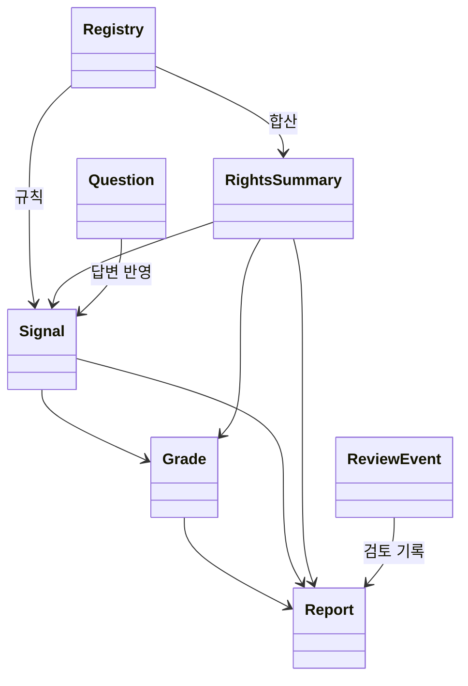
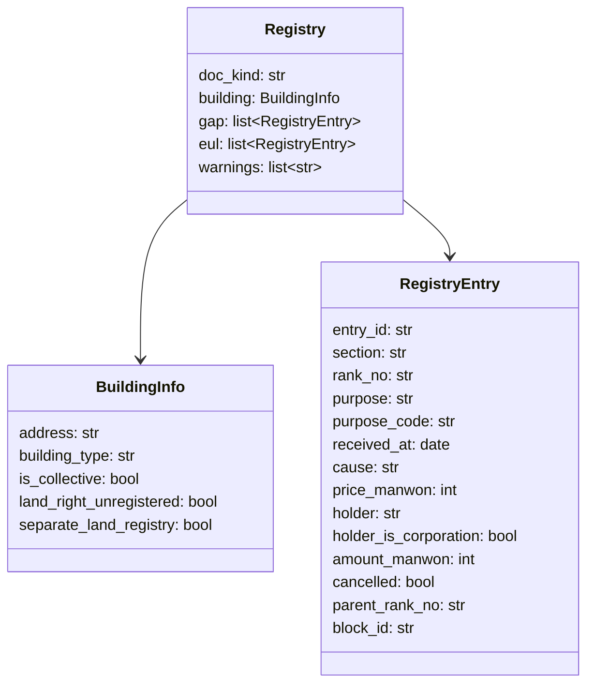
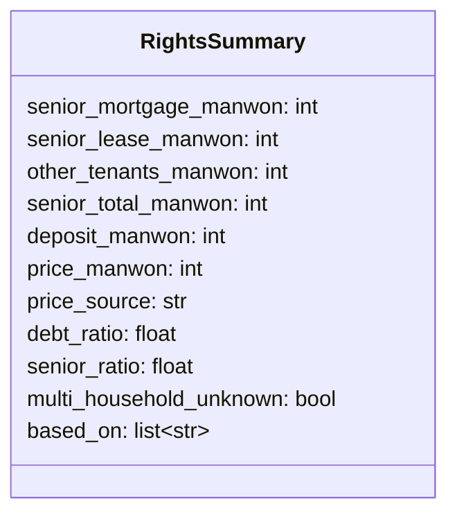
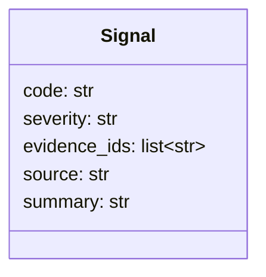
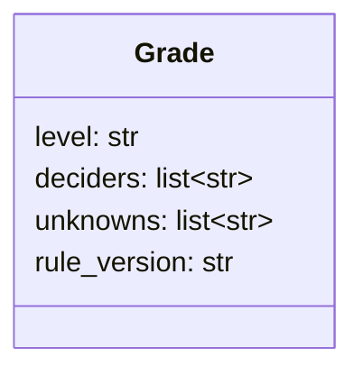
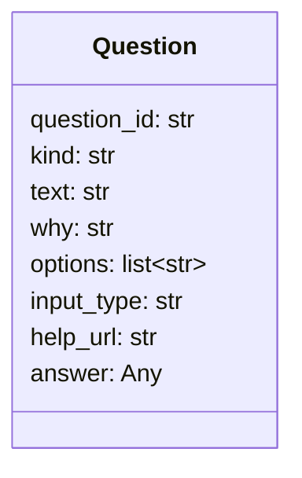
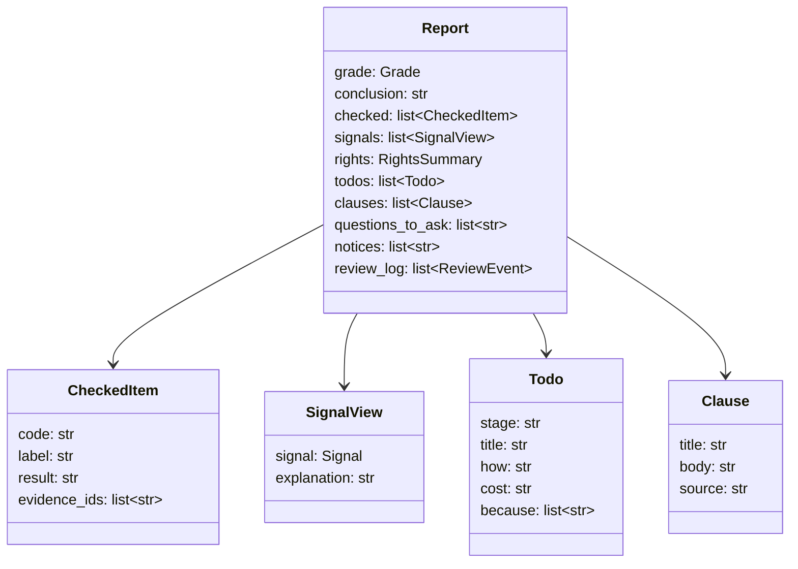
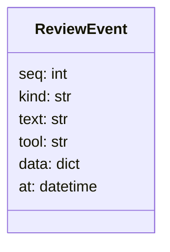

# 클래스 명세

## 0. 이 문서가 다루는 것

도구 사이를 오가는 값 객체(DTO) 7개. Pydantic 모델로 `app/domain/dto.py` 한 곳에만 둔다. 테이블은 [[JSD-DOM-001]], 함수는 MS. **내부 타입 정의는 이 문서가 유일하다** — 다른 문서는 참조만 한다.

## 1. 개념 식별

| 클래스 | 만드는 도구 | 쓰는 도구 |
|---|---|---|
| Registry | 등기부 읽기 | 권리 합산, 신호 검사, 의견서 |
| RightsSummary | 권리 합산 | 신호 검사, 등급, 의견서 |
| Signal | 신호 검사 | 등급, 의견서 |
| Grade | 등급 판정 | 의견서, 화면 |
| Question | 사용자에게 묻기 | 화면, 에이전트 |
| Report | 의견서 작성 | 화면, PDF, 공유 |
| ReviewEvent | 에이전트 루프 | 화면(SSE), 의견서 검토 기록 |

## 2. 개념 모델

## 3. 개념별 정리

#### Registry 등기부 구조

| 필드 | 설명 |
|---|---|
| doc_kind | `building` / `land` / `collective` |
| building_type | `apartment` / `multi_family_unit`(다세대·연립) / `multi_household`(다가구·단독) / `officetel` / `other` |
| section | `gap`(갑구) / `eul`(을구) |
| purpose | 등기목적 원문. purpose_code는 정규화 토큰: `ownership_preserve` / `ownership_transfer` / `mortgage` / `mortgage_change` / `lease_right`(전세권) / `housing_lease`(주택임차권) / `seizure`(압류·가압류) / `injunction`(가처분) / `provisional`(가등기) / `auction` / `trust` / `notice`(예고등기) / `cancellation` / `other` |
| amount_manwon | 채권최고액·전세금·임차보증금 (만원). 없으면 null |
| price_manwon | 갑구 거래가액 (만원). 없으면 null |
| cancelled | 말소 여부. 합산·신호에서 제외 |
| parent_rank_no | 부기등기(1-1)의 주등기 순위. 감액 변경은 주등기 금액을 덮어씀 |
| block_id | 파싱 HTML의 블록 ID. 근거 하이라이트 앵커. **비어 있으면 안 됨** |
| warnings | 추출 실패 필드, 판정 못 한 건물 종류 등 |

판정 근거: [[JSD-PRD-001#R3]] [[JSD-UC-001#UC-S1]].

#### RightsSummary 권리 합산

| 필드 | 설명 |
|---|---|
| senior_mortgage_manwon | 말소 제외 근저당 채권최고액 합 (건물 + 토지) |
| senior_lease_manwon | 전세권 전세금 합 |
| other_tenants_manwon | 다가구 기존 세입자 보증금(답변) + 빈 방 × 지역 최우선변제금 |
| senior_total_manwon | 위 셋의 합 |
| price_manwon / price_source | 주택 가격과 출처 `trade_api` / `registry_sale` / `user_input`. 없으면 null |
| debt_ratio | (senior_total + deposit) ÷ price. price 없으면 null |
| senior_ratio | senior_total ÷ price |
| multi_household_unknown | 다가구인데 세입자 답변 없음 |
| based_on | 계산에 쓴 entry_id·answer_id |

판정 근거: [[JSD-PRD-001#R4]].

#### Signal 위험 신호

| 필드 | 설명 |
|---|---|
| code | `encumbrance` / `trust` / `lease_registration` / `owner_mismatch` / `defaulter_match` / `illegal_building` / `land_right_issue` / `recent_mortgage` / `frequent_transfer` / `corporate_owner` / `senior_excess` / `multi_household_unknown` |
| severity | `danger`(즉시 위험) / `caution`(주의) |
| evidence_ids | 근거 entry_id 또는 answer_id. **빈 목록 금지** |
| source | 공식 기준 출처 문자열 (예: "LH 전세임대 권리분석 기준", "HUG 반환보증 상품개요") |
| summary | 규칙이 만든 한 줄. LLM 아님 |

판정 근거: [[JSD-PRD-001#R5]].

#### Grade 등급

| 필드 | 설명 |
|---|---|
| level | `safe` / `caution` / `danger` |
| deciders | 등급을 결정한 Signal.code 또는 `debt_ratio` |
| unknowns | 확인 못 한 항목 code (`price`, `owner`, `illegal_building`, `tenants`, `defaulter` …) |
| rule_version | 규칙표 기준일 (예: `2026-09-15`) |

판정 근거: [[JSD-PRD-001#R6]].

#### Question 질문

| 필드 | 설명 |
|---|---|
| kind | `illegal_building` / `price` / `tenants` / `proxy` / `owner_type` / `land_registry` / `other` |
| input_type | `choice` / `number` / `text` / `file` |
| options | 선택지. choice일 때만 |
| answer | 답. `"unknown"`이면 건너뜀. 파일이면 새 review_documents id |

판정 근거: [[JSD-PRD-001#R8]].

#### Report 의견서

| 필드 | 설명 |
|---|---|
| conclusion | 한 문장. LLM 생성 후 후검증 (숫자·등급 일치) |
| checked[].result | `ok` / `unknown` / `n_a` |
| signals[].explanation | 쉬운 설명. LLM |
| todos[].stage | `before` / `signing` / `balance` / `after` |
| todos[].because | 이 할 일을 넣은 Signal.code 또는 unknown code |
| clauses[].source | `standard_1` … `standard_3` / `mortgage_release` / `insurance_condition` / `owner_change_notice` / `tax_consent` |
| notices | 고정 문구 3개 (AI 생성, 전문가 확인, 기준 출처) |

판정 근거: [[JSD-PRD-001#R9]].

#### ReviewEvent 검토 이벤트

| 필드 | 설명 |
|---|---|
| kind | `thought` / `tool_call` / `tool_result` / `question` / `answer` / `report` / `error` |
| text | 사람이 읽는 한 줄. 서버가 만든다 |
| data | 도구 입출력 요약. 이름·주민번호·상세주소 제거 |

판정 근거: [[JSD-PRD-001#R12]].

## 4. 경계

- `rules`는 Registry·RightsSummary·Signal·Grade만 안다. Question의 answer는 `rules`에 들어가기 전에 `review`가 단순 값(bool·int·str)으로 풀어 넘긴다.
- `report`는 Report를 만들 때 Grade·RightsSummary를 그대로 넣고, 후검증에서 그 값과 문장을 대조한다.
- 화면은 DTO를 그대로 JSON으로 받는다. 클라이언트 재계산 금지.

## 5. 미결사항

- [ ] `purpose_code` 목록 완전성 — 실제 등기부 샘플로 검증
- [ ] `answer`가 파일일 때의 타입 (document id 문자열로 통일 예정)
- [ ] `Todo.cost`를 문자열로 둘지 숫자+단위로 둘지
