# 클래스 명세

## 0. 이 문서가 다루는 것

폴더 구조, 엔티티(테이블에 대응하는 모델), 설계 클래스(서비스 10개), 의존 관계, DTO 7개. 테이블 정의는 [[JSD-DOM-001]], 함수 시그니처는 MS. **내부 타입(DTO) 정의는 이 문서 5절이 유일하다** — 다른 문서는 참조만 한다.

## 1. 폴더 구조

fastapi-domain-architecture 규칙을 따른다. 도메인 폴더마다 `router.py`(HTTP 입출력) · `schemas.py`(요청/응답 Pydantic) · `service.py`(비즈니스 로직·트랜잭션) · `crud.py`(DB 접근) · `models.py`(ORM). 호출은 router → service → crud 한 방향. 외부 연동 래퍼는 `infra/`.

```
app/
  main.py                 FastAPI 앱, 라우터 등록, web/dist 정적 서빙
  config.py               env 설정(OPENAI_MODEL, UPSTAGE_API_KEY, DATA_GO_KR_KEY, DATABASE_URL) + 한도·단가 상수
  domain/
    dto.py                DTO 7개 (5절) — 유일한 정의처
    rules_const.py        규칙표 상수: 경계·신호·필수 검토·가격 순서·최우선변제금·기준일·출처
    todo_const.py         단계별 할 일 규칙표 (RFQ Q37)
    clause_const.py       특약 템플릿 (표준 1~3 원문 + 4종)
  domains/
    review/   router·schemas·service·crud·models   세션·루프·이벤트 → ReviewService, AgentLoop(service 안)
    registry/ service·crud·models                   파싱·구조화 → RegistryService
    rules/    service                               합산·신호·등급 → RulesService (순수, models 없음)
    lookup/   service·crud·models                   시세·대장·명단 → LookupService
    report/   router·schemas·service·crud·models   의견서·특약·공유 → ReportService, ShareService
    gate/     service·crud·models                   검사·캐시·한도·비용 → GateService
    health/   router·service                        헬스체크 → HealthService
  infra/
    db.py                 async 엔진·세션·Base
    models_all.py         Alembic용 모델 일괄 import (다른 코드는 쓰지 않음)
    logging.py            JSON 로그 + PII 필터(scrub_pii)
    openai_client.py      OpenAI 래퍼 (타임아웃·재시도·토큰→원화)
    upstage_client.py     Document Parse 래퍼 (html + elements[id,page,coordinates])
    datago_client.py      공공데이터포털 래퍼 (XML/JSON)
    sse.py                이벤트 큐·SSE (B3)
migrations/               Alembic (versions/4d02cbc915e3 초기 9테이블)
web/                      React 18 + TS + Vite + Tailwind (UI-1~5). 빌드 산출물 web/dist
assets/samples/           예시 등기부 PDF 3건
tests/                    pytest (rules·registry·review·lookup·report·api)
docker-compose.yml        app + db(postgres:16). dev 호스트 포트 55432
Dockerfile                node 빌드 → python 3.12 + uv
```

## 2. 엔티티

SQLAlchemy 모델. 컬럼은 [[JSD-DOM-001]]의 DD를 그대로 따른다.

| 엔티티 | 테이블 | 소유 도메인 |
|---|---|---|
| ReviewSession | [[JSD-DOM-001#review_sessions]] | review |
| ReviewDocument | [[JSD-DOM-001#review_documents]] | registry |
| ReviewEvent(ORM) | [[JSD-DOM-001#review_events]] | review |
| ReportRow | [[JSD-DOM-001#reports]] | report |
| Share | [[JSD-DOM-001#shares]] | report |
| FileCache | [[JSD-DOM-001#file_cache]] | gate |
| LookupCache | [[JSD-DOM-001#lookup_cache]] | lookup |
| HugDefaulter | [[JSD-DOM-001#hug_defaulters]] | lookup |
| UsageLog | [[JSD-DOM-001#usage_log]] | gate |

엔티티는 DB 경계 안에서만 쓰고, 도메인 사이에는 DTO(5절)로 넘긴다.

## 3. 설계 클래스

#### ReviewService 검토 세션

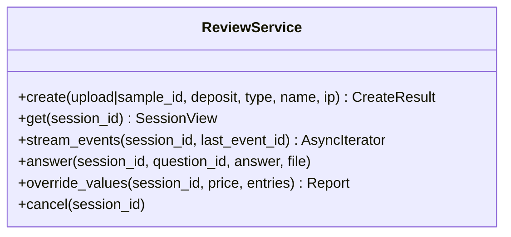

책임: 세션 생명주기, 루프 시작·재개·중단, SSE 스트림(실시간·재생). 근거: [[JSD-UC-001#UC-A1]] [[JSD-UC-001#UC-A3]].

#### AgentLoop 에이전트 루프

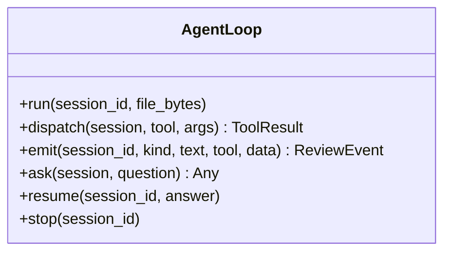

책임: 판단(LLM) → 도구 → 관찰 반복, 한도·순서 규칙, 이벤트 기록. 도구 실행은 다른 서비스에 위임. 근거: [[JSD-UC-001#UC-S9]].

#### RegistryService 등기부

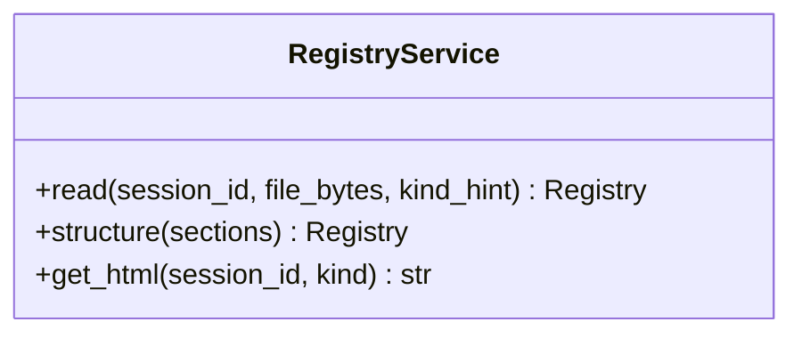

책임: 파싱(업스테이지) → 구간 분리 → 구조화(LLM) → 후처리(말소·부기·정규화) → 저장. 근거: [[JSD-UC-001#UC-S1]].

#### RulesService 규칙 (순수)

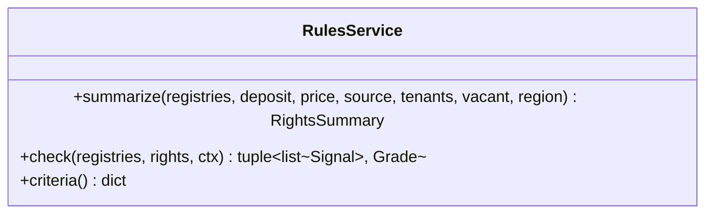

책임: 합산·신호·등급. **DB·LLM·네트워크 없음.** 상수는 `domain/rules_const.py`. 근거: [[JSD-PRD-001#R4]] [[JSD-PRD-001#R5]] [[JSD-PRD-001#R6]].

#### LookupService 외부 조회

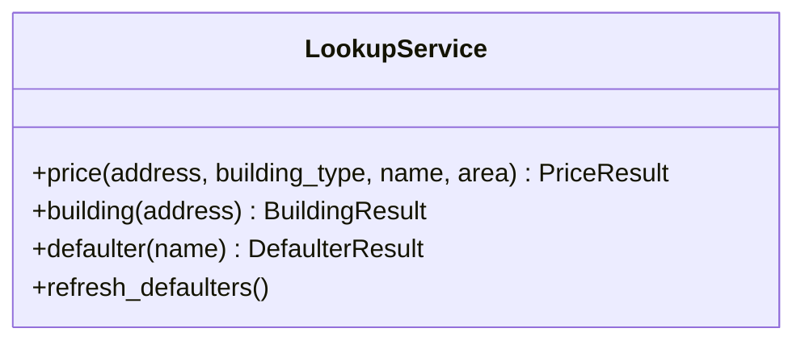

책임: 캐시 → 외부 호출(타임아웃·재시도) → 캐시. 명단 스냅샷 갱신. 근거: [[JSD-UC-001#UC-S4]] [[JSD-UC-001#UC-S5]] [[JSD-UC-001#UC-S6]].

#### ReportService 의견서

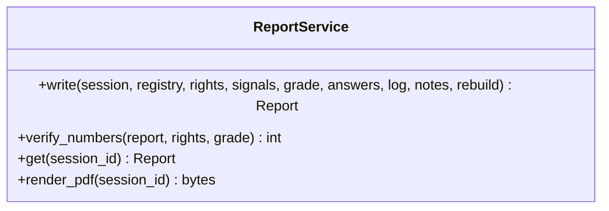

책임: 할 일·특약 선택(규칙), 문장 생성(LLM), 후검증, 저장, PDF. 근거: [[JSD-UC-001#UC-S8]].

#### ShareService 공유

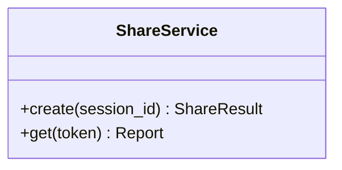

책임: 마스킹, 토큰, 만료. 근거: [[JSD-UC-001#UC-A4]].

#### GateService 게이트

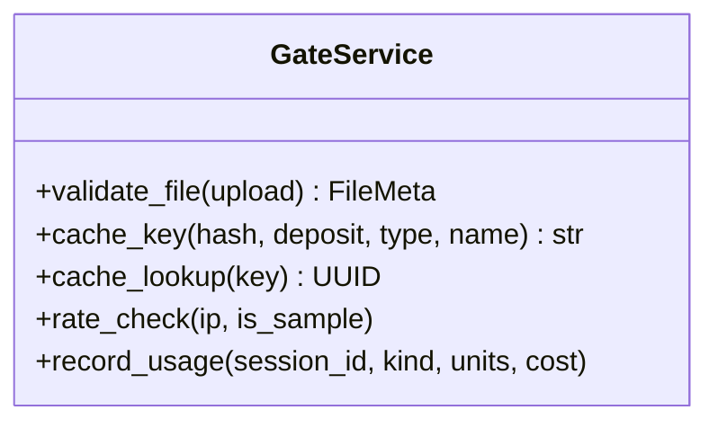

책임: 검사·캐시·한도·비용. 근거: [[JSD-UC-001#UC-S10]].

#### SampleService 예시

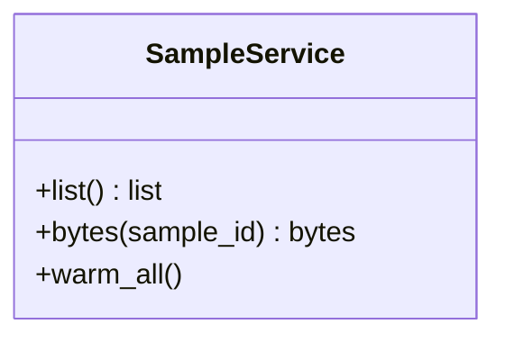

책임: `assets/samples/` 목록·바이트·배포 후 워밍. 근거: [[JSD-UC-001#UC-A2]].

#### HealthService 헬스

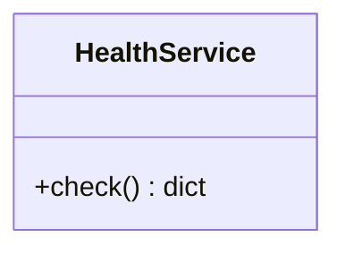

책임: DB 연결, 최근 실패율. 근거: [[JSD-INFRA-001#C1]].

## 4. 의존 관계

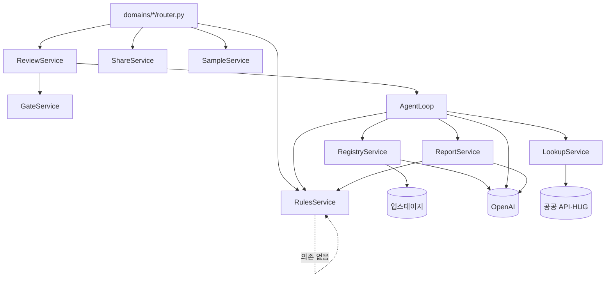

규칙: `rules`는 아무것도 import하지 않는다(DTO 제외). `review`만 여러 도메인을 조립한다. `router`는 `service`만 부르고 `crud`를 모른다.

## 5. DTO

도구 사이를 오가는 값 객체. Pydantic 모델로 `app/domain/dto.py` 한 곳에만 둔다.

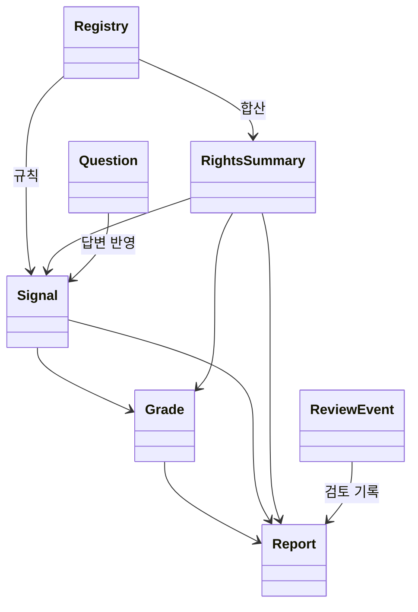

#### Registry 등기부 구조

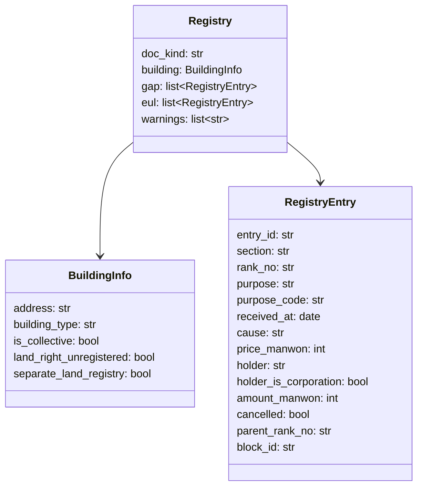

| 필드 | 설명 |
|---|---|
| doc_kind | `building` / `land` / `collective` |
| building_type | `apartment` / `multi_family_unit`(다세대·연립) / `multi_household`(다가구·단독) / `officetel` / `other` |
| section | `gap`(갑구) / `eul`(을구) |
| purpose | 등기목적 원문. purpose_code는 정규화 토큰: `ownership_preserve` / `ownership_transfer` / `mortgage` / `mortgage_change` / `lease_right`(전세권) / `housing_lease`(주택임차권) / `seizure`(압류·가압류) / `injunction`(가처분) / `provisional`(가등기) / `auction` / `trust` / `notice`(예고등기) / `cancellation` / `other` |
| amount_manwon | 채권최고액·전세금·임차보증금 (만원). 없으면 null |
| price_manwon | 갑구 거래가액 (만원). 없으면 null |
| cancelled | 말소 여부. 합산·신호에서 제외 |
| parent_rank_no | 부기등기(1-1)의 주등기 순위. 감액 변경은 주등기 금액을 덮어씀 |
| block_id | 파싱 HTML의 요소 `id` 속성 (업스테이지 elements[].id). 근거 하이라이트 앵커. **비어 있으면 안 됨** |
| warnings | 추출 실패 필드, 판정 못 한 건물 종류 등 |

판정 근거: [[JSD-PRD-001#R3]] [[JSD-UC-001#UC-S1]].

#### RightsSummary 권리 합산

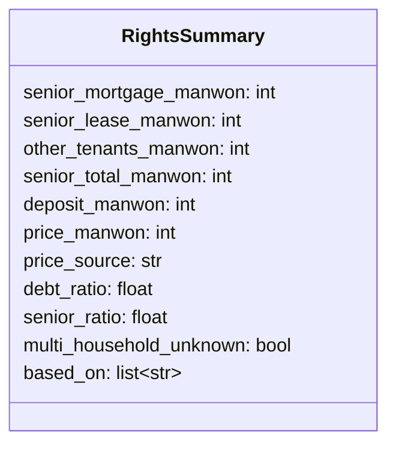

| 필드 | 설명 |
|---|---|
| senior_mortgage_manwon | 말소 제외 근저당 채권최고액 합 (건물 + 토지) |
| senior_lease_manwon | 전세권 전세금 합 |
| other_tenants_manwon | 다가구 기존 세입자 보증금(답변) + 빈 방 × 지역 최우선변제금 |
| senior_total_manwon | 위 셋의 합 |
| price_manwon / price_source | 주택 가격과 출처 `trade_api` / `registry_sale` / `user_input`. 없으면 null |
| debt_ratio | (senior_total + deposit) ÷ price. price 없으면 null |
| senior_ratio | senior_total ÷ price |
| multi_household_unknown | 다가구인데 세입자 답변 없음 |
| based_on | 계산에 쓴 entry_id·answer_id |

판정 근거: [[JSD-PRD-001#R4]].

#### Signal 위험 신호

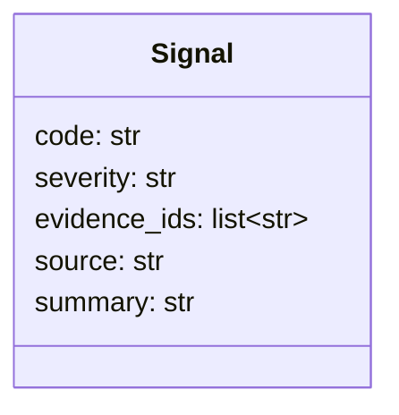

| 필드 | 설명 |
|---|---|
| code | `encumbrance` / `trust` / `lease_registration` / `owner_mismatch` / `defaulter_match` / `illegal_building` / `land_right_issue` / `recent_mortgage` / `frequent_transfer` / `corporate_owner` / `senior_excess` / `multi_household_unknown` |
| severity | `danger`(즉시 위험) / `caution`(주의) |
| evidence_ids | 근거 entry_id 또는 answer_id. **빈 목록 금지** |
| source | 공식 기준 출처 문자열 (예: "LH 전세임대 권리분석 기준", "HUG 반환보증 상품개요") |
| summary | 규칙이 만든 한 줄. LLM 아님 |

판정 근거: [[JSD-PRD-001#R5]].

#### Grade 등급

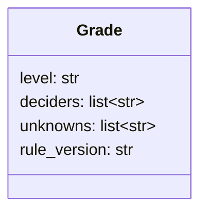

| 필드 | 설명 |
|---|---|
| level | `safe` / `caution` / `danger` |
| deciders | 등급을 결정한 Signal.code 또는 `debt_ratio` |
| unknowns | 확인 못 한 항목 code (`price`, `owner`, `illegal_building`, `tenants`, `defaulter` …) |
| rule_version | 규칙표 기준일 (예: `2026-09-15`) |

판정 근거: [[JSD-PRD-001#R6]].

#### Question 질문

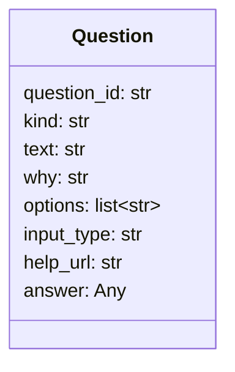

| 필드 | 설명 |
|---|---|
| kind | `illegal_building` / `price` / `tenants` / `proxy` / `owner_type` / `land_registry` / `other` |
| input_type | `choice` / `number` / `text` / `file` |
| options | 선택지. choice일 때만 |
| answer | 답. `"unknown"`이면 건너뜀. 파일이면 새 review_documents id |

판정 근거: [[JSD-PRD-001#R8]].

#### Report 의견서

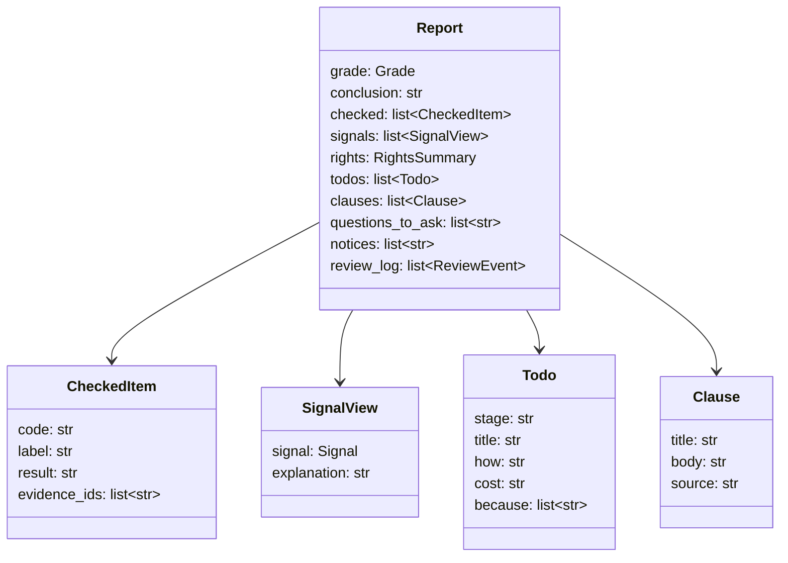

| 필드 | 설명 |
|---|---|
| conclusion | 한 문장. LLM 생성 후 후검증 (숫자·등급 일치) |
| checked[].result | `ok` / `unknown` / `n_a` |
| signals[].explanation | 쉬운 설명. LLM |
| todos[].stage | `before` / `signing` / `balance` / `after` |
| todos[].because | 이 할 일을 넣은 Signal.code 또는 unknown code |
| clauses[].source | `standard_1` … `standard_3` / `mortgage_release` / `insurance_condition` / `owner_change_notice` / `tax_consent` |
| notices | 고정 문구 3개 (AI 생성, 전문가 확인, 기준 출처) |

판정 근거: [[JSD-PRD-001#R9]].

#### ReviewEvent 검토 이벤트

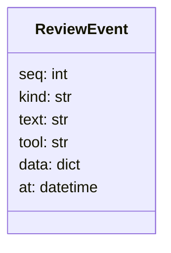

| 필드 | 설명 |
|---|---|
| kind | `thought` / `tool_call` / `tool_result` / `question` / `answer` / `report` / `error` |
| text | 사람이 읽는 한 줄. 서버가 만든다 |
| data | 도구 입출력 요약. 이름·주민번호·상세주소 제거 |

판정 근거: [[JSD-PRD-001#R12]].

## 6. 경계

- `rules`는 Registry·RightsSummary·Signal·Grade만 안다. Question의 answer는 `rules`에 들어가기 전에 `review`가 단순 값(bool·int·str)으로 풀어 넘긴다.
- `report`는 Report를 만들 때 Grade·RightsSummary를 그대로 넣고, 후검증에서 그 값과 문장을 대조한다.
- 화면은 DTO를 그대로 JSON으로 받는다. 클라이언트 재계산 금지.

## 7. 미결사항

- [ ] `purpose_code` 목록 완전성 — 실제 등기부 샘플로 검증
- [ ] `answer`가 파일일 때의 타입 (document id 문자열로 통일 예정)
- [ ] `Todo.cost`를 문자열로 둘지 숫자+단위로 둘지
