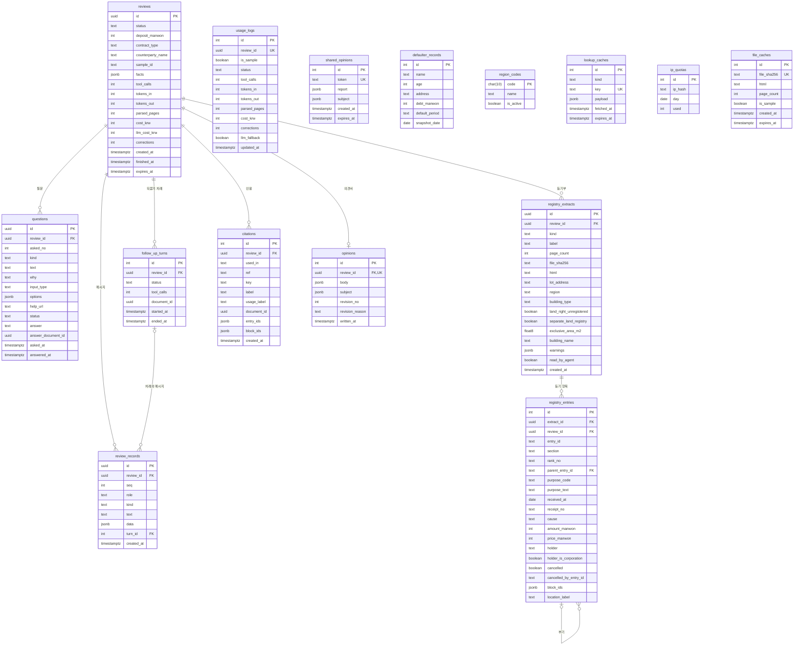

# ERD·DD: 보증금지킴 (deposit-guard)

클래스 명세의 엔티티 15개를 PostgreSQL 테이블 15개로 옮긴 ERD와 데이터 사전.

---

## 0. 이 문서가 다루는 것

클래스 명세의 엔티티 클래스를 **테이블**로 옮긴다. ERD는 그림, DD는 컬럼마다 타입·제약·의미를 적은 설명서다. 둘은 한 세트다.

테이블은 [[JSD-DOM-002]] 2.1~2.7의 엔티티 클래스 15개와 1:1이고 컬럼은 클래스 속성과 1:1이다. 이름은 클래스 명세 항목의 `테이블:` 줄 그대로다. 클래스가 바뀌면 이 문서에 `확인 필요`가 붙어야 한다.

**전제**
- PostgreSQL 16. 시각은 전부 `timestamptz`([[JSD-API-001]] 1장 — 시간대 포함)
- 바깥에 보이는 ID(`review_id`·`document_id`·`message_id`·`question_id`)는 `uuid` 기본키, 안 보이는 행은 `int` identity 기본키([[JSD-DOM-002]] 0장 전제. uuid 형태는 6장 부록)
- 열거형은 DB enum이 아니라 `text` + CHECK. 값은 [[JSD-DOM-002]] 2.9 그대로
- `dict`는 `jsonb` 객체, `list`는 `jsonb` 배열. 모양은 [[JSD-DOM-002]] 2.8의 DTO가 정한다
- 올린 파일 바이트와 IP 원문은 어느 테이블에도 없다([[JSD-INFRA-001#C2]] · [[JSD-PRD-001#N1]] · [[JSD-PRD-001#N2]])

---

## 1. ERD

**설계 규칙**
- **선은 DB 외래키만 긋는다.** `review_records`·`questions`·`follow_up_turns`·`registry_extracts`·`citations`·`opinions`는 `reviews.id`에 외래키를 건다 — 코드 도메인이 달라도(`registry_extracts`·`citations`·`opinions`). `registry_entries`는 `registry_extracts`를 거쳐 검토에 딸린다. 클래스 명세 5장 결정 11이 이 예외를 적었다(4장 1)
- **삭제는 서비스가 명시적으로 한다.** `ReviewService.cancel`은 한 트랜잭션에 등기부 → 파싱 캐시(`gate.forget`) → 인용·의견서 → 자기 행 순서로 지우고, `purge_expired`는 같은 자식 행을 지우되 `reviews` 행은 `counterparty_name`을 null, `facts`를 `{}`로 비워 status expired로 남긴다(410 답). `ON DELETE CASCADE`는 그 행을 지우는 다른 길(만료 행 삭제, 수동 삭제)에서 개인정보가 고아로 남지 않게 하는 그물이다
- **외래키가 아닌 ID 열** — `usage_logs.review_id`(검토가 지워져도 남는다), `questions.answer_document_id`·`follow_up_turns.document_id`·`citations.document_id`·`entry_ids`·`block_ids`(다른 도메인 `registry`의 값 — 클래스 명세가 외래키가 아니라고 적었다), `citations.ref`(메시지 행보다 먼저 쌓이고 message가 아니면 메시지 ID가 아니다), `registry_entries.cancelled_by_entry_id`(클래스 명세에 관계가 없다 — 말소 행이 뒤에 오므로 걸려면 DEFERRABLE이어야 한다), `file_caches.file_sha256`(여러 검토가 같은 파일을 쓴다)
- **보관** — 검토에 딸린 7테이블(`review_records` `questions` `follow_up_turns` `registry_extracts` `registry_entries` `citations` `opinions`)은 `reviews.created_at` + 24시간에 지운다. `shared_opinions`는 7일 뒤 `report`·`subject`만 비운다. `file_caches`는 24시간(예시는 `expires_at` null로 영구), `lookup_caches`는 24시간, `ip_quotas`는 어제 이전 행을 지운다. `defaulter_records`는 최신 스냅샷 하나, `region_codes`·`usage_logs`는 기한 없음([[JSD-DOM-002]] 5장 결정 4 · [[JSD-INFRA-001]] 6장)
- **개인정보 컬럼** — `reviews.counterparty_name`, `registry_extracts.html`·`lot_address`, `registry_entries.holder`, `file_caches.html`, `defaulter_records.name`·`age`·`address`(공개 명단), `ip_quotas.ip_hash`(가명). DD의 의미 칸에 **개인정보**로 표시한다. 사용자 문장이 들어가는 `reviews.facts`·`review_records.text`·`questions.answer`는 `privacy.mask_text`로 가린 사본이라 표시하지 않는다
- 카운터는 전부 `int not null default 0`. 금액은 만원 단위 정수([[JSD-API-001]] 1장)

---

## 2. DD (데이터 사전)

클래스 속성 전부를 싣는다 — `id`·외래키·시각까지. 한 테이블도 빼지 않는다.

### reviews

클래스: [[JSD-DOM-002#Review]]

| 컬럼 | 타입 | 제약 | 의미 | 예시 |
|---|---|---|---|---|
| id | uuid | PK, default gen_random_uuid() | `review_id`. 추측할 수 없어야 한다 — 로그인이 없어 이 값이 곧 권한 | |
| status | text | not null, default `created`, CHECK (created, running, waiting_user, done, failed, expired) | ReviewStatus. expired면 410 | `running` |
| deposit_manwon | int | not null | 체결 예정 보증금(만원). 만료 때도 남는다 | `21000` |
| contract_type | text | not null, CHECK (jeonse, monthly) | ContractType | `jeonse` |
| counterparty_name | text | null 허용 | 계약 상대방 이름. **개인정보** — 서버 안에서만(명단 대조·소유자 일치). 만료 때 null | |
| sample_id | text | null 허용 | 예시 사례 ID. FK 아님(예시는 저장소 파일). 있으면 예시 검토 | |
| facts | jsonb | not null, default `{}` | `ReviewFacts`. 답변은 가린 사본(`questions.answer`와 같다). 만료 때 `{}` | |
| tool_calls | int | not null, default 0 | 검토 단계 도구 호출 수(상한 20) | |
| tokens_in | int | not null, default 0 | 입력 토큰 합 | |
| tokens_out | int | not null, default 0 | 출력 토큰 합 | |
| parsed_pages | int | not null, default 0 | 과금된 파싱 쪽수. 캐시 적중이면 더하지 않는다 | |
| cost_krw | int | not null, default 0 | 파싱 + LLM 건당 비용(원) | |
| llm_cost_krw | int | not null, default 0 | 그중 LLM만. 되묻기·값 수정 한도가 본다 | |
| corrections | int | not null, default 0 | 대화 문장과 의견서에서 교정한 수 | |
| created_at | timestamptz | not null, default now() | 검토 시작 시각 | |
| finished_at | timestamptz | null 허용 | 끝난 시각. `finish`가 쓴다 | |
| expires_at | timestamptz | not null | `created_at` + `LIMITS.retention_hours`(24시간). 앱이 넣는다 | |

### review_records

클래스: [[JSD-DOM-002#ReviewRecord]]

| 컬럼 | 타입 | 제약 | 의미 | 예시 |
|---|---|---|---|---|
| id | uuid | PK, default gen_random_uuid() | `message_id`. 인용이 먼저 만들어지므로 호출자가 미리 정해 넣을 수 있다 | |
| review_id | uuid | FK not null → reviews on delete cascade | 검토 | |
| seq | int | not null, (review_id, seq) UK | 검토 안 1부터. 스트림 이벤트 ID | `7` |
| role | text | not null, CHECK (agent, user, system) | Role | `agent` |
| kind | text | not null, CHECK (say, tool, question, answer, numbers, report, notice, error) | MessageKind | `say` |
| text | text | not null | 저장 전에 가린 문장. `{{c1}}` 표식이 남는다 | `을구 2번 근저당 {{c1}}` |
| data | jsonb | null 허용 | kind별 `ToolCard`·`Question`·`AnswerData`·`RightsSummary`·`ReportCard`·`NoticeData`·`Error`. 도구 응답은 가린 사본 | |
| turn_id | int | FK null 허용 → follow_up_turns on delete set null | 되묻기 차례의 메시지면 그 차례 | |
| created_at | timestamptz | not null, default now() | 쌓인 시각 | |

### questions

클래스: [[JSD-DOM-002#Question]]

| 컬럼 | 타입 | 제약 | 의미 | 예시 |
|---|---|---|---|---|
| id | uuid | PK, default gen_random_uuid() | `question_id`. API로 나가므로 uuid | |
| review_id | uuid | FK not null → reviews on delete cascade | 검토 | |
| asked_no | int | not null | 몇 번째 질문인지(한도 5) | `2` |
| kind | text | not null, CHECK (illegal_building, price, tenants, proxy, owner_type, land_registry, other) | QuestionKind | `proxy` |
| text | text | not null | 질문 문장 | |
| why | text | not null | 왜 묻는지 한 줄 | |
| input_type | text | not null, CHECK (choice, number, text, file) | InputType | `choice` |
| options | jsonb | null 허용 | 선택지 문자열 배열 | |
| help_url | text | null 허용 | 도움말 링크 | |
| status | text | not null, default `pending`, CHECK (pending, answered, timeout) | QuestionStatus. 답과 상태의 진실은 이 행 | |
| answer | text | null 허용 | 답. 모름·건너뛰기·무응답은 `unknown`, 대리·위반건축물·임대인 유형은 열거형 값. 가린 뒤 저장. pending이면 null | `proxy_with_poa` |
| answer_document_id | uuid | null 허용 | 파일로 답했을 때 붙은 `registry_extracts.id`. FK 아님 | |
| asked_at | timestamptz | not null, default now() | 물은 시각 | |
| answered_at | timestamptz | null 허용 | 답한 시각 | |

### follow_up_turns

클래스: [[JSD-DOM-002#FollowUpTurn]]

| 컬럼 | 타입 | 제약 | 의미 | 예시 |
|---|---|---|---|---|
| id | int | PK, identity | 내부 ID(`Accepted.turn_id`) | |
| review_id | uuid | FK not null → reviews on delete cascade | 검토 | |
| status | text | not null, default `running`, CHECK (running, done, failed) | TurnStatus. running이면 다음 되묻기·값 수정이 wrong_state | |
| tool_calls | int | not null, default 0 | 이 차례의 도구 수(상한 5) | |
| document_id | uuid | null 허용 | 서류를 올려 연 차례면 그 `registry_extracts.id`. FK 아님 | |
| started_at | timestamptz | not null, default now() | 연 시각 | |
| ended_at | timestamptz | null 허용 | 닫은 시각 | |

### usage_logs

클래스: [[JSD-DOM-002#UsageLog]]

| 컬럼 | 타입 | 제약 | 의미 | 예시 |
|---|---|---|---|---|
| id | int | PK, identity | | |
| review_id | uuid | not null, UK | 검토 ID. **FK 아님** — 검토가 지워져도 남는다. 검토 끝과 되묻기 차례 끝에 같은 행을 갱신 | |
| is_sample | boolean | not null | 예시 검토인지 | |
| status | text | not null, CHECK (created, running, waiting_user, done, failed, expired) | 마지막 기록 때 ReviewStatus | `done` |
| tool_calls | int | not null, default 0 | `reviews`에서 옮긴 값 | |
| tokens_in | int | not null, default 0 | 〃 | |
| tokens_out | int | not null, default 0 | 〃 | |
| parsed_pages | int | not null, default 0 | 〃 | |
| cost_krw | int | not null, default 0 | 건당 비용(원). 일일 점검이 평균을 본다 | `212` |
| corrections | int | not null, default 0 | 후검증 교정 수 | |
| llm_fallback | boolean | not null, default false | 템플릿 문장으로 대체했는지 | |
| updated_at | timestamptz | not null, default now() | 마지막 갱신. `usage_report`의 날짜 기준 | |

### registry_extracts

클래스: [[JSD-DOM-002#RegistryExtract]]

| 컬럼 | 타입 | 제약 | 의미 | 예시 |
|---|---|---|---|---|
| id | uuid | PK, default gen_random_uuid(), (id, review_id) UK | `document_id`. 복합 UK는 `registry_entries`의 외래키 대상 | |
| review_id | uuid | FK not null → reviews on delete cascade | 검토. 한 검토에 두 장까지(앱 검증) | |
| kind | text | not null, CHECK (building, land, collective) | DocKind | `building` |
| label | text | not null | 문서 목록에 보일 이름 | `건물 등기부` |
| page_count | int | not null | 쪽수 | `3` |
| file_sha256 | text | not null | 파일 해시. unique 아님(여러 검토가 같은 파일). 검토를 지울 때 `file_caches`를 찾는다 | |
| html | text | not null | `data-block-id`가 붙은 원문 HTML. **개인정보**(소유자 이름) | |
| lot_address | text | null 허용 | 지번까지(동·호수 없음). **개인정보** — 외부 조회에만, 모델·공유본 금지. 토지 등기부는 null | |
| region | text | null 허용 | 시군구·동. 토지 등기부는 null | |
| building_type | text | null 허용, CHECK (apartment, multi_family_unit, multi_household, officetel, other) | BuildingType. 토지 등기부는 null | `multi_household` |
| land_right_unregistered | boolean | null 허용 | 대지권 미등기. 토지 등기부는 null | |
| separate_land_registry | boolean | null 허용 | 토지 별도등기. 토지 등기부는 null | |
| exclusive_area_m2 | float8 | null 허용 | 전용면적(㎡) | `59.8` |
| building_name | text | null 허용 | 건물명 | |
| warnings | jsonb | not null, default `[]` | 표 읽기에서 못 읽은 필드를 적은 문장 배열. 이름 없이 `entry_id`와 필드 이름만 | `["eul-3 채권최고액을 읽지 못함"]` |
| read_by_agent | boolean | not null, default false | 에이전트가 읽었는지. `RegistryService.read`가 true로 | |
| created_at | timestamptz | not null, default now() | 올린 시각. 등기부 순서의 기준(4장 3) | |

### registry_entries

클래스: [[JSD-DOM-002#RegistryEntry]]

| 컬럼 | 타입 | 제약 | 의미 | 예시 |
|---|---|---|---|---|
| id | int | PK, identity | 내부 ID. 한 등기부의 항목을 문서 순서대로 넣으므로 문서 안 순서도 된다(4장 3) | |
| extract_id | uuid | not null, (extract_id, review_id) FK → registry_extracts(id, review_id) on delete cascade | 등기부 | |
| review_id | uuid | not null, 위 복합 FK의 일부 | `registry_extracts.review_id`의 사본 — 검토 단위 조회용. 복합 FK가 등기부의 검토와 같게 묶는다 | |
| entry_id | text | not null, (review_id, entry_id) UK | 검토 안 유일한 항목 ID. 뒤에 붙은 등기부는 `land-` 접두어 | `eul-2` |
| section | text | not null, CHECK (gap, eul) | Section | `eul` |
| rank_no | text | not null | 순위번호 원문 | `1-1` |
| parent_entry_id | text | null 허용, (review_id, parent_entry_id) FK → registry_entries(review_id, entry_id) on delete cascade | 부기면 주등기의 `entry_id`. 주등기가 문서에서 앞서므로 먼저 들어가 있다. null이면 검사하지 않는다 | `eul-1` |
| purpose_code | text | not null, CHECK PurposeCode 15값([[JSD-DOM-002]] 2.9) | PurposeCode | `mortgage` |
| purpose_text | text | not null | 등기목적 원문 | `근저당권설정` |
| received_at | date | null 허용 | 접수일 | |
| receipt_no | text | null 허용 | 접수번호 | |
| cause | text | null 허용 | 등기원인 | |
| amount_manwon | int | null 허용 | 채권최고액·전세금(만원) | `24000` |
| price_manwon | int | null 허용 | 거래가액(만원) | |
| holder | text | null 허용 | 권리자 이름 그대로. **개인정보** — 모델로는 `개인 A`로 가려 간다 | |
| holder_is_corporation | boolean | null 허용 | 법인 권리자인지 | |
| cancelled | boolean | not null, default false | 말소됐는지 | |
| cancelled_by_entry_id | text | null 허용 | 말소한 항목의 `entry_id`. FK 아님(1장) | `eul-5` |
| block_ids | jsonb | not null | 원문 블록 ID 배열 | |
| location_label | text | not null | 세입자가 등기부에서 찾는 말 | `을구 2번` |

### citations

클래스: [[JSD-DOM-002#Citation]]

| 컬럼 | 타입 | 제약 | 의미 | 예시 |
|---|---|---|---|---|
| id | int | PK, identity | | |
| review_id | uuid | FK not null → reviews on delete cascade | 검토 | |
| used_in | text | not null, CHECK (message, conclusion, rights, signal, checked, clause) | CitationUse. 쓰인 곳 | `signal` |
| ref | text | not null, default `''` | message면 `message_id`, signal이면 신호 코드, checked면 검토 항목 코드, clause면 특약 순번, conclusion·rights면 빈 문자열. FK 아님 — 메시지 행보다 먼저 쌓인다 | |
| key | text | not null | 그 자리 안 순서. 본문 `{{c1}}`과 맞는다 | `c1` |
| label | text | not null | 첫 항목의 `location_label` | `을구 2번` |
| usage_label | text | not null | 역방향 조회에 보일 한 줄 | `선순위 합산 2.1억` |
| document_id | uuid | not null | 가리키는 등기부 하나. FK 아님 | |
| entry_ids | jsonb | not null | 대조를 통과한 `entry_id` 배열(1개 이상) | `["eul-2"]` |
| block_ids | jsonb | not null | 원문 블록 ID 배열 | |
| created_at | timestamptz | not null, default now() | | |

### opinions

클래스: [[JSD-DOM-002#Opinion]]

| 컬럼 | 타입 | 제약 | 의미 | 예시 |
|---|---|---|---|---|
| id | int | PK, identity | | |
| review_id | uuid | FK not null → reviews on delete cascade, UK | 검토 하나에 하나. 다시 쓰면 같은 행을 덮는다 | |
| body | jsonb | not null | 인용을 뺀 `Report` 전체. 개인 이름이 없다(개인 권리자는 개인 A) | |
| subject | jsonb | not null | 공유본용 요약 `{region_short, building_type, deposit_manwon, contract_type, reviewed_at}` | |
| revision_no | int | not null, default 1 | 판. 다시 쓸 때마다 1 올린다 | `2` |
| revision_reason | text | null 허용 | 다시 쓴 이유. 이름을 가린 한 줄. 첫 판은 null | `직접 입력` |
| written_at | timestamptz | not null, default now() | 마지막으로 쓴 시각 | |

### shared_opinions

클래스: [[JSD-DOM-002#SharedOpinion]]

| 컬럼 | 타입 | 제약 | 의미 | 예시 |
|---|---|---|---|---|
| id | int | PK, identity | | |
| token | text | not null, UK | 추측할 수 없는 랜덤 문자열. 링크 경로 | |
| report | jsonb | null 허용 | 인용·특약·물어볼 것을 뺀 `Report`. 만료 뒤 null | |
| subject | jsonb | null 허용 | `Opinion.subject` 사본. 만료 뒤 null | |
| created_at | timestamptz | not null, default now() | 링크를 만든 시각 | |
| expires_at | timestamptz | not null | `created_at` + `LIMITS.share_days`(7일). 원본 검토와 상관없다 | |

### defaulter_records

클래스: [[JSD-DOM-002#DefaulterRecord]]

| 컬럼 | 타입 | 제약 | 의미 | 예시 |
|---|---|---|---|---|
| id | int | PK, identity | | |
| name | text | not null | 공개 명단의 이름. **개인정보**(공개 정보) | |
| age | int | null 허용 | 나이. **개인정보** | |
| address | text | not null | 주소. **개인정보** | |
| debt_manwon | int | null 허용 | 채무액(만원) | |
| default_period | text | null 허용 | 체납 기간 원문 | |
| snapshot_date | date | not null | 스냅샷 날짜. 모든 행이 같다 | |

### region_codes

클래스: [[JSD-DOM-002#RegionCode]]

| 컬럼 | 타입 | 제약 | 의미 | 예시 |
|---|---|---|---|---|
| code | char(10) | PK | 법정동코드 10자리. 앞 5자리는 실거래가 지역 코드, 뒤 5자리는 건축HUB 법정동 코드 | |
| name | text | not null | 법정동 이름 | |
| is_active | boolean | not null | 폐지되지 않았는지 | |

### lookup_caches

클래스: [[JSD-DOM-002#LookupCache]]

| 컬럼 | 타입 | 제약 | 의미 | 예시 |
|---|---|---|---|---|
| id | int | PK, identity | | |
| kind | text | not null, CHECK (trade, building) | LookupKind | `trade` |
| key | text | not null, UK | 종류·법정동코드·조회 인자를 이은 문자열을 앱 비밀키로 HMAC한 16진수. kind가 해시 입력에 들어 있어 단독 UK. 번·지 원문은 어디에도 없다([[JSD-DOM-002]] 5장 결정 12) | |
| payload | jsonb | not null | 공공 API 응답 중 판정에 쓰는 필드. 건축물대장의 대지위치·도로명주소는 뺀다 | |
| fetched_at | timestamptz | not null, default now() | 받은 시각 | |
| expires_at | timestamptz | not null | `fetched_at` + 24시간 | |

### ip_quotas

클래스: [[JSD-DOM-002#IpQuota]]

| 컬럼 | 타입 | 제약 | 의미 | 예시 |
|---|---|---|---|---|
| id | int | PK, identity | | |
| ip_hash | text | not null, (ip_hash, day) UK | HMAC(앱 비밀키, IP). IP 원문은 없다. **개인정보**(가명) | |
| day | date | not null | 센 날 | |
| used | int | not null, default 1 | 그날 쓴 건수. `used < LIMITS.ip_daily`(5)일 때만 한 문장으로 올린다 | `3` |

### file_caches

클래스: [[JSD-DOM-002#FileCache]]

| 컬럼 | 타입 | 제약 | 의미 | 예시 |
|---|---|---|---|---|
| id | int | PK, identity | | |
| file_sha256 | text | not null, UK | 파일 해시. 파일 바이트는 저장하지 않는다 | |
| html | text | not null | 업스테이지 HTML. **개인정보**(소유자 이름) | |
| page_count | int | not null | 쪽수 | |
| is_sample | boolean | not null, default false | 예시 파일인지. 예시면 IP 한도를 세지 않는다 | |
| created_at | timestamptz | not null, default now() | 캐시한 시각 | |
| expires_at | timestamptz | null 허용 | `created_at` + 24시간. 예시는 null(만료 없음) | |

---

## 3. 인덱스와 정규화

PK·UK는 인덱스를 만든다(아래 표에 조회와 함께 적는다). 외래키는 PostgreSQL이 인덱스를 만들지 않으므로 필요한 것만 적었다. 아래가 전부다.

| 테이블 | 인덱스 | 이유 (어느 쿼리) |
|---|---|---|
| review_records | `(review_id, seq)` unique | `ReviewService.record` 다음 seq · `list_messages`의 seq 이후 · `stream` 폴링. 두 삽입이 같은 seq를 받으면 둘째가 실패한다(4장 2) |
| review_records | `(turn_id) where turn_id is not null` 부분 | FK. `follow_up_turns`를 지울 때 set null 찾기 · `cancel` · `purge_expired` |
| questions | `(review_id, status)` | `ask`의 질문 수 · `get`의 pending 질문 · `receive`의 pending 확인 · `stream` |
| follow_up_turns | `(review_id, status)` | `receive`의 차례 수 · `get`의 `asks_used` · `stream` |
| follow_up_turns | `(review_id) where status = 'running'` 부분 unique | 검토당 열린 차례 하나(4장 5) · `receive`·`override_values`의 열린 차례 확인 |
| registry_extracts | `(review_id)` | FK. `RegistryService.read` · `list` · `property` · `delete_for_review` · 검토당 두 장 확인 |
| registry_extracts | `(id, review_id)` unique | `registry_entries` 복합 외래키의 대상 |
| registry_entries | `(review_id, entry_id)` unique | `RegistryService.entries`(인용 대조마다) · `owner` · `holder_names` · `block_excerpt`는 검토 안 훑기 |
| registry_entries | `(extract_id)` | FK. `RegistryService.read`의 항목 · 등기부 삭제 |
| registry_entries | `(review_id, parent_entry_id) where parent_entry_id is not null` 부분 | 부기 외래키. 주등기 행을 지울 때 부기 찾기 |
| citations | `(review_id, used_in, ref)` | `CitationService.for_messages` · `for_report` · `clear_report` · `delete_for_review` · `usages`는 앞부분으로 검토 안 `block_ids @>` 훑기 |
| opinions | `(review_id)` unique | `ReportService.get` · `exists` · `write`의 upsert(`on conflict (review_id)`) |
| usage_logs | `(review_id)` unique | `ReviewService.finish`의 upsert(`on conflict (review_id)`) |
| usage_logs | `(updated_at)` | `ReviewService.usage_report(day)` — 테이블이 기한 없이 쌓인다 |
| reviews | `(expires_at) where status <> 'expired'` 부분 | `ReviewService.purge_expired` — 만료 행이 남아 쌓인다 |
| shared_opinions | `(token)` unique | `ShareService.get` |
| shared_opinions | `(expires_at) where report is not null` 부분 | `ShareService.purge_expired` — 비운 행이 남아 쌓인다 |
| lookup_caches | `(key)` unique | `LookupService.price`(달마다 최대 12번) · `building` · 없을 때 upsert |
| ip_quotas | `(ip_hash, day)` unique | `gate.take_quota`의 `on conflict (ip_hash, day)` 대상([[JSD-DOM-002]] 6장 부록) |
| file_caches | `(file_sha256)` unique | `gate.cached_html` · `take_quota`의 예시 해시 확인 · `remember_html` upsert · `forget` |
| defaulter_records | `(regexp_replace(name, '\s', '', 'g'))` 식 | `LookupService.defaulter` — 공백을 뺀 완전 일치 |

`file_caches`·`lookup_caches`의 만료 삭제와 `ip_quotas`의 어제 이전 삭제(`gate.purge` · `purge_cache`)는 시간마다 지워 하루치만 남으므로 전체 훑기로 둔다. `region_codes`의 가장 긴 이름 일치(`LookupService.region_code`)는 B-tree가 돕지 못하는 조건이고 적재 후 바뀌지 않는 수만 행이라 인덱스를 두지 않는다.

**정규화** — 전 테이블 3NF. 의도적 비정규화 넷: `registry_entries.review_id`(검토 단위 조회를 조인 없이, 복합 외래키로 원본과 맞춘다), `usage_logs`의 카운터(검토 행이 지워진 뒤에도 남아야 한다), `shared_opinions.report`·`subject`(원본 없이 7일 산다), `questions` 행과 질문 메시지 `data`(물을 때의 사본, 답과 상태는 행이 진실).

## 4. 판단이 필요한 지점

**1. 다른 코드 도메인의 테이블도 `reviews`에 외래키를 거나 — 결정: 건다, on delete cascade. 클래스 명세 5장 결정 11에 적었다(2026-09-17).** `registry_extracts`·`citations`·`opinions`는 검토보다 오래 살 이유가 없고, 클래스 명세의 삭제 순서(등기부 → 인용·의견서 → 자기 행)와 `purge_expired`(자식만 지우고 검토 행은 남김)를 둘 다 막지 않는다. 클래스 명세의 "도메인을 넘는 관계는 ID 열로만"은 코드와 다이어그램의 규칙이고 `review_id`는 DB에서 예외다. 등기부를 가리키는 `document_id`·`entry_ids`·`block_ids`는 그 규칙대로 걸지 않는다. `citations.ref`는 인용이 메시지보다 먼저 쌓여 걸 수 없다.

**2. `seq`를 누가 올리나.** `record`는 max+1인데 루프와 `receive`(HTTP)가 동시에 메시지를 쌓을 수 있다. `(review_id, seq)` unique가 중복을 막아 둘째 삽입이 실패한다. 실패 뒤 다시 시도할지, 검토 행을 잠글지는 클래스 명세가 정한다(5장).

**3. 등기 항목의 순서.** `holder_names`(등기부 순서·갑구 → 을구)와 `owner`(마지막 소유권 항목)는 순서가 필요한데 순서 컬럼이 없고 `rank_no`는 `1-1` 같은 문자열이다. 지금은 `registry_extracts.created_at`, `CASE section WHEN 'gap' THEN 0 ELSE 1 END`, `registry_entries.id`(문서 순서대로 한 트랜잭션에 넣은 identity) 순으로 정렬한다. `section`을 글자로 정렬하면 eul이 gap보다 앞서 을구가 먼저 온다. 컬럼을 더하지 않았다.

**4. 열거형을 CHECK로 막나 — 결정: 막는다.** 클래스 명세는 `str` 컬럼 + `StrEnum`만 적었다. 값이 틀린 행이 들어오면 CHECK가 삽입을 거절한다. 값을 더하면 CHECK를 바꾸는 마이그레이션이 하나 붙는다.

**5. 열린 되묻기 차례를 하나로 막나 — 결정: 부분 unique로 막는다.** `receive`(kind ask)는 열린 차례가 없는지 본 뒤 차례를 넣는데, 두 요청이 동시에 오면 둘 다 확인을 통과해 루프 둘이 `facts`를 함께 쓴다. `follow_up_turns (review_id) where status = 'running'` unique가 둘째 삽입을 거절하고, 서비스는 그 위반을 wrong_state로 답한다.

---

## 5. 미결사항

- [ ] [[JSD-DOM-002]] 되먹임 — 속성의 null 허용·기본값이 다이어그램에 없어 이 문서가 정했다(카운터 0, status 첫 값, `facts` `{}`, `revision_no` 1, `read_by_agent`·`cancelled` false). 맞는지
- [ ] [[JSD-DOM-002]] 되먹임 — 0장 전제의 UUID 목록에 `question_id`가 없다. 바깥에 보이는 ID라 uuid로 두었다
- [ ] [[JSD-DOM-002]] 되먹임 — 인용: 합산(rights)·특약(clause) 인용은 저장되지만 `RightsSummary`·`SpecialClause` DTO에 인용 필드가 없어 역방향 조회로만 보인다. `cite`가 등기부마다 인용을 나누는지 적혀 있지 않은데 한 행은 `document_id` 하나다(합산은 건물·토지 등기부에 걸친다). 같은 신호 코드가 둘이면 `ref`로 구분되지 않는다. 그래서 `citations`에 unique를 두지 않았다
- [x] [[JSD-DOM-002]] 되먹임 — 결정(2026-09-17): 외래키를 건다. 클래스 명세 5장 결정 11. 질문은 2장 머리·Citation 설명의 "도메인을 넘으면 ID 열로만, 외래키 아님"을 `review_id`에도 적용하나였다. 이 문서는 `registry_extracts`·`citations`·`opinions.review_id`를 on delete cascade 외래키로 두었다(4장 1)
- [ ] [[JSD-DOM-002]] 되먹임 — `seq` 동시 삽입(4장 2), 등기 항목 순서(4장 3), 열린 차례 하나(4장 5)를 클래스 명세에 적을지
- [ ] [[JSD-DOM-002]] 되먹임 — `UsageLog`에 만든 날짜가 없어 `usage_report(day)`가 `updated_at`을 쓴다. 되묻기 차례가 다음 날 끝나면 그 검토가 날짜를 옮긴다. `llm_cost_krw`도 없다
- [ ] [[JSD-DOM-002]] 되먹임 — 예시 파일을 직접 올린 경우(해시 일치) `usage_logs.is_sample`을 무엇으로 채울지. `reviews`에는 `sample_id`만 있다
- [ ] 만료(expired) `reviews` 행과 비운 `shared_opinions` 행을 언제 지울지 — [[JSD-DOM-002]] 미결과 같다
- [ ] [[JSD-INFRA-001]] 되먹임 — 6장 테이블 이름을 이 문서 이름으로: `review_sessions` → reviews, `review_events` → review_records, `review_documents` → registry_extracts·registry_entries, `reports` → opinions, `shares` → shared_opinions, `file_cache` → file_caches, `lookup_cache` → lookup_caches, `hug_defaulters` → defaulter_records, `usage_log` → usage_logs. 백업 규칙에 `ip_quotas`(기한 있음 — 데이터를 뺄지)와 `region_codes`(기한 없음 — 데이터째 담을지)가 없다
- [ ] [[JSD-INFRA-001]] 되먹임 — 백업이 `reviews` 데이터를 빼면 복구한 DB는 만료 검토에 410이 아니라 404를 답한다
- [x] [[JSD-INFRA-001]] 되먹임 — 결정(2026-09-17): 의견서에 개인 이름이 없다. INFRA 6장을 고쳤다. 질문은 6장이 의견서 JSON에 이름·상세주소가 있다고 적었고 [[JSD-DOM-002]]는 `body`에 개인 이름이 처음부터 없다고 적었다. 어느 쪽인지
- [x] [[JSD-DOM-002]] 되먹임 — 결정(2026-09-17): 키를 HMAC으로 두고 응답에서 주소 필드를 뺀다. 클래스 명세 5장 결정 12. 질문은 `LookupCache`는 개인정보가 없다고 적었지만 건축물대장 `key`에 법정동코드·번·지가 들어가 `lot_address`와 같은 정보다. 이 문서는 개인정보로 표시했다. 검토를 지워도 24시간 남아 [[JSD-API-001]] DELETE의 "즉시 지운다"에 들지 않는다 — 키를 HMAC으로 둘지, 검토 삭제 때 지울지
- [ ] 법정동 가장 긴 일치에 `is_active`를 거를지, 행을 메모리에 올릴지
- [ ] HUG 명단 페이지의 실제 열 — `defaulter_records` 컬럼은 잠정이다
- [ ] 재시작 때 running·waiting_user로 남은 검토를 failed로 닫는다면 `reviews(status)` 인덱스가 필요한지 — 지금은 두지 않았다
