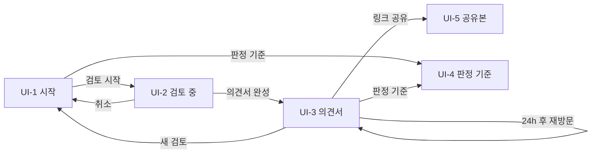

# 화면 설계 / 와이어프레임

## 0. 이 문서가 다루는 것

화면 5개의 배치·요소·규칙·시나리오와 공통 디자인 토큰. 모바일(390px) 우선, 데스크톱은 같은 배치를 가운데 정렬(최대 720px). 컴포넌트 구현은 CODE 슬라이스에서.

**3줄 요약.** 시작 → 검토 중 → 의견서, 세 화면이 한 흐름이다. 검토 중 화면은 에이전트의 문장이 흐르는 타임라인이고, 질문이 오면 카드가 끼어든다. 의견서는 등급 배지 아래 근거·할 일·특약 순서로, 근거는 옆 패널의 원문을 강조한다.

### 0.1 형식

와이어프레임. 화면마다 배치(html 뼈대)·요소 표·규칙·시나리오 네 절. 시각 디자인은 3절의 토큰으로 통일하고 별도 시안은 만들지 않는다.

## 1. 유스케이스 대응

| 화면 | 주 유스케이스 | 부 유스케이스 |
|---|---|---|
| UI-1 시작 | [[JSD-UC-001#UC-A1]] 1~2, [[JSD-UC-001#UC-A2]] | [[JSD-UC-001#UC-S10]] |
| UI-2 검토 중 | [[JSD-UC-001#UC-A1]] 3~6, [[JSD-UC-001#UC-A3]] | [[JSD-UC-001#UC-S9]] |
| UI-3 의견서 | [[JSD-UC-001#UC-A1]] 8, [[JSD-UC-001#UC-A4]] | |
| UI-4 판정 기준 | [[JSD-PRD-001#R6]] 공개 | |
| UI-5 공유본 | [[JSD-UC-001#UC-A4]] 5 | |

## 2. 화면 목록

#### UI-1 시작

페이지 `/`. 목적: 10초 안에 무슨 서비스인지 알고, 예시 파일이나 내 등기부로 검토를 시작한다. 주 유스케이스: [[JSD-UC-001#UC-A1]] [[JSD-UC-001#UC-A2]]. 진입: 대회 링크·직접 접속. 이탈: 검토 시작 → UI-2.

### 배치
```html
<header data-el="1">보증금지킴 · 판정 기준 링크</header>
<section data-el="2">한 줄 설명 + 두 줄 부연</section>
<section data-el="3">예시 등기부 카드 3개 (가로 스크롤/모바일 세로)</section>
<form data-el="4">
  <div data-el="5">파일 드롭존 (PDF·JPG·PNG, 10MB·20쪽)</div>
  <div data-el="6">보증금(만원) · 계약 형태 토글</div>
  <div data-el="7">계약 상대방 이름 (선택, 접힘)</div>
  <div data-el="8">미저장 고지 한 줄</div>
  <button data-el="9">검토 시작</button>
</form>
<footer data-el="10">AI 고지 · 출처</footer>
```

### 요소
| # | 이름 | 종류 | 보여주는 것 | 누르면 |
|---|---|---|---|---|
| 1 | 헤더 | 고정 | 서비스명, "판정 기준" 링크 | UI-4 |
| 2 | 설명 | 텍스트 | "등기부 올리면 LH 권리분석 기준으로 검토해 드립니다" + "위험한지, 그래서 뭘 준비할지" | — |
| 3 | 예시 카드 ×3 | 카드 | 집 종류 아이콘, 제목(아파트·보통의 집 / 신축 빌라 / 다가구·세입자 여럿), 한 줄 상황 | 파일이 5에 첨부되고 6이 시나리오 값으로 채워짐. 카드에 "첨부됨" 표시 |
| 4 | 폼 | 폼 | | |
| 5 | 드롭존 | 파일 입력 | 안내 문구, 첨부 후 파일명·페이지 수, 다가구면 "토지 등기부는 검토 중에 요청" 안내 | 파일 선택 |
| 6 | 보증금·형태 | 숫자 입력 + 토글 | 만원 단위, 천 단위 구분. 전세 / 반전세·월세 | — |
| 7 | 상대방 이름 | 텍스트 (접힘) | "계약서에 적힌 임대인 이름" | 펼침 |
| 8 | 고지 | 텍스트 | "올린 파일은 저장하지 않고 처리 후 바로 지웁니다" | — |
| 9 | 검토 시작 | 주 버튼 | 필수 입력 전엔 비활성 | POST 세션 → UI-2 |
| 10 | 푸터 | 텍스트 | AI 생성 결과 고지, LH·HUG 기준 출처 | — |

### 규칙
- 파일 형식·크기·페이지 초과는 드롭존 아래 빨간 한 줄로 즉시 (서버 응답 전 클라이언트 검사 + 서버 재검사)
- IP 한도 초과는 9를 누른 뒤 토스트 "오늘은 5건까지 검토할 수 있습니다"
- 예시 카드로 첨부한 상태에서 사용자가 보증금을 바꾸면 실처리된다는 안내 없이 그냥 진행 (캐시 키가 달라짐)
- 헤더 링크 외에는 이 화면에서 나가는 길이 없다

### 시나리오
**S-1 예시로 시작** — [[JSD-SCN-001#S4]] 1~2
1. 카드 "신축 빌라" 탭 → 드롭존에 `sample-multi-family.pdf`, 보증금 18,000, 전세
2. 검토 시작 → UI-2

**S-2 내 등기부로 시작** — [[JSD-SCN-001#S1]] 1
1. PDF 드롭 → 파일명 표시
2. 보증금 20,000, 전세 → 검토 시작

#### UI-2 검토 중

페이지 `/review/{id}`. 목적: 에이전트가 무엇을 왜 확인하는지 실시간으로 보고, 질문에 답한다. 주 유스케이스: [[JSD-UC-001#UC-A1]] [[JSD-UC-001#UC-A3]]. 진입: UI-1에서. 이탈: 의견서 완성 → UI-3 자동 전환, 취소 → UI-1.

### 배치
```html
<header data-el="1">보증금지킴 · 진행 단계 표시(읽기→확인→판정→의견서)</header>
<section data-el="2">요약 카드: 집 종류 · 보증금 · 경과 시간</section>
<ol data-el="3">
  <li data-el="4">이벤트 줄 (아이콘 · 문장 · 시각)</li>
  <li data-el="5">질문 카드 (질문 · 이유 · 선택지/입력 · 답변 · 모름)</li>
</ol>
<footer data-el="6">취소</footer>
```

### 요소
| # | 이름 | 종류 | 보여주는 것 | 누르면 |
|---|---|---|---|---|
| 1 | 헤더 | 고정 | 4단계 진행 표시. 현재 단계 강조 | — |
| 2 | 요약 | 카드 | 표제부 판정 후 집 종류 채워짐. 경과 시간 | — |
| 3 | 타임라인 | 목록 | SSE 이벤트를 위→아래로 추가. 자동 스크롤 | — |
| 4 | 이벤트 줄 | 항목 | kind별 아이콘(생각·도구·결과·오류), 문장, 시각. 도구 결과는 한 줄 요약, 펼치면 데이터 | 펼침 |
| 5 | 질문 카드 | 카드 | 질문, "왜 묻나요" 한 줄, 선택지 버튼 또는 입력칸 또는 파일 입력, 확인 방법 링크, "답변" / "모름·건너뛰기" | 답변 → POST → 카드가 답변 이벤트로 바뀜 |
| 6 | 취소 | 보조 버튼 | | 확인 후 세션 종료 → UI-1 |

### 규칙
- 도구 호출마다 최소 1줄. 문장은 서버가 만든 것을 그대로 (클라이언트에서 가공 금지)
- 질문 카드가 있으면 타임라인 맨 아래 고정, 답하기 전엔 새 이벤트가 안 온다 (`waiting_user`)
- 5분 무응답 시 카드가 "답변 없이 진행합니다"로 바뀜
- 연결 끊김: `Last-Event-ID`로 재접속. 재접속 중 상단에 "다시 연결 중" 띠
- 캐시 재생(예시 두 번째 이후)이면 2 아래에 "앞서 처리된 결과를 보여드립니다" 띠, 이벤트는 같은 순서로 0.3초 간격 재생
- `report` 이벤트 수신 시 1초 후 UI-3로 전환

### 시나리오
**S-1 질문에 답하기** — [[JSD-SCN-001#S2]] 5
1. "건축물대장을 조회합니다 → 다세대주택, 12세대" 줄
2. 질문 카드 "정부24 건축물대장에 '위반건축물' 표시가 있나요?" 예 / 아니오 / 모름
3. "아니오" → 카드가 "답변: 위반건축물 아님"으로 바뀜, 타임라인 계속

**S-2 토지 등기부 요청** — [[JSD-SCN-001#S3]] 2
1. 질문 카드에 파일 입력 → 올리면 "토지 등기부를 읽습니다" 줄

#### UI-3 의견서

페이지 `/review/{id}/report`. 목적: 등급과 근거를 보고, 할 일과 특약을 가져간다. 주 유스케이스: [[JSD-UC-001#UC-A1]] [[JSD-UC-001#UC-A4]]. 진입: UI-2 완료, 또는 URL 재방문(24h 내). 이탈: 저장·공유, 새 검토 → UI-1.

### 배치
```html
<header data-el="1">보증금지킴 · 새 검토 · 판정 기준</header>
<section data-el="2">등급 배지(안전/주의/위험) + 결론 한 문장 + AI 고지</section>
<section data-el="3">숫자 카드: 부채비율 · 선순위 · 보증금 · 시세(출처)</section>
<section data-el="4">위험 신호 카드 목록 (신호 · 쉬운 설명 · 출처 · [근거 보기])</section>
<aside data-el="5">원문 패널 (등기부 HTML, 강조 블록으로 스크롤) — 모바일은 바텀시트</aside>
<section data-el="6">확인한 것 표 (항목 · 확인함/못 함/해당 없음)</section>
<section data-el="7">단계별 할 일 탭 (계약 전 · 당일 · 잔금 · 입주 후)</section>
<section data-el="8">특약 문구 (복사) · 집주인·중개사 질문 (복사)</section>
<details data-el="9">검토 기록 (타임라인 전체)</details>
<footer data-el="10">PDF 저장 · 링크 공유 · 판정 기준 · 전문가 확인 권고</footer>
```

### 요소
| # | 이름 | 종류 | 보여주는 것 | 누르면 |
|---|---|---|---|---|
| 2 | 등급 | 배지 + 텍스트 | 색·아이콘·글자 셋 다로 등급 표시(색맹 대응). 결론 문장. "AI가 읽고 정리한 결과입니다" | — |
| 3 | 숫자 | 카드 4개 | 부채비율 % (경계선 70·90 표시), 선순위 합계, 보증금, 시세와 출처(실거래가·등기부 매매가·직접 입력) | 시세 카드: 직접 입력이면 수정 가능 → 재판정 |
| 4 | 신호 카드 | 목록 | 즉시 위험은 빨강, 주의는 노랑. 제목, 쉬운 설명, "LH 기준" 같은 출처 | "근거 보기" → 5 열림, 해당 블록 강조·스크롤 |
| 5 | 원문 패널 | 사이드/바텀시트 | `parsed_html` 렌더링. 강조 블록은 노란 배경 + 왼쪽 띠 | 닫기 |
| 6 | 확인한 것 | 표 | 항목 · 결과 · 근거 링크. "확인 못 함"은 회색이 아니라 주황으로 눈에 띄게 | 근거 → 5 |
| 7 | 할 일 | 탭 + 체크리스트 | 단계별. 각 항목: 할 일, 어디서·어떻게, 비용, 왜(신호 연결). 체크 상태는 로컬 저장 | 체크 |
| 8 | 특약·질문 | 텍스트 블록 | 특약 제목·본문(빈칸 채워진 상태)·출처. 질문 3~5개 | 복사 버튼 |
| 9 | 검토 기록 | 접힘 | UI-2 타임라인 전체 + "후검증 교정 N건" | 펼침 |
| 10 | 푸터 | 버튼 | PDF 저장, 링크 공유(복사), 판정 기준, 새 검토 | 각 동작 |

### 규칙
- 등급·수치는 서버 값 그대로. 클라이언트 계산 금지
- "근거 보기"는 3초 안에 강조 (블록 ID 앵커)
- 확인 못 함 항목이 하나라도 있으면 2 아래에 "확인 못 한 항목 N개가 있습니다 — 할 일에 포함했습니다" 띠
- 추출값 수정(3의 시세, 6의 근저당 금액)은 인라인 편집 → 확인 → 규칙 도구만 재실행 → 화면 갱신 ([[JSD-UC-001#UC-A1]] 8a)
- 세션 만료(24h) 후 접근하면 "원문은 삭제됐습니다" + 의견서만 표시(근거 보기 비활성)

### 시나리오
**S-1 근거 확인** — [[JSD-SCN-001#S4]] 5
1. 신호 "근저당이 두 달 전 설정됨" 카드의 근거 보기
2. 바텀시트에 을구 표, 해당 행 강조

**S-2 특약 복사** — [[JSD-SCN-001#S2]] 10
1. 특약 3 블록의 복사 → 토스트 "복사됨"

#### UI-4 판정 기준

페이지 `/criteria`. 목적: 등급 규칙과 출처를 그대로 공개한다. 주 유스케이스: [[JSD-PRD-001#R6]]. 진입: 헤더·의견서 링크. 이탈: 뒤로.

### 배치
```html
<article data-el="1">
  <section data-el="2">등급 규칙표 (R6)</section>
  <section data-el="3">신호 규칙표 (R5) + 출처 링크</section>
  <section data-el="4">건물 종류별 필수 검토 (R11)</section>
  <section data-el="5">주택 가격 산정 순서 · 최우선변제금 표 · 기준일</section>
</article>
```

### 요소
| # | 이름 | 종류 | 보여주는 것 | 누르면 |
|---|---|---|---|---|
| 2~5 | 표 | 정적 | PRD 표를 그대로. 규칙 버전·기준일 | 출처 링크 → 새 탭 |

### 규칙
- 내용은 코드의 규칙 상수에서 생성 (문서와 코드가 어긋나지 않게)

### 시나리오
**S-1** — [[JSD-SCN-001#S4]] 6

#### UI-5 공유본

페이지 `/s/{token}`. 목적: 가족·지인이 마스킹된 의견서를 본다. 주 유스케이스: [[JSD-UC-001#UC-A4]]. 진입: 공유 링크. 이탈: 없음 (새 검토 링크만).

### 배치
UI-3에서 5(원문 패널)·9(검토 기록)·10의 저장·공유를 뺀 읽기 전용. 상단에 "공유된 의견서 · N일 후 만료" 띠.

### 규칙
- 이름·주민번호·동 이하 주소 없음. 근거 보기 없음
- 만료 후: "만료된 링크입니다" + 새 검토 버튼

### 시나리오
**S-1** — [[JSD-UC-001#UC-A4]] 5a

## 3. 공통 틀

### 디자인 토큰

| 토큰 | 값 | 용도 |
|---|---|---|
| `--bg` | #FFFFFF | 배경 |
| `--fg` | #1A1A1A | 본문 |
| `--muted` | #6B7280 | 보조 텍스트 |
| `--line` | #E5E7EB | 구분선·카드 테두리 |
| `--primary` | #1D4ED8 | 주 버튼, 링크 |
| `--safe` | #15803D (배경 #DCFCE7) | 등급 안전 |
| `--caution` | #B45309 (배경 #FEF3C7) | 등급 주의, 확인 못 함 |
| `--danger` | #B91C1C (배경 #FEE2E2) | 등급 위험, 즉시 위험 신호 |
| `--highlight` | #FDE68A | 원문 강조 블록 |
| 글꼴 | Pretendard, system-ui | 본문 15px / 제목 20·24px / 숫자 카드 28px |
| 간격 | 4·8·12·16·24·32px | 4의 배수만 |
| 모서리 | 12px 카드, 8px 버튼 | |
| 최대 폭 | 720px 가운데 정렬 | 데스크톱 |
| 터치 | 최소 44px | 버튼·카드 |

등급은 색·아이콘(✓ / ! / ✕)·글자 셋 다로 표시한다. 색만으로 뜻을 전달하지 않는다.

### 공통 요소
- 헤더: 서비스명(→ `/`), 판정 기준 링크
- 토스트: 하단 중앙 3초
- 로딩: 버튼 안 스피너, 페이지 전환 없음
- 오류 페이지: 한 줄 이유 + "처음으로"

## 4. 화면 흐름



## 5. 미결사항

- [ ] 원문 패널의 강조 단위 — Document Parse 블록이 행 단위인지 셀 단위인지에 따라 (INFRA 미결)
- [ ] 모바일 바텀시트 vs 전체 화면 전환 (구현하며 판단)
- [ ] 예시 카드 아이콘·일러스트 (없어도 됨, 시간 남으면)
- [ ] PDF 저장 레이아웃 (브라우저 인쇄 CSS로 갈지 서버 렌더링으로 갈지) → CODE
