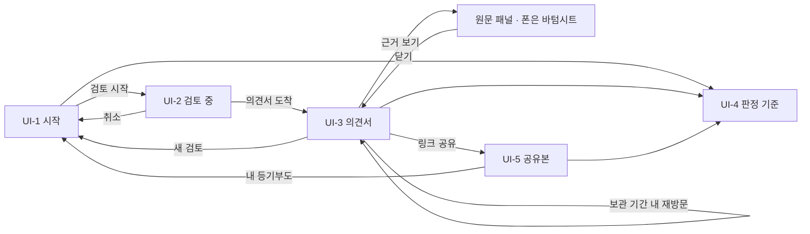

# 화면 설계 / 와이어프레임

## 0. 이 문서가 다루는 것

화면 5개의 배치·요소·규칙·시나리오, 폭에 따른 배치 변화, 공통 디자인 토큰.

**3줄 요약.** 시작 → 검토 중 → 의견서 세 화면이 한 흐름이다. 검토 중 화면은 에이전트의 문장이 흐르는 타임라인이고, 질문이 오면 카드가 끼어든다. 의견서는 등급 아래 숫자·근거·할 일·특약 순서이고, 데스크톱에서는 등기부 원문이 오른쪽에 함께 열려 있다.

**웹 서비스다.** 앱은 만들지 않는다. 앱으로 제출해도 대회 규정상 웹 데모 링크가 따로 필요하고, 제출까지 스토어 심사 기간이 없다. 이 결정이 2절 반응형 기준의 전제다.

### 0.1 형식

와이어프레임. 화면마다 배치(HTML 뼈대)·요소 표·규칙·시나리오 네 절을 둔다. 시각 디자인은 4절 토큰으로 통일하고 별도 시안 문서를 만들지 않는다. 배치는 폰 기준을 먼저 적고, 데스크톱에서 달라지는 화면만 뼈대를 하나 더 둔다.

## 1. 유스케이스 대응

| 화면 | 주 유스케이스 | 부 유스케이스 | 주로 보여주는 개념 |
|---|---|---|---|
| [[#UI-1]] 시작 | [[JSD-UC-001#UC-A1]] 1~2, [[JSD-UC-001#UC-A2]] | [[JSD-UC-001#UC-S10]] | [[JSD-DOM-001#PlannedLease]] [[JSD-DOM-001#SampleCase]] |
| [[#UI-2]] 검토 중 | [[JSD-UC-001#UC-A1]] 3~6, [[JSD-UC-001#UC-A3]] | [[JSD-UC-001#UC-S9]] | [[JSD-DOM-001#ReviewRecord]] [[JSD-DOM-001#Question]] |
| [[#UI-3]] 의견서 | [[JSD-UC-001#UC-A1]] 8, [[JSD-UC-001#UC-A4]] | [[JSD-UC-001#UC-S8]] | [[JSD-DOM-001#Grade]] [[JSD-DOM-001#RiskSignal]] [[JSD-DOM-001#Opinion]] |
| [[#UI-4]] 판정 기준 | [[JSD-PRD-001#R6]] 공개 | [[JSD-UC-001#UC-S3]] | [[JSD-DOM-001#OfficialCriterion]] |
| [[#UI-5]] 공유본 | [[JSD-UC-001#UC-A4]] | | [[JSD-DOM-001#SharedOpinion]] |

## 2. 반응형 기준

심사위원은 데스크톱, 투표자는 폰으로 본다고 가정한다. 두 폭을 모두 1급으로 설계하고, 태블릿은 폰 배치를 넓힌 것으로 처리한다.

| 폭 | 이름 | 본문 폭 | 배치가 달라지는 곳 |
|---|---|---|---|
| ≤ 599px | 폰 | 전폭 − 좌우 16px | 기준 배치. 근거는 바텀시트, 할 일은 탭, 숫자 카드 2열 |
| 600~1023px | 태블릿 | 680px 가운데 | 폰 배치 그대로. 폼 입력과 숫자 카드만 2열 유지 |
| ≥ 1024px | 데스크톱 | 화면별 2~3열, 최대 1200px | 아래 표 |
| ≥ 1440px | 와이드 | 1200px 가운데 고정 | 더 늘리지 않는다. 남는 폭은 여백 |

데스크톱에서 바뀌는 것.

| 화면 | 데스크톱 배치 | 이유 |
|---|---|---|
| [[#UI-1]] | 왼쪽 설명·예시 카드 / 오른쪽 420px 폼 카드 + 아래 4단계 띠 | 폼 전체가 첫 화면에 들어온다 |
| [[#UI-2]] | 왼쪽 타임라인 / 오른쪽 360px에 요약·질문 카드 고정 | 질문이 스크롤 밖으로 밀리지 않는다 |
| [[#UI-3]] | 왼쪽 168px 목차 레일 / 가운데 본문 / 오른쪽 348px 등기부 원문 패널 상시 노출 | 수치와 원문을 한 화면에서 대조한다 |
| [[#UI-4]] | 왼쪽 목차 레일 / 오른쪽 규칙표 2열 | 표 넷을 한 화면에 |
| [[#UI-5]] | 760px 한 열 | 읽기 전용이라 열을 나눌 이유가 없다 |

웹 제출 요건에서 온 규칙 (2026-09-16 대회 공지).

- 로그인·회원가입 화면이 없다. 시크릿 모드로 첫 URL을 열면 [[#UI-1]]이 바로 뜬다
- 예시 등기부 3건이 첫 화면 접힘선 위에 있다. 심사자가 파일 없이 핵심 기능을 끝까지 볼 수 있어야 한다
- 로컬 저장이 막힌 브라우저에서도 모든 화면이 정상 동작한다. 저장은 편의 기능일 뿐이다
- 설치·API 키·도커 안내를 화면 어디에도 두지 않는다
- 진행 스트림이 프록시에 막히면 짧은 주기 조회로 자동 전환한다

## 3. 화면 목록

### UI-1 시작

페이지 `/`. 목적: 10초 안에 무슨 서비스인지 알고, 예시 파일이나 내 등기부로 검토를 시작한다. 주 유스케이스: [[JSD-UC-001#UC-A1]] [[JSD-UC-001#UC-A2]]. 진입: 대회 링크·직접 접속. 이탈: 검토 시작 → [[#UI-2]].

#### 배치 (폰)

```html
<header data-el="1">보증금지킴 · 판정 기준</header>
<section data-el="2">한 줄 설명 + 두 줄 부연</section>
<section data-el="3">예시 등기부 카드 3개 (세로)</section>
<form data-el="4">
  <div data-el="5">드롭존 + 다른 파일 선택 · 사진 찍어 올리기</div>
  <div data-el="6">보증금(만원) · 계약 형태 토글</div>
  <div data-el="7">계약 상대방 이름 (선택, 접힘)</div>
  <div data-el="8">미저장 고지 한 줄</div>
  <button data-el="9">검토 시작</button>
</form>
<footer data-el="10">AI 고지 · 기준 출처</footer>
```

#### 배치 (데스크톱)

```html
<header data-el="1">보증금지킴 · 판정 기준 · 예시로 체험하기</header>
<div class="two-column">
  <section class="left">
    <p data-el="2b">로그인 없음 · 파일은 저장하지 않습니다</p>
    <section data-el="2">한 줄 설명 + 두 줄 부연</section>
    <section data-el="3">예시 등기부 카드 3개</section>
  </section>
  <form data-el="4" class="right card">
    <div data-el="5"></div><div data-el="6"></div>
    <div data-el="7"></div><div data-el="8"></div>
    <button data-el="9">검토 시작</button>
  </form>
</div>
<section data-el="11">4단계 띠: 읽기 · 확인 · 질문 · 의견서</section>
<footer data-el="10"></footer>
```

#### 요소

| # | 이름 | 종류 | 보여주는 것 | 누르면 |
|---|---|---|---|---|
| 1 | 헤더 | 고정 | 서비스명, 판정 기준. 데스크톱은 "예시로 체험하기" 앵커 추가 | [[#UI-4]] / 3으로 스크롤 |
| 2 | 설명 | 텍스트 | "등기부 올리면 LH 권리분석 기준으로 검토해 드립니다" + 위험 여부와 준비할 것 | — |
| 2b | 안심 알약 | 배지 | "로그인 없음 · 파일은 저장하지 않습니다". 데스크톱·태블릿만 | — |
| 3 | 예시 카드 ×3 | 카드 | 집 종류 아이콘, 제목(아파트·보통의 집 / 신축 빌라 / 다가구·세입자 여럿), 한 줄 상황, 자동 채움값(지역·보증금) | 파일이 5에 첨부되고 6이 시나리오 값으로 채워짐. 카드에 "첨부됨" |
| 4 | 폼 | 폼 | 데스크톱은 오른쪽 420px 카드로 분리 | |
| 5 | 드롭존 | 파일 입력 | 안내 문구 / 첨부 후 파일명·쪽수·건물 종류. 아래 "다른 파일 선택 · 사진 찍어 올리기" | 파일 선택 · 카메라 |
| 6 | 보증금·형태 | 숫자 + 토글 | 만원 단위, 천 단위 구분. 전세 / 반전세·월세 | — |
| 7 | 상대방 이름 | 텍스트 (접힘) | "계약서에 적힌 임대인 이름" | 펼침 |
| 8 | 고지 | 텍스트 | "올린 파일은 저장하지 않고 처리 후 바로 지웁니다" | — |
| 9 | 검토 시작 | 주 버튼 | 파일·보증금 전에는 비활성 | 세션 생성 → [[#UI-2]] |
| 10 | 푸터 | 텍스트 | AI 생성 고지, LH·HUG·서울시 출처 | — |
| 11 | 4단계 띠 | 설명 | 읽기 → 확인 → 질문 → 의견서. 각 한 줄 설명. 데스크톱·태블릿만 | — |

#### 규칙

- 데스크톱에서 폼 카드 전체가 첫 화면 안에 들어온다. 히어로가 화면 높이를 다 먹지 않는다
- 형식·크기·쪽수 초과는 드롭존 아래 빨간 한 줄로 즉시 표시한다 (클라이언트 검사 + 서버 재검사, [[JSD-UC-001#UC-S10]])
- 하루 요청 한도를 넘으면 9를 누른 뒤 토스트로 알린다. 예시 파일은 한도에서 제외한다
- "사진 찍어 올리기"는 카메라를 여는 입력이며 데스크톱에서는 숨긴다
- 예시 카드로 첨부한 뒤 보증금을 바꿔도 그대로 진행한다. 조건이 달라지면 실제로 다시 처리된다
- 헤더 링크 외에 이 화면에서 나가는 길은 없다

#### 시나리오

**S-1 예시로 시작** — [[JSD-SCN-001#S4]] 1~2
1. "신축 빌라" 카드를 누르면 드롭존에 예시 파일이 붙고 보증금·계약 형태가 채워진다
2. 검토 시작 → [[#UI-2]]

**S-2 내 등기부로 시작** — [[JSD-SCN-001#S1]] 1
1. PDF를 끌어다 놓으면 파일명과 쪽수가 보인다
2. 보증금과 계약 형태를 넣고 검토 시작

### UI-2 검토 중

페이지 `/review/{id}`. 목적: 에이전트가 무엇을 왜 확인하는지 실시간으로 보고, 질문에 답한다. 주 유스케이스: [[JSD-UC-001#UC-A1]] [[JSD-UC-001#UC-A3]]. 진입: [[#UI-1]]. 이탈: 의견서 완성 → [[#UI-3]] 자동 전환, 취소 → [[#UI-1]].

#### 배치 (폰)

```html
<header data-el="1">보증금지킴 · 진행 단계(읽기→확인→판정→의견서)</header>
<section data-el="2">요약: 집 종류 · 보증금 · 경과 시간</section>
<div data-el="7">재생 띠 또는 재연결 띠 (해당할 때만)</div>
<ol data-el="3">
  <li data-el="4">이벤트 줄 (아이콘 · 문장 · 시각)</li>
</ol>
<section data-el="5">질문 카드 (화면 아래 고정)</section>
<footer data-el="6">검토 취소</footer>
```

#### 배치 (데스크톱)

```html
<header data-el="1"></header>
<div class="two-column">
  <ol data-el="3" class="left">…이벤트 줄…</ol>
  <aside class="right sticky">
    <section data-el="2"></section>
    <section data-el="5">질문 카드</section>
    <footer data-el="6">검토 취소</footer>
  </aside>
</div>
```

#### 요소

| # | 이름 | 종류 | 보여주는 것 | 누르면 |
|---|---|---|---|---|
| 1 | 헤더 | 고정 | 4단계 진행. 서버가 주는 단계 값으로 현재 단계를 강조. 폰은 축약, 데스크톱은 전체 이름 | — |
| 2 | 요약 | 카드 | 집 종류(표제부 판정 뒤 채움, 그전엔 "판별 중"), 보증금·형태, 경과 시간 | — |
| 3 | 타임라인 | 목록 | 이벤트를 위에서 아래로 추가. 자동 스크롤. 지난 줄은 회색으로 눌러 현재 줄을 도드라지게 | — |
| 4 | 이벤트 줄 | 항목 | 아이콘 4종(판단·도구·결과·대체와 실패), 사람이 읽는 문장, 시각. 둘째 줄에 결과 요약 | 펼치면 원본 데이터 |
| 5 | 질문 카드 | 카드 | "질문 n / 최대 5", 질문, 왜 묻는지 한 줄, 확인 방법 링크, 입력(선택·숫자·글·파일), 답변·건너뛰기 | 답변 → 카드가 답변 줄로 바뀜 |
| 6 | 취소 | 보조 버튼 | | 확인 뒤 종료 → [[#UI-1]] |
| 7 | 상태 띠 | 알림 | 캐시 재생이면 "앞서 처리된 결과를 보여드립니다", 끊기면 "다시 연결 중" | — |

질문 카드 변형 ([[JSD-PRD-001#R8]], [[JSD-DOM-001#Question]]).

| 종류 | 입력 | 문구 |
|---|---|---|
| 위반건축물 | 예 / 아니오 / 모름 | 정부24 건축물대장에 '위반건축물' 표시가 있나요? |
| 시세 | 숫자(만원) / 모름 | 중개사가 말한 이 집 시세는 얼마인가요? |
| 세입자 | 가구 수 + 보증금 합계 / 모름 | 다른 세입자가 몇 가구고, 아는 보증금 합계는? |
| 토지 등기부 | 파일 | 다가구는 토지 등기부도 봐야 합니다. 올려 주세요 |
| 대리인 | 본인 / 위임장 있음 / 없음 / 모름 | 계약 상대방이 소유자 본인인가요? |
| 임대인 유형 | 개인 / 법인 / 모름 | 임대인이 개인인가요, 법인인가요? |

#### 규칙

- 도구 호출마다 최소 한 줄. 병렬 호출은 한 줄로 묶고 결과는 각각 한 줄로 낸다 ([[JSD-PRD-001#R12]])
- 문장은 서버가 만든 것을 그대로 쓴다. 화면에서 가공하지 않는다
- 질문 카드는 폰에서 화면 아래, 데스크톱에서 오른쪽 열에 고정한다. 어느 폭에서도 스크롤 없이 보인다
- 답하기 전에는 새 이벤트가 오지 않는다. 무응답이 이어지면 "답변 없이 진행합니다" 줄로 바뀐다
- 연결이 끊기면 마지막으로 받은 지점부터 다시 잇고 재연결 띠를 띄운다. 두 번 실패하면 짧은 주기 조회로 전환한다
- 의견서가 준비되면 1초 뒤 [[#UI-3]]으로 넘어간다. 오류로 끝나면 마지막 줄이 빨간 줄이 되고 "처음으로"가 뜬다
- 캐시 재생이면 기록된 순서 그대로 일정 간격으로 재생한다 ([[JSD-UC-001#UC-A2]])

#### 시나리오

**S-1 질문에 답하기** — [[JSD-SCN-001#S2]] 5
1. "건축물대장을 조회합니다 → 다세대주택, 12세대" 줄이 뜬다
2. 질문 카드 "위반건축물 표시가 있나요?" 예 / 아니오 / 모름
3. "아니오" → 카드가 "답변: 위반건축물 아님"으로 바뀌고 타임라인이 이어진다

**S-2 토지 등기부 요청** — [[JSD-SCN-001#S3]] 2
1. 질문 카드에 파일 입력이 뜬다
2. 올리면 "토지 등기부를 읽습니다" 줄이 이어진다

### UI-3 의견서

페이지 `/review/{id}/report`. 목적: 등급과 근거를 보고, 할 일과 특약을 가져간다. 주 유스케이스: [[JSD-UC-001#UC-A1]] [[JSD-UC-001#UC-A4]]. 진입: [[#UI-2]] 완료 또는 보관 기간 내 재방문. 이탈: 저장·공유, 새 검토 → [[#UI-1]].

#### 배치 (폰)

```html
<header data-el="1">보증금지킴 · 새 검토 · 판정 기준</header>
<section data-el="2">등급 배지 + 결론 한 문장 + AI 고지</section>
<div data-el="11">확인 못 한 항목 N개 띠 (있을 때만)</div>
<section data-el="3">숫자 카드: 부채비율 · 선순위 · 보증금 · 주택 가격(출처)</section>
<section data-el="4">위험 신호 카드 목록 (신호 · 설명 · 출처 · 근거 보기)</section>
<section data-el="6">확인한 것 표</section>
<section data-el="7">단계별 할 일 탭 (계약 전 · 당일 · 잔금 · 입주 후)</section>
<section data-el="8">특약 (복사) · 물어볼 것 (복사)</section>
<details data-el="9">검토 기록</details>
<footer data-el="10">PDF 저장 · 링크 공유 · 전문가 확인 권고</footer>
<aside data-el="5">원문 바텀시트 (근거 보기를 눌렀을 때)</aside>
```

#### 배치 (데스크톱)

```html
<header data-el="1">보증금지킴 · PDF 저장 · 링크 공유 · 판정 기준 · 새 검토</header>
<div class="three-column">
  <nav data-el="12" class="rail sticky">판정 · 숫자 · 신호 · 확인한 것 · 할 일 · 특약 · 물어볼 것 · 기록</nav>
  <main class="center">
    <section data-el="2"></section><div data-el="11"></div>
    <section data-el="3"></section><section data-el="4"></section>
    <section data-el="6"></section><section data-el="7"></section>
    <section data-el="8"></section><details data-el="9"></details>
  </main>
  <aside data-el="5" class="right sticky">등기부 원문 패널 (항상 열림, 근거 1/N 이동)</aside>
</div>
<footer data-el="10"></footer>
```

#### 요소

| # | 이름 | 종류 | 보여주는 것 | 누르면 |
|---|---|---|---|---|
| 1 | 헤더 | 고정 | 폰은 새 검토·판정 기준. 데스크톱은 PDF 저장·링크 공유까지 올린다 | 각 동작 |
| 2 | 등급 | 배지 + 텍스트 | 색·기호·글자 셋 다로 등급 표시. 결론 한 문장. "AI가 읽고 정리한 결과입니다" + 규칙 버전 | — |
| 3 | 숫자 카드 | 카드 | 부채비율(70·90 경계 막대), 선순위 합계, 보증금, 주택 가격과 출처. 폰 2열, 데스크톱 3열 | 가격 "직접 입력" → 인라인 편집 → 재판정 |
| 4 | 신호 카드 | 목록 | 왼쪽 띠 색으로 심각도. 제목(쉬운 말), 설명, 출처, 근거 보기. 데스크톱은 근거 위치까지 표시 | 근거 보기 → 5 |
| 5 | 원문 패널 | 사이드 / 바텀시트 | 등기부 원문. 강조 블록은 노란 배경 + 왼쪽 띠. 상단에 "근거 1 / N ‹ ›" | 이동 · 닫기 |
| 6 | 확인한 것 | 표 | 항목 · 결과 알약(확인함 · 확인 못 함 · 해당 없음) · 근거 | 행 → 5 |
| 7 | 할 일 | 탭 + 체크리스트 | 단계별 개수 표시. 할 일, 어디서 어떻게, 비용, "↳ 왜". 체크 상태는 브라우저에만 저장 | 체크 |
| 8 | 특약·질문 | 텍스트 블록 | 제목·본문(채운 값은 굵게)·출처. 물어볼 것 3~5개 | 복사 → 토스트 |
| 9 | 검토 기록 | 접힘 | 요약 한 줄(도구 호출 수·교정 수). 펼치면 [[#UI-2]] 타임라인 전체 | 펼침 |
| 10 | 푸터 | 버튼 | PDF 저장, 링크 공유, 전문가 확인 권고, 삭제 시점 | 각 동작 |
| 11 | 확인 못 함 띠 | 알림 | "확인 못 한 항목 N개가 있습니다 — 할 일에 넣었습니다" | 할 일로 이동 |
| 12 | 목차 레일 | 내비 | 절 이름 + 개수. 현재 절 강조. 데스크톱만 | 해당 절로 이동 |

#### 규칙

- 등급과 수치는 서버 값 그대로 쓴다. 화면에서 계산하지 않는다 ([[JSD-DOM-001#Opinion]])
- 데스크톱은 원문 패널이 처음부터 열려 있고, 근거 보기는 패널 안에서 스크롤·강조만 한다. 폰은 바텀시트가 화면 높이의 78%까지 올라온다
- 근거 보기는 3초 안에 강조한다 ([[JSD-PRD-001#R13]])
- 원문이 삭제된 뒤에는 패널 자리에 "원문은 삭제됐습니다"를 두고 근거 보기를 비활성한다
- 말소된 등기 항목은 회색 취소선으로 구분한다
- 확인 못 함에서 나온 할 일은 각 단계 맨 위에 오고 "↳ 왜"를 붙인다
- 추출값 수정은 인라인 편집 → 확인 → 판정 다시 → 숫자·등급·신호·할 일 갱신. 검토 기록에 "직접 입력" 줄이 남는다
- PDF 저장은 인쇄 레이아웃으로 한다. 목차 레일·원문 패널·검토 기록은 인쇄에서 뺀다
- 근거 보기는 키보드로도 닿아야 한다. 누르면 패널로 초점이 옮겨가고 Esc로 돌아온다

#### 시나리오

**S-1 근거 확인** — [[JSD-SCN-001#S4]] 5
1. "근저당이 두 달 전에 설정됨" 카드의 근거 보기를 누른다
2. 데스크톱은 오른쪽 패널에서 을구 해당 행이 강조된다. 폰은 바텀시트가 올라온다

**S-2 특약 복사** — [[JSD-SCN-001#S2]] 10
1. 특약 블록의 복사를 누르면 토스트 "복사됨"

**S-3 시세 직접 입력** — [[JSD-SCN-001#S1]] 변형
1. 주택 가격 카드의 "직접 입력"을 누르고 금액을 넣는다
2. 숫자·등급·신호가 갱신되고 출처가 "직접 입력"으로 바뀐다

### UI-4 판정 기준

페이지 `/criteria`. 목적: 등급 규칙과 출처를 그대로 공개한다. 주 유스케이스: [[JSD-PRD-001#R6]] 공개. 진입: 헤더·의견서 링크. 이탈: 뒤로.

#### 배치

```html
<header data-el="1">보증금지킴 · 의견서로 · 새 검토</header>
<div class="two-column">
  <nav data-el="6" class="rail">목차 (데스크톱만)</nav>
  <article>
    <p data-el="5">규칙 버전과 기준일</p>
    <section data-el="2">등급 규칙표</section>
    <section data-el="3">즉시 위험 · 주의 신호표 + 출처</section>
    <section data-el="4">건물 종류별 필수 검토 · 가격 산정 순서 · 최우선변제금</section>
  </article>
</div>
```

#### 요소

| # | 이름 | 종류 | 보여주는 것 | 누르면 |
|---|---|---|---|---|
| 1 | 헤더 | 고정 | 돌아가기, 새 검토 | 이전 화면 / [[#UI-1]] |
| 2~4 | 규칙표 | 정적 표 | [[JSD-PRD-001#R5]] [[JSD-PRD-001#R6]] [[JSD-PRD-001#R11]]의 표를 그대로 | 출처 링크 → 새 탭 |
| 5 | 버전 | 텍스트 | 규칙 버전과 기준일 | — |
| 6 | 목차 레일 | 내비 | 절 이름. 데스크톱만 | 해당 절로 |

#### 규칙

- 표 내용은 코드의 규칙 상수에서 만들어 보여준다. 문서와 코드가 어긋나지 않게 한다
- 폰은 한 열로 세로 나열하고, 표마다 가로 스크롤 컨테이너를 둔다
- 의견서의 출처 표기가 이 페이지의 같은 줄로 이어진다 ([[JSD-DOM-001#OfficialCriterion]])

#### 시나리오

**S-1 기준 확인** — [[JSD-SCN-001#S4]] 6
1. 의견서에서 판정 기준을 누른다
2. 등급 규칙표와 LH·HUG 출처를 본다

### UI-5 공유본

페이지 `/s/{token}`. 목적: 가족·지인이 마스킹된 의견서를 본다. 주 유스케이스: [[JSD-UC-001#UC-A4]]. 진입: 공유 링크. 이탈: 새 검토 링크만.

#### 배치

```html
<header data-el="1">보증금지킴 · 내 등기부 검토하기</header>
<div data-el="2">공유된 의견서 · N일 후 만료 · 이름과 상세 주소는 가려져 있습니다</div>
<section data-el="3">등급 배지 + 결론 + 지역·건물 종류·검토일</section>
<section data-el="4">숫자 카드</section>
<section data-el="5">위험 신호 (근거 보기 없음)</section>
<section data-el="6">단계별 할 일 (체크 없음)</section>
<footer data-el="7">내 등기부도 검토하기</footer>
```

#### 요소

| # | 이름 | 종류 | 보여주는 것 | 누르면 |
|---|---|---|---|---|
| 2 | 만료 띠 | 알림 | 남은 기간과 마스킹 안내 | — |
| 3~6 | 본문 | [[#UI-3]]과 같은 부품 | 원문·검토 기록·저장·공유를 뺀 읽기 전용 | — |
| 5 | 신호 | 카드 | 근거 자리에 회색 알약 "근거 보기 없음" | — |
| 7 | 새 검토 | 주 버튼 | | [[#UI-1]] |

#### 규칙

- 이름·주민번호·상세 주소가 없다. 주소는 동까지만 ([[JSD-PRD-001#N1]])
- 근거 보기와 원문 접근이 없다. 구조는 유지하고 자리만 회색 알약으로 남긴다
- 체크박스가 없다. 읽기 전용이다
- 만료 뒤에는 "만료된 링크입니다"와 새 검토 버튼만 남는다

#### 시나리오

**S-1 가족에게 보여주기** — [[JSD-UC-001#UC-A4]]
1. 의견서에서 링크 공유를 누르고 링크를 보낸다
2. 받은 사람이 열면 마스킹된 의견서가 뜬다

## 4. 공통 틀

### 4.1 디자인 토큰

| 토큰 | 값 | 용도 |
|---|---|---|
| `--bg` | #FFFFFF | 배경 |
| `--fg` | #1A1A1A | 본문, 선택된 토글 |
| `--muted` | #6B7280 | 보조 텍스트 |
| `--line` | #E5E7EB | 구분선·카드 테두리 |
| `--primary` | #1D4ED8 | 주 버튼, 링크, 선택 |
| `--safe` | #15803D (배경 #DCFCE7) | 안전, 확인함 |
| `--caution` | #B45309 (배경 #FEF3C7) | 주의, 확인 못 함 |
| `--danger` | #B91C1C (배경 #FEE2E2) | 위험, 즉시 위험 신호 |
| `--highlight` | #FDE68A | 원문 강조 블록 |

등급은 색·기호(✓ ! ✕)·글자 셋 다로 표시한다. 색만으로 뜻을 전달하지 않는다.

### 4.2 글꼴·간격·폭

- 글꼴 Pretendard → Noto Sans KR → system-ui. 본문 15px, 폰 제목 22px, 데스크톱 제목 34px, 숫자 카드 26px, 원문 표 10.5px 고정폭
- 간격 4·8·12·16·24·32·48px. 카드 모서리 12px(데스크톱 폼 카드 16px), 버튼 8px, 알약 999px
- 터치 대상 최소 44px. 데스크톱 클릭 대상 36px 이상
- 숫자는 고정폭 숫자로 정렬한다
- 금액 표기: 1억 이상은 "2.1억", 미만은 "8,000만원". 서버가 주는 만원 값을 표시만 바꾼다

### 4.3 공통 요소

- 헤더는 모든 화면 공통. 데스크톱 60px, 폰 52px
- 토스트는 화면 아래 가운데 3초
- 로딩은 버튼 안 회전 표시. 페이지 전환은 없다
- 오류 화면은 한 줄 이유 + "처음으로"
- 초점 표시는 2px 파란 외곽선. 키보드만으로 업로드·답변·근거 보기·복사가 가능해야 한다
- 지원 브라우저: 크롬·엣지·사파리 최신, iOS 사파리 16 이상. 인쇄는 A4 세로 기준

## 5. 화면 흐름



## 6. 미결사항

- [ ] [[#UI-2]] 진행 단계 네 개를 무엇으로 넘길지 — 마지막 도구 호출 이름으로 서버가 단계 값을 함께 주는 안
- [ ] 추출값 직접 입력을 시세만 열지, 확인한 것 표의 근저당 금액까지 열지
- [ ] 데스크톱 원문 패널을 처음부터 열어 둘지, 근거 보기를 눌렀을 때만 열지 (이 문서는 열어 두는 안)
- [ ] 진행 스트림이 막혔을 때 폴백을 짧은 주기 조회로 둘지, 재접속만 반복할지
- [ ] PDF 저장을 인쇄 레이아웃으로 갈지 서버 렌더링으로 갈지 (이 문서는 인쇄 레이아웃)
- [ ] 예시 카드 아이콘을 이모지로 둘지 일러스트를 만들지
- [ ] 홈 화면에 추가(매니페스트·아이콘)를 넣을지
- [ ] 폰에서 원문 바텀시트 대신 전체 화면으로 갈지
