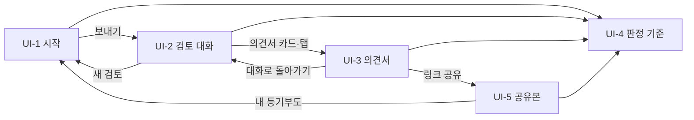

# 화면 설계 / 와이어프레임

## 0. 이 문서가 다루는 것

화면 5개의 배치·요소·규칙·시나리오와 공통 틀.

**3줄 요약.** 시작 화면에서 등기부와 보증금을 넣으면 검토는 **대화**로 흐른다. 에이전트가 판단과 도구 호출을 말풍선으로 내고, 문장 속 **인용**을 누르면 오른쪽 문서 패널이 등기부 해당 줄로 이동해 강조한다. 의견서는 화면을 바꾸지 않고 같은 패널의 탭으로 열리며, 공유·인쇄용 단독 페이지가 따로 있다.

**웹 서비스다.** 앱은 만들지 않는다. 앱으로 제출해도 대회 규정상 웹 데모 링크가 따로 필요하고 스토어 심사 기간이 없다.

**데스크톱을 먼저 확정한다.** 이 문서의 배치는 데스크톱 1240px 기준이다. 폰 배치는 대화형 전환으로 다시 그려야 하므로 6절 미결로 둔다.

### 0.1 형식

와이어프레임. 화면마다 메타 표 뒤에 배치(뼈대)·요소 표·규칙·시나리오 네 절을 둔다. 뼈대는 `div`와 클래스 이름으로 적고 `data-el` 번호가 요소 표와 이어진다. 시안은 흑백으로 그리고 색·서체는 4절 토큰으로 따로 정한다.

## 1. 유스케이스 대응

| 화면 | 주 유스케이스 | 부 유스케이스 | 주로 보여주는 개념 |
|---|---|---|---|
| [[#UI-1]] 시작 | [[JSD-UC-001#UC-A1]] 1~2, [[JSD-UC-001#UC-A2]] | [[JSD-UC-001#UC-S10]] | [[JSD-DOM-001#PlannedLease]] [[JSD-DOM-001#SampleCase]] |
| [[#UI-2]] 검토 대화 | [[JSD-UC-001#UC-A1]] 3~6, [[JSD-UC-001#UC-A3]] | [[JSD-UC-001#UC-S9]] | [[JSD-DOM-001#ReviewRecord]] [[JSD-DOM-001#Question]] [[JSD-DOM-001#RegistryEntry]] |
| [[#UI-3]] 의견서 | [[JSD-UC-001#UC-A1]] 8, [[JSD-UC-001#UC-A4]] | [[JSD-UC-001#UC-S8]] | [[JSD-DOM-001#Grade]] [[JSD-DOM-001#RiskSignal]] [[JSD-DOM-001#Opinion]] |
| [[#UI-4]] 판정 기준 | [[JSD-PRD-001#R6]] 공개 | [[JSD-UC-001#UC-S3]] | [[JSD-DOM-001#OfficialCriterion]] [[JSD-DOM-001#ChecklistItem]] |
| [[#UI-5]] 공유본 | [[JSD-UC-001#UC-A4]] | | [[JSD-DOM-001#SharedOpinion]] |

## 2. 형태와 폭

### 2.1 왜 대화인가

에이전트가 스스로 확인할 것을 정하는 제품이다. 진행 바와 타임라인은 "무엇이 끝났는지"만 보여주지만, 대화는 "무엇을 왜 보는지"를 문장으로 남긴다. 심사 기준의 AI 활용 적절성과 기획력이 같은 화면에서 드러난다. 검토가 끝난 뒤에도 사용자가 되물을 수 있어 일회성 보고서와 달라진다.

### 2.2 폭

| 폭 | 이름 | 배치 |
|---|---|---|
| 1240px 이상 | 데스크톱 (확정) | 화면별 2~3열. 대화 + 문서 패널 452 |
| 1024~1239px | 좁은 데스크톱 | 문서 패널을 380까지 줄인다. 그 아래로는 접는다 |
| 1024px 미만 | 태블릿·폰 | 미결. 문서 패널을 시트로 내릴지 탭으로 바꿀지 정하지 않았다 |

### 2.3 웹 제출 요건에서 온 규칙

2026-09-16 대회 공지에서 나온 제약이다.

- 로그인·회원가입 화면이 없다. 시크릿 모드로 첫 URL을 열면 [[#UI-1]]이 바로 뜬다
- 예시 등기부 3건이 첫 화면에 있다. 심사자가 파일 없이 핵심 기능을 끝까지 볼 수 있어야 한다
- 브라우저 저장이 막혀도 모든 화면이 정상 동작한다. 저장은 할 일 체크 같은 편의 기능뿐이다
- 설치·API 키·도커 안내를 화면 어디에도 두지 않는다

## 3. 화면 목록

| 화면 | 페이지 | 한 줄 목적 |
|---|---|---|
| [[#UI-1]] 시작 | `/` | 등기부와 보증금만 받아 대화로 넘긴다 |
| [[#UI-2]] 검토 대화 | `/review/{id}` | 에이전트가 무엇을 왜 확인하는지 대화로 보고, 답하고, 되묻는다 |
| [[#UI-3]] 의견서 | 패널 탭 · `/review/{id}/report` | 결과를 보고 할 일과 특약을 가져간다 |
| [[#UI-4]] 판정 기준 | `/criteria` | 등급이 어디서 나왔는지 그대로 공개한다 |
| [[#UI-5]] 공유본 | `/s/{token}` | 가족·지인이 마스킹된 의견서를 본다 |

## UI-1 시작

| 항목 | 내용 |
|---|---|
| 페이지 | `/` |
| 목적 | 등기부와 보증금만 받아 대화로 넘긴다 |
| 주 유스케이스 | [[JSD-UC-001#UC-A1]] [[JSD-UC-001#UC-A2]] |
| 진입 | 대회 링크 · 직접 접속 · [[#UI-5]] |
| 이탈 | 보내기 → [[#UI-2]] |

### 배치

```html
<div class="topbar" data-el="1">보증금지킴 · 판정 기준</div>
<div class="center-column">
  <div class="kicker" data-el="2b">LH 전세임대 권리분석 기준 그대로</div>
  <div class="title" data-el="2">이 집, 계약해도 될까요?</div>
  <div class="sub" data-el="2c">확인할 것을 스스로 정해 검토하고 의견서를 냅니다</div>
  <div class="composer" data-el="3">
    <div class="drop">드롭존 (비었을 때 점선)</div>
    <div class="row">보증금 · 계약 형태 · 임대인 이름 펼침 · 보내기</div>
  </div>
  <div class="hint" data-el="3b">파일과 보증금을 넣으면 검토가 시작됩니다 · 로그인 없음</div>
  <div class="samples" data-el="4">예시 등기부 카드 3개 (가로 3열)</div>
  <div class="privacy" data-el="5">미저장 고지</div>
</div>
<div class="footer" data-el="6">AI 고지 · 판정 기준 출처</div>
```

### 요소

| # | 이름 | 종류 | 보여주는 것 | 누르면 |
|---|---|---|---|---|
| 1 | 상단 바 | 고정 | 서비스명, 판정 기준. 다른 길은 없다 | [[#UI-4]] |
| 2 | 제목 | 텍스트 | "이 집, 계약해도 될까요?" 세입자의 질문을 그대로 | — |
| 2b | 기준 배지 | 배지 | "LH 전세임대 권리분석 기준 그대로" | — |
| 2c | 설명 | 텍스트 | 확인할 것을 스스로 정해 검토하고 의견서를 낸다는 한 문장 | — |
| 3 | 입력 상자 | 폼 | 드롭존, 보증금(만원), 계약 형태, 임대인 이름(접힘), 보내기. **[[#UI-2]]의 입력창과 같은 부품** | 보내기 → [[#UI-2]] |
| 3b | 상태 줄 | 텍스트 | 무엇이 빠졌는지 / 넘어간다는 안내. 오른쪽에 "로그인 없음 · 무료" | — |
| 4 | 예시 카드 ×3 | 카드 | 등기부 아이콘, 제목, 한 줄 상황, 지역·보증금·형태. 고르면 3이 채워지고 "선택됨" | 3에 첨부·값 채움 |
| 5 | 미저장 고지 | 텍스트 | 저장하지 않는다는 것과 보관 기간 | — |
| 6 | 푸터 | 텍스트 | AI 고지, 판정 기준 출처 4곳 | 새 탭 |

### 규칙

- 보내기는 파일과 보증금이 모두 있을 때만 활성된다. 그 전에는 3b가 무엇이 빠졌는지 알린다
- 입력 상자 전체가 첫 화면 접힘선 위에 들어온다
- 형식·크기·쪽수 초과는 입력 상자 아래 한 줄로 즉시 알리고 서버에서 다시 검사한다 ([[JSD-UC-001#UC-S10]])
- 등기부가 아니거나 파싱이 실패하면 보내기 후 입력 상자 아래 한 줄로 알린다. 검토가 만들어지지 않으므로 [[#UI-2]]로 넘어가지 않는다
- 예시 카드는 미리 만든 결과를 트는 것이 아니라 같은 파일을 실제로 읽는다. 문구에 그 사실을 적는다 ([[JSD-DOM-001#SampleCase]])
- 예시로 채운 뒤 보증금을 바꾸든 않든 에이전트가 매번 실제로 처리한다. 같은 파일이면 파싱 결과만 다시 쓴다
- 하루 요청 한도를 넘으면 보내기 후 알린다. 예시 파일은 한도에서 제외한다
- 증거 띠·4단계 설명·검토 항목 목록은 이 화면에 두지 않는다. 각각 [[#UI-2]]와 [[#UI-4]]가 맡는다

### 시나리오

**S-1 예시로 시작** — [[JSD-SCN-001#S4]] 1~2
1. "신축 빌라" 카드를 누르면 파일이 붙고 보증금 1억 8,000만원이 채워진다
2. 보내기 → [[#UI-2]]에서 첫 말풍선이 뜬다

**S-2 내 등기부로 시작** — [[JSD-SCN-001#S1]] 1
1. PDF를 끌어다 놓고 보증금을 입력한다
2. 보내기 → [[#UI-2]]

## UI-2 검토 대화

| 항목 | 내용 |
|---|---|
| 페이지 | `/review/{id}` |
| 목적 | 에이전트가 무엇을 왜 확인하는지 대화로 보고, 질문에 답하고, 되묻는다 |
| 주 유스케이스 | [[JSD-UC-001#UC-A1]] [[JSD-UC-001#UC-A3]] |
| 진입 | [[#UI-1]] |
| 이탈 | 새 검토 → [[#UI-1]] · 의견서 전체 화면 → [[#UI-3]] |

### 배치

```html
<div class="topbar" data-el="1">검토 대상 요약 · 도구/질문/경과 · 판정 기준 · 새 검토</div>
<div class="two-column">
  <div class="thread-col">
    <div class="thread" data-el="2">
      <div class="msg-agent" data-el="2a">에이전트 말풍선 (문장 + 인용 칩)</div>
      <div class="msg-tool" data-el="2b">도구 카드 (단독 또는 가로 3개)</div>
      <div class="msg-question" data-el="3">질문 카드</div>
      <div class="msg-user" data-el="2c">사용자 말풍선</div>
      <div class="msg-numbers" data-el="4">숫자 요약 네 칸</div>
      <div class="msg-report" data-el="5">의견서 카드</div>
    </div>
    <div class="composer" data-el="6">추천 질문 칩 · 첨부 · 입력란 · 보내기 · 범위 고지</div>
  </div>
  <div class="doc-panel" data-el="7">
    <div class="tabs">등기부(건물) · 토지 등기부 · 의견서</div>
    <div class="panel-head">인용 위치 · 인용 n/N 이동 · 닫기</div>
    <div class="sheet">원문 표 (강조된 줄)</div>
    <div class="usages">이 줄이 쓰인 곳</div>
  </div>
</div>
```

### 요소

| # | 이름 | 종류 | 보여주는 것 | 누르면 |
|---|---|---|---|---|
| 1 | 상단 바 | 고정 | 검토 대상 요약(집 종류·보증금·형태·지역), 도구 호출 수·질문 수·경과 시간, 판정 기준, 새 검토 | [[#UI-4]] / [[#UI-1]] |
| 2 | 대화 타래 | 목록 | 말풍선이 아래로 쌓인다. 자동 스크롤 | — |
| 2a | 에이전트 말풍선 | 항목 | 판단과 관찰을 사람이 읽는 문장으로. 사실 문장에는 인용 칩이 붙는다 | — |
| 2b | 도구 카드 | 카드 | 도구 이름, 상태(완료·실패·소요 시간), 결과 요약 두세 줄. 병렬 호출은 가로 3개 | 펼치면 원본 값 |
| 2c | 사용자 말풍선 | 항목 | 답변 또는 되묻기. 표식으로 구분 | — |
| 2d | 인용 칩 | 칩 | `을구 2번`처럼 등기부 위치. 선택된 칩은 반전 | 7이 그 줄로 이동·강조 |
| 3 | 질문 카드 | 카드 | "질문 n / 최대 5", 질문, 왜 묻는지, 선택지·숫자·글·파일 입력, 확인 방법 링크 | 답변 → 2c로 남음 |
| 4 | 숫자 요약 | 카드 | 부채비율·선순위·보증금·주택 가격. 합산 직후 한 번 | — |
| 5 | 의견서 카드 | 카드 | 등급 배지, 결론, 신호·확인 못 함 개수, 규칙 버전, 동작 버튼. 다시 쓴 판이면 판 번호와 다시 쓴 이유. 이전 판 카드는 흐려진다 | 전체 화면 → [[#UI-3]] |
| 6 | 입력창 | 폼 | 추천 질문 칩 3개, 첨부(토지 등기부 등), 입력란, 보내기. 아래 한 줄로 답변 범위 고지 | 보내면 2c |
| 7 | 문서 패널 | 사이드 | 탭 3개, 현재 인용 위치, 인용 n/N 이동, 원문 표(강조. 말소 취소선은 파싱 결과에 남지 않는다), "이 줄이 쓰인 곳" | 이동·닫기 |

### 규칙

- 에이전트의 사실 문장은 인용 칩을 달거나 도구 카드로 근거를 보인다. 근거 없는 문장은 쓰지 않는다 ([[JSD-PRD-001#R9]])
- 인용 칩을 누르면 3초 안에 문서 패널이 그 줄로 이동해 강조한다. 선택된 칩과 강조된 줄은 항상 한 쌍이다
- 한 문장에 인용이 여럿이면 패널 머리의 "인용 n / N"으로 순회한다
- 패널 아래 "이 줄이 쓰인 곳"은 그 등기 항목이 합산·신호·특약 중 어디에 쓰였는지 되짚는다. 인용은 양방향이다
- 질문이 뜨면 답하기 전까지 다음 말풍선이 오지 않는다. 5분 무응답이면 "답변 없이 진행합니다"로 넘어간다 ([[JSD-PRD-001#R8]])
- 사용자 입력은 되묻기·값 수정·서류 추가에만 쓴다. 등급과 수치를 바꿔 달라는 요청은 거절하고 이유를 말한다
- 올린 서류가 등기부가 아니거나 파싱이 실패하면 입력창이나 질문 카드 아래 한 줄로 알린다. 대화에 남지 않고 패널 탭도 생기지 않으며 다시 올릴 수 있다
- 답은 등기부와 조회 결과 안에서만 한다. 밖의 사실을 말하지 않는다 ([[JSD-PRD-001#R10]])
- 도구 호출마다 최소 한 줄. 병렬 호출은 한 카드 묶음으로 내고 결과는 각각 적는다 ([[JSD-PRD-001#R12]])
- 연결이 끊기면 마지막 말풍선부터 다시 잇는다. 스트림이 막히면 짧은 주기 조회로 전환한다
- 보관 기간 24시간이 지나면 원문·대화·의견서가 함께 지워진다. 열려 있던 화면에서는 인용 칩이 비활성되고 만료 안내를 띄운다. 다시 열면 오류 화면만 뜬다

### 시나리오

**S-1 질문에 답하기** — [[JSD-SCN-001#S2]] 5
1. 도구 카드 3개(실거래가 실패·건축물대장·명단)가 한 묶음으로 뜬다
2. 질문 카드 "위반건축물 표시가 있나요?" → "아니오"
3. 사용자 말풍선이 남고 에이전트가 합산으로 넘어간다

**S-2 되묻기**
1. 의견서가 나온 뒤 "근저당이 두 달 전에 설정된 게 왜 문제인가요?"라고 입력한다
2. 에이전트가 이유를 설명하고 해당 인용 칩을 강조한다. 패널이 을구 2번으로 이동한다

**S-3 토지 등기부 추가** — [[JSD-SCN-001#S3]] 2
1. 질문 카드가 파일 입력으로 뜨거나 사용자가 첨부로 올린다
2. 패널에 "토지 등기부" 탭이 생기고 대화가 이어진다

## UI-3 의견서

| 항목 | 내용 |
|---|---|
| 페이지 | [[#UI-2]] 문서 패널의 탭 · `/review/{id}/report` |
| 목적 | 결과를 보고 할 일과 특약을 가져간다 |
| 주 유스케이스 | [[JSD-UC-001#UC-A1]] [[JSD-UC-001#UC-A4]] |
| 진입 | [[#UI-2]]의 의견서 카드·탭 · 보관 기간 내 재방문 |
| 이탈 | 대화로 돌아가기 · 공유 · 인쇄 |

의견서는 두 곳에 산다. **패널 탭**은 대화를 떠나지 않고 접어서 보는 것이고, **단독 페이지**는 공유·인쇄·재방문용으로 펼쳐서 보는 것이다. 같은 의견서다.

### 배치

단독 페이지 기준. 패널 탭은 같은 절을 접어서 담는다.

```html
<div class="topbar" data-el="1">검토 대상 요약 · 대화로 돌아가기 · PDF 저장 · 링크 공유 · 판정 기준</div>
<div class="three-column">
  <div class="rail" data-el="2">목차: 판정 · 숫자 · 신호 · 확인한 것 · 할 일 · 특약 · 물어볼 것 | 검토 과정: 대화 전체 · 도구 호출</div>
  <div class="report-body">
    <div class="verdict" data-el="3">등급 배지 · 결론(인용 포함) · 규칙 버전 · 후검증 교정 수</div>
    <div class="unknown-band" data-el="11">확인 못 한 항목 N개 띠</div>
    <div class="numbers" data-el="4">숫자 네 칸 (부채비율 눈금 70·90)</div>
    <div class="signals" data-el="5">위험 신호 카드 (제목 · 설명 · 출처 · 근거 인용)</div>
    <div class="checked" data-el="6">확인한 것 표 (항목 · 근거 인용 · 결과)</div>
    <div class="todos" data-el="7">단계별 할 일 탭 + 체크리스트</div>
    <div class="clauses" data-el="8">특약 · 물어볼 것 (복사)</div>
    <div class="print-note" data-el="9">인쇄 안내</div>
  </div>
  <div class="evidence-panel" data-el="10">강조된 줄 · 인용 n/N · 이 줄이 쓰인 곳</div>
</div>
```

### 요소

| # | 이름 | 종류 | 보여주는 것 | 누르면 |
|---|---|---|---|---|
| 1 | 상단 바 | 고정 | 검토 대상 요약, 대화로 돌아가기, PDF 저장, 링크 공유, 판정 기준 | 각 동작 |
| 2 | 목차 레일 | 내비 | 절 이름 + 개수. 아래에 검토 과정(대화 전체·도구 호출 수) | 절 이동 / [[#UI-2]] |
| 3 | 판정 | 배지 + 문장 | 등급을 기호·글자로 함께. 결론 문장과 인용. 규칙 버전, 후검증 교정 수. 다시 쓴 판이면 "n판 · 다시 쓴 이유"와 대화의 그 자리로 가는 링크 | 인용 → 10 / 이유 → [[#UI-2]] |
| 4 | 숫자 네 칸 | 카드 | 부채비율(70·90 눈금), 선순위 합계, 보증금, 주택 가격과 출처 | 가격 직접 입력 → 재판정 |
| 5 | 위험 신호 | 카드 | 제목(쉬운 말), 설명, 공식 출처, 근거 인용. 즉시 위험은 굵은 띠 | 인용 → 10 |
| 6 | 확인한 것 | 표 | 항목 · 근거 인용 · 결과(확인함·대체·확인 못 함·해당 없음) | 인용 → 10 |
| 7 | 단계별 할 일 | 탭 + 목록 | 단계별 개수. 할 일, 어디서 어떻게, 비용, "↳ 왜". 확인 못 함에서 온 항목이 맨 위 | 체크 (브라우저에만) |
| 8 | 특약·물어볼 것 | 블록 | 제목·본문(채운 값 굵게)·출처·복사. 질문 3~5개와 모두 복사 | 복사 → 알림 |
| 9 | 인쇄 안내 | 텍스트 | 인쇄에서 목차·근거 패널·대화가 빠진다는 것 | — |
| 10 | 근거 패널 | 사이드 | 인용된 줄 강조, 인용 n/N 이동, "이 줄이 쓰인 곳" | 이동·닫기 |
| 11 | 확인 못 함 띠 | 알림 | 확인 못 한 항목 수. 할 일 맨 위로 이어진다 | 할 일로 이동 |
| 12 | 패널 탭 | 탭 | [[#UI-2]] 안에서 같은 의견서를 접어서 보여준다. 머리에 확대·인쇄·닫기 | 확대 → 단독 페이지 |

### 규칙

- 등급과 수치는 서버 값 그대로 쓴다. 화면에서 계산하지 않는다 ([[JSD-DOM-001#Opinion]])
- 패널 탭과 단독 페이지는 같은 의견서다. 접느냐 펼치느냐만 다르다
- 인용 칩은 어디서 눌러도 같은 동작이다. 3초 안에 해당 줄을 강조한다
- 확인 못 한 항목이 있으면 판정 바로 아래 띠로 알리고 그 항목이 할 일 맨 위에 온다
- 주택 가격을 직접 입력하면 규칙만 다시 돌려 숫자·등급·신호·할 일을 갱신하고, 대화에 "직접 입력" 말풍선을 남긴다
- 대화에서 값을 알려 주면(시세·다른 세입자 보증금) 에이전트가 합산·신호를 다시 돌리고 의견서를 다시 쓴다. 대화에 새 의견서 카드가 뜨고 이전 카드는 흐려진다. 판정 아래에 "n판 · 다시 쓴 이유"가 붙는다. 서류를 더해 다시 쓸 때도 같다
- 열려 있던 패널 탭과 단독 페이지는 새 판으로 바뀐다. 이전 판은 보이지 않는다. 이전 판의 인용 칩은 비활성된다. 등급이 바뀌면 판정 배지 옆에 "이전 판: 주의"처럼 한 줄로 알린다
- 인쇄는 본문만 나간다. 목차·근거 패널·대화는 뺀다. A4 세로 기준
- 검토 기록 절은 두지 않는다. 대화 자체가 그 자리다. 목차에 도구 호출 수만 남긴다
- 보관 기간 24시간이 지나면 의견서·원문·대화가 함께 지워진다. 열려 있던 화면에서는 인용 칩이 비활성되고 만료 안내를 띄운다. 다시 열면 오류 화면만 뜬다

### 시나리오

**S-1 대화 안에서 결과 보기** — [[JSD-SCN-001#S2]] 8
1. 의견서 카드가 대화에 뜨고 패널이 의견서 탭으로 열린다
2. 결론의 인용을 누르면 패널이 등기부 탭으로 넘어가 을구 2번을 강조한다

**S-2 특약 복사** — [[JSD-SCN-001#S2]] 10
1. 특약 블록의 복사를 누르면 알림이 뜬다

**S-3 시세 직접 입력** — [[JSD-SCN-001#S1]] 변형
1. 주택 가격 카드의 직접 입력으로 금액을 넣는다
2. 숫자·등급·신호·할 일이 갱신되고 출처가 "직접 입력"으로 바뀐다

**S-4 대화에서 값 알려 주기** — [[JSD-SCN-001#S1]] 변형
1. 의견서가 나온 뒤 입력창에 "이 동네 시세는 5억 5천이에요"라고 쓴다
2. 도구 카드 두 개(합산·신호)와 새 의견서 카드가 대화에 뜨고, 이전 의견서 카드가 흐려진다
3. 패널의 의견서 탭이 2판으로 바뀌고 판정 아래에 "2판 · 사용자가 시세 5억 5천을 알려 줌"이 붙는다

## UI-4 판정 기준

| 항목 | 내용 |
|---|---|
| 페이지 | `/criteria` |
| 목적 | 등급이 어디서 나왔는지 그대로 공개한다 |
| 주 유스케이스 | [[JSD-PRD-001#R6]] 공개 |
| 진입 | 어느 화면에서나 |
| 이탈 | 뒤로 · 새 검토 |

### 배치

```html
<div class="topbar" data-el="1">보증금지킴 · 의견서로 돌아가기 · 내 등기부 검토하기</div>
<div class="two-column">
  <div class="rail" data-el="2">목차 (절 이름 + 개수)</div>
  <div class="criteria-body">
    <div class="intro" data-el="3">머리말 + 규칙 버전·기준일 배지</div>
    <div class="grades" data-el="4">등급 규칙표</div>
    <div class="signals" data-el="5">즉시 위험 6 · 주의 6 신호표</div>
    <div class="ratio" data-el="6">부채비율 계산식과 경계</div>
    <div class="required" data-el="7">건물 종류별 필수 검토 · 주택 가격 산정 순서</div>
    <div class="checklist" data-el="8">최우선변제금 · 검토 항목 21개</div>
    <div class="limits" data-el="9">검토 한도</div>
    <div class="sources" data-el="10">출처</div>
  </div>
</div>
```

### 요소

| # | 이름 | 종류 | 보여주는 것 | 누르면 |
|---|---|---|---|---|
| 1 | 상단 바 | 고정 | 의견서에서 왔을 때만 "의견서로 돌아가기". 항상 "내 등기부 검토하기" | [[#UI-3]] / [[#UI-1]] |
| 2 | 목차 레일 | 내비 | 절 이름과 개수 | 절 이동 |
| 3 | 머리말 | 텍스트 | 등급을 규칙이 정하고 에이전트는 설명만 한다는 선언. 규칙 버전·기준일 배지 | — |
| 4 | 등급 표 | 표 | 위험·주의·안전의 조건. 기호와 글자를 함께 | — |
| 5 | 신호 표 | 표 2개 | 즉시 위험 6개, 주의 6개. 줄마다 출처 기관 ([[JSD-PRD-001#R5]]) | — |
| 6 | 부채비율 | 식 + 표 | 계산식 세 줄, 채권최고액·말소·부기·토지 합산 설명, 경계 90·70·54 ([[JSD-PRD-001#R4]]) | — |
| 7 | 필수 검토·가격 | 표 2개 | 건물 종류별 추가 항목 ([[JSD-PRD-001#R11]]), 가격을 정하는 세 단계 | — |
| 8 | 변제금·검토 항목 | 표 + 목록 | 지역별 최우선변제금 4구간, 검토 항목 21개와 출처 꼬리표 ([[JSD-RFQ-001#Q37]]) | — |
| 9 | 검토 한도 | 표 | 도구 20회·질문 5회·대기 5분·파일·보관 24시간과 초과 시 동작 ([[JSD-PRD-001#R10]]) | — |
| 10 | 출처 | 목록 | 기관·무엇을 정하는지·기준일 ([[JSD-RFQ-001#Q38]]) | 새 탭 |

### 규칙

- 표 내용은 코드의 규칙 상수에서 생성한다. 문서를 손으로 옮겨 적지 않는다
- 규칙 버전과 기준일을 머리말에 항상 보인다. 의견서의 판정도 같은 버전을 적는다
- 의견서의 출처 표기가 이 페이지의 같은 줄로 이어진다
- 한도를 숨기지 않고 공개한다. 도구 20회·질문 5회가 제품의 약속이다
- 로그인 없이 누구나 본다. 검토 없이 이 페이지만 읽고 나갈 수 있다

### 시나리오

**S-1 기준 확인** — [[JSD-SCN-001#S4]] 6
1. 의견서에서 판정 기준을 누른다
2. 등급 규칙표와 LH·HUG 출처를 본다

## UI-5 공유본

| 항목 | 내용 |
|---|---|
| 페이지 | `/s/{token}` |
| 목적 | 가족·지인이 마스킹된 의견서를 본다 |
| 주 유스케이스 | [[JSD-UC-001#UC-A4]] |
| 진입 | 공유 링크 |
| 이탈 | 새 검토 · 판정 기준 |

### 배치

```html
<div class="topbar" data-el="1">보증금지킴 · 내 등기부도 검토하기</div>
<div class="single-column">
  <div class="share-band" data-el="2">공유본이라는 것 · 빠진 것 · 남은 기간</div>
  <div class="verdict" data-el="3">등급 · 결론 · 지역(동까지)·건물 종류·보증금·검토일</div>
  <div class="numbers" data-el="4">숫자 네 칸</div>
  <div class="signals" data-el="5">위험 신호 (근거 자리는 회색)</div>
  <div class="checked" data-el="6">확인한 것 표</div>
  <div class="todos" data-el="7">단계별 할 일 (체크 없음)</div>
  <div class="cta" data-el="8">내 등기부 검토하기</div>
</div>
<div class="footer" data-el="9">무엇이 빠졌는지 · AI 고지 · 판정 기준</div>
```

### 요소

| # | 이름 | 종류 | 보여주는 것 | 누르면 |
|---|---|---|---|---|
| 1 | 상단 바 | 고정 | 서비스명과 "내 등기부도 검토하기" 하나뿐 | [[#UI-1]] |
| 2 | 공유 띠 | 알림 | 공유본이라는 사실, 빠진 것, 남은 기간 | — |
| 3 | 판정 | 배지 + 문장 | 등급·결론·규칙 버전. 아래 줄에 지역(동까지)·건물 종류·보증금·검토일 | — |
| 4 | 숫자 네 칸 | 카드 | [[#UI-3]]과 같은 값 | — |
| 5 | 위험 신호 | 카드 | 제목·설명·출처. 근거 자리는 회색 "근거 보기 없음" | — |
| 6 | 확인한 것 | 표 | 항목과 결과. 인용 없음 | — |
| 7 | 단계별 할 일 | 탭 + 목록 | 단계별 항목. 체크박스 없음 | 탭 전환만 |
| 8 | 전환 카드 | 카드 | 본 사람이 자기 등기부로 넘어가는 자리 | [[#UI-1]] |
| 9 | 푸터 | 텍스트 | 원문·대화·이름·상세 주소가 없다는 것, AI 고지 | [[#UI-4]] |
| 10 | 만료 화면 | 화면 | 이유 한 줄과 새 검토 버튼만. 의견서 내용은 보이지 않는다 | [[#UI-1]] |

무엇을 가리는지 ([[JSD-PRD-001#N1]], [[JSD-DOM-001#SharedOpinion]]).

| 원본 | 공유본 |
|---|---|
| 소유자·권리자 이름 | 빼거나 ○○ |
| 주민번호 형태의 숫자 | 뺀다 |
| 지번·동호수까지의 주소 | 시군구·동까지만 |
| 등기부 원문과 인용 | 없음. 근거 자리만 회색으로 남긴다 |
| 검토 대화 전체 | 없음 |
| 특약·물어볼 것 | 없음. 계약 당사자가 쓰는 문구다 |

### 규칙

- 읽기 전용이다. 체크·수정·재판정·저장이 없다
- 근거 자리는 지우지 않고 회색으로 남겨 원본에 근거가 있었다는 사실을 보인다
- 링크를 받은 사람은 원본 검토(대화·원문)에 접근할 수 없다
- 만료는 7일. 지나면 내용 없이 만료 화면만 뜬다
- 로그인·설치를 요구하지 않는다. 시크릿 모드에서도 열린다

### 시나리오

**S-1 가족에게 보여주기** — [[JSD-UC-001#UC-A4]]
1. 의견서에서 링크 공유를 누르고 링크를 보낸다
2. 받은 사람이 열면 마스킹된 의견서가 뜬다

## 4. 공통 틀

### 4.1 색과 서체

와이어프레임은 흑백으로 그린다. 구현 색은 아래 토큰을 쓰되 시각 시안은 6절 미결로 남긴다.

| 토큰 | 값 | 용도 |
|---|---|---|
| `--bg` | #FFFFFF | 배경 |
| `--fg` | #1A1A1A | 본문, 선택된 토글 |
| `--muted` | #6B7280 | 보조 텍스트 |
| `--line` | #E5E7EB | 구분선·카드 테두리 |
| `--primary` | #1D4ED8 | 주 동작, 선택, 인용 칩 선택 상태 |
| `--safe` | #15803D (배경 #DCFCE7) | 안전, 확인함 |
| `--caution` | #B45309 (배경 #FEF3C7) | 주의, 확인 못 함 |
| `--danger` | #B91C1C (배경 #FEE2E2) | 위험, 즉시 위험 신호 |
| `--highlight` | #FDE68A | 인용된 등기부 줄 강조 |

등급은 색·기호(✓ ! ✕)·글자 셋 다로 표시한다. 색만으로 뜻을 전달하지 않는다.

- 글꼴 Pretendard → Noto Sans KR → system-ui. 등기부 원문과 숫자는 고정폭
- 본문 15px, 말풍선 14.5px, 제목 26~38px, 숫자 카드 19~26px, 원문 표 11px
- 간격 4·8·12·16·24·32·48px. 클릭 대상 36px 이상
- 금액은 1억 이상 "2.1억", 미만 "8,000만원". 서버가 주는 만원 값을 표시만 바꾼다

### 4.2 공통 요소

- 상단 바는 모든 화면 공통. 높이 56px
- 알림은 화면 아래 가운데 3초
- 로딩은 버튼 안 표시. 페이지 전환은 없다
- 오류 화면은 한 줄 이유 + "처음으로"
- 초점 표시는 2px 외곽선. 키보드만으로 업로드·답변·인용 이동·복사가 가능해야 한다
- 지원 브라우저: 크롬·엣지·사파리 최신

## 5. 화면 흐름



## 6. 미결사항

- [ ] 폰·태블릿 배치 — 문서 패널을 시트로 내릴지 탭으로 바꿀지. 데스크톱 확정 뒤에 그린다
- [ ] 사용자 되묻기의 한도와 비용 — 질문 5회와 별도로 셀지, 건당 비용 한도에 함께 넣을지
- [ ] 인용의 단위 — 등기 항목 한 줄인지 표의 셀인지. 파싱 블록 구조에 달렸다
- [ ] 대화 스트리밍 방식과 막혔을 때의 폴백 — 짧은 주기 조회로 전환하는 안
- [ ] 시각 시안 확정 — 4.1 토큰을 그대로 쓸지 다시 잡을지
- [ ] PDF 저장을 인쇄 레이아웃으로 갈지 서버 렌더링으로 갈지 (이 문서는 인쇄 레이아웃)
- [ ] 예시 카드 아이콘을 도형으로 둘지 일러스트를 만들지
- [ ] 홈 화면에 추가(매니페스트·아이콘)를 넣을지
