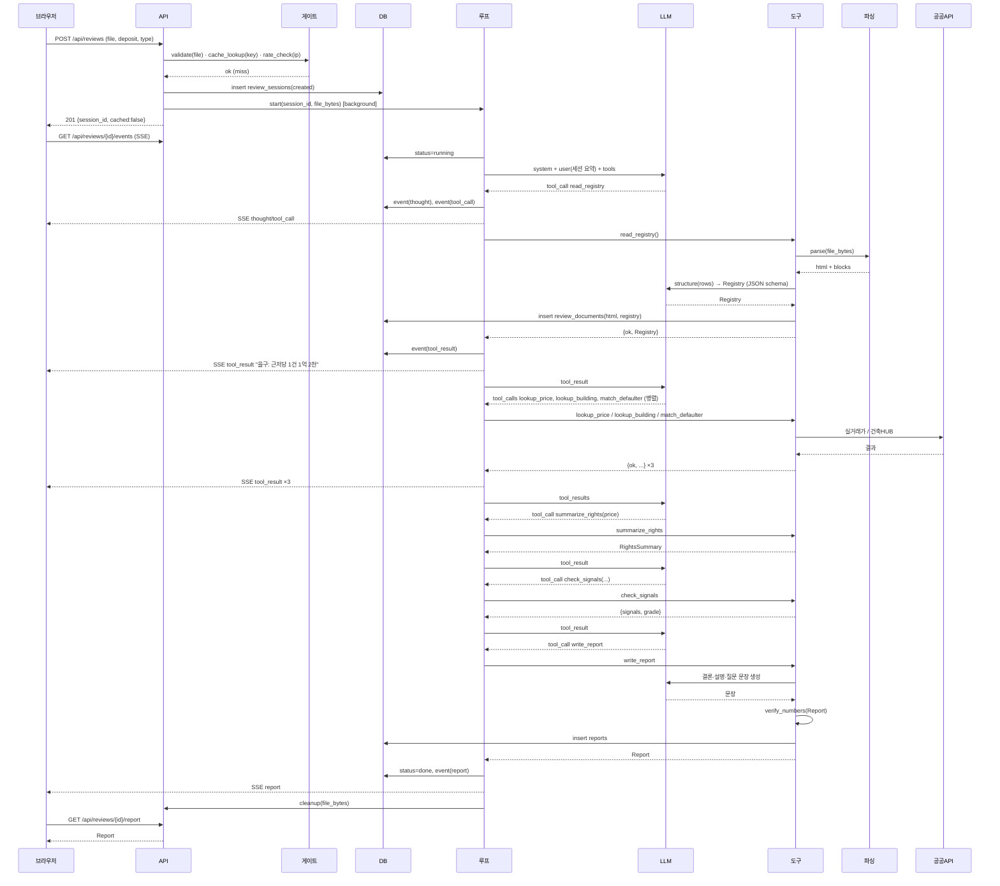
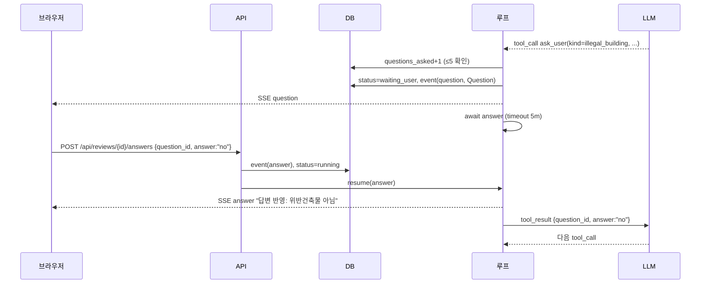
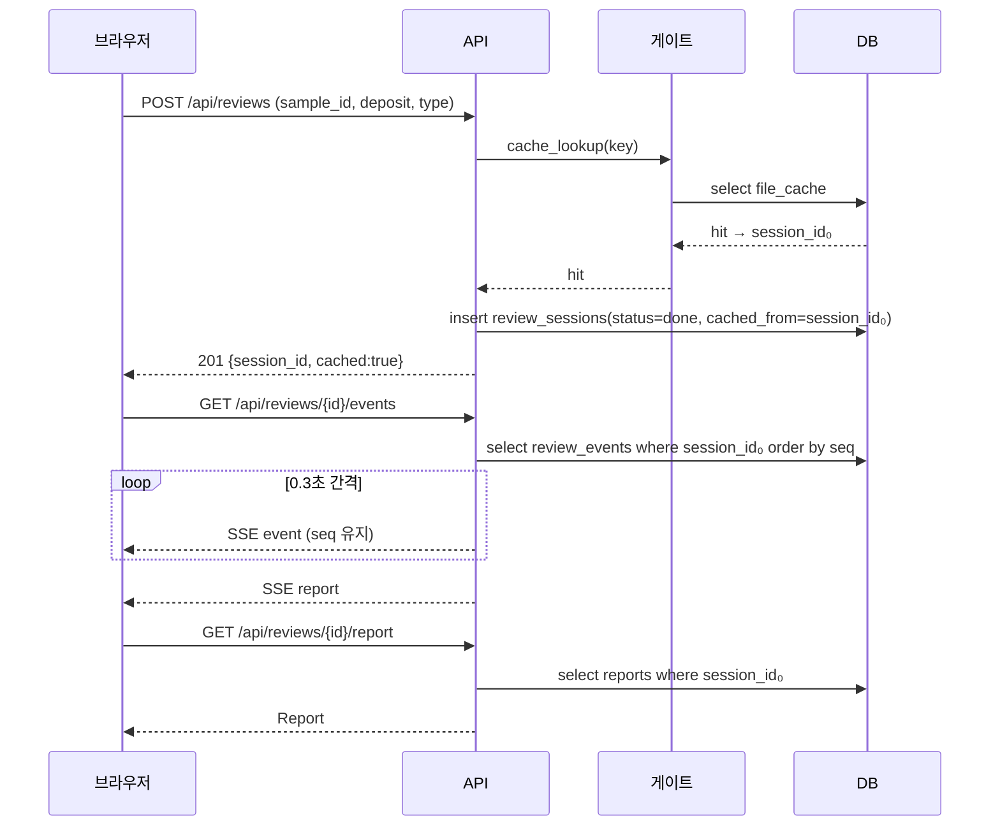
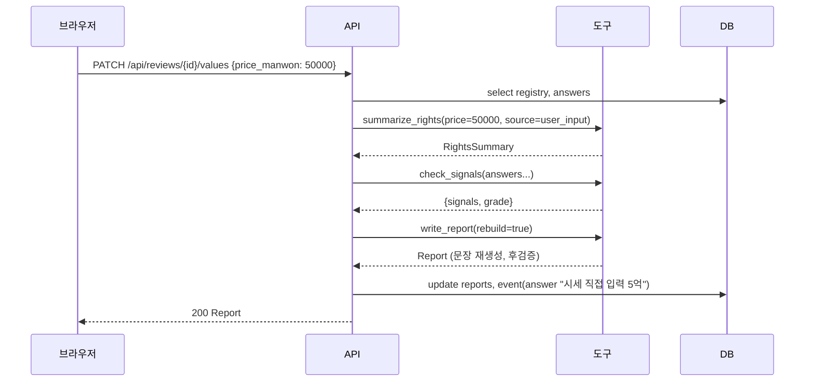

# SEQUENCE

## 0. 이 문서가 다루는 것

에이전트 루프를 중심으로 한 시퀀스 4개. 함수 시그니처는 MS에서 이 문서의 메시지 이름을 그대로 쓴다.

### 0.1 생명선

| 생명선 | 약어 | 실체 | 종류 | 정의한 곳 |
|---|---|---|---|---|
| 브라우저 | B | React 앱 | 클라이언트 | [[JSD-UI-001]] |
| API | API | FastAPI 라우터 + ReviewService | 서비스 | [[JSD-API-001]] |
| 게이트 | G | GateService (검사·캐시·한도) | 서비스 | [[JSD-UC-001#UC-S10]] |
| 루프 | L | AgentLoop (백그라운드 태스크) | 서비스 | [[JSD-UC-001#UC-S9]] |
| LLM | LLM | OpenAI GPT-5.6 Terra | 외부 | [[JSD-INFRA-001#C7]] |
| 도구 | T | RegistryService·RulesService·LookupService·ReportService | 서비스 | [[JSD-API-001]] 4절 |
| 파싱 | UP | 업스테이지 Document Parse | 외부 | [[JSD-INFRA-001#C8]] |
| 공공 API | GO | 실거래가·건축HUB | 외부 | [[JSD-RFQ-001#Q26]] |
| DB | DB | Postgres | 저장소 | [[JSD-DOM-001]] |

#### SEQ-1 검토 전체 (정상 흐름)

근거: [[JSD-UC-001#UC-A1]] [[JSD-UC-001#UC-S9]] · [[JSD-SCN-001#S1]]

**읽을 때 볼 것**
- 파일 바이트는 API → 루프 → 도구 → 파싱까지 메모리로만 흐르고, 마지막에 `cleanup`으로 참조를 지운다. DB에는 `parsed_html`만 남는다.
- 루프는 모든 LLM 응답을 `tool_call`로 기대한다. 텍스트만 오면 "도구를 고르세요"로 되돌려 보낸다 ([[JSD-UC-001#UC-S9]] 3a).
- `lookup_*` 세 개는 한 턴에 병렬 호출 가능. 결과는 한 번에 돌려준다.
- `write_report` 안에서 LLM을 한 번 더 부르지만 이건 루프의 판단 호출이 아니라 문장 생성이다. 비용 집계는 둘 다 `usage_log`에 쌓인다.

#### SEQ-2 질문 대기와 재개

근거: [[JSD-UC-001#UC-A3]] [[JSD-UC-001#UC-S7]] · [[JSD-SCN-001#S2]] 5

**읽을 때 볼 것**
- 루프는 `asyncio.Event`(또는 DB 폴링)로 답을 기다린다. 컨테이너가 재시작되면 대기 중인 세션은 `waiting_user`로 남고, 재시작 후 워커가 이어받는다 (미결 3).
- 5분 타임아웃이면 `answer="unknown"`으로 스스로 재개한다. 브라우저에는 `answer` 이벤트 "답변 없이 진행합니다".
- 질문 한도(5) 초과 시 도구가 `{ok:false, error:"question_limit"}`를 돌려주고 루프는 멈추지 않는다.
- 토지 등기부 요청(`input_type=file`)이면 답변 API가 multipart이고, 재개 전에 `read_registry(document_id)`를 루프가 한 번 더 부른다.

#### SEQ-3 캐시 재생 (예시 파일 두 번째 이후)

근거: [[JSD-UC-001#UC-A2]] 4 · [[JSD-UC-001#UC-S10]] · [[JSD-SCN-001#S4]] 변형

**읽을 때 볼 것**
- 새 세션 행은 만들되 문서·의견서는 원 세션 것을 가리킨다. 원 세션의 `expires_at`은 예시면 무한, 아니면 30일.
- 재생 중에는 LLM·파싱·공공 API 호출이 0이다. 비용 0.
- 사용자가 보증금을 바꾸면 캐시 키가 달라져 SEQ-1로 간다.

#### SEQ-4 추출값 수정 후 재판정

근거: [[JSD-UC-001#UC-A1]] 8a · [[JSD-API-001#PATCH/api/reviews/{id}/values]]

**읽을 때 볼 것**
- 등기부 읽기와 외부 조회는 다시 하지 않는다. `rules`와 `report`만 돈다.
- 수정된 값은 `price_source=user_input`으로 남아 의견서 숫자 카드에 "직접 입력" 표시가 붙는다.

## 1. 대응표

| 시퀀스 | 유스케이스 | API | 도구 |
|---|---|---|---|
| SEQ-1 | UC-A1, UC-S1~S6, S8, S9, S10 | POST reviews, GET events, GET report | 8종 전부 |
| SEQ-2 | UC-A3, UC-S7 | POST answers | ask_user, (read_registry) |
| SEQ-3 | UC-A2, UC-S10 | POST reviews, GET events, GET report | 없음 |
| SEQ-4 | UC-A1 8a | PATCH values | summarize_rights, check_signals, write_report |

## 2. 되먹일 것

| 발견 | 되먹일 문서 |
|---|---|
| 루프가 LLM 텍스트 응답을 받았을 때의 처리(되돌려 보내기)를 UC-S9 3a에 이미 뒀지만, 3회 반복 후 강제 `write_report`는 API 4.1에도 명시해야 함 | [[JSD-API-001]] 4.1 — 이미 있음 |
| 캐시 세션의 `cached_from` 컬럼이 DD에 없음 | [[JSD-DOM-001#review_sessions]]에 `cached_from uuid` 추가 필요 |
| `write_report(rebuild=true)` 인자가 도구 스키마에 없음 | [[JSD-API-001#write_report]]에 내부 전용 인자로 추가 (에이전트에는 노출 안 함) |

## 3. 미결사항

- [ ] 답변 대기를 `asyncio.Event`로 할지 DB 폴링으로 할지 — 단일 컨테이너면 Event, 재시작 대비는 폴링 보완
- [ ] 컨테이너 재시작 시 `running`·`waiting_user` 세션 복구 (실패 처리 vs 재개)
- [ ] SSE 재생 간격 0.3초 (API 미결과 동일)
