# SEQUENCE: 보증금지킴 (deposit-guard)

---

## 0. 이 문서가 다루는 것

유스케이스 흐름을 **객체 수준**으로 내린다. 누가 누구를 어떤 순서로 부르고, 어디서 갈라지는지. 생명선은 클래스 명세([[JSD-DOM-002]]) 3장의 입구와 4장의 서비스·함수 열·포트다.

**입구 30개를 전부 다룬다.** REST 16개([[JSD-API-001]]), 에이전트 도구 9종([[JSD-API-002]]), 배치 명령 5개(클래스 명세 4.15). 대응표(1장)에 입구마다 시퀀스 하나가 있다.

**두 종류로 나눈다.**
- **고유 흐름** SEQ-1~18 — 분기가 있거나 도메인을 넘는 것. 각자 그림
- **공통 형태** SEQ-C1·C2 — 정말로 `입구 → 서비스 하나 → 자기 저장소`인 것과, 검토 경로의 404·410 관문. 그림 하나에 표로 어느 입구가 따르는지

**표기** — `alt` 분기, `opt` 조건부, `loop` 반복, `par` 동시, `break` 빠져나감. 실선 호출, 점선 반환. `rect`는 DB 트랜잭션 하나. `DB`는 부르는 서비스의 자기 테이블이고 이름은 [[JSD-DOM-003]]을 따른다. 바깥 서비스(업스테이지·OpenAI·공공데이터포털·HUG)는 그것을 부르는 어댑터 생명선이 대신한다. 에러는 `AppError(code)`로 적고 HTTP 상태는 [[JSD-API-001]] 2장 표다.

### 0.1 생명선

다이어그램에 나오는 것이 실제로 무엇인지. 약어는 다이어그램 안 표기다.

| 생명선 | 약어 | 실체 | 종류 | 정의한 곳 |
|---|---|---|---|---|
| 세입자 | U | 브라우저(React)를 쓰는 사람. 심사위원도 같다 | 액터 | [[JSD-UC-001]] 1장 |
| 공유본 열람자 | V | 공유 링크를 받은 사람 | 액터 | [[JSD-UC-001#UC-A4]] |
| 스케줄러 | OP | 배치 명령을 돌리는 운영자 또는 주기 실행기 | 액터 | [[JSD-INFRA-001]] 8장 |
| review/router.py | WR | 검토·대화·값 수정 경로. 루프를 BackgroundTasks로 띄운다 | Boundary | 클래스 명세 3.1 |
| 다른 도메인 라우터 | WC·WP·WS | citation·report·share의 `router.py` | Boundary | 클래스 명세 3.1 |
| main.py | MN | 앱 조립. 검토 경로 라우터에 `require_live` 의존성을 걸고 `AppError`를 HTTP로 바꾼다 | Boundary | 클래스 명세 3.1 · 5장 결정 7 |
| jobs.py | JB | `python -m app.jobs` 명령 | Boundary | 클래스 명세 4.15 |
| ReviewService | RV | `review/service.py` | Control | [[JSD-DOM-002#ReviewService]] |
| 에이전트 루프 | AG | `review/service_agent.py` — run_review · run_follow_up · dispatch · say · force_report | Control | 클래스 명세 4.2 |
| RegistryService | RS | `registry/service.py` + 표 읽기 `service_parse.py` | Control | [[JSD-DOM-002#RegistryService]] |
| RulesService | RU | `rules/service.py`. 순수 함수 | Control | [[JSD-DOM-002#RulesService]] |
| LookupService | LK | `lookup/service.py` | Control | [[JSD-DOM-002#LookupService]] |
| CitationService | CT | `citation/service.py` | Control | [[JSD-DOM-002#CitationService]] |
| ReportService | RP | `report/service.py` | Control | [[JSD-DOM-002#ReportService]] |
| ShareService | SH | `share/service.py` | Control | [[JSD-DOM-002#ShareService]] |
| SampleService | SA | `sample/service.py` | Control | [[JSD-DOM-002#SampleService]] |
| gate | GT | `gate/service.py` 함수 열 — 파일 검사·요청 한도·파싱 캐시 | Control | 클래스 명세 4.11 |
| AgentModel | AM | `review/adapters/openai_agent.py` → OpenAI | 어댑터 | 클래스 명세 4.13 |
| DocumentParser | UP | `registry/adapters/upstage.py` → 업스테이지 Document Parse | 어댑터 | 클래스 명세 4.13 |
| TradeSource·LedgerSource | DG | `lookup/adapters/data_go_kr.py` → 공공데이터포털 | 어댑터 | 클래스 명세 4.13 |
| DefaulterSource | HG | `lookup/adapters/hug.py` → HUG 명단 페이지 | 어댑터 | 클래스 명세 4.13 |
| SentenceWriter | SW | `report/adapters/openai_writer.py` → OpenAI | 어댑터 | 클래스 명세 4.13 |
| privacy · factcheck | PV·FC | `shared/privacy.py` · `shared/factcheck.py` | 유틸 | 클래스 명세 4.14 |
| DB | DB | PostgreSQL. 부르는 서비스의 자기 테이블 | 저장소 | [[JSD-DOM-003]] |
| 호출자 (공통) | C | SEQ-C1·C2의 사람 또는 루프·스케줄러 | 액터 | — |
| 입구 (공통) | B | SEQ-C1·C2의 표가 정하는 라우터 · 루프 dispatch · jobs.py | Boundary | 클래스 명세 3.1 |
| 서비스 (공통) | SV | SEQ-C1·C2의 표가 정하는 서비스 | Control | 클래스 명세 4장 |

---

## 1. 대응표 — 입구 → 시퀀스

| 입구 | 시퀀스 | 도메인 넘음 |
|---|---|---|
| [[JSD-API-001#POST/api/reviews]] | [[#SEQ-1]] → [[#SEQ-2]] | ○ |
| [[JSD-API-001#GET/api/reviews/{id}]] | [[#SEQ-12]] | ○ |
| [[JSD-API-001#DELETE/api/reviews/{id}]] | [[#SEQ-15]] | ○ |
| [[JSD-API-001#GET/api/reviews/{id}/messages]] | [[#SEQ-11]] | ○ |
| [[JSD-API-001#GET/api/reviews/{id}/stream]] | [[#SEQ-11]] | ○ |
| [[JSD-API-001#POST/api/reviews/{id}/messages]] kind answer | [[#SEQ-7]] | ○ |
| [[JSD-API-001#POST/api/reviews/{id}/messages]] kind ask | [[#SEQ-9]] | ○ |
| [[JSD-API-001#GET/api/reviews/{id}/documents]] | [[#SEQ-C1]] · [[#SEQ-C2]] | |
| [[JSD-API-001#GET/api/reviews/{id}/documents/{documentId}]] | [[#SEQ-C1]] · [[#SEQ-C2]] | |
| [[JSD-API-001#GET/api/reviews/{id}/blocks/{blockId}]] | [[#SEQ-13]] | ○ |
| [[JSD-API-001#GET/api/reviews/{id}/report]] | [[#SEQ-14]] | ○ |
| [[JSD-API-001#PATCH/api/reviews/{id}/values]] | [[#SEQ-10]] → [[#SEQ-8]] | ○ |
| [[JSD-API-001#POST/api/reviews/{id}/shares]] | [[#SEQ-14]] | ○ |
| [[JSD-API-001#GET/api/shares/{token}]] | [[#SEQ-14]] | |
| [[JSD-API-001#GET/api/criteria]] | [[#SEQ-C1]] | |
| [[JSD-API-001#GET/api/samples]] | [[#SEQ-C1]] | |
| [[JSD-API-001#GET/health]] | [[#SEQ-C1]] | |
| 루프 run_review | [[#SEQ-2]] · 말풍선 [[#SEQ-3]] | ○ |
| 루프 run_follow_up | [[#SEQ-9]] | ○ |
| [[JSD-API-002#read_registry]] | [[#SEQ-4]] | ○ |
| [[JSD-API-002#summarize_rights]] | [[#SEQ-5]] | ○ |
| [[JSD-API-002#check_signals]] | [[#SEQ-5]] | ○ |
| [[JSD-API-002#lookup_price]] | [[#SEQ-6]] | ○ |
| [[JSD-API-002#lookup_building]] | [[#SEQ-6]] | ○ |
| [[JSD-API-002#match_defaulter]] | [[#SEQ-6]] | ○ |
| [[JSD-API-002#ask_user]] | [[#SEQ-7]] | ○ |
| [[JSD-API-002#get_criteria]] | [[#SEQ-C1]] | |
| [[JSD-API-002#write_report]] | [[#SEQ-8]] | ○ |
| jobs purge | [[#SEQ-16]] | ○ |
| jobs refresh_defaulters | [[#SEQ-17]] | |
| jobs load_region_codes | [[#SEQ-C1]] | |
| jobs warm_samples | [[#SEQ-18]] | ○ |
| jobs usage_report | [[#SEQ-C1]] | |
| 검토 경로의 404·410 (registry·citation·report·share 라우터) | [[#SEQ-C2]] | ○ |

입구 30개 중 22개가 도메인을 넘는다. PDF 저장([[JSD-UC-001#UC-A4]] 1~2)은 브라우저 인쇄라 서버 입구가 없다(2장 #13).

---

## SEQ-1 검토를 시작한다

[[JSD-UC-001#UC-A1]] 기본 흐름 1~3, 확장 2a·2b·2c·3a · [[JSD-UC-001#UC-A2]] 3~4 · [[JSD-UC-001#UC-S10]] · [[JSD-UC-001#UC-S1]] 1~6. [[JSD-API-001#POST/api/reviews]].

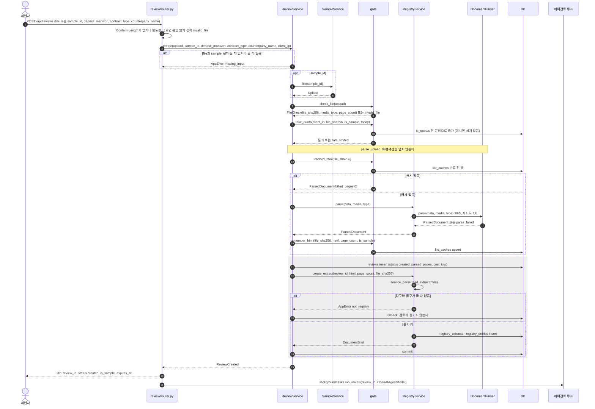
```mermaid
sequenceDiagram
    autonumber
    actor U as 세입자
    participant WR as review/router.py
    participant RV as ReviewService
    participant SA as SampleService
    participant GT as gate
    participant RS as RegistryService
    participant UP as DocumentParser
    participant DB
    participant AG as 에이전트 루프

    U->>WR: POST /api/reviews (file 또는 sample_id, deposit_manwon, contract_type, counterparty_name)
    WR->>WR: Content-Length가 없거나 한도를 넘으면 폼을 읽기 전에 invalid_file
    WR->>RV: create(upload, sample_id, deposit_manwon, contract_type, counterparty_name, client_ip)
    alt file과 sample_id가 둘 다 없거나 둘 다 있음
        RV-->>WR: AppError missing_input
    end
    opt sample_id
        RV->>SA: file(sample_id)
        SA-->>RV: Upload
    end
    RV->>GT: check_file(upload)
    GT-->>RV: FileCheck(file_sha256, media_type, page_count) 또는 invalid_file
    RV->>GT: take_quota(client_ip, file_sha256, is_sample, today)
    GT->>DB: ip_quotas 한 문장으로 증가 (예시면 세지 않음)
    GT-->>RV: 통과 또는 rate_limited
    Note over RV,UP: parse_upload. 트랜잭션을 열지 않는다
    RV->>GT: cached_html(file_sha256)
    GT->>DB: file_caches 만료 전 행
    alt 캐시 적중
        GT-->>RV: ParsedDocument(billed_pages 0)
    else 캐시 없음
        RV->>RS: parse(data, media_type)
        RS->>UP: parse(data, media_type) 30초, 재시도 1회
        UP-->>RS: ParsedDocument 또는 parse_failed
        RS-->>RV: ParsedDocument
        RV->>GT: remember_html(file_sha256, html, page_count, is_sample)
        GT->>DB: file_caches upsert
    end
    rect rgb(238, 238, 238)
        RV->>DB: reviews insert (status created, parsed_pages, cost_krw)
        RV->>RS: create_extract(review_id, html, page_count, file_sha256)
        RS->>RS: service_parse.read_extract(html)
        alt 갑구와 을구가 둘 다 없음
            RS-->>RV: AppError not_registry
            RV->>DB: rollback. 검토가 생기지 않는다
        else 등기부
            RS->>DB: registry_extracts · registry_entries insert
            RS-->>RV: DocumentBrief
            RV->>DB: commit
        end
    end
    RV-->>WR: ReviewCreated
    WR-->>U: 201 review_id, status created, is_sample, expires_at
    WR->>AG: BackgroundTasks run_review(review_id, OpenAIAgentModel)
```

**읽을 때 볼 것**
- 순서가 규칙이다. 파일 검사 → 한도 → 파싱 → 트랜잭션 하나. 업스테이지를 기다리는 30초 동안 DB 연결과 한도 행을 붙들지 않는다
- 한도는 파싱 전에 센다. 등기부가 아닌 파일도 한 건으로 센다 — 파싱 비용이 이미 났다(클래스 명세 7장 미결)
- **파싱 캐시에 넣는 것(단계 19)이 등기부 판정(단계 23)보다 앞이다.** 등기부가 아닌 파일의 HTML도 24시간 캐시에 남고, 어느 검토에도 매이지 않아 삭제로 지울 수 없다 → 2장 #1
- 파일 바이트는 `create`가 끝나면 버려진다. 루프는 응답 뒤에 뜨고 저장된 등기부만 읽는다(클래스 명세 5장 결정 1·6)
- 예시 파일 해시를 한도에서 빼는 것은 `file_caches.is_sample` 행에 기댄다. 배포 뒤 [[#SEQ-18]]이 돌지 않았으면 예시 파일을 직접 올린 요청이 한도에 세어진다 → 2장 #14

---

## SEQ-2 에이전트 루프가 돈다 — 검토 단계

[[JSD-UC-001#UC-S9]] 기본 흐름 1~5, 확장 3a·3b·3c · [[JSD-API-002]] 4.1.

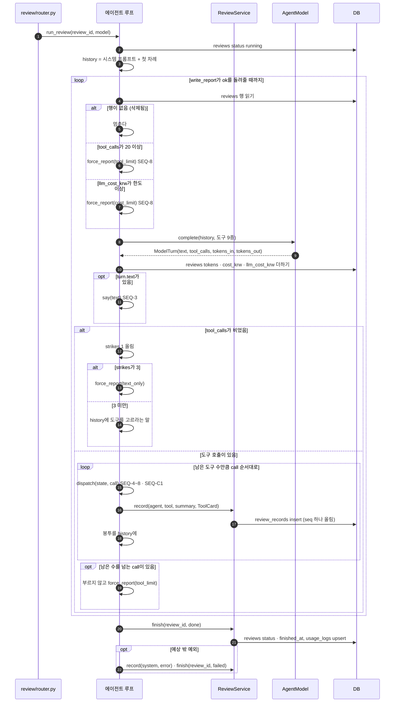
```mermaid
sequenceDiagram
    autonumber
    participant WR as review/router.py
    participant AG as 에이전트 루프
    participant RV as ReviewService
    participant AM as AgentModel
    participant DB

    WR->>AG: run_review(review_id, model)
    AG->>DB: reviews status running
    AG->>AG: history = 시스템 프롬프트 + 첫 차례
    loop write_report가 ok를 돌려줄 때까지
        AG->>DB: reviews 행 읽기
        alt 행이 없음 (삭제됨)
            AG->>AG: 멈춘다
        else tool_calls가 20 이상
            AG->>AG: force_report(tool_limit) SEQ-8
        else llm_cost_krw가 한도 이상
            AG->>AG: force_report(cost_limit) SEQ-8
        end
        AG->>AM: complete(history, 도구 9종)
        AM-->>AG: ModelTurn(text, tool_calls, tokens_in, tokens_out)
        AG->>DB: reviews tokens · cost_krw · llm_cost_krw 더하기
        opt turn.text가 있음
            AG->>AG: say(text) SEQ-3
        end
        alt tool_calls가 비었음
            AG->>AG: strikes 1 올림
            alt strikes가 3
                AG->>AG: force_report(text_only)
            else 3 미만
                AG->>AG: history에 도구를 고르라는 말
            end
        else 도구 호출이 있음
            loop 남은 도구 수만큼 call 순서대로
                AG->>AG: dispatch(state, call) SEQ-4~8 · SEQ-C1
                AG->>RV: record(agent, tool, summary, ToolCard)
                RV->>DB: review_records insert (seq 하나 올림)
                AG->>AG: 봉투를 history에
            end
            opt 남은 수를 넘는 call이 있음
                AG->>AG: 부르지 않고 force_report(tool_limit)
            end
        end
    end
    AG->>RV: finish(review_id, done)
    RV->>DB: reviews status · finished_at, usage_logs upsert
    opt 예상 밖 예외
        AG->>RV: record(system, error) · finish(review_id, failed)
    end
```

**읽을 때 볼 것**
- 한도 검사는 모델을 부르기 **전**이다. 20회에 닿은 뒤의 `write_report`는 세지 않는다 — 그때까지의 결과로 의견서를 내는 호출이다([[JSD-PRD-001#R10]])
- 루프 상태(단계·strikes·history)는 메모리에만 있다. 프로세스가 죽으면 도는 루프가 사라지고 검토는 running으로 남는다(클래스 명세 7장 미결)
- **삭제 확인은 한 바퀴에 한 번이다(단계 4).** 그 뒤 같은 바퀴 안에서 검토가 지워지면, 도구가 `facts`를 쓰거나 `record`가 대화를 쌓을 때 외래키 위반이 난다. 그 예외가 "예상 밖 예외" 줄로 가면 없는 검토에 error 메시지와 `finish`를 또 쓰려 한다 → 2장 #3
- 도구 카드(`kind: tool`)는 루프가 남기고, 숫자 카드·의견서 카드는 각 도구가 남긴다(SEQ-5·8)

---

## SEQ-3 에이전트 말풍선에 인용을 단다

[[JSD-UC-001#UC-S9]] 3 · [[JSD-API-002]] 1.4 인용 표식 · [[JSD-UC-001#UC-A1]] 7a.

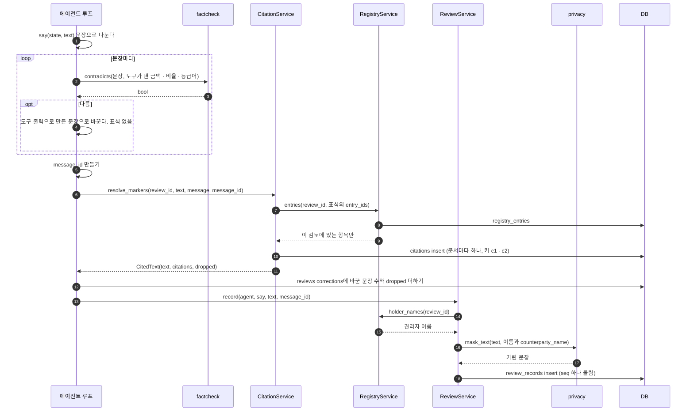
```mermaid
sequenceDiagram
    autonumber
    participant AG as 에이전트 루프
    participant FC as factcheck
    participant CT as CitationService
    participant RS as RegistryService
    participant RV as ReviewService
    participant PV as privacy
    participant DB

    AG->>AG: say(state, text) 문장으로 나눈다
    loop 문장마다
        AG->>FC: contradicts(문장, 도구가 낸 금액 · 비율 · 등급어)
        FC-->>AG: bool
        opt 다름
            AG->>AG: 도구 출력으로 만든 문장으로 바꾼다. 표식 없음
        end
    end
    AG->>AG: message_id 만들기
    AG->>CT: resolve_markers(review_id, text, message, message_id)
    CT->>RS: entries(review_id, 표식의 entry_ids)
    RS->>DB: registry_entries
    RS-->>CT: 이 검토에 있는 항목만
    CT->>DB: citations insert (문서마다 하나, 키 c1 · c2)
    CT-->>AG: CitedText(text, citations, dropped)
    AG->>DB: reviews corrections에 바꾼 문장 수와 dropped 더하기
    AG->>RV: record(agent, say, text, message_id)
    RV->>RS: holder_names(review_id)
    RS-->>RV: 권리자 이름
    RV->>PV: mask_text(text, 이름과 counterparty_name)
    PV-->>RV: 가린 문장
    RV->>DB: review_records insert (seq 하나 올림)
```

**읽을 때 볼 것**
- 후검증이 인용보다 먼저다. 바꾼 문장에는 표식이 없으므로 인용 행이 생기지 않는다
- 인용 행이 메시지 행보다 먼저 쌓인다. 그래서 `message_id`를 루프가 미리 만들어 둘 다에 쓴다(클래스 명세 4.1 `record`). `citations.ref`가 외래키가 아닌 이유다([[JSD-DOM-003]] 1장)
- 모델은 이름을 본 적이 없지만 `record`가 한 번 더 가린다. 이름 목록은 `review`만 안다(counterparty_name)

---

## SEQ-4 등기부를 읽어 모델에 넘긴다

[[JSD-UC-001#UC-S1]] 트리거 · [[JSD-API-002#read_registry]] · [[JSD-API-002]] 1.3.

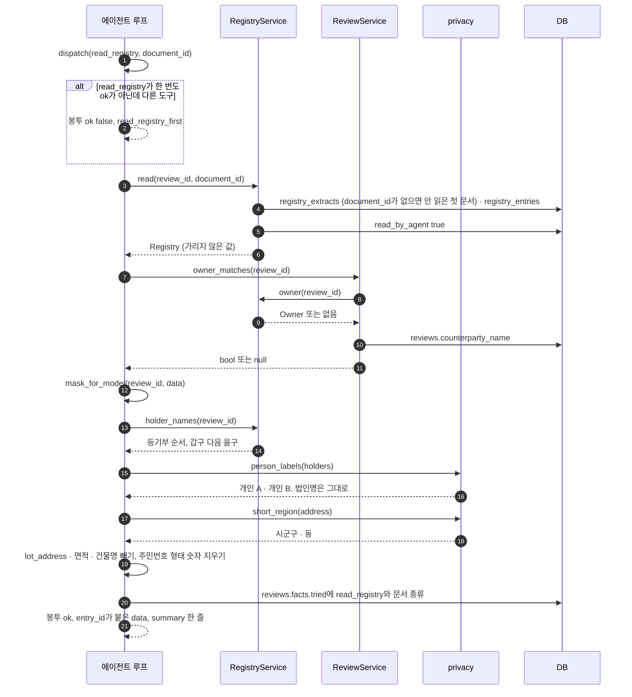
```mermaid
sequenceDiagram
    autonumber
    participant AG as 에이전트 루프
    participant RS as RegistryService
    participant RV as ReviewService
    participant PV as privacy
    participant DB

    AG->>AG: dispatch(read_registry, document_id)
    alt read_registry가 한 번도 ok가 아닌데 다른 도구
        AG-->>AG: 봉투 ok false, read_registry_first
    end
    AG->>RS: read(review_id, document_id)
    RS->>DB: registry_extracts (document_id가 없으면 안 읽은 첫 문서) · registry_entries
    RS->>DB: read_by_agent true
    RS-->>AG: Registry (가리지 않은 값)
    AG->>RV: owner_matches(review_id)
    RV->>RS: owner(review_id)
    RS-->>RV: Owner 또는 없음
    RV->>DB: reviews.counterparty_name
    RV-->>AG: bool 또는 null
    AG->>AG: mask_for_model(review_id, data)
    AG->>RS: holder_names(review_id)
    RS-->>AG: 등기부 순서, 갑구 다음 을구
    AG->>PV: person_labels(holders)
    PV-->>AG: 개인 A · 개인 B. 법인명은 그대로
    AG->>PV: short_region(address)
    PV-->>AG: 시군구 · 동
    AG->>AG: lot_address · 면적 · 건물명 빼기, 주민번호 형태 숫자 지우기
    AG->>DB: reviews.facts.tried에 read_registry와 문서 종류
    AG-->>AG: 봉투 ok, entry_id가 붙은 data, summary 한 줄
```

**읽을 때 볼 것**
- `registry`는 가리지 않은 값을 돌려주고, 가리기와 소유자 일치 계산은 `review`가 한다. 계약 상대방 이름은 `registry`에 들어가지 않는다(클래스 명세 3.2)
- 라벨 순서는 `holder_names` 한 곳이 정한다. 같은 사람이 갑구·을구에 나와도 같은 라벨이다([[JSD-API-002]] 미결)
- 등기부가 아니거나 파싱이 실패하는 경우는 여기 없다 — 업로드 요청이 이미 답했다(SEQ-1 · SEQ-7)

---

## SEQ-5 권리를 합산하고 신호를 본다

[[JSD-UC-001#UC-S2]] · [[JSD-UC-001#UC-S3]] · [[JSD-API-002#summarize_rights]] · [[JSD-API-002#check_signals]] · 사실 인자 대조는 클래스 명세 4.2.

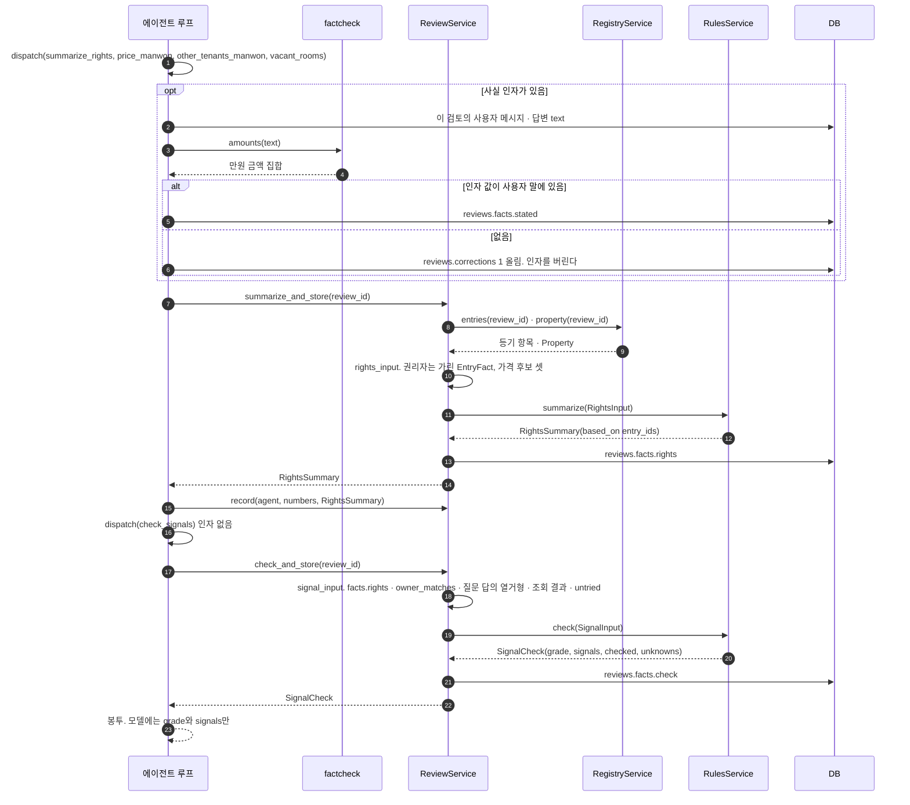
```mermaid
sequenceDiagram
    autonumber
    participant AG as 에이전트 루프
    participant FC as factcheck
    participant RV as ReviewService
    participant RS as RegistryService
    participant RU as RulesService
    participant DB

    AG->>AG: dispatch(summarize_rights, price_manwon, other_tenants_manwon, vacant_rooms)
    opt 사실 인자가 있음
        AG->>DB: 이 검토의 사용자 메시지 · 답변 text
        AG->>FC: amounts(text)
        FC-->>AG: 만원 금액 집합
        alt 인자 값이 사용자 말에 있음
            AG->>DB: reviews.facts.stated
        else 없음
            AG->>DB: reviews.corrections 1 올림. 인자를 버린다
        end
    end
    AG->>RV: summarize_and_store(review_id)
    RV->>RS: entries(review_id) · property(review_id)
    RS-->>RV: 등기 항목 · Property
    RV->>RV: rights_input. 권리자는 가린 EntryFact, 가격 후보 셋
    RV->>RU: summarize(RightsInput)
    RU-->>RV: RightsSummary(based_on entry_ids)
    RV->>DB: reviews.facts.rights
    RV-->>AG: RightsSummary
    AG->>RV: record(agent, numbers, RightsSummary)
    AG->>AG: dispatch(check_signals) 인자 없음
    AG->>RV: check_and_store(review_id)
    RV->>RV: signal_input. facts.rights · owner_matches · 질문 답의 열거형 · 조회 결과 · untried
    RV->>RU: check(SignalInput)
    RU-->>RV: SignalCheck(grade, signals, checked, unknowns)
    RV->>DB: reviews.facts.check
    RV-->>AG: SignalCheck
    AG-->>AG: 봉투. 모델에는 grade와 signals만
```

**읽을 때 볼 것**
- 모델의 사실 인자는 사용자 말과 대조를 통과해야 `facts.stated`에 들어간다. 대리·위반건축물·임대인 유형은 인자로 받지 않고 질문 답에서만 온다([[JSD-PRD-001#R6]])
- **`check_and_store`는 `facts.rights`를 읽기만 한다(단계 17).** 에이전트가 `summarize_rights`보다 `check_signals`를 먼저 부르면 `SignalInput.rights`가 비고, 합산 뒤에 `lookup_price`가 오면 가격 없는 옛 합산으로 신호를 낸다. 의견서는 `write_report`가 둘 다 다시 돌려 맞지만, 모델이 보는 등급은 틀릴 수 있다 → 2장 #7
- `rules`는 다른 도메인 타입을 모른다. 옮겨 담기(`rights_input`·`signal_input`)는 `ReviewService` 한 곳이다

---

## SEQ-6 바깥을 조회한다

[[JSD-UC-001#UC-S4]] · [[JSD-UC-001#UC-S5]] · [[JSD-UC-001#UC-S6]] 2~3 · [[JSD-API-002#lookup_price]] · [[JSD-API-002#lookup_building]] · [[JSD-API-002#match_defaulter]] · [[JSD-API-002]] 4.1 병렬.

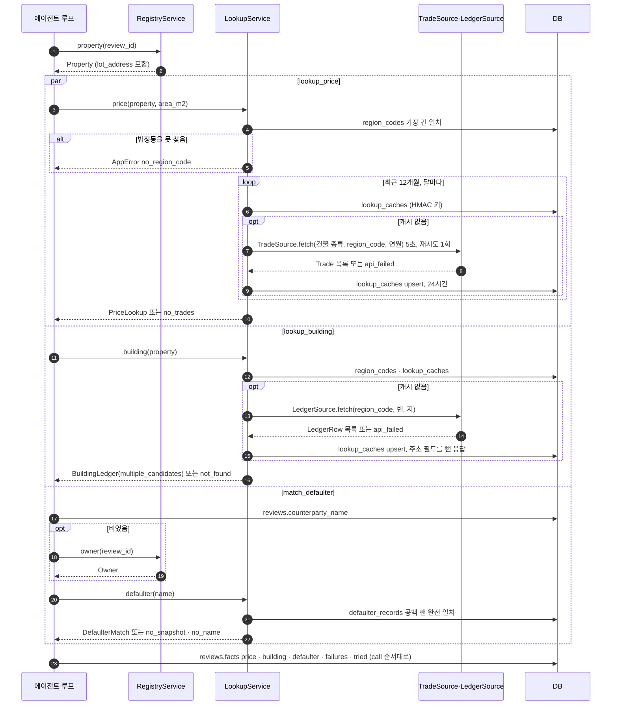
```mermaid
sequenceDiagram
    autonumber
    participant AG as 에이전트 루프
    participant RS as RegistryService
    participant LK as LookupService
    participant DG as TradeSource·LedgerSource
    participant DB

    AG->>RS: property(review_id)
    RS-->>AG: Property (lot_address 포함)
    par lookup_price
        AG->>LK: price(property, area_m2)
        LK->>DB: region_codes 가장 긴 일치
        alt 법정동을 못 찾음
            LK-->>AG: AppError no_region_code
        end
        loop 최근 12개월, 달마다
            LK->>DB: lookup_caches (HMAC 키)
            opt 캐시 없음
                LK->>DG: TradeSource.fetch(건물 종류, region_code, 연월) 5초, 재시도 1회
                DG-->>LK: Trade 목록 또는 api_failed
                LK->>DB: lookup_caches upsert, 24시간
            end
        end
        LK-->>AG: PriceLookup 또는 no_trades
    and lookup_building
        AG->>LK: building(property)
        LK->>DB: region_codes · lookup_caches
        opt 캐시 없음
            LK->>DG: LedgerSource.fetch(region_code, 번, 지)
            DG-->>LK: LedgerRow 목록 또는 api_failed
            LK->>DB: lookup_caches upsert, 주소 필드를 뺀 응답
        end
        LK-->>AG: BuildingLedger(multiple_candidates) 또는 not_found
    and match_defaulter
        AG->>DB: reviews.counterparty_name
        opt 비었음
            AG->>RS: owner(review_id)
            RS-->>AG: Owner
        end
        AG->>LK: defaulter(name)
        LK->>DB: defaulter_records 공백 뺀 완전 일치
        LK-->>AG: DefaulterMatch 또는 no_snapshot · no_name
    end
    AG->>DB: reviews.facts price · building · defaulter · failures · tried (call 순서대로)
```

**읽을 때 볼 것**
- `par` 안은 `LookupService` 호출만 동시다. 호출마다 자기 DB 세션을 쓴다. `facts`·도구 수·도구 카드는 셋이 다 끝난 뒤 루프 하나가 call 순서대로 쓴다(클래스 명세 4.2 동시 호출)
- 번·지는 바깥 API 요청에만 실리고 캐시 키는 HMAC이다. 캐시에는 대지위치·도로명주소를 뺀 응답을 둔다(클래스 명세 5장 결정 12)
- 실패 코드는 `facts.failures`로 가고 루프는 계속된다. 같은 조회를 다시 부르게 하지 않는다 — 확인 못 함은 `RulesService.check`가 모은다
- 이름은 `review` 안에서 골라 `lookup`에 넘긴다. 결과에 이름·공개 항목을 싣지 않는다

---

## SEQ-7 사용자에게 묻고 답을 받는다

[[JSD-UC-001#UC-S7]] · [[JSD-UC-001#UC-A3]] 기본 흐름 1~4, 확장 2a·2b·2c·3a · [[JSD-API-002#ask_user]] · [[JSD-API-001#POST/api/reviews/{id}/messages]] kind answer.

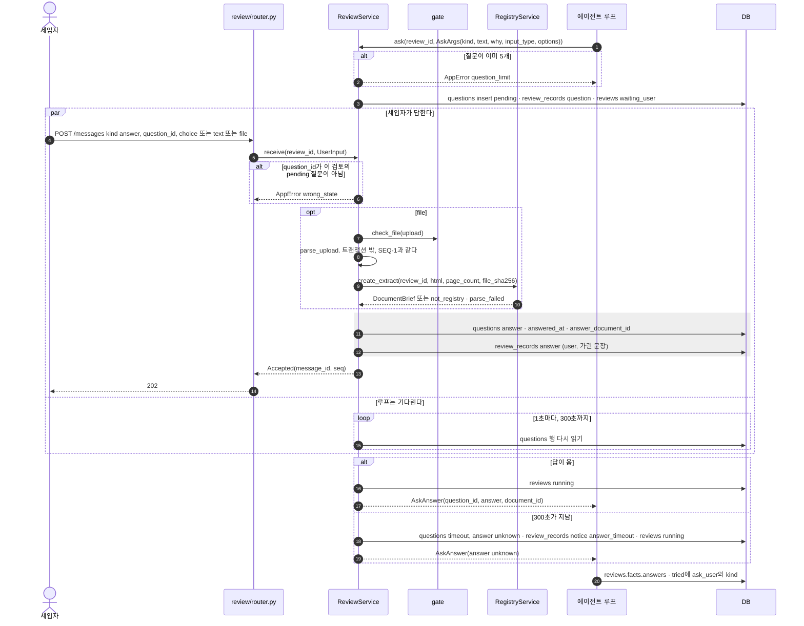
```mermaid
sequenceDiagram
    autonumber
    actor U as 세입자
    participant WR as review/router.py
    participant RV as ReviewService
    participant GT as gate
    participant RS as RegistryService
    participant AG as 에이전트 루프
    participant DB

    AG->>RV: ask(review_id, AskArgs(kind, text, why, input_type, options))
    alt 질문이 이미 5개
        RV-->>AG: AppError question_limit
    end
    RV->>DB: questions insert pending · review_records question · reviews waiting_user
    par 세입자가 답한다
        U->>WR: POST /messages kind answer, question_id, choice 또는 text 또는 file
        WR->>RV: receive(review_id, UserInput)
        alt question_id가 이 검토의 pending 질문이 아님
            RV-->>WR: AppError wrong_state
        end
        opt file
            RV->>GT: check_file(upload)
            RV->>RV: parse_upload. 트랜잭션 밖, SEQ-1과 같다
            RV->>RS: create_extract(review_id, html, page_count, file_sha256)
            RS-->>RV: DocumentBrief 또는 not_registry · parse_failed
        end
        rect rgb(238, 238, 238)
            RV->>DB: questions answer · answered_at · answer_document_id
            RV->>DB: review_records answer (user, 가린 문장)
        end
        RV-->>WR: Accepted(message_id, seq)
        WR-->>U: 202
    and 루프는 기다린다
        loop 1초마다, 300초까지
            RV->>DB: questions 행 다시 읽기
        end
    end
    alt 답이 옴
        RV->>DB: reviews running
        RV-->>AG: AskAnswer(question_id, answer, document_id)
    else 300초가 지남
        RV->>DB: questions timeout, answer unknown · review_records notice answer_timeout · reviews running
        RV-->>AG: AskAnswer(answer unknown)
    end
    AG->>DB: reviews.facts.answers · tried에 ask_user와 kind
```

**읽을 때 볼 것**
- 답은 HTTP 요청이 저장하고, 기다리던 루프가 행을 다시 읽어 가져간다. 두 흐름은 DB 행으로만 만난다 — 프로세스 안 전달 통로가 없다
- 등급을 움직이는 질문(위반건축물·대리·임대인 유형)은 선택지를 서버가 고정하고 답을 열거형으로 저장한다(클래스 명세 4.1 `ask`)
- 파일 답은 요청 안에서 파싱·저장까지 끝난다. 루프는 `AskAnswer.document_id`를 보고 [[#SEQ-4]]로 읽는다. 파일이 거절되면 질문은 pending으로 남는다
- **기다리는 동안 검토가 지워지면** 질문 행이 사라진다. `ask`는 답이 오지 않은 것으로 보고 300초를 채운 뒤 없는 검토에 notice와 상태를 쓰려 한다 → 2장 #2

---

## SEQ-8 의견서를 쓴다

[[JSD-UC-001#UC-S8]] 기본 흐름 1~5, 확장 3a · [[JSD-UC-001#UC-S9]] 4a · [[JSD-UC-001#UC-A1]] 6~7, 7a · [[JSD-API-002#write_report]].

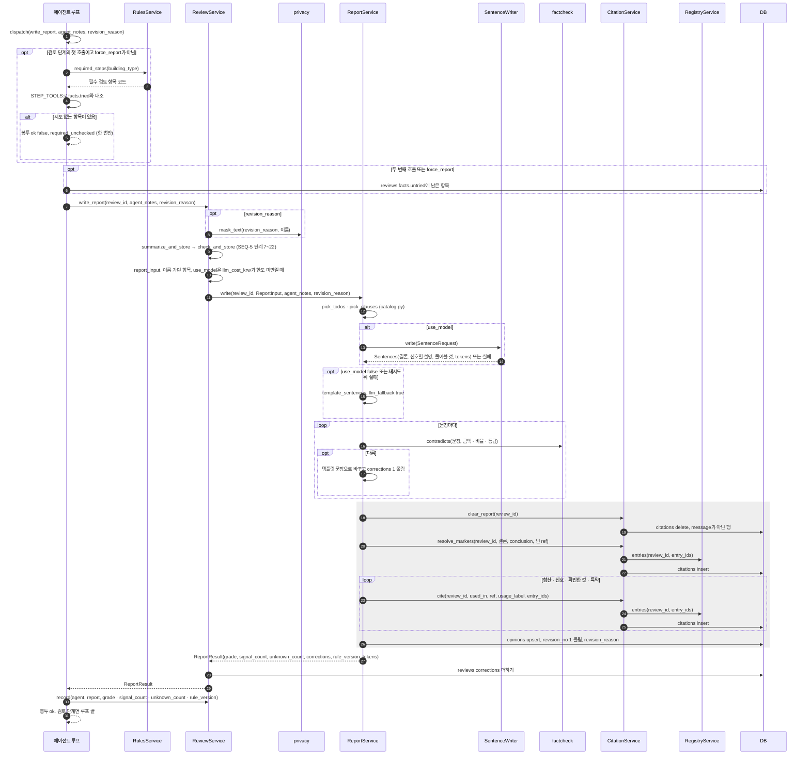
```mermaid
sequenceDiagram
    autonumber
    participant AG as 에이전트 루프
    participant RU as RulesService
    participant RV as ReviewService
    participant PV as privacy
    participant RP as ReportService
    participant SW as SentenceWriter
    participant FC as factcheck
    participant CT as CitationService
    participant RS as RegistryService
    participant DB

    AG->>AG: dispatch(write_report, agent_notes, revision_reason)
    opt 검토 단계의 첫 호출이고 force_report가 아님
        AG->>RU: required_steps(building_type)
        RU-->>AG: 필수 검토 항목 코드
        AG->>AG: STEP_TOOLS로 facts.tried와 대조
        alt 시도 없는 항목이 있음
            AG-->>AG: 봉투 ok false, required_unchecked (한 번만)
        end
    end
    opt 두 번째 호출 또는 force_report
        AG->>DB: reviews.facts.untried에 남은 항목
    end
    AG->>RV: write_report(review_id, agent_notes, revision_reason)
    opt revision_reason
        RV->>PV: mask_text(revision_reason, 이름)
    end
    RV->>RV: summarize_and_store → check_and_store (SEQ-5 단계 7~22)
    RV->>RV: report_input. 이름 가린 항목, use_model은 llm_cost_krw가 한도 미만일 때
    RV->>RP: write(review_id, ReportInput, agent_notes, revision_reason)
    RP->>RP: pick_todos · pick_clauses (catalog.py)
    alt use_model
        RP->>SW: write(SentenceRequest)
        SW-->>RP: Sentences(결론, 신호별 설명, 물어볼 것, tokens) 또는 실패
    end
    opt use_model false 또는 재시도 뒤 실패
        RP->>RP: template_sentences, llm_fallback true
    end
    loop 문장마다
        RP->>FC: contradicts(문장, 금액 · 비율 · 등급)
        opt 다름
            RP->>RP: 템플릿 문장으로 바꾸고 corrections 1 올림
        end
    end
    rect rgb(238, 238, 238)
        RP->>CT: clear_report(review_id)
        CT->>DB: citations delete, message가 아닌 행
        RP->>CT: resolve_markers(review_id, 결론, conclusion, 빈 ref)
        CT->>RS: entries(review_id, entry_ids)
        CT->>DB: citations insert
        loop 합산 · 신호 · 확인한 것 · 특약
            RP->>CT: cite(review_id, used_in, ref, usage_label, entry_ids)
            CT->>RS: entries(review_id, entry_ids)
            CT->>DB: citations insert
        end
        RP->>DB: opinions upsert, revision_no 1 올림, revision_reason
    end
    RP-->>RV: ReportResult(grade, signal_count, unknown_count, corrections, rule_version, tokens)
    RV->>DB: reviews corrections 더하기
    RV-->>AG: ReportResult
    AG->>RV: record(agent, report, grade · signal_count · unknown_count · rule_version)
    AG-->>AG: 봉투 ok. 검토 단계면 루프 끝
```

**읽을 때 볼 것**
- 합산·신호·의견서를 다시 내는 순서는 `ReviewService.write_report` 한 곳이다. 루프의 write_report, 되묻기의 값 제공([[#SEQ-9]]), 직접 입력([[#SEQ-10]])이 모두 여기로 온다
- 의견서 전문은 모델로 가지 않는다. 모델이 받는 것은 `ReportResult`의 요약뿐이다
- **문장 생성 비용이 검토 비용에 더해지지 않는다(단계 28).** `ReportResult`에 토큰이 있지만 `write_report` 규칙은 교정 수만 더한다 → 2장 #8
- **의견서 카드 메시지는 루프 dispatch가 남긴다(단계 30).** 직접 입력은 루프를 지나지 않으므로 카드가 남지 않는다 → 2장 #10. 카드와 `Report`에 판 번호·다시 쓴 이유가 없다([[JSD-API-001]] 4.4) → 2장 #9
- **rect는 이 문서의 제안이다.** 클래스 명세 4.8은 순서만 적었다. 인용을 지운 뒤 의견서를 덮기 전에 실패하면 이전 판이 인용 없이 남는다 → 2장 #4

---

## SEQ-9 되묻기 한 차례

[[JSD-API-002]] 4.2 되묻기 단계 · [[JSD-DOM-001#FollowUpTurn]] · [[JSD-API-001#POST/api/reviews/{id}/messages]] kind ask · [[JSD-UI-001#UI-3]] S-4.

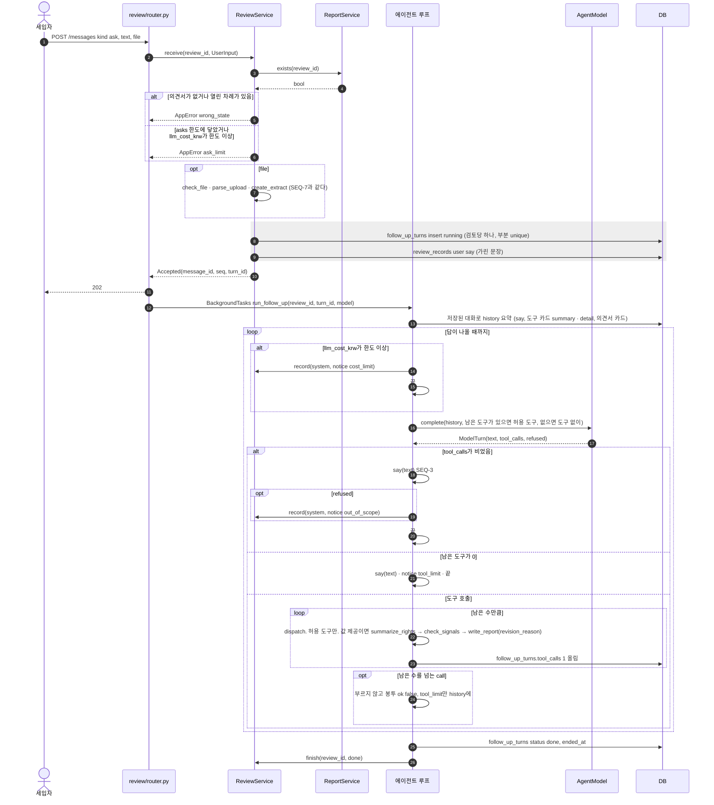
```mermaid
sequenceDiagram
    autonumber
    actor U as 세입자
    participant WR as review/router.py
    participant RV as ReviewService
    participant RP as ReportService
    participant AG as 에이전트 루프
    participant AM as AgentModel
    participant DB

    U->>WR: POST /messages kind ask, text, file
    WR->>RV: receive(review_id, UserInput)
    RV->>RP: exists(review_id)
    RP-->>RV: bool
    alt 의견서가 없거나 열린 차례가 있음
        RV-->>WR: AppError wrong_state
    else asks 한도에 닿았거나 llm_cost_krw가 한도 이상
        RV-->>WR: AppError ask_limit
    end
    opt file
        RV->>RV: check_file · parse_upload · create_extract (SEQ-7과 같다)
    end
    rect rgb(238, 238, 238)
        RV->>DB: follow_up_turns insert running (검토당 하나, 부분 unique)
        RV->>DB: review_records user say (가린 문장)
    end
    RV-->>WR: Accepted(message_id, seq, turn_id)
    WR-->>U: 202
    WR->>AG: BackgroundTasks run_follow_up(review_id, turn_id, model)
    AG->>DB: 저장된 대화로 history 요약 (say, 도구 카드 summary · detail, 의견서 카드)
    loop 답이 나올 때까지
        alt llm_cost_krw가 한도 이상
            AG->>RV: record(system, notice cost_limit)
            AG->>AG: 끝
        end
        AG->>AM: complete(history, 남은 도구가 있으면 허용 도구, 없으면 도구 없이)
        AM-->>AG: ModelTurn(text, tool_calls, refused)
        alt tool_calls가 비었음
            AG->>AG: say(text) SEQ-3
            opt refused
                AG->>RV: record(system, notice out_of_scope)
            end
            AG->>AG: 끝
        else 남은 도구가 0
            AG->>AG: say(text) · notice tool_limit · 끝
        else 도구 호출
            loop 남은 수만큼
                AG->>AG: dispatch. 허용 도구만. 값 제공이면 summarize_rights → check_signals → write_report(revision_reason)
                AG->>DB: follow_up_turns.tool_calls 1 올림
            end
            opt 남은 수를 넘는 call
                AG->>AG: 부르지 않고 봉투 ok false, tool_limit만 history에
            end
        end
    end
    AG->>DB: follow_up_turns status done, ended_at
    AG->>RV: finish(review_id, done)
```

**읽을 때 볼 것**
- 되묻기 차례는 요청이 열고 루프가 닫는다. 열린 차례 하나는 DB의 부분 unique가 막고, 서비스는 그 위반을 wrong_state로 답한다([[JSD-DOM-003]] 4장 5)
- 허용 도구는 get_criteria · summarize_rights · check_signals · write_report · lookup_price다. 서류로 연 차례만 read_registry가 더해진다. ask_user는 없다
- 값 제공의 다시 쓰기는 [[#SEQ-8]]을 그대로 탄다. 판 번호가 오르고 다시 쓴 이유가 남는다
- 검토 스트림은 의견서 뒤 done으로 닫혔다. 화면은 202를 받은 뒤 스트림에 다시 붙어야 이 차례의 말풍선을 받는다 → 2장 #12

---

## SEQ-10 값을 직접 고친다

[[JSD-UC-001#UC-A1]] 확장 8a · [[JSD-API-001#PATCH/api/reviews/{id}/values]] · [[JSD-UI-001#UI-3]] S-3.

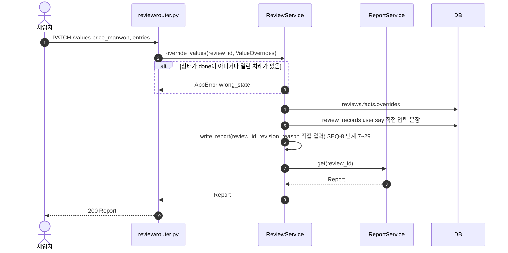
```mermaid
sequenceDiagram
    autonumber
    actor U as 세입자
    participant WR as review/router.py
    participant RV as ReviewService
    participant RP as ReportService
    participant DB

    U->>WR: PATCH /values price_manwon, entries
    WR->>RV: override_values(review_id, ValueOverrides)
    alt 상태가 done이 아니거나 열린 차례가 있음
        RV-->>WR: AppError wrong_state
    end
    RV->>DB: reviews.facts.overrides
    RV->>DB: review_records user say 직접 입력 문장
    RV->>RV: write_report(review_id, revision_reason 직접 입력) SEQ-8 단계 7~29
    RV->>RP: get(review_id)
    RP-->>RV: Report
    RV-->>WR: Report
    WR-->>U: 200 Report
```

**읽을 때 볼 것**
- 등기부 읽기·외부 조회·모델 루프를 지나지 않는다. 되묻기 차례로 세지 않는다
- **대화에 새 의견서 카드가 남지 않는다.** [[#SEQ-8]]의 카드는 루프 dispatch가 남기기 때문이다. [[JSD-UI-001#UI-2]] 요소 5와 [[JSD-UI-001#UI-3]] 규칙은 새 카드가 뜨고 이전 카드가 흐려진다고 적었다 → 2장 #10
- **`entries`의 `entry_id`를 대조하지 않는다.** 없는 ID를 보내면 `amount_overrides`에 들어가 조용히 무시된다 → 2장 #11
- 상태 검사와 `write_report` 사이에 되묻기 차례가 열릴 수 있다. 둘 다 `facts`를 쓴다 — 드물어 지금은 두지 않는다(3장)

---

## SEQ-11 대화를 이어 받는다

[[JSD-UC-001#UC-S9]] 3 진행 이벤트 · [[JSD-API-001#GET/api/reviews/{id}/stream]] · [[JSD-API-001#GET/api/reviews/{id}/messages]] · [[JSD-INFRA-001#C4]].

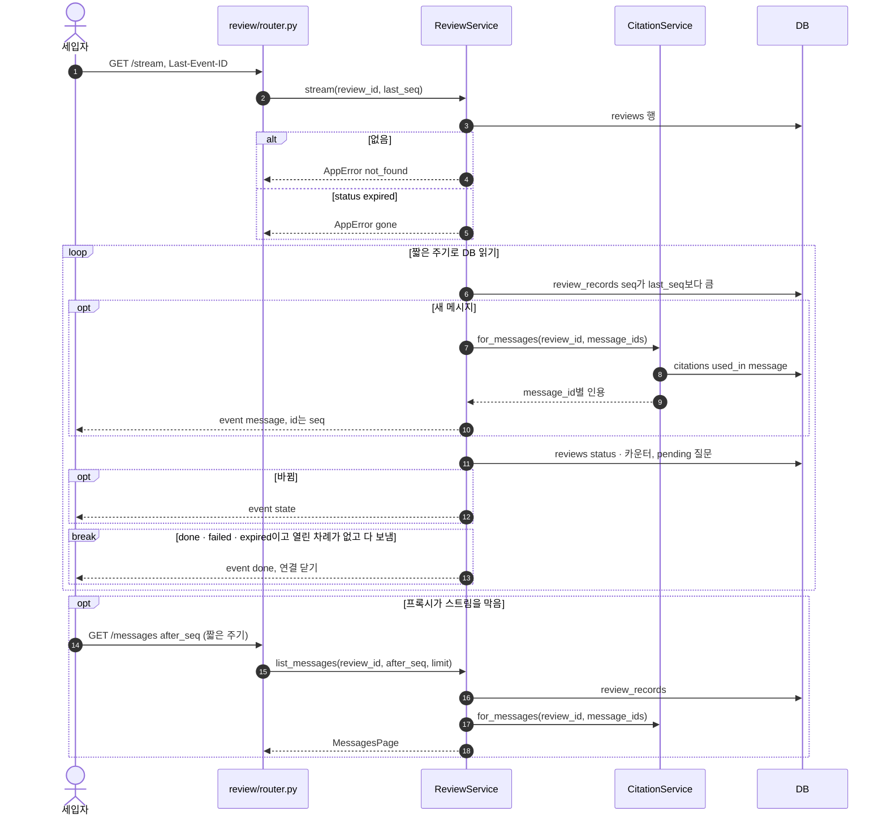
```mermaid
sequenceDiagram
    autonumber
    actor U as 세입자
    participant WR as review/router.py
    participant RV as ReviewService
    participant CT as CitationService
    participant DB

    U->>WR: GET /stream, Last-Event-ID
    WR->>RV: stream(review_id, last_seq)
    RV->>DB: reviews 행
    alt 없음
        RV-->>WR: AppError not_found
    else status expired
        RV-->>WR: AppError gone
    end
    loop 짧은 주기로 DB 읽기
        RV->>DB: review_records seq가 last_seq보다 큼
        opt 새 메시지
            RV->>CT: for_messages(review_id, message_ids)
            CT->>DB: citations used_in message
            CT-->>RV: message_id별 인용
            RV-->>U: event message, id는 seq
        end
        RV->>DB: reviews status · 카운터, pending 질문
        opt 바뀜
            RV-->>U: event state
        end
        break done · failed · expired이고 열린 차례가 없고 다 보냄
            RV-->>U: event done, 연결 닫기
        end
    end
    opt 프록시가 스트림을 막음
        U->>WR: GET /messages after_seq (짧은 주기)
        WR->>RV: list_messages(review_id, after_seq, limit)
        RV->>DB: review_records
        RV->>CT: for_messages(review_id, message_ids)
        RV-->>WR: MessagesPage
    end
```

**읽을 때 볼 것**
- 스트림은 DB에 쌓인 것만 보낸다. `delta`는 보내지 않는다(클래스 명세 7장 미결). 재접속은 `Last-Event-ID`가 곧 `seq`라 빠짐없이 이어진다
- 인용은 메시지 행에 없다. 보낼 때 `Citation` 행에서 붙인다(클래스 명세 5장 결정 5)
- `stream`과 `list_messages`는 같은 조립을 쓴다. 스트림이 막혀도 결과가 같다

---

## SEQ-12 검토 상태를 본다

[[JSD-UC-001#UC-A1]] 4 · [[JSD-API-001#GET/api/reviews/{id}]] · [[JSD-UI-001#UI-2]] 상단 바.

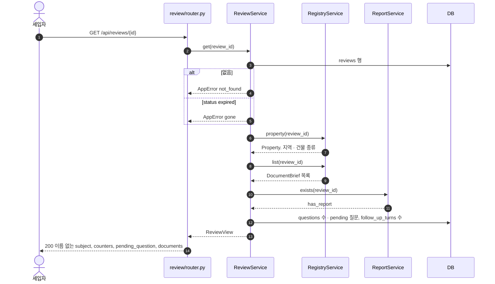
```mermaid
sequenceDiagram
    autonumber
    actor U as 세입자
    participant WR as review/router.py
    participant RV as ReviewService
    participant RS as RegistryService
    participant RP as ReportService
    participant DB

    U->>WR: GET /api/reviews/{id}
    WR->>RV: get(review_id)
    RV->>DB: reviews 행
    alt 없음
        RV-->>WR: AppError not_found
    else status expired
        RV-->>WR: AppError gone
    end
    RV->>RS: property(review_id)
    RS-->>RV: Property. 지역 · 건물 종류
    RV->>RS: list(review_id)
    RS-->>RV: DocumentBrief 목록
    RV->>RP: exists(review_id)
    RP-->>RV: has_report
    RV->>DB: questions 수 · pending 질문, follow_up_turns 수
    RV-->>WR: ReviewView
    WR-->>U: 200 이름 없는 subject, counters, pending_question, documents
```

**읽을 때 볼 것**
- `subject`에 계약 상대방 이름이 없다. 지역은 `Property`의 시군구·동이다(클래스 명세 7장 · [[JSD-API-001]] 1장)
- `elapsed_sec`는 `finished_at`(없으면 지금) − `created_at`이다. 되묻기 차례가 끝날 때마다 `finish`가 `finished_at`을 다시 쓰므로 뒤로 늘어난다

---

## SEQ-13 원문 한 줄이 쓰인 곳을 본다

[[JSD-UC-001#UC-A1]] 8 근거 보기 · [[JSD-API-001#GET/api/reviews/{id}/blocks/{blockId}]] · [[JSD-DOM-001#Citation]] 양방향.

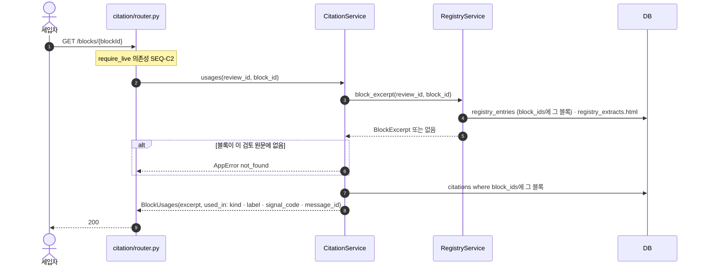
```mermaid
sequenceDiagram
    autonumber
    actor U as 세입자
    participant WC as citation/router.py
    participant CT as CitationService
    participant RS as RegistryService
    participant DB

    U->>WC: GET /blocks/{blockId}
    Note over WC: require_live 의존성 SEQ-C2
    WC->>CT: usages(review_id, block_id)
    CT->>RS: block_excerpt(review_id, block_id)
    RS->>DB: registry_entries (block_ids에 그 블록) · registry_extracts.html
    RS-->>CT: BlockExcerpt 또는 없음
    alt 블록이 이 검토 원문에 없음
        CT-->>WC: AppError not_found
    end
    CT->>DB: citations where block_ids에 그 블록
    CT-->>WC: BlockUsages(excerpt, used_in: kind · label · signal_code · message_id)
    WC-->>U: 200
```

**읽을 때 볼 것**
- 역방향 조회도 `Citation` 행을 읽는다. 앞방향(메시지·의견서의 인용)과 같은 행이라 둘이 어긋날 수 없다
- `citation` 라우터는 `review`를 import하지 않는다. 404·410은 `main.py`가 건 의존성이 먼저 답한다([[#SEQ-C2]])

---

## SEQ-14 의견서를 보고 공유한다

[[JSD-UC-001#UC-A4]] 기본 흐름 3~5, 확장 4a·5a · [[JSD-UC-001#UC-S8]] · [[JSD-API-001#GET/api/reviews/{id}/report]] · [[JSD-API-001#POST/api/reviews/{id}/shares]] · [[JSD-API-001#GET/api/shares/{token}]].

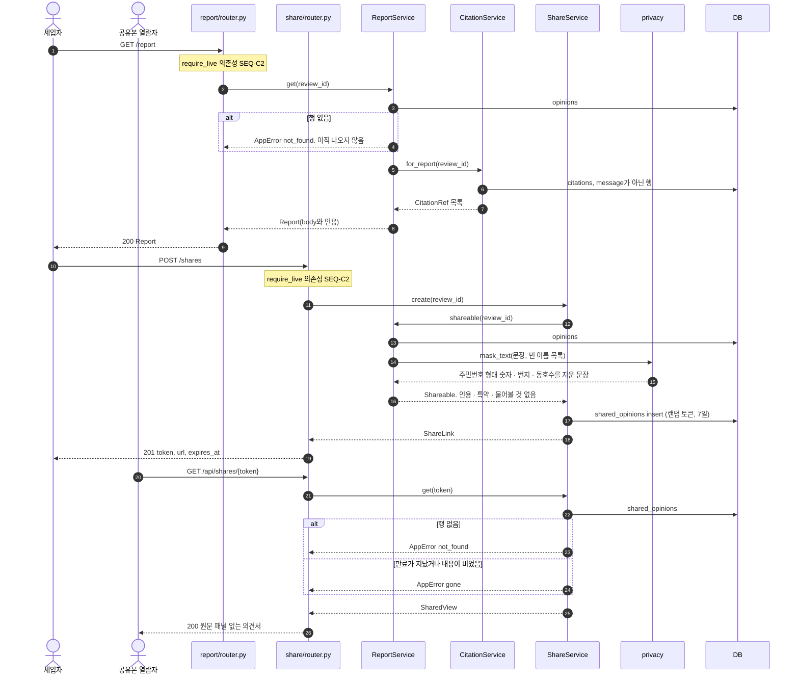
```mermaid
sequenceDiagram
    autonumber
    actor U as 세입자
    actor V as 공유본 열람자
    participant WP as report/router.py
    participant WS as share/router.py
    participant RP as ReportService
    participant CT as CitationService
    participant SH as ShareService
    participant PV as privacy
    participant DB

    U->>WP: GET /report
    Note over WP: require_live 의존성 SEQ-C2
    WP->>RP: get(review_id)
    RP->>DB: opinions
    alt 행 없음
        RP-->>WP: AppError not_found. 아직 나오지 않음
    end
    RP->>CT: for_report(review_id)
    CT->>DB: citations, message가 아닌 행
    CT-->>RP: CitationRef 목록
    RP-->>WP: Report(body와 인용)
    WP-->>U: 200 Report
    U->>WS: POST /shares
    Note over WS: require_live 의존성 SEQ-C2
    WS->>SH: create(review_id)
    SH->>RP: shareable(review_id)
    RP->>DB: opinions
    RP->>PV: mask_text(문장, 빈 이름 목록)
    PV-->>RP: 주민번호 형태 숫자 · 번지 · 동호수를 지운 문장
    RP-->>SH: Shareable. 인용 · 특약 · 물어볼 것 없음
    SH->>DB: shared_opinions insert (랜덤 토큰, 7일)
    SH-->>WS: ShareLink
    WS-->>U: 201 token, url, expires_at
    V->>WS: GET /api/shares/{token}
    WS->>SH: get(token)
    SH->>DB: shared_opinions
    alt 행 없음
        SH-->>WS: AppError not_found
    else 만료가 지났거나 내용이 비었음
        SH-->>WS: AppError gone
    end
    SH-->>WS: SharedView
    WS-->>V: 200 원문 패널 없는 의견서
```

**읽을 때 볼 것**
- 공유본은 만들 때의 사본이다. 뒤에 의견서가 다시 쓰여도 바뀌지 않고, 원본 검토가 지워져도 `expires_at`까지 산다(클래스 명세 5장 결정 7)
- 공유본 보기에는 `require_live`가 없다. `share`는 `review`·`registry`·`citation`에 닿지 않는다
- `body`에는 처음부터 개인 이름이 없다. 공유본은 번지·동호수·주민번호 형태만 한 번 더 지운다

---

## SEQ-15 검토를 지운다

[[JSD-UC-001#UC-A1]] 이해관계자(임대인) · [[JSD-API-001#DELETE/api/reviews/{id}]] · [[JSD-DOM-002]] 5장 결정 3·4.

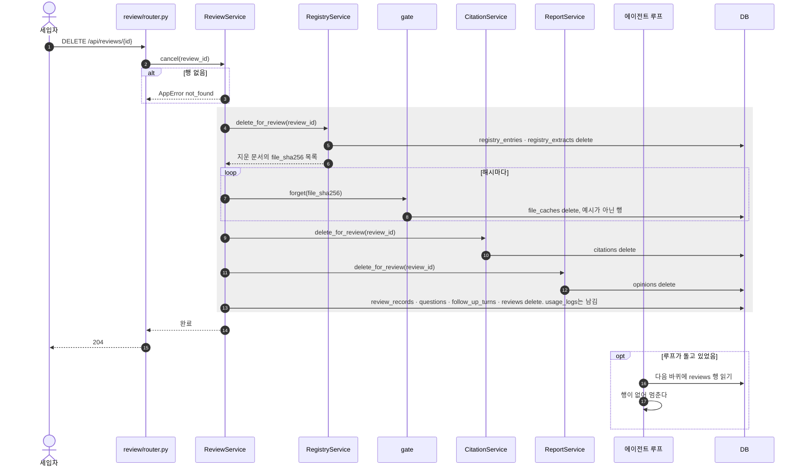
```mermaid
sequenceDiagram
    autonumber
    actor U as 세입자
    participant WR as review/router.py
    participant RV as ReviewService
    participant RS as RegistryService
    participant GT as gate
    participant CT as CitationService
    participant RP as ReportService
    participant AG as 에이전트 루프
    participant DB

    U->>WR: DELETE /api/reviews/{id}
    WR->>RV: cancel(review_id)
    alt 행 없음
        RV-->>WR: AppError not_found
    end
    rect rgb(238, 238, 238)
        RV->>RS: delete_for_review(review_id)
        RS->>DB: registry_entries · registry_extracts delete
        RS-->>RV: 지운 문서의 file_sha256 목록
        loop 해시마다
            RV->>GT: forget(file_sha256)
            GT->>DB: file_caches delete, 예시가 아닌 행
        end
        RV->>CT: delete_for_review(review_id)
        CT->>DB: citations delete
        RV->>RP: delete_for_review(review_id)
        RP->>DB: opinions delete
        RV->>DB: review_records · questions · follow_up_turns · reviews delete. usage_logs는 남김
    end
    RV-->>WR: 완료
    WR-->>U: 204
    opt 루프가 돌고 있었음
        AG->>DB: 다음 바퀴에 reviews 행 읽기
        AG->>AG: 행이 없어 멈춘다
    end
```

**읽을 때 볼 것**
- 원문이 든 파싱 캐시까지 지워야 "즉시 지운다"가 지켜진다. 예시 파일 캐시는 남는다
- 공유본은 지우지 않는다. 이름·원문·인용이 없는 사본이고 자기 기한(7일)을 산다
- **도는 루프는 다음 바퀴에야 알아챈다.** 그 사이 도구가 쓰는 행은 외래키 위반이 되고, 질문을 기다리던 `ask`는 300초를 채운다 → 2장 #2 · #3
- **만료된 검토(expired 행)에 DELETE를 보내면** 남겨 둔 행이 지워져 그 뒤로는 410 대신 404를 답한다 → 2장 #5

---

## SEQ-16 만료된 것을 지운다

[[JSD-UC-001#UC-A1]] 9 · [[JSD-UC-001#UC-S10]] 3a · [[JSD-INFRA-001]] 8장 만료 정리 · 클래스 명세 4.15.

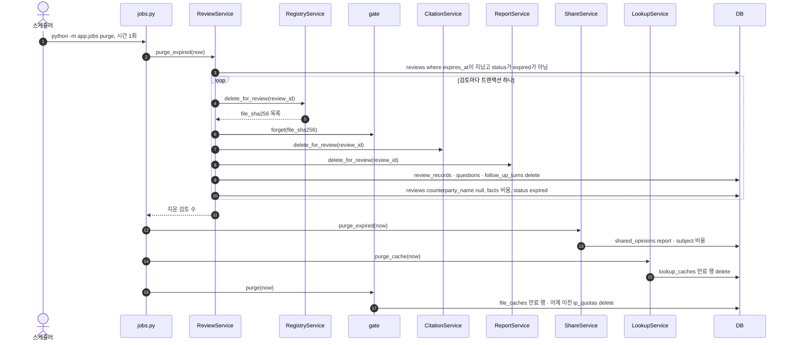
```mermaid
sequenceDiagram
    autonumber
    actor OP as 스케줄러
    participant JB as jobs.py
    participant RV as ReviewService
    participant RS as RegistryService
    participant GT as gate
    participant CT as CitationService
    participant RP as ReportService
    participant SH as ShareService
    participant LK as LookupService
    participant DB

    OP->>JB: python -m app.jobs purge, 시간 1회
    JB->>RV: purge_expired(now)
    RV->>DB: reviews where expires_at이 지났고 status가 expired가 아님
    loop 검토마다 트랜잭션 하나
        RV->>RS: delete_for_review(review_id)
        RS-->>RV: file_sha256 목록
        RV->>GT: forget(file_sha256)
        RV->>CT: delete_for_review(review_id)
        RV->>RP: delete_for_review(review_id)
        RV->>DB: review_records · questions · follow_up_turns delete
        RV->>DB: reviews counterparty_name null, facts 비움, status expired
    end
    RV-->>JB: 지운 검토 수
    JB->>SH: purge_expired(now)
    SH->>DB: shared_opinions report · subject 비움
    JB->>LK: purge_cache(now)
    LK->>DB: lookup_caches 만료 행 delete
    JB->>GT: purge(now)
    GT->>DB: file_caches 만료 행 · 어제 이전 ip_quotas delete
```

**읽을 때 볼 것**
- `Review` 행과 비운 공유본 행은 남는다. 그래야 410을 답한다. 남은 행을 언제 지울지는 미결이다([[JSD-DOM-003]] 5장)
- 검토 하나를 한 트랜잭션으로 지운다. 중간에 실패해도 다음 시간에 남은 것부터 다시 한다
- `usage_logs`는 지우지 않는다. 개인정보가 없고 건당 비용을 센다

---

## SEQ-17 명단 스냅샷을 갈아 끼운다

[[JSD-UC-001#UC-S6]] 기본 흐름 1, 확장 1a · [[JSD-INFRA-001]] 7장 · 8장.

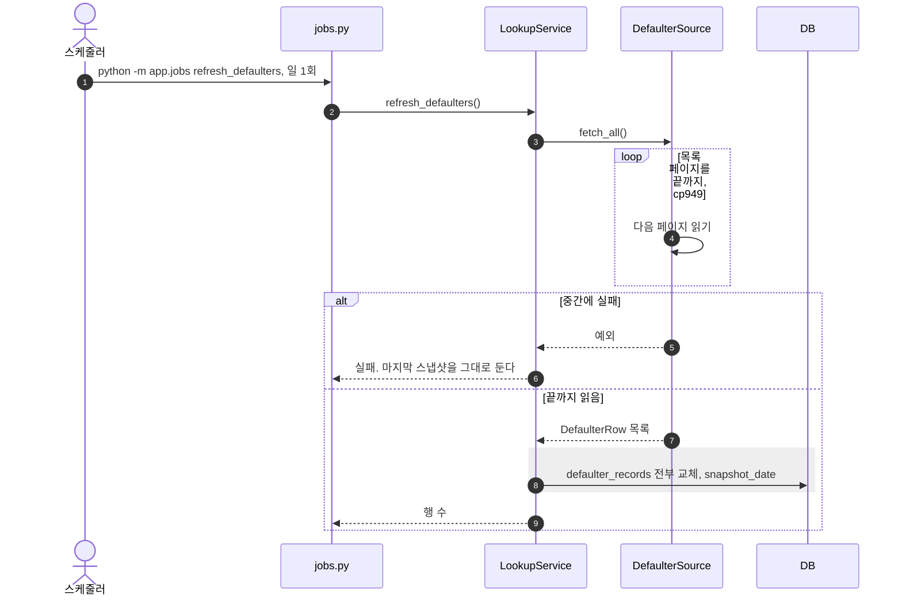
```mermaid
sequenceDiagram
    autonumber
    actor OP as 스케줄러
    participant JB as jobs.py
    participant LK as LookupService
    participant HG as DefaulterSource
    participant DB

    OP->>JB: python -m app.jobs refresh_defaulters, 일 1회
    JB->>LK: refresh_defaulters()
    LK->>HG: fetch_all()
    loop 목록 페이지를 끝까지, cp949
        HG->>HG: 다음 페이지 읽기
    end
    alt 중간에 실패
        HG-->>LK: 예외
        LK-->>JB: 실패. 마지막 스냅샷을 그대로 둔다
    else 끝까지 읽음
        HG-->>LK: DefaulterRow 목록
        rect rgb(238, 238, 238)
            LK->>DB: defaulter_records 전부 교체, snapshot_date
        end
        LK-->>JB: 행 수
    end
```

**읽을 때 볼 것**
- 다 읽은 뒤에만 교체한다. 루프의 `match_defaulter`는 교체 중에도 옛 스냅샷이나 새 스냅샷 하나만 본다
- **예외 없이 0건이 오면 빈 명단으로 교체한다.** 페이지 구조가 바뀌면 흔히 이렇게 된다. 그 뒤 대조는 no_snapshot이 된다 → 2장 #6

---

## SEQ-18 예시 파일을 미리 파싱한다

[[JSD-UC-001#UC-A2]] 확장 4a · [[JSD-INFRA-001]] 8장 예시 파일 워밍.

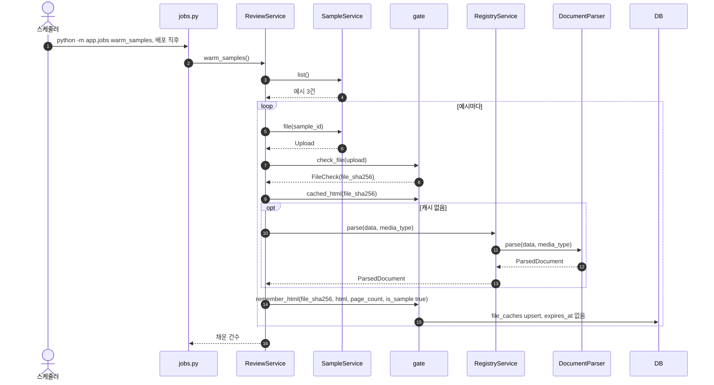
```mermaid
sequenceDiagram
    autonumber
    actor OP as 스케줄러
    participant JB as jobs.py
    participant RV as ReviewService
    participant SA as SampleService
    participant GT as gate
    participant RS as RegistryService
    participant UP as DocumentParser
    participant DB

    OP->>JB: python -m app.jobs warm_samples, 배포 직후
    JB->>RV: warm_samples()
    RV->>SA: list()
    SA-->>RV: 예시 3건
    loop 예시마다
        RV->>SA: file(sample_id)
        SA-->>RV: Upload
        RV->>GT: check_file(upload)
        GT-->>RV: FileCheck(file_sha256)
        RV->>GT: cached_html(file_sha256)
        opt 캐시 없음
            RV->>RS: parse(data, media_type)
            RS->>UP: parse(data, media_type)
            UP-->>RS: ParsedDocument
            RS-->>RV: ParsedDocument
        end
        RV->>GT: remember_html(file_sha256, html, page_count, is_sample true)
        GT->>DB: file_caches upsert, expires_at 없음
    end
    RV-->>JB: 채운 건수
```

**읽을 때 볼 것**
- 검토를 만들지 않는다. 결과를 미리 계산하지 않고 파싱만 채운다([[JSD-PRD-001#R2]])
- 이미 일반 캐시로 들어간 예시 파일도 `is_sample true`로 덮는다. 그 뒤로는 만료되지 않고 한도에서 빠진다([[#SEQ-1]])
- 이 파싱 비용은 어느 검토에도 속하지 않아 `usage_logs`에 남지 않는다

---

## SEQ-C1 공통 형태 — 입구 → 서비스 하나 → 자기 저장소

그려서 확인한 뒤 넣었다. 분기는 에러 하나뿐이고 다른 도메인을 부르지 않는다.

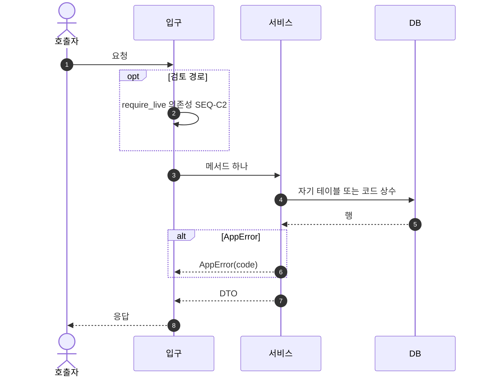
```mermaid
sequenceDiagram
    autonumber
    actor C as 호출자
    participant B as 입구
    participant SV as 서비스
    participant DB

    C->>B: 요청
    opt 검토 경로
        B->>B: require_live 의존성 SEQ-C2
    end
    B->>SV: 메서드 하나
    SV->>DB: 자기 테이블 또는 코드 상수
    DB-->>SV: 행
    alt AppError
        SV-->>B: AppError(code)
    end
    SV-->>B: DTO
    B-->>C: 응답
```

| 입구 | 서비스 메서드 | 자기 저장소 | 에러 |
|---|---|---|---|
| [[JSD-API-001#GET/api/reviews/{id}/documents]] | `RegistryService.list` | registry_extracts | 404·410은 SEQ-C2 |
| [[JSD-API-001#GET/api/reviews/{id}/documents/{documentId}]] | `RegistryService.get_html` | registry_extracts.html | not_found |
| [[JSD-API-001#GET/api/criteria]] | `RulesService.criteria(LIMITS)` | `rules/criteria.py` 상수 | |
| [[JSD-API-002#get_criteria]] (루프 dispatch) | `RulesService.criteria(LIMITS, topic, signal_code)` | `rules/criteria.py` 상수 | |
| [[JSD-API-001#GET/api/samples]] | `SampleService.list` | `assets/samples/samples.json` | |
| [[JSD-API-001#GET/health]] | `HealthService.check` | DB 가벼운 질의 | 실패면 503 degraded |
| jobs load_region_codes FILE | `LookupService.load_region_codes` | region_codes | |
| jobs usage_report | `ReviewService.usage_report(day)` | usage_logs | 건당 평균이 한도를 넘으면 경고 로그 |

**읽을 때 볼 것** — 판정 기준 페이지와 get_criteria는 같은 상수를 내려보낸다. 화면과 에이전트가 다른 기준을 볼 수 없다([[JSD-UI-001#UI-4]] 규칙).

---

## SEQ-C2 공통 형태 — 검토 경로의 404·410과 에러 응답

클래스 명세 5장 결정 7 · [[JSD-API-001]] 2장.

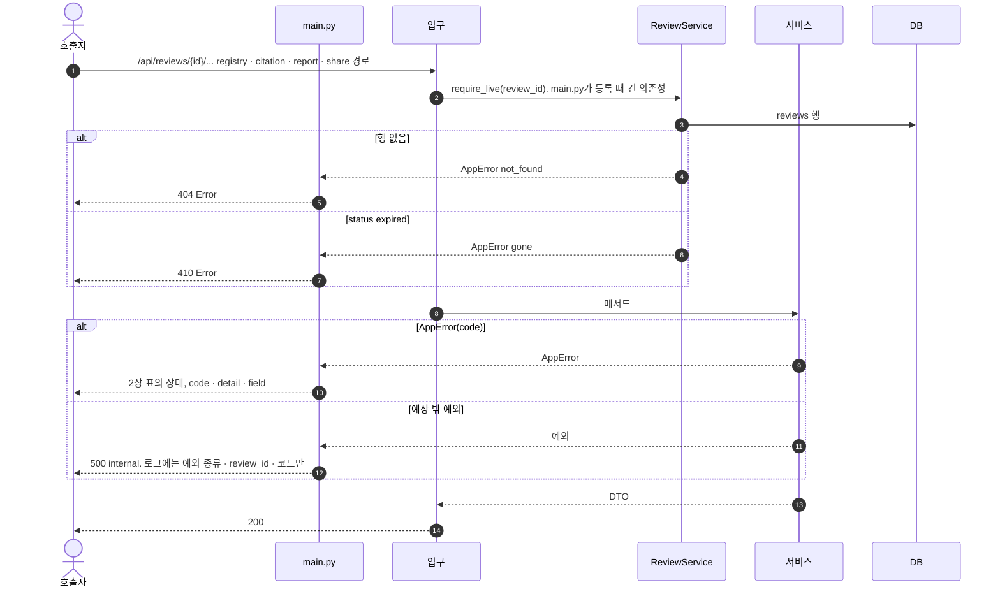
```mermaid
sequenceDiagram
    autonumber
    actor C as 호출자
    participant MN as main.py
    participant B as 입구
    participant RV as ReviewService
    participant SV as 서비스
    participant DB

    C->>B: /api/reviews/{id}/... registry · citation · report · share 경로
    B->>RV: require_live(review_id). main.py가 등록 때 건 의존성
    RV->>DB: reviews 행
    alt 행 없음
        RV-->>MN: AppError not_found
        MN-->>C: 404 Error
    else status expired
        RV-->>MN: AppError gone
        MN-->>C: 410 Error
    end
    B->>SV: 메서드
    alt AppError(code)
        SV-->>MN: AppError
        MN-->>C: 2장 표의 상태, code · detail · field
    else 예상 밖 예외
        SV-->>MN: 예외
        MN-->>C: 500 internal. 로그에는 예외 종류 · review_id · 코드만
    end
    SV-->>B: DTO
    B-->>C: 200
```

**읽을 때 볼 것** — `review` 라우터의 경로는 이 의존성 없이 서비스가 직접 404·410을 판정한다(`get`·`list_messages`·`stream`). 다른 도메인은 `review`를 import하지 않는다. 예외 문자열은 로그와 `Error.detail`에 쓰지 않는다 — 바인드 값에 이름이 실린다(클래스 명세 4.14).

---

## 2. 되먹일 것

시퀀스를 그려서 드러난 구멍이다. 고칠 문서는 이 문서를 승인하기 전에 반영하고, 반영하면 이 표에 결정을 붙인다.

### 2.1 저장·삭제

| # | 발견 | 고칠 문서 | 내용 |
|---|---|---|---|
| 1 | 파싱 캐시에 넣는 것이 등기부 판정보다 앞이다([[#SEQ-1]] 19·23, [[#SEQ-7]]). 등기부가 아닌 파일의 HTML이 24시간 남고 어느 검토에도 매이지 않아 지울 수 없다 | 클래스 명세 4.1 `create`·`receive`·`parse_upload` | `remember_html`을 `create_extract` 성공 뒤로 옮긴다. 캐시 행 쓰기는 같은 트랜잭션에 넣는다 |
| 2 | 질문을 기다리는 동안 검토가 지워지면 `ask`가 300초를 채우고 없는 검토에 쓴다([[#SEQ-7]] · [[#SEQ-15]]) | 클래스 명세 4.1 `ask` | 다시 읽을 때 질문 행이 없으면 바로 멈춤을 알린다(루프가 조용히 끝냄) |
| 3 | 한 바퀴 안에서 검토가 지워지면 도구의 쓰기가 외래키 위반이 되고, 루프의 예외 처리가 없는 검토에 error 메시지와 `finish`를 쓴다([[#SEQ-2]]) | 클래스 명세 4.2 `run_review`·`run_follow_up` | 검토 행이 없어서 난 실패는 조용히 멈춘다. error 메시지·`finish`를 쓰지 않는다 |
| 4 | `ReportService.write`의 트랜잭션 경계가 없다. 인용을 지운 뒤 의견서를 덮기 전에 실패하면 이전 판이 인용 없이 남는다([[#SEQ-8]]) | 클래스 명세 4.8 `write` | 문장 생성은 트랜잭션 밖, `clear_report`부터 `Opinion` 덮기까지 한 트랜잭션 |
| 5 | 만료된 검토에 DELETE를 보내면 남겨 둔 행이 지워져 그 뒤 410 대신 404가 된다([[#SEQ-15]]) | 클래스 명세 4.1 `cancel` · [[JSD-API-001#DELETE/api/reviews/{id}]] | status expired면 지우지 않고 gone(410)으로 답한다. API에 410 추가 |
| 6 | 명단 페이지가 예외 없이 0건을 주면 빈 명단으로 교체한다([[#SEQ-17]]) | 클래스 명세 4.6 `refresh_defaulters` | 0건이면 교체하지 않고 실패로 본다 |

### 2.2 판정·의견서

| # | 발견 | 고칠 문서 | 내용 |
|---|---|---|---|
| 7 | `check_and_store`가 `facts.rights`를 읽기만 한다. 합산 전이면 `SignalInput.rights`가 비고, 합산 뒤 시세가 오면 옛 합산으로 신호를 낸다([[#SEQ-5]]) | 클래스 명세 4.1 `check_and_store` | `summarize_and_store`를 먼저 부른다. `write_report`와 같은 순서 |
| 8 | 의견서 문장 생성의 토큰이 검토 비용에 더해지지 않는다([[#SEQ-8]] 28). 건당 비용 300원([[JSD-INFRA-001#C3]])을 덜 센다 | 클래스 명세 4.1 `write_report` | `ReportResult`의 토큰을 원화로 바꿔 `cost_krw`·`llm_cost_krw`에 더한다 |
| 9 | `Report` DTO와 `ReportResult`에 판 번호·다시 쓴 이유가 없다. [[JSD-API-001]] v5의 `Report`와 report 메시지에는 있다([[#SEQ-8]] · [[#SEQ-10]]) | 클래스 명세 2.8 | `Report`에 `revision_no`·`revision_reason`, `ReportResult`에 `revision_no`·`revision_reason` |
| 10 | 직접 입력으로 다시 쓰면 대화에 의견서 카드가 남지 않는다. 카드는 루프 dispatch만 남긴다([[#SEQ-10]]) | 클래스 명세 4.1 `write_report` · 4.2 dispatch | report 메시지를 `ReviewService.write_report`가 남긴다. dispatch에서는 뺀다 |
| 11 | 직접 입력의 `entry_id`를 대조하지 않는다([[#SEQ-10]]) | 클래스 명세 4.1 `override_values` · [[JSD-API-001#PATCH/api/reviews/{id}/values]] | `RegistryService.entries`로 대조하고 없는 ID면 missing_input(field entries). API에 400 추가 |

### 2.3 화면·운영·문서 정합

| # | 발견 | 고칠 문서 | 내용 |
|---|---|---|---|
| 12 | 검토 스트림은 의견서 뒤 done으로 닫힌다. 되묻기 차례의 말풍선을 받으려면 다시 붙어야 한다([[#SEQ-9]]) | [[JSD-UI-001#UI-2]] 규칙 | 되묻기·값 수정을 보낸 뒤 스트림에 다시 붙는다고 적는다 |
| 13 | [[JSD-UC-001#UC-A4]] 2는 시스템이 PDF를 만든다고 적었지만 [[JSD-UI-001#UI-3]]은 브라우저 인쇄이고 API에 경로가 없다 | [[JSD-UC-001#UC-A4]] · [[JSD-INFRA-001]] 4장 report | 브라우저 인쇄(A4)로 저장한다고 고친다 |
| 14 | 예시 파일 해시의 한도 제외가 `warm_samples` 실행에 기댄다([[#SEQ-1]] · [[#SEQ-18]]) | [[JSD-INFRA-001]] 8장 | 배포 절차에서 예시 워밍을 필수 단계로 적는다 |
| 15 | [[JSD-INFRA-001]] 2장 구성도가 도구 8종·`/events` 경로로 남았다. [[JSD-UC-001#UC-S9]] 1도 도구 8종이다 | [[JSD-INFRA-001]] 2장 · [[JSD-UC-001#UC-S9]] | 도구 9종, 스트림 경로 `/api/reviews/{id}/stream` |

---

## 3. 미결사항

- [ ] 2장 되먹일 것 15건 — 고칠 문서에 반영한 뒤 이 문서를 승인한다
- [ ] 직접 입력 중 되묻기 차례가 열리는 경합([[#SEQ-10]]) — 둘 다 `facts`를 쓴다. 검토 행 잠금을 둘지
- [ ] `ask`의 1초 폴링과 스트림의 짧은 주기 폴링이 동시 검토 수만큼 DB를 읽는다 — 심사 기간 규모에서 괜찮은지 첫 구현에서 잰다
- [ ] 되묻기 서류 추가의 파싱 비용 — IP 한도에 세지 않는다. 되묻기 횟수 한도(`LIMITS.asks`)와 함께 정한다([[JSD-API-002]] 미결)
- [ ] 프로세스 재시작 때 running·waiting_user로 남은 검토 — 클래스 명세 7장 미결과 같다
- [ ] 예시 워밍의 파싱 비용을 `usage_logs`에 남길지([[#SEQ-18]])
